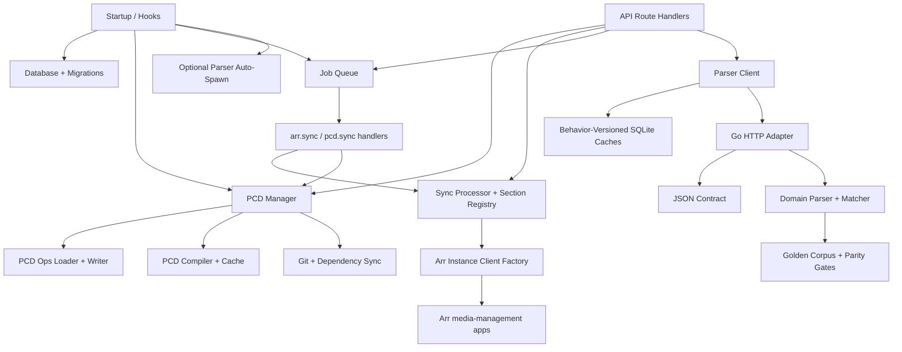

# Architecture Components

## Component Map

## 1) Startup and Runtime Wiring

Responsibilities:

- Initialize config, DB, migrations, cache, auth/session middleware, and job scheduling.
- Validate encryption key material before services needing Arr credentials.
- Optionally auto-spawn parser service in standalone runtime mode.
- Continue serving when the optional parser cannot start; parser-dependent
  routes expose an unavailable state instead of failing app startup.

Key references:

- `packages/praxrr-app/src/hooks.server.ts`
- `packages/praxrr-app/src/lib/server/db/db.ts`
- `packages/praxrr-app/src/lib/server/db/migrations.ts`
- `packages/praxrr-app/src/lib/server/jobs/init.ts`
- `packages/praxrr-app/src/lib/server/utils/parser/spawn.ts`

## 2) API Route Layer

Responsibilities:

- Expose `/api/v1` route handlers for Arr library/releases, health checks, PCD import/export, and entity-testing.
- Perform request-level validation and map requests to PCD/sync/parser services.

Key references:

- `packages/praxrr-app/src/routes/api/v1/arr/library/+server.ts`
- `packages/praxrr-app/src/routes/api/v1/arr/releases/+server.ts`
- `packages/praxrr-app/src/routes/api/v1/pcd/import/+server.ts`
- `packages/praxrr-app/src/routes/api/v1/pcd/export/+server.ts`
- `packages/praxrr-app/src/routes/api/v1/entity-testing/evaluate/+server.ts`
- `packages/praxrr-app/src/routes/api/v1/health/+server.ts`

## 3) PCD Lifecycle Components

Responsibilities:

- Link/sync database repositories, import base ops, seed built-in ops, and compile runtime cache.
- Load layered operations in order: schema -> base -> tweaks -> user.
- Write validated operations into DB-first ops storage.

Key references:

- `packages/praxrr-app/src/lib/server/pcd/core/manager.ts`
- `packages/praxrr-app/src/lib/server/pcd/ops/loadOps.ts`
- `packages/praxrr-app/src/lib/server/pcd/ops/writer.ts`
- `packages/praxrr-app/src/lib/server/pcd/database/compiler.ts`
- `packages/praxrr-app/src/lib/shared/pcd/portable.ts`

## 4) Sync Components

Responsibilities:

- Schedule-trigger and event-trigger sync processing.
- Dispatch per-instance section syncs through registry handlers.
- Enforce Arr-specific section support and mapping semantics.

Key references:

- `packages/praxrr-app/src/lib/server/sync/processor.ts`
- `packages/praxrr-app/src/lib/server/sync/mappings.ts`
- `packages/praxrr-app/src/lib/server/sync/registry.ts`
- `packages/praxrr-app/src/lib/server/sync/qualityProfiles/handler.ts`
- `packages/praxrr-app/src/lib/server/sync/metadataProfiles/handler.ts`

## 5) Job Queue Components

Responsibilities:

- Persist, dispatch, and reschedule queued work.
- Execute specific handlers for Arr sync and PCD sync.
- Bridge schedule and event-based work into sync/PCD systems.

Key references:

- `packages/praxrr-app/src/lib/server/jobs/dispatcher.ts`
- `packages/praxrr-app/src/lib/server/jobs/queueService.ts`
- `packages/praxrr-app/src/lib/server/jobs/handlers/arrSync.ts`
- `packages/praxrr-app/src/lib/server/jobs/handlers/pcdSync.ts`

## 6) Arr and Parser Integration Components

Responsibilities:

- Build Arr clients by decrypting credentials at runtime.
- Parse and pattern-match release titles through the app parser client.
- Namespace SQLite parse/match caches by the parser behavior version.
- Serve the exact four-route contract through the Go HTTP adapter and domain
  parser while retaining .NET-compatible regex syntax with finite limits.
- Prove compatibility through the captured golden corpus and parity gates.

Key references:

- `packages/praxrr-app/src/lib/server/utils/arr/arrInstanceClients.ts`
- `packages/praxrr-app/src/lib/server/utils/arr/parser/index.ts`
- `packages/praxrr-app/src/lib/server/db/queries/parsedReleaseCache.ts`
- `packages/praxrr-app/src/lib/server/db/queries/patternMatchCache.ts`
- `packages/praxrr-parser/cmd/praxrr-parser/main.go`
- `packages/praxrr-parser/internal/httpserver/handler.go`
- `packages/praxrr-parser/internal/contract/`
- `packages/praxrr-parser/internal/parser/`
- `packages/praxrr-parser/testdata/golden/`

## 7) Supporting Packages

Responsibilities:

- Publish API contracts as reusable OpenAPI/types package.
- Provide schema/content ops consumed by PCD workflows.

Key references:

- `packages/praxrr-api/mod.ts`
- `packages/praxrr-api/openapi.json`
- `packages/praxrr-schema/ops/0.schema.sql`
- `packages/praxrr-db/ops/0.rosettarr.sql`
