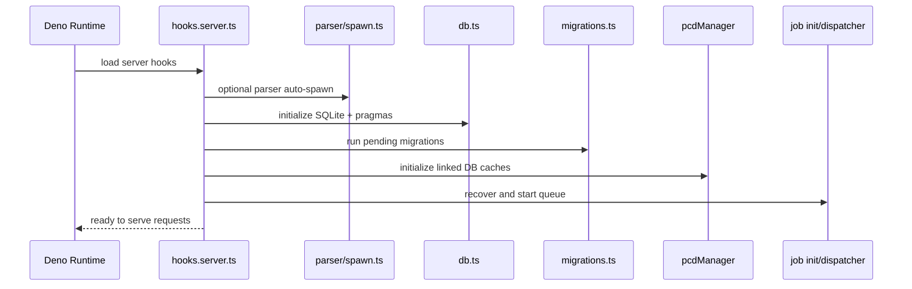
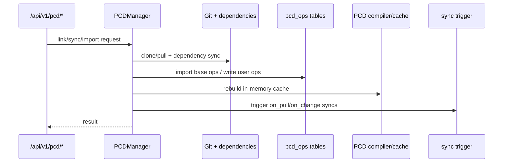
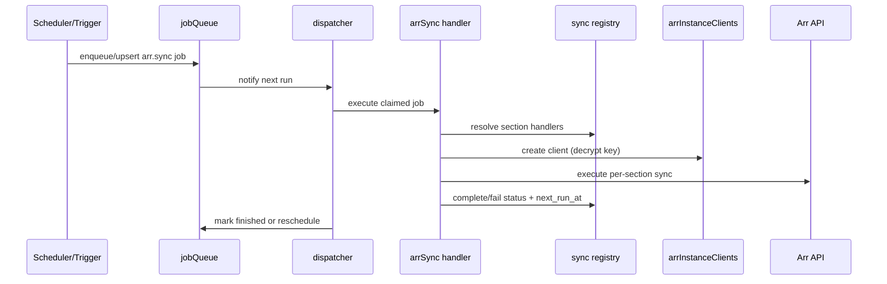
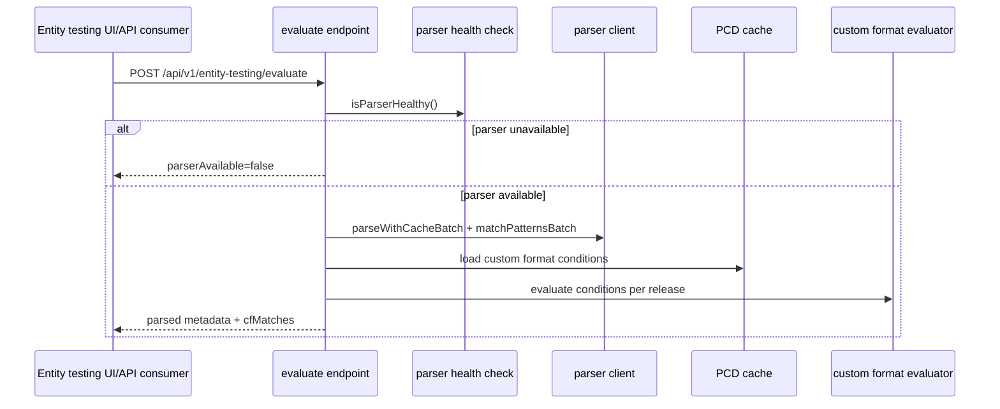

# Architecture Data Flow

## 1) Server Startup Flow

Key references:

- `packages/praxrr-app/src/hooks.server.ts`
- `packages/praxrr-app/src/lib/server/db/db.ts`
- `packages/praxrr-app/src/lib/server/db/migrations.ts`
- `packages/praxrr-app/src/lib/server/pcd/core/manager.ts`
- `packages/praxrr-app/src/lib/server/jobs/init.ts`

## 2) PCD Link/Sync/Compile Flow

Key references:

- `packages/praxrr-app/src/lib/server/pcd/core/manager.ts`
- `packages/praxrr-app/src/lib/server/pcd/ops/loadOps.ts`
- `packages/praxrr-app/src/lib/server/pcd/ops/writer.ts`
- `packages/praxrr-app/src/lib/server/pcd/database/compiler.ts`
- `packages/praxrr-app/src/routes/api/v1/pcd/import/+server.ts`
- `packages/praxrr-app/src/routes/api/v1/pcd/export/+server.ts`

## 3) Arr Sync Job Flow

Key references:

- `packages/praxrr-app/src/lib/server/jobs/queueService.ts`
- `packages/praxrr-app/src/lib/server/jobs/dispatcher.ts`
- `packages/praxrr-app/src/lib/server/jobs/handlers/arrSync.ts`
- `packages/praxrr-app/src/lib/server/sync/processor.ts`
- `packages/praxrr-app/src/lib/server/sync/mappings.ts`
- `packages/praxrr-app/src/lib/server/utils/arr/arrInstanceClients.ts`

## 4) Entity Testing Evaluation Flow

Key references:

- `packages/praxrr-app/src/routes/api/v1/entity-testing/evaluate/+server.ts`
- `packages/praxrr-app/src/lib/server/utils/arr/parser/index.ts`
- `packages/praxrr-app/src/lib/server/utils/parser/spawn.ts`
- `packages/praxrr-parser/Program.cs`
- `packages/praxrr-parser/Endpoints/MatchEndpoints.cs`

## 5) Contract Flow Between Packages

`praxrr-api` provides typed API contracts consumed by route handlers and clients, while `praxrr-schema` and `praxrr-db` provide operation sources consumed by the PCD layer.

Key references:

- `packages/praxrr-api/mod.ts`
- `packages/praxrr-api/openapi.json`
- `packages/praxrr-schema/ops/0.schema.sql`
- `packages/praxrr-db/ops/0.rosettarr.sql`
