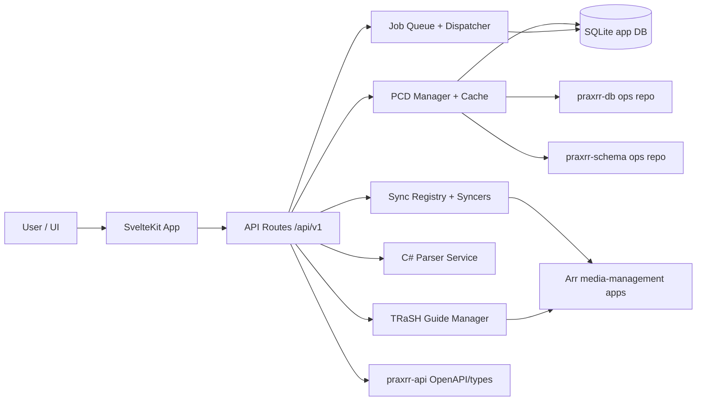

# Architecture Overview

## Scope

This page is the high-level map for the current repository architecture. It focuses on runtime
behavior and where to find implementation entry points.

## System Context

## Runtime Layers

`praxrr-app` is the primary runtime. Startup initializes config, encryption keys, DB/migrations, PCD
caches, and jobs.

Key references:

- `packages/praxrr-app/src/hooks.server.ts`
- `packages/praxrr-app/src/lib/server/db/db.ts`
- `packages/praxrr-app/src/lib/server/db/migrations.ts`
- `packages/praxrr-app/src/lib/server/pcd/core/manager.ts`
- `packages/praxrr-app/src/lib/server/jobs/init.ts`

API surface is under SvelteKit route handlers, with Arr, PCD import/export, health, and
entity-testing endpoints.

Key references:

- `packages/praxrr-app/src/routes/api/v1/arr/library/+server.ts`
- `packages/praxrr-app/src/routes/api/v1/arr/releases/+server.ts`
- `packages/praxrr-app/src/routes/api/v1/pcd/import/+server.ts`
- `packages/praxrr-app/src/routes/api/v1/pcd/export/+server.ts`
- `packages/praxrr-app/src/routes/api/v1/entity-testing/evaluate/+server.ts`
- `packages/praxrr-app/src/routes/api/v1/health/+server.ts`

## Repository Package Boundaries

| Package                  | Role                                                                    | Key files                                                                                           |
| ------------------------ | ----------------------------------------------------------------------- | --------------------------------------------------------------------------------------------------- |
| `packages/praxrr-app`    | Main web/API runtime, DB access, PCD lifecycle, sync/jobs orchestration | `packages/praxrr-app/src/hooks.server.ts`, `packages/praxrr-app/src/lib/server/pcd/core/manager.ts` |
| `packages/praxrr-api`    | Published OpenAPI spec + generated TypeScript types for clients         | `packages/praxrr-api/mod.ts`, `packages/praxrr-api/openapi.json`                                    |
| `packages/praxrr-schema` | Base schema ops consumed by PCD compile layer                           | `packages/praxrr-schema/ops/0.schema.sql`, `packages/praxrr-schema/pcd.json`                        |
| `packages/praxrr-db`     | Default PCD content ops repository used for linked database content     | `packages/praxrr-db/ops/0.rosettarr.sql`, `packages/praxrr-db/pcd.json`                             |
| `packages/praxrr-parser` | Optional parser microservice used by entity testing/evaluation          | `packages/praxrr-parser/Program.cs`, `packages/praxrr-parser/Endpoints/ParseEndpoints.cs`           |

## Implementation Notes

- PCD state is DB-first (`pcd_ops` and compiled in-memory cache), not file-first.
- Sync behavior is Arr-aware and section-gated by app type.
- Arr credentials are decrypted at runtime when constructing Arr clients.
- TRaSH Guide sync is a separate entity source pipeline alongside PCD, importing community
  configurations from TRaSH Guides git repositories and syncing them directly into Arr instances.

Key references:

- `packages/praxrr-app/src/lib/server/pcd/ops/loadOps.ts`
- `packages/praxrr-app/src/lib/server/pcd/ops/writer.ts`
- `packages/praxrr-app/src/lib/server/sync/mappings.ts`
- `packages/praxrr-app/src/lib/server/utils/arr/arrInstanceClients.ts`
- `packages/praxrr-app/src/lib/server/trashguide/manager.ts`
