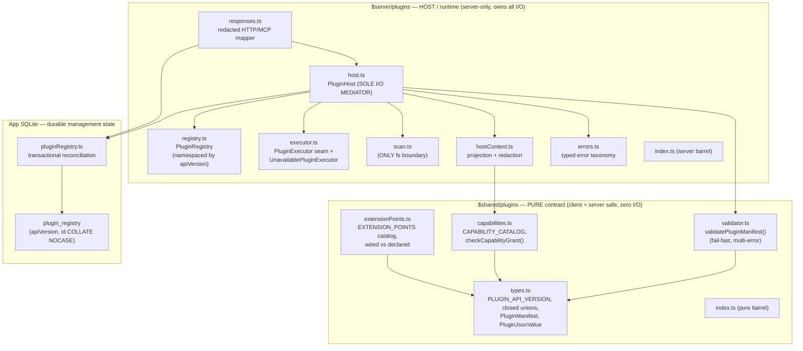
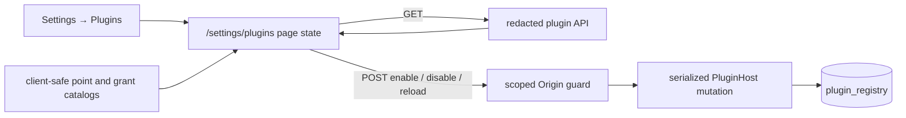

# Plugin System Architecture

> Phase-1 foundation for the WASM plugin system (issue #35), extended by the production observe
> call-sites in issue #263, durable management backend in issue #264, and operator UI in issue
> #266. This note describes the **stable, versioned contract, durable discovery state, and lifecycle
> scaffolding**. It is opt-in via the UI **Enable plugins** control
> **OFF by default**, adds **no WASM/Extism runtime dependency**, executes
> **no untrusted code**, and keeps every production dispatch behind the inert default executor. The
> default executor throws `PluginRuntimeUnavailableError('wasm runtime not yet available')`.

## Scope

This page is the architectural map for the plugin subsystem: the module boundary, durable registry
reconciliation and management API, extension-point versioning, lifecycle state, capability
projection/redaction, the sole-I/O-mediator invariant, and graceful degradation. Runtime execution
remains inert; points and capabilities that are declared-but-inert are called out explicitly.

## Published Developer Docs

Third-party plugin authors should start with the published **Plugin SDK** guide at
<https://docs.praxrr.dev/plugins/> (source under `docs/site/src/content/docs/plugins/`). It covers
the manifest contract, capability and extension-point catalogs, lifecycle, observe snapshots, and
API versioning, plus a buildable example under `examples/plugins/sync-preview-observer/`. Authors
can build, discover, validate, and register plugins today, but execution remains a no-op through the
production `UnavailablePluginExecutor`. This note remains the authoritative contract mirror; the
published pages must not contradict it.

## Module Map

The subsystem is split across two roots by a hard **purity boundary**. Contract code is pure and
client+server safe (modeled 1:1 on `$shared/security`); host/runtime code is server-only and owns
all I/O.



### `$shared/plugins` — the pure contract

Type-only imports, no logic that touches Deno APIs, safe to import from client bundles. It is the
single source of truth for the contract.

| File                                | Responsibility                                                                                                                                                                                                                                                                                                                           |
| ----------------------------------- | ---------------------------------------------------------------------------------------------------------------------------------------------------------------------------------------------------------------------------------------------------------------------------------------------------------------------------------------- |
| `shared/plugins/types.ts`           | Declares `PLUGIN_API_VERSION` **once**, `SUPPORTED_PLUGIN_API_VERSIONS`, the closed `ExtensionPointId` / `CapabilityId` / `PluginRuntime` / `PluginLifecycleState` unions, `PluginJsonValue` (recursive structured-clone-safe), the `PluginManifest` interface (all `readonly`), and the `ManifestValidationResult` discriminated union. |
| `shared/plugins/capabilities.ts`    | `CAPABILITY_CATALOG` of `{ id, label, description, mutates:false, touchesSecrets:false, compatiblePoints }` descriptors, plus `getCapability()` and `checkCapabilityGrant(point, capability)` — the least-privilege policy map. Contains **no** credential/auth/secret/network/fs/db/write id by construction.                           |
| `shared/plugins/extensionPoints.ts` | The declare-all-in-one-array `EXTENSION_POINTS` catalog (all 9 points, stable order), each stamped with `apiVersion` + `interfaceVersion` + `wired` + `mutates` + `requiredCapability`. Exposes `listExtensionPoints()`, `getExtensionPoint()`, `wiredObservePoints()`.                                                                  |
| `shared/plugins/validator.ts`       | `validatePluginManifest(raw): ManifestValidationResult` — a pure, fail-fast, **multi-error-accumulating** validator (richer than pcd's `{valid, error?}`). No I/O, no `Deno.env`; unit-testable like `parseCookieSecureMode`. Reused by the host, scan, and any future UI.                                                               |
| `shared/plugins/index.ts`           | Pure barrel — one import surface, safe from client and server (mirrors `$shared/security/index.ts`).                                                                                                                                                                                                                                     |

### `$server/plugins` — the host and runtime seam

Server-only. Owns discovery, validation orchestration, registration, dispatch, and the swappable
executor.

| File                                  | Responsibility                                                                                                                                                                                                                                                                                              |
| ------------------------------------- | ----------------------------------------------------------------------------------------------------------------------------------------------------------------------------------------------------------------------------------------------------------------------------------------------------------- |
| `server/plugins/host.ts`              | `PluginHost` singleton (`pluginHost`). The **sole I/O mediator**: serialized `initialize()` / `reload()` scans and validates a complete candidate, commits durable reconciliation, then atomically replaces the in-memory snapshot. `notifyObservers()` projects+redacts input and isolates executor calls. |
| `server/plugins/registry.ts`          | Pure in-memory dispatch snapshot over `Map<apiVersion, Map<lowercased id, RegisteredPlugin>>`. Full replacement rejects duplicate keys before mutation; point selection includes only enabled, currently discovered entries.                                                                                |
| `server/plugins/executor.ts`          | The swappable `PluginExecutor` seam over `PluginJsonValue`, and the shipped inert default `UnavailablePluginExecutor`. **No Extism/WASM import.**                                                                                                                                                           |
| `server/plugins/scan.ts`              | The **only** file that touches `Deno.readDir` / `Deno.readTextFile`. Reads each subdir's `praxrr.plugin.json`, JSON-parses, returns raw entries (collecting parse errors, never throwing on bad manifests; rethrows only unexpected fs errors).                                                             |
| `server/plugins/hostContext.ts`       | The projection + redaction boundary: `buildCapabilityInput()` copies only allow-listed fields per granted capability, then `scrubPluginBoundary()` runs the secret scrubber (reuses `redactSecrets` from `$server/mcp/redact.ts`).                                                                          |
| `server/plugins/responses.ts`         | Shared allow-list response/service boundary for HTTP and read-only MCP listing. It exposes validated portable fields and lifecycle facts, never `sourceDir` or raw manifest JSON.                                                                                                                           |
| `server/plugins/errors.ts`            | Typed error taxonomy (mirrors `mcp/errors.ts`): `PluginManifestError` / `PluginValidationError`, `PluginCapabilityDeniedError`, `PluginPointNotWiredError`, `PluginRuntimeUnavailableError`, `PluginExecutionError`. A rejected-manifest **skip** must never be conflated with an execution-seam **throw**. |
| `server/plugins/index.ts`             | Server barrel imported by `hooks.server.ts` as `$server/plugins/index.ts`.                                                                                                                                                                                                                                  |
| `server/db/queries/pluginRegistry.ts` | App-database repository for namespace-qualified lookup, enablement intent, and transactional scan reconciliation. Missing plugins remain durable as `discovered:false`; reappearance preserves the prior enablement decision.                                                                               |

## Extension-Point Catalog

Extension points are **declared in full** but only a safe **observe-only subset is wired** at the
host dispatch seam. Safety rests on the absence of a wired transform/provider handler, not on a
flag. A wired point is dispatchable via `notifyObservers`; a declared-but-unwired point registers
fine but throws `PluginPointNotWiredError` if dispatched.

| Extension point                   | Kind      | Wired (P1) | Grantable capability     | Notes                                                                                                           |
| --------------------------------- | --------- | :--------: | ------------------------ | --------------------------------------------------------------------------------------------------------------- |
| `config.profileCompiled.observe`  | observe   |     ✅     | `read:resolved-profile`  | Production quality-profile sync calls the host after compilation and before the Arr write.                      |
| `sync.previewComputed.observe`    | observe   |     ✅     | `read:sync-preview`      | Production preview generation calls the host after computing the preview and before returning it.               |
| `config.validation.observe`       | observe   |     ❌     | `read:config-validation` | Declared future observer; no host dispatch path yet.                                                            |
| `sync.beforeApply.observe`        | observe   |     ❌     | `read:sync-preview`      | Declared; unwired because it runs adjacent to the mutating sync path. Waits for a compliant sandboxed executor. |
| `sync.afterApply.observe`         | observe   |     ❌     | `read:sync-preview`      | Declared future audit observer. Unwired.                                                                        |
| `parser.releaseTitle.transform`   | transform |     ❌     | — (none grantable)       | Declared future mutating point. Never wired until sandbox execution exists.                                     |
| `customFormat.condition.evaluate` | provider  |     ❌     | `read:custom-format`     | Declared future compute provider; requires a compliant sandboxed executor.                                      |
| `notification.dispatch.observe`   | provider  |     ❌     | — (none grantable)       | Declared; a provider needs a network capability that does not exist in Phase 1.                                 |
| `importExport.adapter`            | provider  |     ❌     | — (none grantable)       | Declared; needs fs/network capabilities that are unrepresentable in Phase 1.                                    |

**Invariant:** every wired point is `kind: 'observe'`. No transform or provider point is wired, and
no capability lists a **mutating** point in its `compatiblePoints`, so a plugin structurally cannot
be granted what it would need to alter pipeline output.

## `apiVersion` Semantics

`apiVersion` is the contract-compatibility key and the **registry namespace key** (the parser
cache-safety analog). Its handling is deliberately strict:

- **Strict support, never negotiate.** A manifest's `apiVersion` must be a member of
  `SUPPORTED_PLUGIN_API_VERSIONS` (Phase 1: `['1']`). A non-member is a **hard reject** — unlike the
  MCP protocol's echo-else-latest negotiation. A plugin compiled for another `apiVersion` must not
  run.
- **Namespace, not just a check.** The registry is keyed by `(apiVersion, lowercased id)`. The same
  `id` under two different `apiVersion`s coexists in isolation; a lookup under the wrong
  `apiVersion` returns `undefined`. An enable/disable/rollback or an upgrade **cannot resurrect** a
  plugin validated under an incompatible contract version.
- **Cache tuple.** Any future result cache is namespaced by the `(apiVersion, plugin.version)`
  tuple, so an upgrade cannot reuse results produced by a prior build (mirrors
  `arr/parser/client.ts` keying its cache by `(cacheKey, parserVersion)`).
- **`PLUGIN_API_VERSION` is declared once** in `types.ts` and manually bumped on any contract
  change (mirrors `SECURITY_POSTURE_ENGINE_VERSION`). A pinning test asserts it is a member of
  `SUPPORTED_PLUGIN_API_VERSIONS` so it can't drift.

Adding a grantable capability, or otherwise widening the contract, is a deliberate, test-guarded
change that bumps the API version — never an ambient default.

## Lifecycle States

`PluginLifecycleState` enumerates the contract states, but the current host does not persist every
scan phase. `discovered`, `validated`, and `rejected` describe scan-time outcomes. Successful
reconciliation persists accepted candidates as `registered` and retains previously known identities
that are absent from the accepted candidate as `unloaded`. `activated` and `failed` remain reserved
for a future runtime and are not evidence that code executed.

```mermaid
stateDiagram-v2
    [*] --> discovered: scan entry (ephemeral)
    discovered --> validated: parse + validation succeeds
    discovered --> rejected: parse, validation, or<br/>duplicate check fails
    rejected --> [*]: skipped + logged;<br/>no rejected row is persisted

    validated --> registered: pluginRegistryQueries.reconcile()<br/>upserts discovered=true
    registered --> unloaded: successful reconciliation omits identity
    unloaded --> registered: accepted identity reappears;<br/>enablement intent is preserved
    registered --> registered: enable / disable persists first
    registered --> liveSnapshot: PluginRegistry.replaceSnapshot()<br/>publishes current discovered rows
    liveSnapshot --> liveSnapshot: setEnabled() mirrors a committed<br/>enablement mutation when present
    liveSnapshot --> [*]: host.reset() clears live state only

    liveSnapshot --> activated: future runtime only
    activated --> failed: future execution threw / timed out
```



- **discovered** — `scan.ts` lists each immediate subdir of `PLUGINS_DIR` and reads its
  `praxrr.plugin.json`. This is the only `Deno.readDir` / `readTextFile` boundary in the subsystem;
  discovery itself is not a durable lifecycle transition.
- **validated** — `validatePluginManifest(raw)` runs fail-fast, accumulating **all** field errors in
  one pass. Accepted manifests enter the complete reconciliation candidate only after the host also
  rejects case-insensitive duplicate ids within an API-version namespace.
- **registered** — the host passes the complete accepted candidate to
  `pluginRegistryQueries.reconcile()`, which upserts each current identity with `discovered:true` and
  lifecycle state `registered` while preserving an existing enablement decision. After the
  transaction commits, `PluginRegistry.replaceSnapshot()` atomically publishes the current
  discovered rows; the reload path does not call `PluginRegistry.register()`.
- **rejected** — a bad, malformed, or duplicate scan entry is skipped, logged, and counted in the
  reload summary. The rejected entry and its validation issues are not stored as a durable row. If a
  previously registered identity is no longer in the accepted candidate, reconciliation retains that
  prior row as `unloaded`.
- **unloaded** — the durable row remains queryable when a successful scan no longer finds the plugin;
  enablement intent is preserved for a later reappearance.
- **enable / disable** — not a lifecycle-state transition. The host serializes the mutation with
  reload, commits the durable `enabled` value first, and then mirrors it into the live snapshot with
  `PluginRegistry.setEnabled()` when the identity is currently discovered.
- **activated / failed** — reserved for a future runtime; neither is reached by management state.
  `PluginHost.reset()` clears only the in-memory snapshot and does not rewrite durable lifecycle
  state.

## Capability Model: Projection & Redaction Boundary

The security posture is **deny-by-construction** across three defense layers (mirroring
`$shared/security` + `mcp/context.ts` projection + `mcp/redact.ts` scrubber).

1. **Type layer — forbidden grants are unrepresentable.** `CapabilityId` is a closed string-literal
   union. Phase-1 grantable capabilities are all observe-only and credential-free:
   `read:resolved-profile`, `read:sync-preview`, `read:custom-format`, `read:config-validation`.
   There is deliberately **no** capability id for credentials/API keys, auth/session/users, secrets,
   network/HTTP, filesystem, database, environment, or any write/mutate/sync-apply action — a
   manifest cannot even name them. This is a structural guarantee, not a runtime blocklist that
   could be misconfigured.
2. **Validation layer — fail-closed + least-privilege.** The pure validator rejects any capability
   not in `CAPABILITY_IDS` (fail-closed), and enforces least privilege via
   `checkCapabilityGrant(point, capability)`: a plugin may request a capability only if one of its
   declared extension points can legitimately consume it. Every catalog entry is tagged
   `{ mutates:false, touchesSecrets:false }` and a pinning test asserts it.
3. **Runtime boundary layer — the host projects then redacts.** `hostContext.ts` is the sole place
   domain data is shaped for plugins. `buildCapabilityInput()` copies **only** the allow-listed
   fields a granted capability entitles; `scrubPluginBoundary()` then runs the `redactSecrets`
   scrubber as defense-in-depth so even a projection regression cannot leak an `api_key`/`token`.
   Inputs **and** outputs across the seam are strictly `PluginJsonValue` (structured-clone-safe).

Plugins never receive live domain objects, DB handles, config, env, or credential-bearing rows —
only least-privilege, secret-scrubbed plain-JSON snapshots.

## The Sole-I/O-Mediator Invariant

**`PluginHost` mediates every byte of data that crosses the plugin seam, and `scan.ts` is the only
filesystem boundary.** These two rules keep the trust boundary auditable in a single place.

- **`scan.ts` is the only fs boundary.** It is the only module that touches `Deno.readDir` /
  `Deno.readTextFile`. It is injected into the host so host logic stays pure and unit-testable, and
  so all disk access is reviewed in one small file.
- **`PluginHost` is the only mediator of seam data.** Nothing hands a plugin data except the host,
  and the host only ever passes a `PluginJsonValue` snapshot produced by `hostContext.ts`
  (project → redact). No live object, DB row, config, env, or credential ever reaches the seam.
- **No Extism/WASM type leaks inward.** The `PluginExecutor` seam is an interface over
  `PluginJsonValue` only. Extism vs a native Deno Worker vs QuickJS stays swappable; no runtime type
  appears in host, registry, or validator.

```mermaid
sequenceDiagram
    participant Caller as wired production caller
    participant Host as PluginHost
    participant Ctx as hostContext.ts
    participant Reg as PluginRegistry
    participant Exec as PluginExecutor
    Caller->>Host: notifyObservers(point, buildInput)
    Note over Host: reject if point is not a wired observe point<br/>→ PluginPointNotWiredError
    Host->>Ctx: buildCapabilityInput(cap, source)
    Ctx->>Ctx: project allow-listed fields → scrub secrets
    Ctx-->>Host: PluginJsonValue snapshot
    Host->>Reg: listForPoint(apiVersion, point)
    loop per registered plugin (isolated)
        Host->>Exec: execute({ plugin, point, input, signal })
        Note over Host,Exec: finite AbortSignal timeout;<br/>default UnavailablePluginExecutor<br/>rejects PluginRuntimeUnavailableError
        Exec-->>Host: reject / resolve (discarded for observe)
        Note over Host: try/catch swallows —<br/>debug-log expected unavailability,<br/>warn-log any other throw. Never propagates.
    end
    Host-->>Caller: resolves void (never throws)
```

Data-flow, in brief:

```
PLUGINS_DIR (disk)
    │  scan.ts  ── ONLY fs boundary
    ▼
raw manifest entries ──► validatePluginManifest() ──► transactional reconciliation
    │
    ▼
plugin_registry (durable intent)
    │ committed rows
    ▼
PluginRegistry atomic snapshot
(enabled + discovered dispatch only)
                                                              │
(source domain data) ─► hostContext: project → redact ─► PluginJsonValue snapshot
                                                              │
                                                     PluginHost.notifyObservers
                                                     (wired observe points only)
                                                              │  per-plugin try/catch
                                                              ▼  + finite timeout
                                                     PluginExecutor.execute
                                                     (default: throws "wasm runtime
                                                      not yet available")
```

## Durable Registry and Management

Issue #264 adds durable management state without widening the runtime or capability surface:

- `plugin_registry` is app-database state keyed by exact `api_version` plus case-insensitive
  `plugin_id`. It stores the validated manifest JSON, administrator `enabled` intent, current
  `discovered` state, lifecycle/error facts, and timestamps. It is not a PCD base-op table.
- `PluginHost.initialize()` and `reload()` use one single-flight path. A successful bounded scan is
  validated into a complete candidate, reconciled in one SQLite transaction, and only then published
  through `PluginRegistry.replaceSnapshot()`. Snapshot duplicate keys are rejected before mutation;
  unexpected scan/database failure cannot partially replace the previous in-memory snapshot.
- A plugin missing from a successful scan is retained as `discovered:false`; a reappearing plugin
  recovers its prior enablement decision. Dispatch requires both `enabled:true` and
  `discovered:true`. Enablement records administrator intent only — it never claims activation or
  successful execution.
- Auth-gated `/api/v1/plugins*` endpoints list, read, enable, disable, and reload using the shared
  allow-list mapper. Responses omit `sourceDir` and raw persisted JSON. The read-only MCP
  `list_plugins` projection uses the same redacted list boundary and adds no mutation handler.
- With plugins disabled, list returns `pluginsEnabled:false` with no active entries, reload is a
  successful no-I/O summary, and enable/disable is rejected without changing durable state.

### Management UI and request flow

Issue #266 adds `/settings/plugins` as an operator-facing view over the same redacted boundary. The
route remains visible under Settings while the feature is off so deployment configuration is
discoverable. It performs one list request, renders each durable record through the client-safe
capability and extension-point catalogs, and keeps discovery, enablement intent, lifecycle state,
wiring, and execution evidence as separate facts.



Enable and disable persist administrator intent; they do not claim activation. Reload returns only
aggregate `discovered`, `registered`, `rejected`, and `missing` counters, after which the page
refetches the authoritative list. Rejected identities and raw validation details are not exposed.
Missing rows remain visible as `discovered:false`, with intent described as applying when the plugin
is rediscovered.

All plugin API routes remain auth-gated. The three body-less POST routes additionally reject a
malformed, foreign, or explicit cross-site browser origin before identity validation, scanning, or
durable mutation. Exact same-origin browser requests pass; authenticated non-browser clients may
omit `Origin`. The guard returns an empty `403` with `Cache-Control: no-store`, adds no CORS policy,
and does not alter list/detail reads.

The management contract exposes lifecycle evidence but no runtime availability, invocation result,
duration, or last-run timestamp. The UI therefore reports **Execution telemetry unavailable in this
build** and never derives health from `enabled`, `discovered`, `registeredAt`, `state`, or
`lastError`.

## Graceful-Degradation Contract

The plugin subsystem must **never** destabilize boot or the core pipeline (the "optional parser
degradation" convention). Three concrete guarantees:

- **Disabled = hard no-op.** UI enablement defaults **OFF**, loaded from
  non-throwing `Config.parseBooleanEnv` (like `pullOnStart`, not the default-ON `mcpEnabled` helper)
  so a typo cannot brick module-eval boot. When off, reload never stats `PLUGINS_DIR` or mutates the
  database; management reads expose the contract-defined disabled view. Startup logs the disabled
  state.
- **Enabled + missing dir = successful empty reconciliation.** The host warns, reconciles a successful
  empty scan, retains prior rows as `discovered:false`, and publishes a non-dispatchable snapshot. It
  does not auto-create the directory. Unexpected filesystem/database errors rethrow before snapshot
  replacement; the startup wrapper warns and continues with the prior in-memory state.
- **Per-plugin isolation on dispatch.** `notifyObservers` runs each executor call inside its own
  `try/catch`, bounded by a finite `AbortSignal` timeout. The expected `PluginRuntimeUnavailableError`
  is logged at debug; any other throw is logged at warn. Neither propagates — one plugin's failure,
  hang, or missing runtime can never block another plugin or the caller. Dispatching a
  declared-but-unwired point is the one intentional throw (`PluginPointNotWiredError`), a programmer
  error surfaced in tests.

## Runtime Seam & Future Runtime

All execution routes through the `PluginExecutor` interface (`execute(req): Promise<PluginJsonValue>`).
The shipped default `UnavailablePluginExecutor` rejects with
`PluginRuntimeUnavailableError('wasm runtime not yet available')`. The host takes the executor by
constructor injection (default `new UnavailablePluginExecutor()`) plus a `setExecutor()` seam, so
tests supply a resolving fake and a future compliant backend can implement the identical interface
with zero changes to host / registry / validator / contract.

The issue #262 Deno-WASM spike is **NO-GO for `@extism/extism@2.0.0-rc13`** under the unchanged
sandbox contract. On Deno 2.9.1 the JavaScript SDK executed a compatible trivial guest and its
worker timeout stopped a non-terminating call after the Deno-specific `execArgv: []` override.
However, `Plugin.call` exposes no active cancellation API, `memory.maxPages` accounts for Extism
host-context blocks rather than every guest-owned linear memory, and the JavaScript SDK exposes no
fuel/instruction limit. The native Extism C/Rust runtime has fuel and cancellation facilities, but
those are not JavaScript SDK manifest options and adopting them would require a separately approved
FFI, native-artifact, ABI, permission, and platform design.

Therefore the runtime seam remains intentionally inert: no Extism dependency, executor, selector,
lockfile change, or production trigger is present; `UnavailablePluginExecutor` remains the only
production executor; and UI enablement remains default OFF. Timeout is not treated as fuel, and
exchange-memory accounting is not described as a total guest-memory limit. See the validated
[issue #262 feature spec](../plans/262-wasm-extism-runtime/feature-spec.md) and its sibling
`research-*.md` files for the reproducible spike, threat model, and gates a future backend must pass.

## Configuration

| Setting / variable | Default            | Behavior                                                                                                                                           |
| ------------------ | ------------------ | -------------------------------------------------------------------------------------------------------------------------------------------------- |
| UI Enable plugins  | `false` (OFF)      | DB-backed master switch (`general_settings.plugins_enabled`). Off ⇒ host is a hard no-op. Hot-applied via `PATCH /api/v1/plugins/settings`.        |
| `PLUGINS_DIR`      | `${base}/plugins`  | Directory scanned for manifests. Exposed as a trimmed, non-throwing `config.paths.plugins` getter. Not auto-created — the host stats and degrades. |
| `PLUGINS_ENABLED`  | ignored at runtime | Legacy env seed only: on upgrade, a truthy value may one-time set `plugins_enabled=1`. Not the operator gate.                                      |

## Key References

- `packages/praxrr-app/src/lib/shared/plugins/` — pure contract (`types.ts`, `capabilities.ts`,
  `extensionPoints.ts`, `validator.ts`, `index.ts`)
- `packages/praxrr-app/src/lib/server/plugins/` — host/runtime (`host.ts`, `registry.ts`,
  `executor.ts`, `scan.ts`, `hostContext.ts`, `responses.ts`, `errors.ts`, `index.ts`)
- `packages/praxrr-app/src/lib/server/db/queries/pluginRegistry.ts` and migration `20260724` — durable
  reconciliation and namespace-qualified management state
- `packages/praxrr-app/src/routes/api/v1/plugins/` — auth-gated list/get/enable/disable/reload/settings handlers
- `packages/praxrr-app/src/routes/settings/plugins/` — operator page, presentation helpers, and
  plugin card
- `packages/praxrr-app/src/lib/server/plugins/featureFlag.ts` — DB-backed runtime enablement cache
- `packages/praxrr-app/src/lib/server/utils/config/config.ts` — legacy `pluginsEnabled` seed +
  `paths.plugins` getter
- `packages/praxrr-app/src/hooks.server.ts` — startup wiring (after `trashGuideManager.initialize()`)
- `packages/praxrr-app/src/lib/server/mcp/context.ts`, `mcp/redact.ts`, `mcp/errors.ts` — the
  projection / redaction / error-taxonomy precedents this subsystem mirrors
- `docs/plans/35-wasm-plugin-system/phase-1-foundation.md` — internal design doc (contract, risk
  register, Extism evaluation, Phase-2 spike gate)
- [Plugin Management operator guide](../features/plugin-management.md) — deployment, UI state, and
  reload guidance
