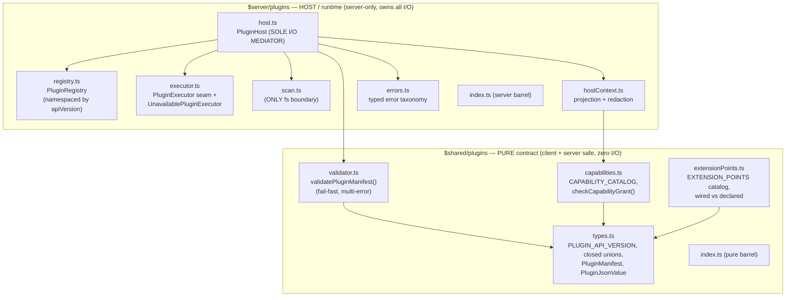
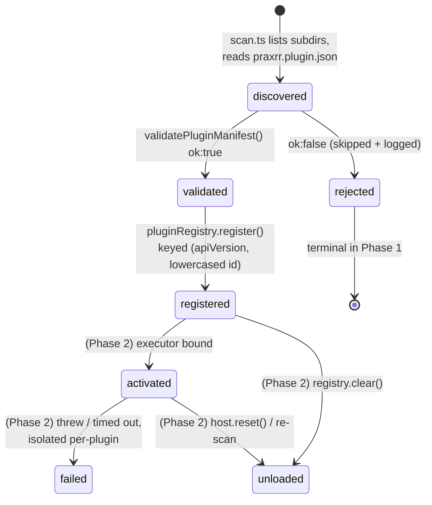

# Plugin System Architecture

> Phase-1 foundation for the WASM plugin system (issue #35). This note describes the **stable,
> versioned contract and lifecycle scaffolding** that ships in Phase 1. It is feature-flagged
> **OFF by default** (`PLUGINS_ENABLED`), adds **no WASM/Extism runtime dependency**, executes
> **no untrusted code**, and inserts **zero call-sites** into the sync / compile / parser /
> notification pipelines. The default executor throws `PluginRuntimeUnavailableError('wasm runtime
not yet available')`.

## Scope

This page is the architectural map for the plugin subsystem: the module boundary, the
extension-point catalog and its versioning semantics, the lifecycle states a plugin passes
through, the capability projection/redaction boundary, the sole-I/O-mediator invariant, and the
graceful-degradation contract. It documents the design as of Phase 1; points and capabilities
that are declared-but-inert are called out explicitly.

## Module Map

The subsystem is split across two roots by a hard **purity boundary**. Contract code is pure and
client+server safe (modeled 1:1 on `$shared/security`); host/runtime code is server-only and owns
all I/O.



### `$shared/plugins` — the pure contract

Type-only imports, no logic that touches Deno APIs, safe to import from client bundles. It is the
single source of truth for the contract.

| File                                | Responsibility                                                                                                                                                                                                                                                                                                                           |
| ----------------------------------- | ---------------------------------------------------------------------------------------------------------------------------------------------------------------------------------------------------------------------------------------------------------------------------------------------------------------------------------------- |
| `shared/plugins/types.ts`           | Declares `PLUGIN_API_VERSION` **once**, `SUPPORTED_PLUGIN_API_VERSIONS`, the closed `ExtensionPointId` / `CapabilityId` / `PluginRuntime` / `PluginLifecycleState` unions, `PluginJsonValue` (recursive structured-clone-safe), the `PluginManifest` interface (all `readonly`), and the `ManifestValidationResult` discriminated union. |
| `shared/plugins/capabilities.ts`    | `CAPABILITY_CATALOG` of `{ id, label, description, mutates:false, touchesSecrets:false, compatiblePoints }` descriptors, plus `getCapability()` and `checkCapabilityGrant(point, capability)` — the least-privilege policy map. Contains **no** credential/auth/secret/network/fs/db/write id by construction.                           |
| `shared/plugins/extensionPoints.ts` | The declare-all-in-one-array `EXTENSION_POINTS` catalog (all 9 points, stable order), each stamped with `apiVersion` + `interfaceVersion` + `wired` + `mutates` + `requiredCapability`. Exposes `listExtensionPoints()`, `getExtensionPoint()`, `wiredObservePoints()`.                                                                  |
| `shared/plugins/validator.ts`       | `validatePluginManifest(raw): ManifestValidationResult` — a pure, fail-fast, **multi-error-accumulating** validator (richer than pcd's `{valid, error?}`). No I/O, no `Deno.env`; unit-testable like `parseCookieSecureMode`. Reused by the host, scan, and any future UI.                                                               |
| `shared/plugins/index.ts`           | Pure barrel — one import surface, safe from client and server (mirrors `$shared/security/index.ts`).                                                                                                                                                                                                                                     |

### `$server/plugins` — the host and runtime seam

Server-only. Owns discovery, validation orchestration, registration, dispatch, and the swappable
executor.

| File                            | Responsibility                                                                                                                                                                                                                                                                                                       |
| ------------------------------- | -------------------------------------------------------------------------------------------------------------------------------------------------------------------------------------------------------------------------------------------------------------------------------------------------------------------- |
| `server/plugins/host.ts`        | `PluginHost` singleton (`pluginHost`). The **sole I/O mediator**: `initialize()` discovers → validates → registers; `notifyObservers(point, buildInput)` projects+redacts input and dispatches wired observe points through the executor with per-plugin isolation. Constructor-injected executor + `setExecutor()`. |
| `server/plugins/registry.ts`    | `PluginRegistry` singleton (`pluginRegistry`) over a nested `Map<apiVersion, Map<lowercased id, RegisteredPlugin>>`. Adds `unregister` + apiVersion namespacing + case-insensitive per-namespace id uniqueness over the `queueRegistry` pattern. In-memory only, rebuilt each boot.                                  |
| `server/plugins/executor.ts`    | The swappable `PluginExecutor` seam over `PluginJsonValue`, and the shipped inert default `UnavailablePluginExecutor`. **No Extism/WASM import.**                                                                                                                                                                    |
| `server/plugins/scan.ts`        | The **only** file that touches `Deno.readDir` / `Deno.readTextFile`. Reads each subdir's `praxrr.plugin.json`, JSON-parses, returns raw entries (collecting parse errors, never throwing on bad manifests; rethrows only unexpected fs errors).                                                                      |
| `server/plugins/hostContext.ts` | The projection + redaction boundary: `buildCapabilityInput()` copies only allow-listed fields per granted capability, then `scrubPluginBoundary()` runs the secret scrubber (reuses `redactSecrets` from `$server/mcp/redact.ts`).                                                                                   |
| `server/plugins/errors.ts`      | Typed error taxonomy (mirrors `mcp/errors.ts`): `PluginManifestError` / `PluginValidationError`, `PluginCapabilityDeniedError`, `PluginPointNotWiredError`, `PluginRuntimeUnavailableError`, `PluginExecutionError`. A rejected-manifest **skip** must never be conflated with an execution-seam **throw**.          |
| `server/plugins/index.ts`       | Server barrel imported by `hooks.server.ts` as `$server/plugins/index.ts`.                                                                                                                                                                                                                                           |

## Extension-Point Catalog

Extension points are **declared in full** but only a safe **observe-only subset is wired** at the
host dispatch seam. Safety rests on the absence of a wired transform/provider handler, not on a
flag. A wired point is dispatchable via `notifyObservers`; a declared-but-unwired point registers
fine but throws `PluginPointNotWiredError` if dispatched.

| Extension point                   | Kind      | Wired (P1) | Grantable capability     | Notes                                                                                                                                    |
| --------------------------------- | --------- | :--------: | ------------------------ | ---------------------------------------------------------------------------------------------------------------------------------------- |
| `config.profileCompiled.observe`  | observe   |     ✅     | `read:resolved-profile`  | Redacted snapshot of a freshly compiled profile. Dispatch path is exercised only at the host seam in tests; **no production call-site**. |
| `sync.previewComputed.observe`    | observe   |     ✅     | `read:sync-preview`      | Redacted sync-preview diff, after preview, before apply. The single reference-wired live observe point; no pipeline call-site added.     |
| `config.validation.observe`       | observe   |     ❌     | `read:config-validation` | Declared future observer; no host dispatch path yet.                                                                                     |
| `sync.beforeApply.observe`        | observe   |     ❌     | —                        | Declared; unwired because it runs adjacent to the mutating sync path. Waits for the sandboxed executor + finite timeouts.                |
| `sync.afterApply.observe`         | observe   |     ❌     | —                        | Declared future audit/notification hook. Unwired.                                                                                        |
| `parser.releaseTitle.transform`   | transform |     ❌     | — (none grantable)       | Declared future mutating point. Never wired until sandbox execution exists.                                                              |
| `customFormat.condition.evaluate` | transform |     ❌     | — (none grantable)       | Declared future compute point; requires a timeout-bounded executor.                                                                      |
| `notification.dispatch.observe`   | provider  |     ❌     | — (none grantable)       | Declared; a provider needs a network capability that does not exist in Phase 1.                                                          |
| `importExport.adapter`            | transform |     ❌     | — (none grantable)       | Declared; needs fs/network capabilities that are unrepresentable in Phase 1.                                                             |

**Invariant:** every wired point is `kind: 'observe'`. No transform or provider point is wired, and
transform/provider points have **no grantable Phase-1 capability**, so they structurally cannot be
granted what they would need to alter pipeline output.

## `apiVersion` Semantics

`apiVersion` is the contract-compatibility key and the **registry namespace key** (the parser
cache-safety analog). Its handling is deliberately strict:

- **Strict support, never negotiate.** A manifest's `apiVersion` must be a member of
  `SUPPORTED_PLUGIN_API_VERSIONS` (Phase 1: `['1']`). A non-member is a **hard reject** — unlike the
  MCP protocol's echo-else-latest negotiation. A plugin compiled for another `apiVersion` must not
  run.
- **Namespace, not just a check.** The registry is keyed by `(apiVersion, lowercased id)`. The same
  `id` under two different `apiVersion`s coexists in isolation; a lookup under the wrong
  `apiVersion` returns `undefined`. An enable/disable/rollback or an upgrade **cannot resurrect** a
  plugin validated under an incompatible contract version.
- **Cache tuple.** Any future result cache is namespaced by the `(apiVersion, plugin.version)`
  tuple, so an upgrade cannot reuse results produced by a prior build (mirrors
  `arr/parser/client.ts` keying its cache by `(cacheKey, parserVersion)`).
- **`PLUGIN_API_VERSION` is declared once** in `types.ts` and manually bumped on any contract
  change (mirrors `SECURITY_POSTURE_ENGINE_VERSION`). A pinning test asserts it is a member of
  `SUPPORTED_PLUGIN_API_VERSIONS` so it can't drift.

Adding a grantable capability, or otherwise widening the contract, is a deliberate, test-guarded
change that bumps the API version — never an ambient default.

## Lifecycle States

`PluginLifecycleState` enumerates the states. Phase-1-reachable states are `discovered`,
`validated`, `registered`, `rejected`; `activated`, `failed`, `unloaded` are **declared for the
runtime phase but unreachable in Phase 1**.



- **discovered** — `scan.ts` lists each immediate subdir of `PLUGINS_DIR` and reads its
  `praxrr.plugin.json`. This is the only `Deno.readDir` / `readTextFile` boundary in the subsystem.
- **validated** — `validatePluginManifest(raw)` runs fail-fast, accumulating **all** field errors in
  one pass.
- **registered** — on `ok:true` the host calls `pluginRegistry.register(sourceDir, manifest)`;
  duplicate id within a namespace is rejected.
- **rejected** — terminal Phase-1 state for a bad/malformed manifest; recorded with its
  `PluginManifestIssue[]` and logged. Initialization continues with the remaining plugins.
- **activated / failed / unloaded** — declared for the runtime phase; not reachable until a real
  executor lands.

## Capability Model: Projection & Redaction Boundary

The security posture is **deny-by-construction** across three defense layers (mirroring
`$shared/security` + `mcp/context.ts` projection + `mcp/redact.ts` scrubber).

1. **Type layer — forbidden grants are unrepresentable.** `CapabilityId` is a closed string-literal
   union. Phase-1 grantable capabilities are all observe-only and credential-free:
   `read:resolved-profile`, `read:sync-preview`, `read:custom-format`, `read:config-validation`.
   There is deliberately **no** capability id for credentials/API keys, auth/session/users, secrets,
   network/HTTP, filesystem, database, environment, or any write/mutate/sync-apply action — a
   manifest cannot even name them. This is a structural guarantee, not a runtime blocklist that
   could be misconfigured.
2. **Validation layer — fail-closed + least-privilege.** The pure validator rejects any capability
   not in `CAPABILITY_IDS` (fail-closed), and enforces least privilege via
   `checkCapabilityGrant(point, capability)`: a plugin may request a capability only if one of its
   declared extension points can legitimately consume it. Every catalog entry is tagged
   `{ mutates:false, touchesSecrets:false }` and a pinning test asserts it.
3. **Runtime boundary layer — the host projects then redacts.** `hostContext.ts` is the sole place
   domain data is shaped for plugins. `buildCapabilityInput()` copies **only** the allow-listed
   fields a granted capability entitles; `scrubPluginBoundary()` then runs the `redactSecrets`
   scrubber as defense-in-depth so even a projection regression cannot leak an `api_key`/`token`.
   Inputs **and** outputs across the seam are strictly `PluginJsonValue` (structured-clone-safe).

Plugins never receive live domain objects, DB handles, config, env, or credential-bearing rows —
only least-privilege, secret-scrubbed plain-JSON snapshots.

## The Sole-I/O-Mediator Invariant

**`PluginHost` mediates every byte of data that crosses the plugin seam, and `scan.ts` is the only
filesystem boundary.** These two rules keep the trust boundary auditable in a single place.

- **`scan.ts` is the only fs boundary.** It is the only module that touches `Deno.readDir` /
  `Deno.readTextFile`. It is injected into the host so host logic stays pure and unit-testable, and
  so all disk access is reviewed in one small file.
- **`PluginHost` is the only mediator of seam data.** Nothing hands a plugin data except the host,
  and the host only ever passes a `PluginJsonValue` snapshot produced by `hostContext.ts`
  (project → redact). No live object, DB row, config, env, or credential ever reaches the seam.
- **No Extism/WASM type leaks inward.** The `PluginExecutor` seam is an interface over
  `PluginJsonValue` only. Extism vs a native Deno Worker vs QuickJS stays swappable; no runtime type
  appears in host, registry, or validator.

```mermaid
sequenceDiagram
    participant Caller as (future) pipeline caller
    participant Host as PluginHost
    participant Ctx as hostContext.ts
    participant Reg as PluginRegistry
    participant Exec as PluginExecutor
    Caller->>Host: notifyObservers(point, buildInput)
    Note over Host: reject if point is not a wired observe point<br/>→ PluginPointNotWiredError
    Host->>Ctx: buildCapabilityInput(cap, source)
    Ctx->>Ctx: project allow-listed fields → scrub secrets
    Ctx-->>Host: PluginJsonValue snapshot
    Host->>Reg: listForPoint(apiVersion, point)
    loop per registered plugin (isolated)
        Host->>Exec: execute({ plugin, point, input, signal })
        Note over Host,Exec: finite AbortSignal timeout;<br/>default UnavailablePluginExecutor<br/>rejects PluginRuntimeUnavailableError
        Exec-->>Host: reject / resolve (discarded for observe)
        Note over Host: try/catch swallows —<br/>debug-log expected unavailability,<br/>warn-log any other throw. Never propagates.
    end
    Host-->>Caller: resolves void (never throws)
```

Data-flow, in brief:

```
PLUGINS_DIR (disk)
    │  scan.ts  ── ONLY fs boundary
    ▼
raw manifest entries ──► validatePluginManifest() ──► PluginRegistry
                                                       (keyed by apiVersion)
                                                              │
(source domain data) ─► hostContext: project → redact ─► PluginJsonValue snapshot
                                                              │
                                                     PluginHost.notifyObservers
                                                     (wired observe points only)
                                                              │  per-plugin try/catch
                                                              ▼  + finite timeout
                                                     PluginExecutor.execute
                                                     (default: throws "wasm runtime
                                                      not yet available")
```

## Graceful-Degradation Contract

The plugin subsystem must **never** destabilize boot or the core pipeline (the "optional parser
degradation" convention). Three concrete guarantees:

- **Disabled = hard no-op.** `PLUGINS_ENABLED` defaults **OFF**, parsed with the existing
  non-throwing `Config.parseBooleanEnv` (like `pullOnStart`, not the default-ON `mcpEnabled` helper)
  so a typo cannot brick module-eval boot. When off, `PluginHost.initialize()` returns immediately —
  it never stats `PLUGINS_DIR`, the registry stays empty, and any future plugin HTTP route returns
  404 at the top of the handler. Startup logs `Plugins disabled via PLUGINS_ENABLED`.
- **Enabled + missing dir = warn + empty.** When enabled, `initialize()` stats `config.paths.plugins`
  and, on `Deno.errors.NotFound`, **warns and degrades to an empty registry** — it does not throw and
  does not auto-create the directory. A disabled/absent feature never litters an empty dir. Only
  genuinely unexpected fs errors rethrow. The startup call site is additionally wrapped in a
  `try/catch` that warns and continues, so even an unexpected failure cannot abort boot.
- **Per-plugin isolation on dispatch.** `notifyObservers` runs each executor call inside its own
  `try/catch`, bounded by a finite `AbortSignal` timeout. The expected `PluginRuntimeUnavailableError`
  is logged at debug; any other throw is logged at warn. Neither propagates — one plugin's failure,
  hang, or missing runtime can never block another plugin or the caller. Dispatching a
  declared-but-unwired point is the one intentional throw (`PluginPointNotWiredError`), a programmer
  error surfaced in tests.

## Runtime Seam & Future Runtime

All execution routes through the `PluginExecutor` interface (`execute(req): Promise<PluginJsonValue>`).
The shipped default `UnavailablePluginExecutor` rejects with
`PluginRuntimeUnavailableError('wasm runtime not yet available')`. The host takes the executor by
constructor injection (default `new UnavailablePluginExecutor()`) plus a `setExecutor()` seam, so
tests supply a resolving fake and **Phase 2 drops in an `ExtismPluginExecutor` implementing the
identical interface with zero changes to host / registry / validator / contract**.

Extism is the recommended Phase-2 runtime (its default-deny `Manifest` capability model maps 1:1 to
this deny-by-construction design; language-agnostic PDKs fit community parsers/evaluators) but is
**not added in Phase 1**. It is gated behind a Deno-WASM go/no-go spike validating that
`@extism/extism` loads under Deno's permission model, that Web-Worker-backed timeout/cancellation
works under Deno, and that host functions + memory/fuel limits behave. A negative spike costs only
the `ExtismPluginExecutor`, never the foundation.

## Configuration

| Variable          | Default           | Behavior                                                                                                                                           |
| ----------------- | ----------------- | -------------------------------------------------------------------------------------------------------------------------------------------------- |
| `PLUGINS_ENABLED` | `false` (OFF)     | Master flag, parsed non-throwing (`1\|true\|yes\|on`, else off). Off ⇒ host is a hard no-op.                                                       |
| `PLUGINS_DIR`     | `${base}/plugins` | Directory scanned for manifests. Exposed as a trimmed, non-throwing `config.paths.plugins` getter. Not auto-created — the host stats and degrades. |

## Key References

- `packages/praxrr-app/src/lib/shared/plugins/` — pure contract (`types.ts`, `capabilities.ts`,
  `extensionPoints.ts`, `validator.ts`, `index.ts`)
- `packages/praxrr-app/src/lib/server/plugins/` — host/runtime (`host.ts`, `registry.ts`,
  `executor.ts`, `scan.ts`, `hostContext.ts`, `errors.ts`, `index.ts`)
- `packages/praxrr-app/src/lib/server/utils/config/config.ts` — `pluginsEnabled` flag +
  `paths.plugins` getter
- `packages/praxrr-app/src/hooks.server.ts` — startup wiring (after `trashGuideManager.initialize()`)
- `packages/praxrr-app/src/lib/server/mcp/context.ts`, `mcp/redact.ts`, `mcp/errors.ts` — the
  projection / redaction / error-taxonomy precedents this subsystem mirrors
- `docs/plans/35-wasm-plugin-system/phase-1-foundation.md` — internal design doc (contract, risk
  register, Extism evaluation, Phase-2 spike gate)
