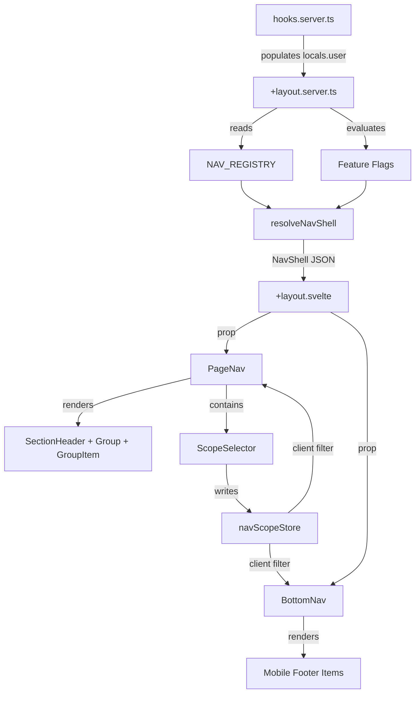
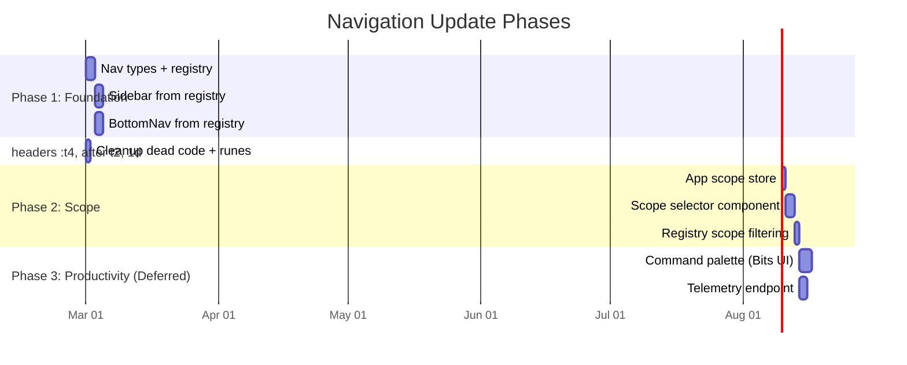
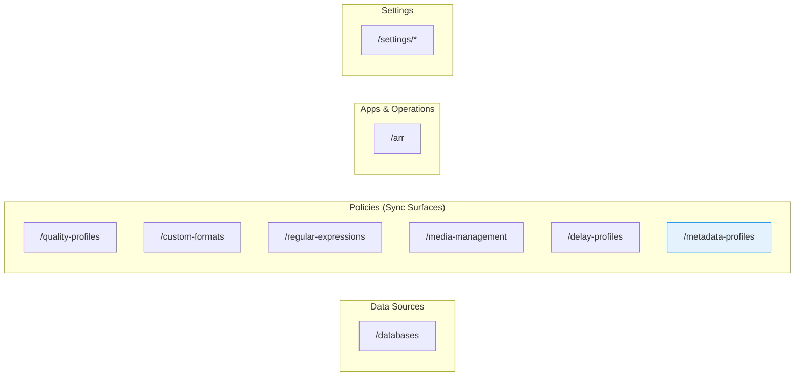

# Feature Spec: navigation-update

## Executive Summary

Praxrr's sidebar (`pageNav.svelte`) and bottom bar (`BottomNav.svelte`) maintain independent hard-coded item arrays with no server-side composition, blocking feature flags, permission gating, and app-scope filtering. The recommended approach is **incremental extraction**: move items into a typed `NavItemDef[]` registry, add section headers for visual grouping, unify both nav data sources through `+layout.server.ts`, and introduce an app-scope selector -- all without external dependencies in Phase 1. Bits UI Command replaces deprecated cmdk-sv for the future command palette; SQLite-backed feature flags replace the overscoped LaunchDarkly/PostHog proposal.

## External Dependencies

### APIs and Services

No external API dependencies are required for the initial implementation. The navigation update is purely internal. Future phases may add:

#### Feature Flags (Internal SQLite Table)

- **Implementation**: New `feature_flags` table in the existing app DB (Kysely migration)
- **Fields**: `key TEXT PK`, `enabled INTEGER`, `description TEXT`
- **Initial flags**: `nav_v2`, `nav_command_palette`, `nav_scope_selector`
- **Reference**: [Martin Fowler Feature Toggles Taxonomy](https://martinfowler.com/articles/feature-toggles.html)

#### Telemetry (Internal Event Table, Deferred)

- **Implementation**: New `navigation_events` table with event name, nav item ID, scope, timestamp
- **Endpoint**: `POST /api/v1/navigation/events` (batched ingestion)
- **Reference**: Internal only; optional [Umami](https://umami.is/) or [Plausible](https://plausible.io/) for general page analytics

### Libraries and SDKs

| Library             | Version | Purpose                                       | When    |
| ------------------- | ------- | --------------------------------------------- | ------- |
| SvelteKit built-ins | 2.43+   | Route groups, layout data, `parent()`         | Phase 1 |
| Bits UI `Command`   | 2.15+   | Command palette (replaces deprecated cmdk-sv) | Phase 3 |
| lucide-svelte       | current | Nav icons (already a dependency)              | Phase 1 |

### External Documentation

- [SvelteKit Advanced Routing](https://svelte.dev/docs/kit/advanced-routing): Route groups for nav without URL changes
- [SvelteKit Load](https://svelte.dev/docs/kit/load): Layout data cascade for nav composition
- [Svelte 5 Context API](https://svelte.dev/docs/svelte/context): SSR-safe component tree state
- [Svelte 5 Snippets](https://svelte.dev/docs/svelte/snippet): Recursive nav tree rendering
- [Bits UI Command](https://bits-ui.com/docs/components/command): Headless command palette for Svelte 5
- [GitLab Sidebar Navigation](https://docs.gitlab.com/development/navigation_sidebar/): Reference architecture for grouped sidebar
- [PatternFly Context Selector](https://www.patternfly.org/components/menus/context-selector/design-guidelines/): Scope switcher placement and behavior

## Business Requirements

### User Stories

**Primary User: Home/Solo Arr Operator**

- As a home user, I want the sidebar to group related items (policies together, operations together) so I can scan quickly instead of reading a flat list of 9 items.
- As a home user, I want the bottom nav on mobile to match the sidebar taxonomy so I do not learn two navigation models.

**Primary User: Power User / Automation Engineer**

- As a power user, I want to know which Arr app context I am working in so that scope-specific features (upgrades for Radarr, metadata profiles for Lidarr) are clearly surfaced or hidden.
- As a power user, I want a command palette (Ctrl+K) so I can jump to any destination without navigating the sidebar tree.

**Secondary User: Mobile User**

- As a mobile user, I want a drawer that shows the full grouped navigation so I can access items hidden by the bottom bar's priority system.

**Future User: Read-Only Operator**

- As a read-only operator, I want to see only destinations I can use so navigation remains focused and safe. (Deferred until multi-role auth ships.)

### Business Rules

1. **Deep-link stability**: No route renames. All existing `/quality-profiles`, `/custom-formats`, `/arr`, etc. paths remain canonical.
   - Validation: Every nav item `href` in the registry matches an existing route.
   - Exception: If a route must move in a future phase, add tested redirect aliases for at least one release cycle.

2. **Single data source**: Sidebar and bottom bar must render from the same nav registry. No more dual hard-coded arrays.
   - Validation: `pageNav.svelte` and `BottomNav.svelte` both import from `registry.ts`.

3. **Arr capability gating**: Nav items linked to Arr surfaces must declare the required capability and be filterable by the active scope using `supportsFeature()` (and underlying workflow/sync capability maps) from `capabilities.ts`.
   - Validation: Metadata Profiles hidden/disabled when Radarr is selected; unsupported non-`all` surfaces remain discoverable with scope-aware behavior.

4. **Database redirect preservation**: Six PCD entity routes use localStorage-based last-database-ID redirects. Nav must not change `href` values for these routes.
   - Validation: Clicking any policy nav item lands on the existing redirect flow.

5. **Convention compliance**: New components must follow "Svelte 5, no runes" convention (`export let` props, writable stores, not `$props()/$derived`).
   - Exception: If project migrates to runes globally, update convention first.

### Edge Cases

| Scenario                                                 | Expected Behavior                                                             | Notes                                     |
| -------------------------------------------------------- | ----------------------------------------------------------------------------- | ----------------------------------------- |
| User switches scope to Lidarr while on Metadata Profiles | Page remains valid (Lidarr supports metadata)                                 | Happy path                                |
| User switches scope to Radarr while on Metadata Profiles | Show inline banner explaining unavailability; offer nearest valid destination | Radarr does not support metadata_profiles |
| Mobile bottom bar with grouped items                     | Show one icon per group or top-priority items; "More" opens drawer            | Preserves current priority system         |
| Feature flag `nav_v2` disabled                           | Render legacy flat sidebar from same registry (no section headers)            | Safe rollback                             |
| `groupItem.svelte` still uses runes                      | Normalize to `export let` pattern during cleanup                              | Existing convention violation             |

### Success Criteria

- [ ] Sidebar and bottom bar render from a single shared registry (zero duplicated nav definitions)
- [ ] 100% of existing deep links remain valid without user action
- [ ] Section headers visually group nav items into 3-5 categories
- [ ] App scope selector filters nav items by Arr capability (Phase 2+)
- [ ] Mobile drawer exposes full grouped navigation (not just bottom bar subset)
- [ ] Dead code removed: `sidebar.ts` deleted, `groupItem.svelte` normalized

> Preserved Deep-link Constraint: `NavShell` only changes composition and visibility, not href values.

## Task 3.4: Implemented Runtime Contract

### NavShell Contract

- `NavShell` is the shared transport object `{ variant, arrScopeOptions, groups }`.
- `src/routes/+layout.server.ts` now returns `{ version }` for auth routes and `{ version, navShell }` for authenticated non-`/auth/*` requests.
- `src/app.d.ts` includes `App.PageData.navShell?: NavShell`.
- `+layout.svelte` passes the same `navShell` payload to both:
  - `PageNav`
  - `BottomNav`

### Registry / Resolver / Shell Flow

```text
+layout.server.ts
   -> resolveNavShell({ user })
   -> reads NAV_GROUPS + NAV_REGISTRY
   -> applies server-side gates:
      - devOnly (dev builds only)
      - permission requirement
      - capability gating
   -> resolves `RegExp` patterns to strings (JSON-safe)
   -> sorts groups/items/children deterministically
   -> returns NavShell
```

### Scope and Priority Rules (Implemented)

- `arrScopeOptions` is derived from `ARR_TARGET_ORDER` (`all`, `radarr`, `sonarr`, `lidarr`) and is fed into the selector UI.
- Scope filtering is applied in `PageNav`:
  - `all` renders entries unchanged
  - unsupported leaf items are hidden
  - unsupported parent entries are shown in disabled/annotated state
- Bottom nav uses deterministic flatten + sort by `mobilePriority` (`always` -> `medium` -> `low`) with stable source-index tie-break.
- Route preservation remains strict: no nav item rename; canonical hrefs are reused.

## Technical Specifications

### Architecture Overview

```text
+layout.server.ts
    |
    | resolveNavShell({ user })
    |   - reads NAV_REGISTRY (NavItemDef[])
    |   - applies server-only gates
    |   - resolves children and patterns for JSON-safe output
    |   - returns NavShell
    v
+layout.svelte
    |
    +-- data.navShell -----> [PageNav]
    |                            |-- for each group in navShell.groups:
    |                            |     [SectionHeader]
    |                            |     [Group]
    |                            |       |-- [GroupHeader]
    |                            |       +-- [GroupItem] (children)
    |                            +-- [NavScopeSelector] (Phase 2)
    |                            +-- [Version]
    |
    +-- data.navShell -----> [BottomNav]
    |                            |-- flatten groups -> items
    |                            |-- filter by mobilePriority
    |
    +-- <slot /> ----------> [Route Page]
                                 |-- may use [Tabs] independently
```

### Data Models

#### NavItemDef (Code-First Registry)

```typescript
// src/lib/shared/navigation/types.ts

import type { ArrFeature } from '$shared/arr/capabilities.ts';
import type { ArrType } from '$shared/pcd/types.ts';

export type NavVariant = 'legacy' | 'nav_v2';
export type NavGroupId = 'overview' | 'apps' | 'policies' | 'operations' | 'settings' | 'dev';
export type NavMobilePriority = 'always' | 'medium' | 'low';

export interface NavItemDef {
  id: string; // Stable: 'policies.quality_profiles'
  label: string;
  href: string;
  groupId: NavGroupId;
  order: number;
  arrScope: ArrType; // 'all' | 'radarr' | 'sonarr' | 'lidarr'
  mobilePriority: NavMobilePriority;
  iconKey: string; // Lucide icon name for client-side resolution
  emoji?: string;
  hasChildren: boolean;
  activePattern?: string | RegExp;
  children?: NavChildDef[];
  featureFlag?: string;
  permission?: string; // Future: role-based filtering
  devOnly?: boolean;
}

// `requiredFeature` is applied in the resolver (`resolveNavShell`) via an
// internal extension type for scope gating.
type ArrCapabilityAwareNavItem = NavItemDef & { requiredFeature?: ArrFeature };

export interface NavChildDef {
  id: string;
  label: string;
  href: string;
  activePattern?: string | RegExp;
  order: number;
}

export interface ResolvedNavItem {
  id: string;
  label: string;
  href: string;
  mobilePriority: NavMobilePriority;
  hasChildren: boolean;
  activePattern?: string;
  children: { id: string; label: string; href: string; activePattern?: string }[];
  iconKey: string;
  emoji?: string;
}

export interface ResolvedNavGroup {
  id: NavGroupId;
  label: string;
  items: ResolvedNavItem[];
}

export interface NavShell {
  variant: NavVariant;
  arrScopeOptions: ArrType[];
  groups: ResolvedNavGroup[];
}
```

#### Icon Serialization

Lucide-svelte `ComponentType` is not JSON-serializable. The registry stores `iconKey: string`, resolved client-side:

```typescript
// src/lib/client/navigation/iconMap.ts
import { FolderTree, Link, Sliders, Palette, ... } from 'lucide-svelte';

export const NAV_ICON_MAP: Record<string, ComponentType> = {
  FolderTree, Link, Sliders, Palette, ...
};

export function resolveIcon(key: string): ComponentType | undefined {
  return NAV_ICON_MAP[key];
}
```

### API Design

#### Layout Load Contract (Modified `+layout.server.ts`)

**Runtime contract**: Auth routes return `{ version }`; authenticated non-auth routes return `{ version, navShell }`.

```typescript
export const load: LayoutServerLoad = async ({ locals }) => {
  return {
    version: appInfoQueries.getVersion(),
    navShell: resolveNavShell({ user: locals.user }),
  };
};
```

The `resolveNavShell` function reads the static registry and returns a pure JSON `NavShell`.

#### Telemetry Endpoint (Phase 3, Deferred)

`POST /api/v1/navigation/events` -- batched event ingestion for nav analytics. Not needed until the app has users generating feedback.

### System Integration

#### Files to Create

| File                                                           | Purpose                                   |
| -------------------------------------------------------------- | ----------------------------------------- |
| `src/lib/shared/navigation/types.ts`                           | Shared TypeScript interfaces              |
| `src/lib/server/navigation/registry.ts`                        | Static `NAV_REGISTRY` constant            |
| `src/lib/server/navigation/resolver.ts`                        | `resolveNavShell()` -- filter + serialize |
| `src/lib/client/navigation/iconMap.ts`                         | Icon key -> ComponentType resolution      |
| `src/lib/client/stores/navScope.ts`                            | App scope writable store (Phase 2)        |
| `src/lib/client/ui/navigation/pageNav/sectionHeader.svelte`    | Section label component                   |
| `src/lib/client/ui/navigation/pageNav/navScopeSelector.svelte` | Scope dropdown (Phase 2)                  |

#### Files to Modify

| File                                                      | Change                                                          |
| --------------------------------------------------------- | --------------------------------------------------------------- |
| `src/routes/+layout.server.ts`                            | Add `resolveNavShell()` call, return `navShell`                 |
| `src/routes/+layout.svelte`                               | Pass `data.navShell` to `PageNav` and `BottomNav`               |
| `src/lib/client/ui/navigation/pageNav/pageNav.svelte`     | Replace hard-coded groups with registry-driven `{#each}` loop   |
| `src/lib/client/ui/navigation/bottomNav/BottomNav.svelte` | Replace hard-coded `NavItem[]` with `navShell.groups` flattened |
| `src/lib/client/ui/navigation/pageNav/groupItem.svelte`   | Normalize from Svelte 5 runes to `export let` (cleanup)         |

#### Files to Delete

| File                               | Reason                                            |
| ---------------------------------- | ------------------------------------------------- |
| `src/lib/client/stores/sidebar.ts` | Dead code -- `sidebarCollapsed` is never imported |

#### Files Unchanged

- All route files under `src/routes/*` -- canonical paths preserved
- `src/lib/shared/arr/capabilities.ts` -- nav registry imports from it, no changes
- `src/hooks.server.ts` -- already populates `locals.user`
- `src/lib/client/ui/navigation/tabs/Tabs.svelte` -- remains route-driven, independent of nav registry

## UX Considerations

### User Workflows

#### Primary: Navigate Grouped Sidebar

1. **Scan section headers** -- User sees "Data Sources", "Policies", "Operations", "Settings" instead of a flat list.
2. **Click destination** -- Same routing behavior as today. Deep links preserved.
3. **Success**: User reaches target page without reading 9 ungrouped items.

#### Primary: Cross-App Scope Switch (Phase 2)

1. **Select scope** -- User picks "Lidarr" from scope selector in top bar / sidebar.
2. **Nav filters** -- Metadata Profiles becomes available or unavailable based on active scope, with explanatory text on unsupported parent groups.
3. **Navigate** -- User clicks Metadata Profiles, lands on familiar route.
4. **Error case**: If current page is unsupported in new scope, show inline banner with nearest valid destination.

#### Secondary: Command Palette (Phase 3)

1. **Trigger** -- User presses `Ctrl/Cmd+K`.
2. **Search** -- Types "quality" and sees Quality Profiles result.
3. **Navigate** -- Presses Enter, palette closes, page loads.

### UI Patterns

| Component       | Pattern                           | Notes                                                |
| --------------- | --------------------------------- | ---------------------------------------------------- |
| Sidebar         | Grouped with section headers      | Preserves existing `Group`/`GroupItem` components    |
| Section headers | Uppercase labels with separator   | "DATA SOURCES", "POLICIES", "OPERATIONS", "SETTINGS" |
| Scope selector  | Dropdown in sidebar or top bar    | Follows PatternFly/AWS placement conventions         |
| Disabled items  | Grayed + inline note (not hidden) | "Not available for Radarr"                           |
| Command palette | Bits UI Command.Dialog            | `Cmd+K` trigger, grouped results, Svelte 5 native    |
| Mobile          | Bottom bar + drawer for full tree | Same taxonomy, different container                   |

### Accessibility Requirements

- Semantic landmarks: `nav` with distinct `aria-label` ("Main navigation", "Mobile navigation")
- `aria-current="page"` on active nav links (currently missing from `groupHeader.svelte`)
- `aria-expanded` / `aria-controls` on collapsible groups (already implemented in `group.svelte`)
- Scope change announced via assertive live region: "Switched to Lidarr"
- Touch targets: minimum 44x44px on mobile (WCAG 2.5.8)

### Performance UX

- **Loading**: Nav shell computed server-side in `+layout.server.ts`, serialized as JSON. No client-side re-computation on initial render.
- **Scope switching**: Client-side filter over pre-loaded data. No server round-trip. Target: <300ms.
- **Hydration safety**: All nav filtering happens once on server. Client receives identical shape. Scope store defaults to `'all'` for SSR stability.

## Recommendations

### Implementation Approach

**Recommended Strategy**: Incremental extraction (Option B) -- registry + section headers + unified data source. No external dependencies. Add scope selector when registry is stable.

**Phasing:**

1. **Phase 1 - Foundation** (~2-3 days): Extract typed registry, unify sidebar/bottom bar data, add section headers, cleanup dead code.
2. **Phase 2 - Scope Awareness** (~2 days): Add app scope store, selector component, and capability-based nav filtering.
3. **Phase 3 - Productivity** (deferred): Command palette via Bits UI Command, favorites/recents, telemetry.

### Technology Decisions

| Decision           | Recommendation                  | Rationale                                         |
| ------------------ | ------------------------------- | ------------------------------------------------- |
| Nav data source    | Typed registry in code          | Eliminates dual hard-coded arrays; type-safe      |
| Feature flags      | SQLite table or env var         | Self-hosted app; LaunchDarkly/PostHog is overkill |
| Command palette    | Bits UI Command v2.x            | cmdk-sv deprecated; Bits UI is Svelte 5 native    |
| Analytics          | Internal event table (deferred) | No users yet; ship nav, get manual feedback       |
| Scope switching    | Client-side filter              | Avoids server round-trip; pre-loaded data         |
| Icon serialization | `iconKey` string + client map   | Lucide ComponentType not JSON-serializable        |

### Quick Wins

- Add section header dividers in `pageNav.svelte` (pure markup, zero risk)
- Delete `src/lib/client/stores/sidebar.ts` (dead code)
- Add `aria-current="page"` to active nav links for screen reader support
- Normalize `groupItem.svelte` from Svelte 5 runes to `export let` per project convention

### Future Enhancements

- Command palette with entity search (specific profiles/formats by name)
- Favorites and recents in sidebar and palette
- Role-based nav filtering when multi-user auth ships
- Plugin/module self-registration for nav entries
- Collapsible icon-only sidebar rail (wire up existing unused `sidebarCollapsed` store)

## Risk Assessment

### Technical Risks

| Risk                                                    | Likelihood | Impact | Mitigation                                                                                                                              |
| ------------------------------------------------------- | ---------- | ------ | --------------------------------------------------------------------------------------------------------------------------------------- |
| SSR/hydration mismatch from browser-only scope state    | Medium     | High   | Keep registry as pure static data. Scope store defaults to `'all'` for SSR. Follow `navIcons.ts` pattern with `browser` guard.          |
| Breaking mobile drawer behavior during sidebar refactor | Medium     | Medium | Preserve `$mobileNavOpen` store, `svelte:window` keydown, and `$page.url.pathname` watcher. Test mobile open/close/escape/route-change. |
| BottomNav priority regression                           | Medium     | Medium | Registry exposes `mobilePriority` field mapped to same Tailwind classes (`hidden sm:flex`).                                             |
| localStorage redirect interference                      | Low        | High   | Nav items use identical `href` values. No route changes = no redirect breakage.                                                         |
| Over-engineering the registry                           | High       | Medium | Start with 8-10 fields per item. Add permissions, telemetry IDs only when needed.                                                       |

### Integration Challenges

- Keeping sidebar and bottom bar visually synchronized when rendering from shared data
- Ensuring `groupItem.svelte` normalization (runes -> export let) does not break active-state matching
- Coordinating registry updates with route additions in future features

### Security Considerations

- Nav visibility is UX only; server-side auth in `hooks.server.ts` remains source of truth
- Feature flag table values must not be exposed to unauthenticated users
- Telemetry endpoint (when added) must validate payloads and rate-limit

## Sample Diagrams

### ASCII: Current vs Proposed Sidebar

```text
CURRENT (flat)                    PROPOSED (grouped)
+---------------------------+     +---------------------------+
| [icon] Databases          |     |  DATA SOURCES             |
| [icon] Arrs               |     | [icon] Databases          |
| [icon] Quality Profiles  v|     |                           |
|    Testing                |     |  POLICIES                 |
| [icon] Custom Formats     |     | [icon] Quality Profiles  v|
| [icon] Regular Expressions|     |    Testing                |
| [icon] Media Management  v|     | [icon] Custom Formats     |
|    Naming Settings        |     | [icon] Regular Expressions|
|    Quality Definitions    |     | [icon] Media Management  v|
|    Media Settings         |     |    Naming Settings        |
| [icon] Delay Profiles     |     |    Quality Definitions    |
| [icon] Metadata Profiles  |     |    Media Settings         |
| [icon] Settings          v|     | [icon] Delay Profiles     |
|    General                |     | [icon] Metadata Profiles  |
|    Jobs                   |     |                           |
|    Logs                   |     |  APPS & OPERATIONS        |
|    ...                    |     | [icon] Arrs               |
+---------------------------+     |                           |
                                  |  SETTINGS                 |
                                  | [icon] General            |
                                  | [icon] Jobs               |
                                  | [icon] Logs               |
                                  | [icon] Backups            |
                                  | [icon] Notifications      |
                                  | [icon] Security           |
                                  | [icon] About              |
                                  +---------------------------+
```

### ASCII: Scope Selector Effect (Radarr)

```text
+----------------------------------------------------------+
|  [Logo] praxrr       [Scope: Radarr v] [Cmd+K] [T]      |
+----------------------------------------------------------+
|                                                           |
|  POLICIES                                                 |
|    Quality Profiles                                       |
|    Custom Formats                                         |
|    Regular Expressions                                    |
|    Media Management                                       |
|    Delay Profiles                                         |
|    Metadata Profiles  [!] "Not available for Radarr"      |
|                                                           |
|  APPS & OPERATIONS                                        |
|    Arrs                                                   |
|      (Upgrades -- visible, Radarr supported)              |
|      (Renames  -- visible, Radarr supported)              |
|                                                           |
```

### Mermaid: Data Flow



### Mermaid: Phased Rollout



### Mermaid: Route-to-Group Mapping



## Task Breakdown Preview

### Phase 1: Foundation (~2-3 days)

**Focus**: Single source of truth, visual grouping, cleanup.
**Tasks**:

- Create `src/lib/shared/navigation/types.ts` (interfaces)
- Create `src/lib/server/navigation/registry.ts` (nav item data)
- Create `src/lib/server/navigation/resolver.ts` (filter + serialize)
- Create `src/lib/client/navigation/iconMap.ts` (icon resolution)
- Modify `+layout.server.ts` to return `navShell`
- Modify `+layout.svelte` to pass `navShell` props
- Refactor `pageNav.svelte` to render from registry
- Refactor `BottomNav.svelte` to render from registry
- Create `sectionHeader.svelte` and integrate
- Delete `sidebar.ts`, normalize `groupItem.svelte`

**Parallelization**: Cleanup (delete + normalize) can run in parallel with registry extraction.

### Phase 2: Scope Awareness (~2 days)

**Focus**: App context indicator and capability-based filtering.
**Dependencies**: Phase 1 registry must be complete.
**Tasks**:

- Create `navScope.ts` store (localStorage-persisted)
- Create `navScopeSelector.svelte` component
- Add `arrScope` filtering to `pageNav.svelte` rendering loop
- Add scope indicator to `navbar.svelte` or sidebar header
- Test: scope changes correctly filter items per capability matrix

### Phase 3: Productivity Layer (Deferred)

**Focus**: Power-user speed features. Ship when app has real users.
**Tasks**:

- Command palette with Bits UI Command.Dialog
- Favorites and recents
- Telemetry endpoint and internal event table
- Feature flag table migration

## Decisions Needed

Before proceeding to implementation planning:

1. **Implementation Scope**
   - Options: Option A (headers only), **Option B (registry + headers)**, Option C (full platform shell)
   - Recommendation: **Option B** -- fixes the real maintenance pain while staying lean.

2. **Section Names**
   - Options: `Data Sources / Policies / Apps & Operations / Settings` or `Data / Operations / Settings`
   - Impact: Affects onboarding, label copy, and future module registration.

3. **Arrs Placement**
   - Options: Under "Apps & Operations" (recommended) or its own "Instances" section.
   - Impact: Whether Arr instances are peers with policies or a separate concern.

4. **Scope Selector Timing**
   - Options: Ship in Phase 1 alongside registry, or defer to Phase 2.
   - Recommendation: Defer to Phase 2 -- get the registry stable first.

5. **Svelte Pattern**
   - Options: Normalize `groupItem.svelte` back to `export let` (align with convention), or migrate all nav to runes (change convention).
   - Recommendation: Normalize to `export let` to match current convention.

6. **Sidebar Collapse**
   - Options: Wire up existing `sidebarCollapsed` store, or delete it.
   - Impact: Determines if icon-only rail mode is a future option.

## Research References

For detailed findings, see:

- [research-external.md](./research-external.md): SvelteKit patterns, Bits UI Command, lightweight flag/telemetry alternatives
- [research-business.md](./research-business.md): Route-to-group mapping, capability matrix, user stories
- [research-technical.md](./research-technical.md): TypeScript interfaces, component architecture, file change list
- [research-ux.md](./research-ux.md): Competitive analysis (Servarr, Jellyfin, Grafana, Portainer), scope switcher patterns, wireframes
- [research-recommendations.md](./research-recommendations.md): Grounded recommendations, decision tree, phased rollout
