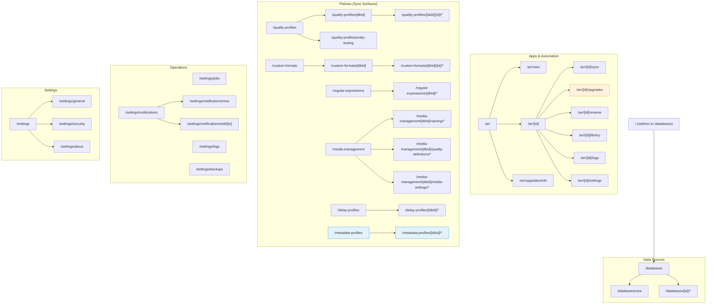
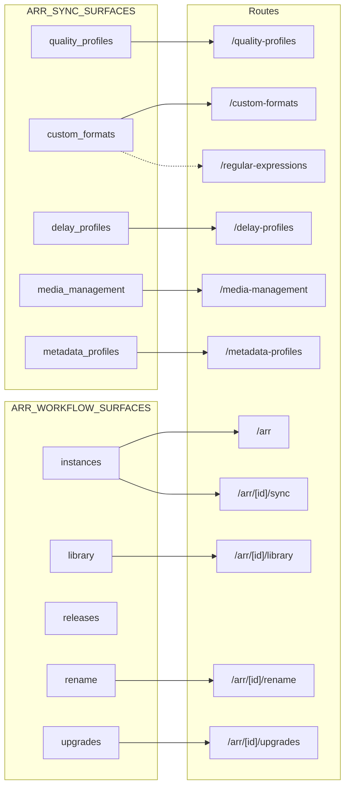
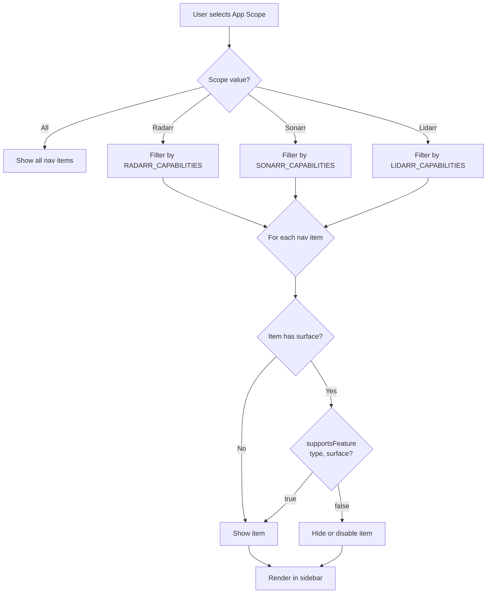

## Executive Summary

Praxrr is evolving from a quality-profile manager into a broader Arr management and automation platform, but the current navigation still treats every capability as a flat, equally-weighted sidebar entry. The existing `pageNav.svelte` hard-codes nine top-level groups (Databases, Arrs, Quality Profiles, Custom Formats, Regular Expressions, Media Management, Delay Profiles, Metadata Profiles, Settings) with no concept of grouping, scope filtering, or capability gating. The mobile `BottomNav.svelte` repeats the same items with a priority system (`always`, `medium`, `low`) that hides lower-frequency items entirely on small screens. This document frames the business behaviors the navigation must serve: logical grouping of Arr surfaces, lowering cognitive load for home users, empowering power users and automation engineers, and positioning the new terminology (management + automation) while letting permissions drive visibility.

## User Stories

- **Home/solo operator:** "I only run one or two Arr apps and care about the essentials (quality profiles, custom formats, arr instances). Today I see nine sidebar entries with no hierarchy. I want a grouped navigation that keeps the few tasks I care about front-and-center without learning a new hierarchy every release. The current pageNav gives me `Databases > Arrs > Quality Profiles > Custom Formats > ...` as a flat list; grouping by purpose (data sources vs sync policies vs operations) would let me skip over categories I never use."
- **Power user / automation engineer:** "I juggle dozens of databases, sync policies, and automation jobs. Today I must navigate between `/quality-profiles`, `/custom-formats`, `/delay-profiles`, `/media-management`, and `/metadata-profiles` as separate sidebar items, each of which redirects me to a database-scoped subpage via `localStorage` lookup. I need fast entry points to cross-app sync workflows plus operational pages (jobs, backups, logs) without clicking through the flat Settings menu every time."
- **Admin monitoring scale:** "When I introduce a new Arr instance or database, the navigation does not reflect what is active or which app context I am in. The Arr instance detail layout (`/arr/[id]`) uses local `Tabs` for Sync/Upgrades/Renames/Library/Logs/Settings, but there is no global indicator of which app family I am working with. I want a scope selector and a single control panel for sync health, job status, and notifications."
- **Role-aware consumer (future):** "If I have a read-only or operator account, the navigation should hide write-intensive destinations like database linking (`/databases/new`) or job creation so I can focus on monitoring. Today, the single admin model means every nav entry is always visible."
- **Mobile user:** "On small screens, the bottom nav only shows 5 `always`-priority items (Databases, Arrs, Profiles, Formats, Settings). Regular Expressions is hidden below `sm` breakpoint, and Media Management, Delay Profiles, and Metadata Profiles are completely hidden (`low` priority). I need a drawer or grouped mobile menu that still gives me access to everything."

## Business Rules

- **Keep existing routes stable.** Every new navigation grouping must map to the route structure under `packages/praxrr-app/src/routes` (for example, `/quality-profiles`, `/custom-formats`, `/arr`, `/media-management`, `/metadata-profiles`, `/delay-profiles`, `/databases`, `/settings/*`) so deep-links continue to work. The root `/` currently redirects to `/databases` via `+page.server.ts`, which remains the canonical onboarding entry.
- **Group by Arr capability surface.** The `Arr` capability metadata (`packages/praxrr-app/src/lib/shared/arr/capabilities.ts`, `ARR_WORKFLOW_SURFACES`, `ARR_SYNC_SURFACES`) already separates workflow surfaces (`instances`, `library`, `releases`, `rename`, `upgrades`) from sync surfaces (`quality_profiles`, `custom_formats`, `delay_profiles`, `media_management`, `metadata_profiles`). Navigation groups should respect that split: sync surfaces live under a "Policies" or "Data & Policies" group, while workflow surfaces live under an "Apps" or "Automation" group. The current pageNav has no grouping -- all nine entries sit at the same hierarchical level.
- **Context selector for app scope.** Because Arr features behave differently per app (e.g., `upgrades` only for Radarr per `RADARR_CAPABILITIES.workflows.upgrades = true`, `metadata_profiles` only for Lidarr per `LIDARR_CAPABILITIES.sync.metadata_profiles = true`, `rename` not for Lidarr per `LIDARR_CAPABILITIES.workflows.rename = false`), the nav must surface the current scope (`All Apps`, `Radarr`, `Sonarr`, `Lidarr`). Context should drive both grouping titles and whether a destination is enabled. Today, no such selector exists -- all entries are always shown.
- **Align language with the new brand.** Replace "quality-profile manager" framing with "management and automation" terms. Top groups could be `Data Sources`, `Policies`, `Apps & Automation`, `Operations`, `Settings`, reflecting the broader promise described in `README.md`.
- **Permission-aware visibility.** Even though the current database schema (`packages/praxrr-app/src/lib/server/db/schema.sql`) defines a single admin user, the navigation must be ready to hide write-heavy modules (databases, job history, security) from future read-only operators or API-only contexts. Server-side checks (auth middleware in `packages/praxrr-app/src/hooks.server.ts`) must still enforce access regardless of nav visibility.
- **Avoid excessive depth.** Each group should expose only 3--5 immediate destinations plus a "More" or "See all" entry; additional pages (settings subpages, data views) should live in contextual side navs or tabs (see how `/arr/[id]` uses `Tabs` with breadcrumbs) instead of piling onto the primary nav. The current Media Management group already demonstrates this pattern by having sub-items (Naming Settings, Quality Definitions, Media Settings), but no other group uses sub-items beyond Settings.
- **Database-scoped redirect preservation.** Six PCD entity routes (`/quality-profiles`, `/custom-formats`, `/regular-expressions`, `/delay-profiles`, `/metadata-profiles`, `/media-management`) use an identical localStorage-based redirect pattern on their root page: read the last selected `databaseId` from storage, then `goto('/entity-type/${databaseId}')`. Any navigation restructuring must preserve this pattern or replace it with a first-class database context selector.

## Workflows

1. **Link a PCD database and manage sync targets.** The `/databases` route (with `/new` and `/[id]` children) drives onboarding: selecting a database, cloning via Git, and persisting git identity info. The database detail layout (`packages/praxrr-app/src/routes/databases/[id]/+layout.svelte`) uses `Tabs` for Changes/Commits/Conflicts/Tweaks/Config/Settings with breadcrumbs back to `/databases`. The nav should surface the upstream "Link" capability alongside other data sources, so users can jump to `/databases/new` from a "Data Sources" group.

2. **Add Arr instances and sync policies.** `/arr` and its child views (`/arr/new`, `/arr/[id]/sync`, `/arr/[id]/upgrades`, `/arr/[id]/rename`, `/arr/[id]/library`, `/arr/[id]/logs`, `/arr/[id]/settings`) represent the "Bridge + Sync" portion. The instance detail layout (`packages/praxrr-app/src/routes/arr/[id]/+layout.svelte`) uses `Tabs` with six tabs (Sync, Upgrades, Renames, Library, Logs, Settings) and breadcrumbs. Additionally, `/arr/upgrades/info` is a standalone informational page. Navigation needs a high-level "Apps & Automation" category for instances plus quick links to instance-specific workflows per `ARR_WORKFLOW_SURFACES`.

3. **Edit sync entities (PCD-backed).** Pages under `/quality-profiles`, `/custom-formats`, `/delay-profiles`, `/media-management`, `/metadata-profiles`, and `/regular-expressions` all represent policies compiled from PCD databases to Arr apps. Each has the same three-tier structure: root redirect -> `[databaseId]` list -> `[databaseId]/[id or name]` editor. Quality profile and custom format editors use additional sub-tab layouts (General/Scoring/Qualities for QP; General/Conditions/Testing for CF). Media Management has a unique three-section sub-nav (Naming, Quality Definitions, Media Settings), each scoped per `arr_type` (Radarr/Sonarr/Lidarr). The nav should let users pivot between these entity types without re-selecting the database context.

4. **Monitor and operate.** `/settings/jobs`, `/settings/logs`, `/settings/backups`, `/settings/notifications` plus alerts/cron components form an operations surface. The Settings hub page (`packages/praxrr-app/src/routes/settings/+page.svelte`) renders seven items as a card list (General, Security, Notifications, Jobs, Logs, Backups, About). In `pageNav.svelte`, these are exposed as `GroupItem` children under the Settings group. The primary nav should surface an "Operations" group to pull Jobs/Logs/Backups/Notifications out of Settings, since they are high-frequency for automation operators.

5. **Cross-cutting support tasks.** Theme toggle, accent picker, and nav icon style toggle currently live in the `navbar.svelte` top bar. The `sidebarCollapsed` store exists but is not currently used in the layout. Global search (`search.ts` store) exists as a data-page utility but not as a navigation search. Future cross-cutting tools (command palette, favorites, recents) should share the utility nav slot.

## Domain Concepts

- **PCD (Praxrr Compliant Database).** Git-backed database containing Arr configuration operations (see `packages/praxrr-app/src/lib/server/pcd/`). Databases are the authoritative source for sync operations and must be easily reachable from the nav because almost every workflow starts or references a database. Six entity routes depend on having at least one linked database and share the same redirect-to-database pattern.
- **Arr Instance / App Scope.** A Radarr/Sonarr/Lidarr instance linked via `/arr` must be treated both as a workflow owner (library, sync, rename, upgrades) and as a target for sync surfaces (quality profiles, custom formats, media/metadata). Arr capability metadata (`ARR_APPS` in `packages/praxrr-app/src/lib/shared/arr/capabilities.ts`) determines which nav entries should be active per app. The `ARR_APP_TYPES` array is `['radarr', 'sonarr', 'lidarr']`, with `ArrType` including the `'all'` meta-type.
- **Sync vs Workflow Surfaces.** As defined in `packages/praxrr-app/src/lib/shared/arr/capabilities.ts`:
  - **Sync surfaces**: `quality_profiles`, `custom_formats`, `delay_profiles`, `media_management`, `metadata_profiles` -- these map directly to the six PCD entity routes.
  - **Workflow surfaces**: `instances`, `library`, `releases`, `rename`, `upgrades` -- these map to `/arr` and its sub-routes.
  - Navigation must surface both so users can manage policies (sync) and operations/automation (workflow) without reorienting.
- **Capability Matrix.** Determines what is available per app:
  - Radarr: all workflows true, all sync true except `metadata_profiles` (false).
  - Sonarr: all workflows except `upgrades` (false), all sync true except `metadata_profiles` (false).
  - Lidarr: `instances`/`library`/`releases` workflows true, `rename`/`upgrades` false; all sync surfaces true.
- **Contextual Tabs.** The `Tabs.svelte` component provides sub-navigation within entity detail pages. It supports desktop tab bars and responsive mobile dropdowns, breadcrumbs, and back buttons. Five layout files currently use it: arr instances, databases, quality profiles, custom formats, and media management. This two-level pattern (sidebar group -> contextual tabs) should be preserved and extended.
- **Operations Surface.** Jobs, logs, backups, notifications, and security settings (all under `/settings/*`) are treated as "operations" even though they live under the settings route. The Settings hub page renders them as a card grid. The navigation should expose the high-frequency ones (Jobs, Logs, Backups, Notifications) under a dedicated group to align with the new platform focus.

## Success Criteria

- **Full Arr coverage:** Every Arr workflow and sync surface (per `ARR_WORKFLOW_SURFACES` and `ARR_SYNC_SURFACES`) is represented in a dedicated nav group without duplicating routes.
- **Two-click reachability:** Small/home users can reach their most-used page (e.g., quality profile editor) within two clicks from the primary nav, even when grouped.
- **Context-aware visibility:** Context selectors (app scope) and feature metadata from `ARR_APPS` determine whether items appear or are disabled, preventing Radarr-only actions (like `upgrades`) from being offered when Lidarr is scoped.
- **Cognitive load controls:** Navigation groups never exceed five visible entries; "more" entries and pinned/recent shortcuts guarantee scalable expansion without overwhelming the primary nav.
- **Permission gating:** Write-heavy destinations remain hidden or disabled when future multi-role auth is active, and operations pages still require server-side checks.
- **Terminology alignment:** All labels, group names, and helper text reflect the broader "management and automation platform" positioning from `README.md`.
- **Mobile parity:** The bottom nav and drawer expose the full taxonomy with grouped progressive disclosure, not just the five `always`-priority items.
- **Database redirect preservation:** The localStorage-based database memory pattern on six entity routes continues to work or is replaced by a superior mechanism (e.g., global database context selector).

## Open Questions

- What permission tiers exist beyond the single administrator defined in `packages/praxrr-app/src/lib/server/db/schema.sql`? Should the navigation expose read-only dashboards vs edit controls differently now or only once multi-role support exists?
- Will new app families beyond Radarr/Sonarr/Lidarr share the same capability surface terms, or do we need a more flexible registry for nav groupings?
- Should relocation of current entries (e.g., moving `/custom-formats` out of the flat list into a "Policies" group) happen behind a feature flag? If so, who decides adoption and what is the success threshold for enabling `nav_v2` by default?
- How literal should we be about the management/automation terminology when renaming nav groups? Should we keep some legacy labels for user familiarity (e.g., "Quality Profiles") while adding new group descriptors?
- What metadata should new modules provide to self-register with the future nav registry (group, app scope, permission, priority)? Who owns that registry and how are updates coordinated?
- The `sidebarCollapsed` store exists but is unused -- should the new nav support a collapsed icon-only mode?
- Should the database context selector be global (affecting all entity routes simultaneously) or per-entity-type (current localStorage-per-route behavior)?

## Route-to-Group Mapping

### Current Navigation Structure (Flat)

The current `pageNav.svelte` renders nine top-level entries in this order. Sub-items are indented.

| #   | Current Sidebar Entry | Route                  | Has Sub-Items                                                              |
| --- | --------------------- | ---------------------- | -------------------------------------------------------------------------- |
| 1   | Databases             | `/databases`           | No                                                                         |
| 2   | Arrs                  | `/arr`                 | No                                                                         |
| 3   | Quality Profiles      | `/quality-profiles`    | Yes: Testing                                                               |
| 4   | Custom Formats        | `/custom-formats`      | No                                                                         |
| 5   | Regular Expressions   | `/regular-expressions` | No                                                                         |
| 6   | Media Management      | `/media-management`    | Yes: Naming, Quality Definitions, Media Settings                           |
| 7   | Delay Profiles        | `/delay-profiles`      | No                                                                         |
| 8   | Metadata Profiles     | `/metadata-profiles`   | No                                                                         |
| 9   | Settings              | `/settings`            | Yes: General, Jobs, Logs, Backups, Notifications, Security, About, Log Out |

### Proposed Group Taxonomy

Routes are organized into five proposed groups, mapped against the capability surface classification from `packages/praxrr-app/src/lib/shared/arr/capabilities.ts`.

| Proposed Group        | Route                                                  | Current Label       | Surface Type            | Arr Scope              | Notes                                                       |
| --------------------- | ------------------------------------------------------ | ------------------- | ----------------------- | ---------------------- | ----------------------------------------------------------- |
| **Data Sources**      | `/databases`                                           | Databases           | --                      | all                    | Onboarding entry; root `/` redirects here                   |
| **Data Sources**      | `/databases/new`                                       | (Link Database)     | --                      | all                    | Create flow                                                 |
| **Data Sources**      | `/databases/[id]/*`                                    | (Database detail)   | --                      | all                    | Tabs: Changes, Commits, Conflicts, Tweaks, Config, Settings |
| **Apps & Automation** | `/arr`                                                 | Arrs                | workflow: instances     | all                    | Instance list                                               |
| **Apps & Automation** | `/arr/new`                                             | (Add Instance)      | workflow: instances     | all                    | Create flow                                                 |
| **Apps & Automation** | `/arr/[id]/sync`                                       | (Instance Sync)     | workflow: instances     | per-instance           | Contextual tab                                              |
| **Apps & Automation** | `/arr/[id]/upgrades`                                   | (Instance Upgrades) | workflow: upgrades      | radarr only            | Contextual tab; Sonarr/Lidarr: false                        |
| **Apps & Automation** | `/arr/[id]/rename`                                     | (Instance Renames)  | workflow: rename        | radarr, sonarr         | Lidarr: false                                               |
| **Apps & Automation** | `/arr/[id]/library`                                    | (Instance Library)  | workflow: library       | all                    | Contextual tab                                              |
| **Apps & Automation** | `/arr/[id]/logs`                                       | (Instance Logs)     | --                      | all                    | Contextual tab                                              |
| **Apps & Automation** | `/arr/[id]/settings`                                   | (Instance Settings) | --                      | all                    | Contextual tab                                              |
| **Apps & Automation** | `/arr/upgrades/info`                                   | (Upgrades Info)     | workflow: upgrades      | radarr                 | Standalone info page                                        |
| **Policies**          | `/quality-profiles`                                    | Quality Profiles    | sync: quality_profiles  | all                    | Root redirect to `[databaseId]`                             |
| **Policies**          | `/quality-profiles/[databaseId]`                       | (QP List)           | sync: quality_profiles  | all                    | Database-scoped list                                        |
| **Policies**          | `/quality-profiles/[databaseId]/[id]/*`                | (QP Editor)         | sync: quality_profiles  | all                    | Tabs: General, Scoring, Qualities                           |
| **Policies**          | `/quality-profiles/entity-testing`                     | (QP Testing)        | sync: quality_profiles  | all                    | Testing subpage                                             |
| **Policies**          | `/custom-formats`                                      | Custom Formats      | sync: custom_formats    | all                    | Root redirect to `[databaseId]`                             |
| **Policies**          | `/custom-formats/[databaseId]`                         | (CF List)           | sync: custom_formats    | all                    | Database-scoped list                                        |
| **Policies**          | `/custom-formats/[databaseId]/[id]/*`                  | (CF Editor)         | sync: custom_formats    | all                    | Tabs: General, Conditions, Testing                          |
| **Policies**          | `/regular-expressions`                                 | Regular Expressions | sync: custom_formats    | all                    | Used within CF conditions                                   |
| **Policies**          | `/regular-expressions/[databaseId]/*`                  | (Regex Editor)      | sync: custom_formats    | all                    | Database-scoped                                             |
| **Policies**          | `/delay-profiles`                                      | Delay Profiles      | sync: delay_profiles    | all                    | Root redirect to `[databaseId]`                             |
| **Policies**          | `/delay-profiles/[databaseId]/*`                       | (Delay Editor)      | sync: delay_profiles    | all                    | Database-scoped                                             |
| **Policies**          | `/media-management`                                    | Media Management    | sync: media_management  | all                    | Root redirect; 3 sub-sections                               |
| **Policies**          | `/media-management/[databaseId]/naming/*`              | (Naming)            | sync: media_management  | radarr, sonarr, lidarr | Per-app editors                                             |
| **Policies**          | `/media-management/[databaseId]/quality-definitions/*` | (Quality Defs)      | sync: media_management  | radarr, sonarr, lidarr | Per-app editors                                             |
| **Policies**          | `/media-management/[databaseId]/media-settings/*`      | (Media Settings)    | sync: media_management  | radarr, sonarr, lidarr | Per-app editors                                             |
| **Policies**          | `/metadata-profiles`                                   | Metadata Profiles   | sync: metadata_profiles | lidarr only            | Root redirect to `[databaseId]`                             |
| **Policies**          | `/metadata-profiles/[databaseId]/*`                    | (Metadata Editor)   | sync: metadata_profiles | lidarr only            | Lidarr-exclusive                                            |
| **Operations**        | `/settings/jobs`                                       | Jobs                | --                      | all                    | Pulled out from Settings                                    |
| **Operations**        | `/settings/logs`                                       | Logs                | --                      | all                    | Pulled out from Settings                                    |
| **Operations**        | `/settings/backups`                                    | Backups             | --                      | all                    | Pulled out from Settings                                    |
| **Operations**        | `/settings/notifications`                              | Notifications       | --                      | all                    | Pulled out from Settings                                    |
| **Operations**        | `/settings/notifications/new`                          | (New Notification)  | --                      | all                    | Create flow                                                 |
| **Operations**        | `/settings/notifications/edit/[id]`                    | (Edit Notification) | --                      | all                    | Edit flow                                                   |
| **Settings**          | `/settings`                                            | Settings            | --                      | all                    | Hub page                                                    |
| **Settings**          | `/settings/general`                                    | General             | --                      | all                    | App config                                                  |
| **Settings**          | `/settings/security`                                   | Security            | --                      | all                    | Auth settings                                               |
| **Settings**          | `/settings/about`                                      | About               | --                      | all                    | Build info                                                  |
| **Utility (navbar)**  | --                                                     | Theme Toggle        | --                      | all                    | Stays in top bar                                            |
| **Utility (navbar)**  | --                                                     | Accent Picker       | --                      | all                    | Stays in top bar                                            |
| **Utility (navbar)**  | --                                                     | App Scope Selector  | --                      | all                    | NEW: to be added                                            |
| **Utility (navbar)**  | --                                                     | Command Palette     | --                      | all                    | NEW: future Ctrl+K                                          |
| **Auth (hidden)**     | `/auth/login`                                          | Login               | --                      | all                    | Hidden from nav when logged in                              |
| **Auth (hidden)**     | `/auth/setup`                                          | Setup               | --                      | all                    | Hidden from nav                                             |
| **Dev (dev-only)**    | `/dev`                                                 | Dev                 | --                      | all                    | Only in `import.meta.env.DEV`                               |
| **Dev (dev-only)**    | `/dev/components`                                      | Components          | --                      | all                    | Only in `import.meta.env.DEV`                               |
| **Easter egg**        | `/databases/bruh`                                      | --                  | --                      | --                     | Hidden; not in nav                                          |

### Bottom Nav Priority Mapping

Current `BottomNav.svelte` priorities vs proposed group mapping:

| Priority | Current Items                                       | Proposed Group                                   |
| -------- | --------------------------------------------------- | ------------------------------------------------ |
| `always` | Databases, Arrs, Profiles, Formats, Settings        | Data Sources, Apps, Policies, Policies, Settings |
| `medium` | Regular Expressions                                 | Policies                                         |
| `low`    | Media Management, Delay Profiles, Metadata Profiles | Policies, Policies, Policies                     |

Proposed: The bottom nav should show one icon per group (Data Sources, Apps, Policies, Operations, Settings) with a tap-to-expand drawer for items within each group.

## Sample Diagrams

### ASCII: Proposed Navigation Hierarchy

```
+----------------------------------------------------------+
|  [Logo] praxrr           [Scope: All v] [Accent] [Theme] |
+----------------------------------------------------------+
|                                                           |
|  DATA SOURCES                                             |
|    Databases (/databases)                                 |
|                                                           |
|  APPS & AUTOMATION                                        |
|    Instances (/arr)                                       |
|                                                           |
|  POLICIES                                                 |
|    Quality Profiles (/quality-profiles)                   |
|    v Testing                                              |
|    Custom Formats (/custom-formats)                       |
|    Regular Expressions (/regular-expressions)             |
|    Media Management (/media-management)                   |
|    v Naming Settings                                      |
|    v Quality Definitions                                  |
|    v Media Settings                                       |
|    Delay Profiles (/delay-profiles)                       |
|    Metadata Profiles (/metadata-profiles)  [Lidarr only]  |
|                                                           |
|  OPERATIONS                                               |
|    Jobs (/settings/jobs)                                  |
|    Logs (/settings/logs)                                  |
|    Backups (/settings/backups)                            |
|    Notifications (/settings/notifications)                |
|                                                           |
|  SETTINGS                                                 |
|    General (/settings/general)                            |
|    Security (/settings/security)                          |
|    About (/settings/about)                                |
|    Log Out                                                |
|                                                           |
|  [praxrr linux . dev . v2.x.x]                           |
+----------------------------------------------------------+
```

### ASCII: Scope Selector Effect (Lidarr Selected)

```
+----------------------------------------------------------+
|  [Logo] praxrr       [Scope: Lidarr v] [Accent] [Theme]  |
+----------------------------------------------------------+
|                                                           |
|  DATA SOURCES                                             |
|    Databases                                              |
|                                                           |
|  APPS & AUTOMATION                                        |
|    Instances                                              |
|    (Upgrades -- hidden, Lidarr unsupported)               |
|    (Renames  -- hidden, Lidarr unsupported)               |
|                                                           |
|  POLICIES                                                 |
|    Quality Profiles                                       |
|    Custom Formats                                         |
|    Regular Expressions                                    |
|    Media Management                                       |
|    Delay Profiles                                         |
|    Metadata Profiles  [visible, Lidarr-supported]         |
|                                                           |
|  ...                                                      |
+----------------------------------------------------------+
```

### Mermaid: Information Architecture



### Mermaid: Capability Surface to Route Mapping



### Mermaid: App Scope Filtering Flow


