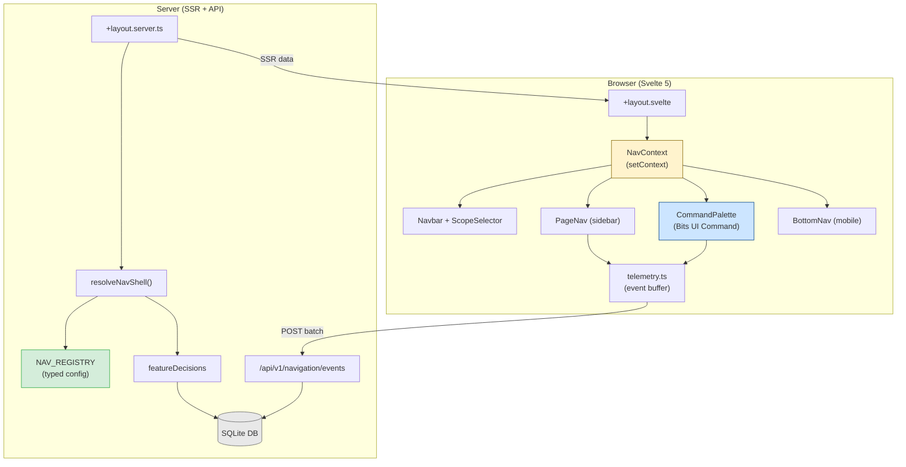

## Executive Summary

For a self-hosted, multi-Arr automation platform running on Deno/SvelteKit, the most scalable model is a **two-layer navigation architecture**:

- **Layer 1: App scope selector** (which Arr instance or "all apps" context the user is in).
- **Layer 2: Contextual capability navigation** (what the user can do in that scope).

This aligns with large product patterns where global navigation sets context and a sidebar provides contextual task navigation (GitLab sidebar model; GitHub's repository-scoped navigation).

**Implementation stack recommendation for Praxrr specifically:**

- **Navigation composition**: SvelteKit route groups + `+layout.server.ts` data loading + Svelte 5 context API for reactive nav state.
- **Command palette**: Bits UI `Command` component (v2.x, Svelte 5 native) -- the canonical headless choice for the Svelte ecosystem since cmdk-sv is deprecated.
- **Feature flags**: Lightweight database-backed flag table in the existing SQLite app DB, not a SaaS flag service. Praxrr is self-hosted with a single operator; LaunchDarkly/PostHog are overengineered for this use case.
- **Telemetry**: Internal `navigation_event` table with a simple `/api/v1/navigation/events` endpoint. External analytics platforms (PostHog, Umami) are optional add-ons, not requirements.

**Confidence**: High -- based on current SvelteKit 2.43+ docs, Bits UI 2.15+ docs, and Svelte 5.39+ patterns.

Key sources:

- https://svelte.dev/docs/kit/advanced-routing
- https://svelte.dev/docs/kit/load
- https://svelte.dev/docs/svelte/snippet
- https://svelte.dev/docs/svelte/context
- https://bits-ui.com/docs/components/command
- https://docs.gitlab.com/development/navigation_sidebar/
- https://martinfowler.com/articles/feature-toggles.html

---

## 1. Primary APIs and Patterns

### A. SvelteKit Layout Data Loading for Nav Composition

SvelteKit's layout system provides the ideal mechanism for hierarchical navigation data loading. Layout load functions cascade data to all child routes automatically.

**Confidence**: High -- official SvelteKit documentation, verified against v2.43+.

#### How Layout Data Flows

```
+layout.server.ts (root)    --> nav shell, scope options, flags
  +layout.server.ts (group)  --> group-specific items
    +page.server.ts           --> page-specific data
```

Data returned from parent layouts is available in all child pages. Child load functions can access parent data via `await parent()`:

```typescript
// packages/praxrr-app/src/routes/+layout.server.ts
import type { LayoutServerLoad } from './$types';

export const load: LayoutServerLoad = async ({ locals }) => {
  const navShell = resolveNavShell(locals.session);

  return {
    version: appInfoQueries.getVersion(),
    navShell, // { variant, arrScopeOptions, groups }
  };
};
```

```typescript
// packages/praxrr-app/src/routes/(app)/+layout.server.ts
import type { LayoutServerLoad } from './$types';

export const load: LayoutServerLoad = async ({ parent }) => {
  const { navShell } = await parent();
  // Add app-scoped context without re-fetching global data
  return {
    activeGroup: navShell.groups.find((g) => g.id === 'app'),
  };
};
```

**Key caveat**: `await parent()` introduces a waterfall. Fetch independent data first, then merge parent data afterward. Layout load functions do not rerun on every client-side navigation between child routes -- only when their dependencies change.

**Source**: https://svelte.dev/docs/kit/load

#### Route Groups for Nav Without URL Changes

Route groups (directories wrapped in parentheses) allow logical grouping without affecting the URL structure:

```
packages/praxrr-app/src/routes/
  (app)/
    quality-profiles/     --> /quality-profiles
    custom-formats/       --> /custom-formats
    +layout.svelte        --> shared app nav shell
  (settings)/
    settings/             --> /settings
    +layout.svelte        --> settings-specific nav
  +layout.svelte          --> root shell
```

Pages can break out of their layout hierarchy using the `@` syntax:

- `+page@(app).svelte` inherits only from the `(app)` layout
- `+page@.svelte` resets to root layout only

**Source**: https://svelte.dev/docs/kit/advanced-routing

### B. Svelte 5 Component Patterns for Navigation

Praxrr currently uses Svelte 5.39+ but does NOT use runes (`$state`, `$derived`). The CLAUDE.md specifies "Svelte 5, no runes." This means the navigation update should use:

- `export let` for component props (not `$props()`)
- Svelte stores (`writable`, `readable`) for shared state (not `$state`)
- `setContext`/`getContext` for component-tree-scoped state

**Confidence**: High -- project convention confirmed in CLAUDE.md and current codebase.

#### Svelte 5 Snippets for Navigation Templates

Snippets replace slots in Svelte 5 and enable reusable markup within a single component. They are useful for rendering recursive nav trees:

```svelte
<!-- NavTree.svelte -->
<script lang="ts">
  import type { NavGroup, NavItem } from '$shared/navigation/types';

  export let groups: NavGroup[] = [];
</script>

{#snippet navItem(item: NavItem)}
  <a
    href={item.href}
    class="block px-3 py-2 rounded-md hover:bg-neutral-100 dark:hover:bg-neutral-800"
    data-nav-id={item.id}
  >
    {item.label}
  </a>
{/snippet}

{#snippet navGroup(group: NavGroup)}
  <div class="mb-2">
    <h3 class="px-3 text-xs font-semibold uppercase text-neutral-500">
      {group.label}
    </h3>
    {#each group.items as item}
      {@render navItem(item)}
    {/each}
  </div>
{/snippet}

{#each groups as group}
  {@render navGroup(group)}
{/each}
```

Snippets can be passed as props to child components for customization:

```svelte
<!-- Parent can override rendering -->
<NavTree {groups}>
  {#snippet navItem(item)}
    <a href={item.href} class="custom-style">{item.label}</a>
  {/snippet}
</NavTree>
```

**Source**: https://svelte.dev/docs/svelte/snippet

#### Context API for Navigation State

The Svelte 5 context API is the recommended pattern for sharing nav state across the component tree without prop drilling. It is SSR-safe because context is scoped per request:

```typescript
// packages/praxrr-app/src/lib/client/navigation/navContext.ts
import { getContext, setContext } from 'svelte';
import type { Writable } from 'svelte/store';
import { writable } from 'svelte/store';
import type { NavShell, ArrScope } from '$shared/navigation/types';

const NAV_CTX = Symbol('nav');

interface NavContext {
  shell: NavShell;
  activeScope: Writable<ArrScope>;
}

export function setNavContext(shell: NavShell, initialScope: ArrScope) {
  const ctx: NavContext = {
    shell,
    activeScope: writable(initialScope),
  };
  return setContext(NAV_CTX, ctx);
}

export function getNavContext(): NavContext {
  return getContext<NavContext>(NAV_CTX);
}
```

```svelte
<!-- packages/praxrr-app/src/routes/+layout.svelte (root) -->
<script lang="ts">
  import { setNavContext } from '$lib/client/navigation/navContext';

  export let data;

  setNavContext(data.navShell, 'all');
</script>

<slot />
```

**Source**: https://svelte.dev/docs/svelte/context

---

## Primary APIs

### A. Authorization / Permissions-Based Navigation

**Confidence**: Medium -- these tools are well-documented but add deployment complexity that may not be justified for a single-operator self-hosted app.

1. **OpenFGA**
   - Why it fits: explicit relationship-based authorization APIs (`check`, `list objects`) for deciding which nav items are visible per user/resource scope.
   - Gotcha: `list objects` with `and` / `but not` conditions can be expensive. Cache aggressively for nav rendering.
   - **Recommendation for Praxrr**: Defer. Praxrr currently has a simple auth model (on/off/local/OIDC). OpenFGA adds value only when multi-user role-based access is implemented.
   - URLs:
     - https://openfga.dev/docs/interacting/relationship-queries
     - https://openfga.dev/docs/modeling/advanced/relationship-queries

2. **Backstage Permission Framework (reference architecture)**
   - Why it fits: demonstrates conditional authorization decisions and permission policies for modular platforms.
   - URL: https://backstage.io/docs/permissions/concepts

### B. Feature Flags / Progressive Rollout

**Confidence**: High -- the "simple internal flags" approach is well-established (Martin Fowler feature toggles taxonomy) and matches Praxrr's self-hosted model.

#### Recommended: Database-Backed Flag Table (Internal)

For a self-hosted Deno/SQLite app, a lightweight internal flag system is far more appropriate than LaunchDarkly or PostHog:

```sql
-- Migration: add feature_flags table
CREATE TABLE IF NOT EXISTS feature_flags (
  key TEXT PRIMARY KEY,
  enabled INTEGER NOT NULL DEFAULT 0,
  description TEXT,
  created_at TEXT NOT NULL DEFAULT (datetime('now')),
  updated_at TEXT NOT NULL DEFAULT (datetime('now'))
);

-- Seed initial flags
INSERT OR IGNORE INTO feature_flags (key, enabled, description) VALUES
  ('nav_v2', 0, 'Enable grouped scalable navigation shell'),
  ('nav_command_palette', 0, 'Enable global command/search palette'),
  ('nav_scope_selector', 0, 'Enable explicit app-scope selector');
```

```typescript
// packages/praxrr-app/src/lib/server/utils/flags/flags.ts
import type { Database } from '$db/db';

export interface FeatureFlag {
  key: string;
  enabled: boolean;
  description: string | null;
}

export function getFlag(db: Database, key: string): boolean {
  const row = db
    .selectFrom('feature_flags')
    .select('enabled')
    .where('key', '=', key)
    .executeTakeFirst();
  return row?.enabled === 1;
}

export function getAllFlags(db: Database): Record<string, boolean> {
  const rows = db
    .selectFrom('feature_flags')
    .select(['key', 'enabled'])
    .execute();
  return Object.fromEntries(rows.map((r) => [r.key, r.enabled === 1]));
}
```

This matches Martin Fowler's "App Database" approach for feature toggles in a single-instance self-hosted application.

**Source**: https://martinfowler.com/articles/feature-toggles.html

#### Toggle Categories (Fowler Taxonomy)

| Category          | Longevity       | Dynamism             | Praxrr Use                           |
| ----------------- | --------------- | -------------------- | ------------------------------------ |
| Release toggle    | Days to weeks   | Static per deploy    | `nav_v2`, `nav_command_palette`      |
| Ops toggle        | Variable        | Fast reconfiguration | Kill switches for expensive features |
| Permission toggle | Months to years | Per-request          | Future role-based nav visibility     |
| Experiment toggle | Hours to weeks  | Per-request/cohort   | Not needed initially                 |

#### Why NOT LaunchDarkly / PostHog Flags

- Praxrr is self-hosted, typically single-user/household. There are no "cohorts" to target.
- External flag services require network calls, API keys, and a running SaaS dependency.
- A SQLite table with 10 rows is simpler, faster, and has zero external dependencies.
- If/when multi-user support grows, OpenFeature can abstract the flag evaluation API surface.

**Deferred option**: OpenFeature SDK (`@openfeature/web-sdk`) for vendor-neutral abstraction if the flag system needs to scale beyond the internal table.

- URL: https://openfeature.dev/docs/reference/intro

#### Self-Hosted Flag Services (If Scaling Beyond Internal Table)

If Praxrr eventually needs a dedicated flag management UI:

| Service        | License                  | DB Requirement | Complexity | Notes                                |
| -------------- | ------------------------ | -------------- | ---------- | ------------------------------------ |
| **Unleash**    | Open-source (Apache 2.0) | PostgreSQL     | Medium     | Most mature OSS option, Docker-ready |
| **GrowthBook** | Open-source (MIT core)   | MongoDB        | Medium     | Flags + A/B testing combined         |
| **Flagsmith**  | Open-source (BSD 3)      | PostgreSQL     | Medium     | Unlimited flags on free tier         |
| **FeatBit**    | Open-source              | Various        | Low-Medium | Budget-friendly, newer project       |

**Recommendation**: Stick with the internal SQLite flag table for Phase 1-2. Revisit only if multi-instance or multi-user flag targeting becomes a real requirement.

**Sources**:

- https://www.getunleash.io/
- https://www.growthbook.io
- https://www.flagsmith.com/blog/launchdarkly-alternatives

### C. Telemetry / Optimization

**Confidence**: Medium -- the internal approach is solid for initial measurement; external analytics are optional enhancements.

#### Recommended: Internal Navigation Event Table

For a self-hosted app, telemetry starts with a simple event log:

```sql
CREATE TABLE IF NOT EXISTS navigation_events (
  id TEXT PRIMARY KEY,
  event_name TEXT NOT NULL,       -- nav_click, nav_impression, nav_search_select
  nav_item_id TEXT,               -- stable registry ID
  arr_scope TEXT NOT NULL,        -- active scope at event time
  variant TEXT,                   -- legacy | nav_v2
  metadata TEXT,                  -- JSON: { source, device, route_from }
  created_at TEXT NOT NULL DEFAULT (datetime('now'))
);

CREATE INDEX idx_nav_events_name_date ON navigation_events (event_name, created_at);
```

Query patterns for nav optimization:

```sql
-- Top clicked nav items by scope
SELECT nav_item_id, arr_scope, COUNT(*) as clicks
FROM navigation_events
WHERE event_name = 'nav_click'
  AND created_at > datetime('now', '-30 days')
GROUP BY nav_item_id, arr_scope
ORDER BY clicks DESC;

-- Backtracking detection (click followed by immediate reverse)
-- Implemented in application code via event stream analysis
```

#### Lightweight External Analytics (Optional)

If external analytics are desired, these are appropriate for self-hosted apps:

| Tool          | Script Size | Self-Hosted  | Cookie-Free | Best For                       |
| ------------- | ----------- | ------------ | ----------- | ------------------------------ |
| **Umami**     | ~1 KB       | Yes (Docker) | Yes         | Minimal page/event analytics   |
| **Plausible** | <1 KB       | Yes (Docker) | Yes         | Privacy-focused page analytics |

Both are dramatically lighter than PostHog (~100 KB) and do not require cookies. They can complement internal telemetry for aggregate page-level metrics but lack the custom event depth needed for nav-specific optimization.

**Recommendation**: Use internal event table for nav-specific telemetry. Add Umami or Plausible only if general page analytics are also desired.

**Sources**:

- https://umami.is/
- https://plausible.io/
- https://aaronjbecker.com/posts/umami-vs-plausible-vs-matomo-self-hosted-analytics/

### D. Command Palette / Federated Search

**Confidence**: High -- Bits UI Command is the clear choice for the Svelte 5 ecosystem.

See section 3 (Libraries and SDKs) for detailed library comparison.

---

## 3. Libraries and SDKs

### SvelteKit Routing/Layout Primitives

**Confidence**: High -- core framework, stable API.

- `route groups` allow feature grouping without URL changes.
- `+layout.server.ts` data inheritance and `parent()` enable hierarchical nav composition.
- `+layout.svelte` uses `<slot />` to render child routes.
- The `@` syntax enables pages to break out of layout hierarchies.
- Route matchers (`packages/praxrr-app/src/params/*.ts`) validate dynamic segments.

URLs:

- https://svelte.dev/docs/kit/advanced-routing
- https://svelte.dev/docs/kit/load

### Bits UI Command Component (v2.x)

**Confidence**: High -- actively maintained (v2.15.5 as of early 2026), Svelte 5 native, replaces deprecated cmdk-sv.

**Status**: Bits UI v2.x is a complete Svelte 5 rewrite. It is the canonical headless component library for the Svelte ecosystem, with the shadcn-svelte project (the Svelte port of shadcn/ui) built entirely on top of it.

**Relationship to Melt UI**: Bits UI was originally powered by Melt UI internally. Both are maintained by the same author (huntabyte). Bits UI provides a simpler component interface; Melt UI provides a lower-level builder API. For new Svelte 5 projects, Bits UI is the recommended choice.

**Installation**:

```bash
npm i bits-ui
```

Peer dependency: `svelte ^5.0.0` (compatible with Praxrr's `^5.39.5`).

**Command Component Structure**:

```svelte
<script lang="ts">
  import { Command } from 'bits-ui';

  let open = false;
  let searchValue = '';

  function handleKeydown(e: KeyboardEvent) {
    if (e.key === 'k' && (e.metaKey || e.ctrlKey)) {
      e.preventDefault();
      open = !open;
    }
  }
</script>

<svelte:window on:keydown={handleKeydown} />

<!-- Dialog-integrated command palette -->
<Command.Dialog bind:open>
  <Command.Input bind:value={searchValue} placeholder="Search routes, actions..." />
  <Command.List>
    <Command.Empty>No results found.</Command.Empty>

    <Command.Group>
      <Command.GroupHeading>Navigation</Command.GroupHeading>
      <Command.GroupItems>
        <Command.LinkItem
          value="quality-profiles"
          href="/quality-profiles"
          keywords={['profiles', 'quality']}
        >
          Quality Profiles
        </Command.LinkItem>
        <Command.LinkItem
          value="custom-formats"
          href="/custom-formats"
          keywords={['formats', 'cf']}
        >
          Custom Formats
        </Command.LinkItem>
      </Command.GroupItems>
    </Command.Group>

    <Command.Separator />

    <Command.Group>
      <Command.GroupHeading>Actions</Command.GroupHeading>
      <Command.GroupItems>
        <Command.Item
          value="sync-all"
          keywords={['sync', 'push']}
          onSelect={() => triggerSync()}
        >
          Sync All Instances
        </Command.Item>
      </Command.GroupItems>
    </Command.Group>
  </Command.List>
</Command.Dialog>
```

**Key API Details**:

| Sub-Component      | Purpose            | Key Props                                                            |
| ------------------ | ------------------ | -------------------------------------------------------------------- |
| `Command.Root`     | State container    | `value` (bindable), `filter`, `shouldFilter`, `loop`, `vimBindings`  |
| `Command.Input`    | Search field       | `value` (bindable)                                                   |
| `Command.List`     | Item container     | CSS var `--bits-command-list-height`                                 |
| `Command.Item`     | Selectable action  | `value` (required, unique), `keywords`, `onSelect`, `disabled`       |
| `Command.LinkItem` | Navigation item    | Same as Item + standard anchor props, supports SvelteKit prefetching |
| `Command.Group`    | Grouping container | `value`, `forceMount`                                                |
| `Command.Empty`    | No results state   | `forceMount`                                                         |
| `Command.Dialog`   | Modal wrapper      | `open` (bindable)                                                    |

**Custom filter function**:

```typescript
function navFilter(value: string, search: string, keywords?: string[]): number {
  const haystack = [value, ...(keywords ?? [])].join(' ').toLowerCase();
  const needle = search.toLowerCase();
  return haystack.includes(needle) ? 1 : 0;
}
```

**Constraint**: Each `Command.Item` must have a unique `value`. Use ID-based values (e.g., `nav.quality-profiles`) rather than display labels.

URL: https://bits-ui.com/docs/components/command

### cmdk-sv (DEPRECATED)

**Confidence**: High -- confirmed deprecated on GitHub.

cmdk-sv has been explicitly deprecated by its author (huntabyte) in favor of the Bits UI Command component. The GitHub repository header reads: "Deprecated by the Command component in Bits UI."

**Recommendation**: Do not use for new development. Use Bits UI Command instead.

URL: https://github.com/huntabyte/cmdk-sv

### Melt UI Combobox

**Confidence**: Medium -- Melt UI is undergoing a major Svelte 5 refactor; current version works but the "next-gen" version is in progress.

Melt UI provides a lower-level builder API for headless components. The combobox builder is useful for accessible filtering/search interactions. However, the project maintainer (TGlide) has acknowledged burnout-related delays and the next-gen version will ship as a separate npm package (`@melt-ui/next`).

**Recommendation for Praxrr**: Use Bits UI Command instead. It provides the same accessibility guarantees with a simpler component API and is more actively maintained. The Melt UI combobox remains a fallback option if finer-grained control is needed.

URLs:

- https://www.melt-ui.com/docs/builders/combobox
- https://github.com/melt-ui/melt-ui/discussions/1238

### svelte-command-palette (Alternative)

**Confidence**: Medium -- newer library, less ecosystem adoption than Bits UI.

A standalone command palette package for Svelte 5 with zero dependencies beyond Svelte itself (~5 KB gzipped). Includes Fuse.js-powered fuzzy search, full ARIA compliance, and customizable keyboard shortcuts.

**When to consider**: If Bits UI is too heavy as a dependency (it includes many components beyond Command) and only a command palette is needed.

**Tradeoff**: Less ecosystem support, fewer integration examples, and no Dialog primitive included.

URL: https://svelte-command-palette.vercel.app/

### ninja-keys (Framework-Agnostic Fallback)

**Confidence**: Low -- web component, not Svelte-native. Included only for completeness.

A framework-agnostic web component (`<ninja-keys>`) that works with Svelte but does not integrate with SvelteKit routing or Svelte's component model.

**Recommendation**: Not recommended for Praxrr. Use Bits UI Command for native Svelte integration.

URL: https://github.com/ssleptsov/ninja-keys

---

## Integration Patterns

### Pattern 1: Config-Driven Navigation Registry

Define a typed navigation manifest that the layout loader resolves into a renderable nav shell. This decouples the nav structure from the rendering components.

```typescript
// packages/praxrr-app/src/lib/shared/navigation/types.ts
import type { ArrType } from '$shared/arr/types';

export type NavVariant = 'legacy' | 'nav_v2';

export interface NavItem {
  id: string; // Stable ID: 'policies.quality_profiles'
  label: string;
  href: string;
  order: number;
  arr_type: ArrType | 'all';
  permission?: string;
  feature_flag?: string;
  keywords?: string[]; // For command palette search
  icon?: string; // Lucide icon name
  mobile_priority?: 'high' | 'medium' | 'low';
}

export interface NavGroup {
  id: string; // 'overview', 'apps', 'automation', 'policies', etc.
  label: string;
  order: number;
  items: NavItem[];
}

export interface NavShell {
  variant: NavVariant;
  arrScopeOptions: ArrType[];
  groups: NavGroup[];
}
```

```typescript
// packages/praxrr-app/src/lib/server/navigation/registry.ts
import type { NavGroup } from '$shared/navigation/types';

export const NAV_REGISTRY: NavGroup[] = [
  {
    id: 'data',
    label: 'Databases',
    order: 10,
    items: [
      {
        id: 'data.databases',
        label: 'Databases',
        href: '/databases',
        order: 10,
        arr_type: 'all',
        keywords: ['pcd', 'config', 'database'],
        icon: 'FolderTree',
      },
    ],
  },
  {
    id: 'apps',
    label: 'Apps',
    order: 20,
    items: [
      {
        id: 'apps.instances',
        label: 'Arrs',
        href: '/arr',
        order: 10,
        arr_type: 'all',
        keywords: ['instances', 'radarr', 'sonarr', 'lidarr'],
        icon: 'Link',
      },
    ],
  },
  {
    id: 'policies',
    label: 'Data & Policies',
    order: 30,
    items: [
      {
        id: 'policies.quality_profiles',
        label: 'Quality Profiles',
        href: '/quality-profiles',
        order: 10,
        arr_type: 'all',
        keywords: ['quality', 'profiles', 'qp'],
        icon: 'Sliders',
      },
      {
        id: 'policies.custom_formats',
        label: 'Custom Formats',
        href: '/custom-formats',
        order: 20,
        arr_type: 'all',
        keywords: ['custom', 'formats', 'cf'],
        icon: 'Palette',
      },
      // ... more items
    ],
  },
  {
    id: 'settings',
    label: 'Settings',
    order: 90,
    items: [
      {
        id: 'settings.general',
        label: 'General',
        href: '/settings/general',
        order: 10,
        arr_type: 'all',
        icon: 'Settings',
      },
      // ... more items
    ],
  },
];
```

### Pattern 2: Layout-Level Nav Resolution

Resolve the nav shell on the server during layout load. This ensures SSR and client render the same nav structure, avoiding hydration mismatches.

```typescript
// packages/praxrr-app/src/lib/server/navigation/resolver.ts
import type { NavShell, NavGroup, NavItem } from '$shared/navigation/types';
import type { ArrType } from '$shared/arr/types';
import { NAV_REGISTRY } from './registry';
import { getFlag } from '$utils/flags/flags';
import type { Database } from '$db/db';

interface ResolveContext {
  db: Database;
  activeScope: ArrType | 'all';
}

export function resolveNavShell(ctx: ResolveContext): NavShell {
  const isV2 = getFlag(ctx.db, 'nav_v2');
  const variant = isV2 ? 'nav_v2' : 'legacy';

  const groups = NAV_REGISTRY.map((group) => ({
    ...group,
    items: group.items.filter((item) => isItemVisible(item, ctx)),
  }))
    .filter((group) => group.items.length > 0)
    .sort((a, b) => a.order - b.order);

  return {
    variant,
    arrScopeOptions: getConfiguredArrTypes(ctx.db),
    groups,
  };
}

function isItemVisible(item: NavItem, ctx: ResolveContext): boolean {
  // 1. Scope filter
  if (item.arr_type !== 'all' && item.arr_type !== ctx.activeScope) {
    return false;
  }

  // 2. Feature flag filter
  if (item.feature_flag && !getFlag(ctx.db, item.feature_flag)) {
    return false;
  }

  // 3. Permission filter (future: check against user permissions)
  // if (item.permission && !hasPermission(ctx.user, item.permission)) {
  //   return false;
  // }

  return true;
}
```

```typescript
// packages/praxrr-app/src/routes/+layout.server.ts
import type { LayoutServerLoad } from './$types';
import { appInfoQueries } from '$db/queries/appInfo';
import { resolveNavShell } from '$lib/server/navigation/resolver';

export const load: LayoutServerLoad = async ({ locals }) => {
  return {
    version: appInfoQueries.getVersion(),
    navShell: resolveNavShell({
      db: locals.db,
      activeScope: 'all', // Default; client switches via scope selector
    }),
  };
};
```

### Pattern 3: Reactive Scope Switching (Client-Side)

When the user changes the active Arr scope, re-filter the nav items client-side using the pre-loaded registry data. This avoids a server round-trip for every scope change.

```svelte
<!-- packages/praxrr-app/src/lib/client/navigation/ScopeSelector.svelte -->
<script lang="ts">
  import { getNavContext } from './navContext';
  import type { ArrType } from '$shared/arr/types';

  const navCtx = getNavContext();
  const { activeScope } = navCtx;

  function handleScopeChange(e: Event) {
    const target = e.target as HTMLSelectElement;
    $activeScope = target.value as ArrType;
  }
</script>

<select
  value={$activeScope}
  on:change={handleScopeChange}
  class="rounded-md border border-neutral-300 bg-neutral-50 px-3 py-1.5 text-sm
         dark:border-neutral-700 dark:bg-neutral-800"
  aria-label="Select app scope"
>
  <option value="all">All Apps</option>
  {#each navCtx.shell.arrScopeOptions as scope}
    <option value={scope}>{scope}</option>
  {/each}
</select>
```

### Pattern 4: Command Palette Indexed from Registry

Wire the nav registry directly into the Bits UI Command component. The registry is the single source of truth for both sidebar rendering and palette search.

```svelte
<!-- packages/praxrr-app/src/lib/client/navigation/CommandPalette.svelte -->
<script lang="ts">
  import { Command, Dialog } from 'bits-ui';
  import { goto } from '$app/navigation';
  import { getNavContext } from './navContext';

  const navCtx = getNavContext();
  let open = false;

  function handleKeydown(e: KeyboardEvent) {
    if (e.key === 'k' && (e.metaKey || e.ctrlKey)) {
      e.preventDefault();
      open = !open;
    }
  }

  // Flatten all items from all groups for command indexing
  $: allItems = navCtx.shell.groups.flatMap((g) =>
    g.items.map((item) => ({
      ...item,
      groupLabel: g.label,
    }))
  );
</script>

<svelte:window on:keydown={handleKeydown} />

<Dialog.Root bind:open>
  <Dialog.Portal>
    <Dialog.Overlay class="fixed inset-0 z-[80] bg-black/50" />
    <Dialog.Content
      class="fixed top-[20%] left-1/2 z-[90] w-full max-w-lg -translate-x-1/2
             rounded-lg border border-neutral-200 bg-white shadow-xl
             dark:border-neutral-700 dark:bg-neutral-900"
    >
      <Command.Root loop>
        <Command.Input
          placeholder="Search routes, actions..."
          class="w-full border-b border-neutral-200 px-4 py-3 text-sm
                 outline-none dark:border-neutral-700 dark:bg-neutral-900"
        />
        <Command.List class="max-h-80 overflow-y-auto p-2">
          <Command.Empty class="px-4 py-6 text-center text-sm text-neutral-500">
            No results found.
          </Command.Empty>

          {#each navCtx.shell.groups as group}
            <Command.Group value={group.id}>
              <Command.GroupHeading
                class="px-2 py-1.5 text-xs font-semibold text-neutral-500"
              >
                {group.label}
              </Command.GroupHeading>
              <Command.GroupItems>
                {#each group.items as item}
                  <Command.LinkItem
                    value={item.id}
                    href={item.href}
                    keywords={item.keywords}
                    class="flex cursor-pointer items-center gap-2 rounded-md px-2 py-2
                           text-sm hover:bg-neutral-100
                           data-[selected]:bg-neutral-100
                           dark:hover:bg-neutral-800
                           dark:data-[selected]:bg-neutral-800"
                    onSelect={() => { open = false; }}
                  >
                    {item.label}
                  </Command.LinkItem>
                {/each}
              </Command.GroupItems>
            </Command.Group>
          {/each}
        </Command.List>
      </Command.Root>
    </Dialog.Content>
  </Dialog.Portal>
</Dialog.Root>
```

### Pattern 5: Feature Flag Evaluation in Layout Load

The toggle decision pattern from Fowler's taxonomy, adapted for SvelteKit:

```typescript
// packages/praxrr-app/src/lib/server/navigation/featureDecisions.ts
// Decouples flag checks from business logic (Fowler: "Decouple Decision Points")
import type { Database } from '$db/db';
import { getFlag } from '$utils/flags/flags';

export function createNavFeatureDecisions(db: Database) {
  return {
    useNavV2: () => getFlag(db, 'nav_v2'),
    showCommandPalette: () => getFlag(db, 'nav_command_palette'),
    showScopeSelector: () => getFlag(db, 'nav_scope_selector'),
  };
}
```

```typescript
// packages/praxrr-app/src/routes/+layout.server.ts
import { createNavFeatureDecisions } from '$lib/server/navigation/featureDecisions';

export const load: LayoutServerLoad = async ({ locals }) => {
  const decisions = createNavFeatureDecisions(locals.db);

  return {
    version: appInfoQueries.getVersion(),
    navShell: resolveNavShell({ db: locals.db, activeScope: 'all' }),
    navFeatures: {
      useV2: decisions.useNavV2(),
      commandPalette: decisions.showCommandPalette(),
      scopeSelector: decisions.showScopeSelector(),
    },
  };
};
```

### Pattern 6: Telemetry Event Dispatch

Lightweight client-side event dispatch with debouncing:

```typescript
// packages/praxrr-app/src/lib/client/navigation/telemetry.ts
interface NavEvent {
  eventName:
    | 'nav_click'
    | 'nav_impression'
    | 'nav_search_select'
    | 'nav_scope_change';
  navItemId?: string;
  arrScope: string;
  variant: string;
  metadata?: Record<string, string>;
}

const EVENT_BUFFER: NavEvent[] = [];
let flushTimer: ReturnType<typeof setTimeout> | null = null;

export function trackNavEvent(event: NavEvent) {
  EVENT_BUFFER.push(event);

  if (!flushTimer) {
    flushTimer = setTimeout(flushEvents, 2000); // Batch every 2s
  }
}

async function flushEvents() {
  flushTimer = null;
  if (EVENT_BUFFER.length === 0) return;

  const batch = EVENT_BUFFER.splice(0);
  try {
    await fetch('/api/v1/navigation/events', {
      method: 'POST',
      headers: { 'Content-Type': 'application/json' },
      body: JSON.stringify({ events: batch }),
    });
  } catch {
    // Silently drop on failure; telemetry is non-critical
  }
}
```

---

## 5. Constraints and Gotchas

### SSR Hydration Mismatch Risk

**Confidence**: High -- this is a well-documented SvelteKit concern.

If the navigation shell is resolved differently on server vs. client (e.g., due to client-side-only state like scope selection), hydration will produce mismatched HTML. Svelte 5 has been observed to produce excessive hydration markers.

**Mitigation**: Compute the full nav shell on the server in `+layout.server.ts` and serialize the stable payload. Client-side scope changes should filter the pre-loaded data, not re-fetch or re-resolve.

**Source**: https://github.com/sveltejs/svelte/issues/15200

### Svelte 5 Migration Considerations

**Confidence**: High -- confirmed by codebase inspection.

Praxrr uses Svelte 5 but follows the convention "Svelte 5, no runes." This means:

- Components use `export let` props, not `$props()`.
- Shared state uses `writable`/`readable` stores, not `$state` runes.
- Event handlers use `on:click`, not `onclick`.
- The `children` snippet pattern is available but Praxrr still uses `<slot />`.

Any new navigation components should follow this convention. If the project migrates to runes in the future, the nav context pattern can shift from stores to `$state` with getter/setter wrappers.

### Command Palette Accessibility

**Confidence**: High -- WAI-ARIA combobox pattern requirements are strict.

The WAI-ARIA combobox pattern requires specific keyboard/focus/ARIA semantics. Bits UI Command handles this correctly out of the box, including:

- Arrow key navigation with `loop` support
- `aria-expanded`, `aria-controls`, `aria-activedescendant`
- Focus trap within dialog mode
- Optional VIM keybindings (`ctrl+n/j/p/k`)

**Implication**: Do not build a custom command palette. Use Bits UI Command.

**Source**: https://www.w3.org/WAI/ARIA/apg/patterns/combobox/

### Bits UI Command: Unique Value Constraint

Each `Command.Item` and `Command.LinkItem` requires a unique `value` prop. If two items have the same display label (e.g., "Settings" appears in multiple groups), use namespaced IDs:

```svelte
<Command.Item value="settings.general">General</Command.Item>
<Command.Item value="settings.notifications">Notifications</Command.Item>
```

### Layout Load Function Rerun Behavior

Layout load functions do NOT rerun on every client-side navigation between child routes. They only rerun when:

- Route parameters change
- URL search params accessed via `url.searchParams` change
- Dependencies declared via `depends()` are invalidated
- `invalidateAll()` is called

**Implication**: The nav shell computed in `+layout.server.ts` persists across child route navigations. This is desirable for performance but means scope changes must be handled client-side or trigger an explicit `invalidateAll()`.

**Source**: https://svelte.dev/docs/kit/load

### Performance: Auth-Backed Nav Queries

If/when OpenFGA or equivalent is used for nav visibility, avoid per-item uncached `list objects` queries during initial render. Cache permission results for the session duration and prefetch on login/scope change.

**Source**: https://openfga.dev/docs/modeling/advanced/relationship-queries

---

## 6. Open Decisions

1. **Primary IA model**
   - **Product-first** (switch app, then tasks) vs. **workflow-first** (shared tasks across apps).
   - Recommendation: **Hybrid** -- default to capability groups, with scope selector as a persistent filter. The nav registry supports both by filtering on `arr_type`.

2. **Feature flag implementation depth**
   - **Internal SQLite table** (recommended for Phase 1-2) vs. **external flag service** (Unleash/GrowthBook).
   - Decision criteria: Move to external service only when multi-user targeting or a management UI becomes a real need.

3. **Command palette search backend**
   - Start with Bits UI Command's built-in client-side filtering.
   - Migrate to server-side search when the entity/action corpus exceeds ~500 items or per-scope filtering makes client-only indexing slow.

4. **Telemetry data retention**
   - Decide retention policy for `navigation_events` table (30 days, 90 days, or indefinite with aggregation).
   - Recommendation: 90 days of raw events, with periodic aggregation into summary tables.

5. **Runes migration timing**
   - The nav system can be built with stores and `export let` (current convention).
   - If/when the project migrates to runes, the nav context module switches from `writable` to `$state` with getter/setter wrappers. This is a localized change.

---

## Sample Diagrams

### ASCII: Navigation Data Flow

```
+------------------------------------------------------------------+
|  Browser (Client)                                                |
|                                                                  |
|  +layout.svelte (root)                                           |
|    |                                                             |
|    +-- setNavContext(data.navShell)                               |
|    |     |                                                       |
|    |     +-- NavContext { shell, activeScope: writable('all') }   |
|    |                                                             |
|    +-- <Navbar />                                                |
|    |     +-- <ScopeSelector /> -- reads/writes activeScope       |
|    |                                                             |
|    +-- <PageNav />                                               |
|    |     +-- getNavContext() -- reads shell + activeScope         |
|    |     +-- filters groups/items by activeScope                 |
|    |     +-- trackNavEvent('nav_click', ...)                     |
|    |                                                             |
|    +-- <CommandPalette />  (if navFeatures.commandPalette)       |
|    |     +-- Bits UI Command.Dialog                              |
|    |     +-- indexes shell.groups -> flat item list              |
|    |     +-- Ctrl/Cmd+K to open                                  |
|    |                                                             |
|    +-- <slot /> (page content)                                   |
+------------------------------------------------------------------+
         |                    ^
         | POST /api/v1/     | GET (layout load)
         | navigation/events |
         v                   |
+------------------------------------------------------------------+
|  Server                                                          |
|                                                                  |
|  +layout.server.ts                                               |
|    +-- resolveNavShell(db, activeScope)                           |
|    |     +-- reads NAV_REGISTRY (typed config)                   |
|    |     +-- filters by arr_type, feature_flag, permission       |
|    +-- returns { navShell, navFeatures, version }                |
|                                                                  |
|  /api/v1/navigation/events                                       |
|    +-- validates + inserts into navigation_events table          |
|                                                                  |
|  SQLite DB                                                       |
|    +-- feature_flags table                                       |
|    +-- navigation_events table                                   |
+------------------------------------------------------------------+
```

### ASCII: Feature Flag Evaluation Flow

```
  +layout.server.ts load()
         |
         v
  createNavFeatureDecisions(db)
         |
         +-- useNavV2()  -------> feature_flags WHERE key='nav_v2'
         |                               |
         |                     +----+----+----+
         |                     | enabled = 1? |
         |                     +----+----+----+
         |                          |         |
         |                        yes        no
         |                          |         |
         |                    nav_v2 shell  legacy shell
         |
         +-- showCommandPalette() --> feature_flags WHERE key='nav_command_palette'
         |
         +-- showScopeSelector()  --> feature_flags WHERE key='nav_scope_selector'
         |
         v
  Return { navFeatures } to +layout.svelte
         |
         v
  {#if data.navFeatures.commandPalette}
    <CommandPalette />
  {/if}
```

### Mermaid: Integration Architecture



---

## Sources Index

### SvelteKit / Svelte 5

- SvelteKit Advanced Routing: https://svelte.dev/docs/kit/advanced-routing
- SvelteKit Load Functions: https://svelte.dev/docs/kit/load
- Svelte 5 Snippets: https://svelte.dev/docs/svelte/snippet
- Svelte 5 Context API: https://svelte.dev/docs/svelte/context
- Svelte 5 `$state` Rune: https://svelte.dev/docs/svelte/$state
- SvelteKit Data Flow: https://joyofcode.xyz/sveltekit-data-flow
- Svelte 5 Global State Patterns: https://mainmatter.com/blog/2025/03/11/global-state-in-svelte-5/

### Component Libraries

- Bits UI Command: https://bits-ui.com/docs/components/command
- Bits UI Getting Started: https://bits-ui.com/docs/getting-started
- cmdk-sv (deprecated): https://github.com/huntabyte/cmdk-sv
- Melt UI Combobox: https://www.melt-ui.com/docs/builders/combobox
- Melt UI Status: https://github.com/melt-ui/melt-ui/discussions/1238
- Bits UI vs Melt UI: https://github.com/huntabyte/bits-ui/discussions/240
- shadcn-svelte Command: https://www.shadcn-svelte.com/docs/components/command
- svelte-command-palette: https://svelte-command-palette.vercel.app/

### Feature Flags

- Martin Fowler Feature Toggles: https://martinfowler.com/articles/feature-toggles.html
- OpenFeature: https://openfeature.dev/docs/reference/intro
- Unleash: https://www.getunleash.io/
- GrowthBook: https://www.growthbook.io
- Flagsmith Alternatives: https://www.flagsmith.com/blog/launchdarkly-alternatives

### Telemetry / Analytics

- Umami: https://umami.is/
- Plausible: https://plausible.io/
- Self-Hosted Analytics Comparison: https://aaronjbecker.com/posts/umami-vs-plausible-vs-matomo-self-hosted-analytics/

### Reference Architectures

- GitLab Sidebar Navigation: https://docs.gitlab.com/development/navigation_sidebar/
- GitHub Command Palette: https://docs.github.com/en/get-started/accessibility/github-command-palette
- WAI-ARIA Combobox Pattern: https://www.w3.org/WAI/ARIA/apg/patterns/combobox/

### Authorization (Deferred)

- OpenFGA: https://openfga.dev/docs/interacting/relationship-queries
- Backstage Permissions: https://backstage.io/docs/permissions/concepts
