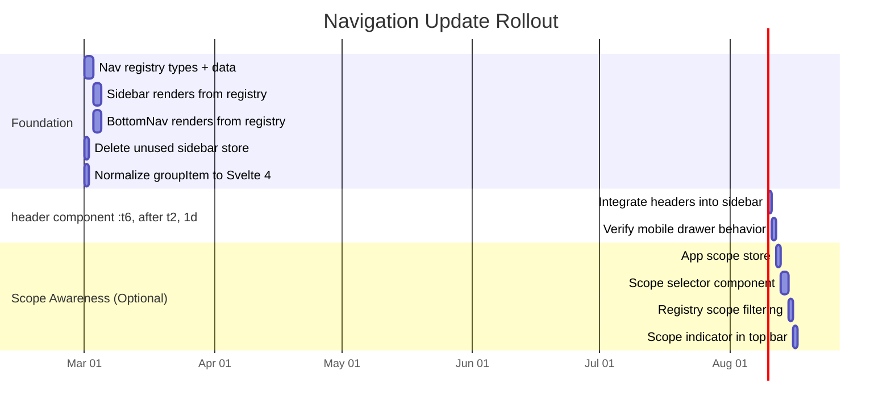
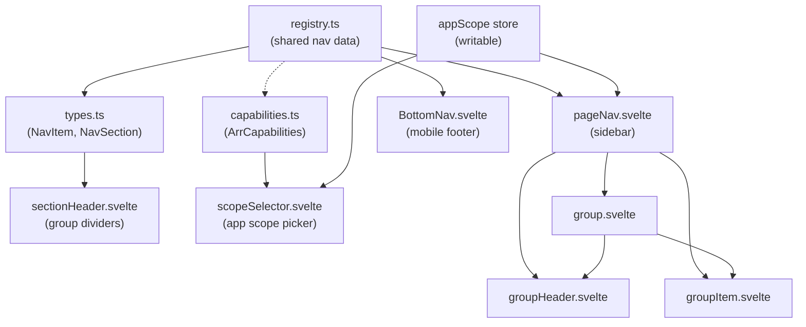

# Navigation Update: Recommendations (Second Pass)

## Executive Summary

The first-pass research was thorough on IA theory but overscoped for a pre-production self-hosted app with a single developer. This second pass grounds every recommendation in the actual navigation codebase, trims scope to what is achievable without external dependencies (no PostHog, no OpenFeature, no OpenFGA), and provides concrete task groupings with file-level impact and dependency hints.

The current navigation is a hardcoded sidebar (`pageNav.svelte`) with 9 top-level groups, a mobile bottom bar (`BottomNav.svelte`), and per-entity tab bars (`Tabs.svelte`). It already works well for the current feature set. The real problems to solve are: (1) nav items are not logically grouped, (2) adding new surfaces requires editing multiple hardcoded component files, and (3) there is no app-scope awareness even though `capabilities.ts` already models it.

Recommended approach: **Extract nav data into a typed registry, introduce lightweight grouping with section headers, and add an app-scope indicator -- all without external dependencies, new API endpoints, or feature flags in the first iteration.**

---

## Current Architecture (Grounded in Code)

### Navigation Component Tree

```
+layout.svelte
  |-- Navbar (top bar: hamburger, logo, accent picker, theme toggle)
  |-- PageNav (left sidebar: 9 hardcoded Groups with GroupItems)
  |-- BottomNav (mobile footer: 9 items with priority-based visibility)
  |-- AlertContainer
  |-- <main> slot (content area, offset by sidebar width)
```

### Key Files

| File                                                      | Role                                                                                  | Lines |
| --------------------------------------------------------- | ------------------------------------------------------------------------------------- | ----- |
| `src/routes/+layout.svelte`                               | Root shell: conditionally renders nav for non-auth pages, passes `version` to PageNav | ~31   |
| `src/routes/+layout.server.ts`                            | Returns only `{ version }` from app DB                                                | ~8    |
| `src/lib/client/ui/navigation/pageNav/pageNav.svelte`     | Left sidebar with 9 hardcoded `Group` instances, mobile drawer, Escape handler        | ~160  |
| `src/lib/client/ui/navigation/bottomNav/BottomNav.svelte` | Mobile bottom bar with separate hardcoded `NavItem[]` array, priority-based hiding    | ~69   |
| `src/lib/client/ui/navigation/pageNav/group.svelte`       | Collapsible group container with slide transition                                     | ~35   |
| `src/lib/client/ui/navigation/pageNav/groupItem.svelte`   | Nav link with `activePattern` matching (Svelte 5 `$derived`)                          | ~36   |
| `src/lib/client/ui/navigation/pageNav/groupHeader.svelte` | Group header with icon, active state, chevron toggle                                  | ~52   |
| `src/lib/client/ui/navigation/navbar/navbar.svelte`       | Top bar: mobile hamburger, desktop logo, accent picker, theme toggle                  | ~44   |
| `src/lib/client/ui/navigation/tabs/Tabs.svelte`           | Per-page tab bar with responsive dropdown, breadcrumbs, back button                   | ~155  |
| `src/lib/client/stores/mobileNav.ts`                      | Simple boolean writable store for mobile drawer open/close                            | ~14   |
| `src/lib/client/stores/navIcons.ts`                       | Persisted localStorage toggle for emoji vs lucide icons                               | ~43   |
| `src/lib/client/stores/sidebar.ts`                        | Sidebar collapsed store -- **unused** (not imported anywhere)                         | ~36   |
| `src/lib/shared/arr/capabilities.ts`                      | Arr app registry with typed workflow/sync surface capabilities                        | ~335  |

### Current Hardcoded Nav Items (in `pageNav.svelte`)

1. Dev (dev-only, `import.meta.env.DEV` guard)
2. Databases (`/databases`)
3. Arrs (`/arr`)
4. Quality Profiles (`/quality-profiles`) + Testing sub-item
5. Custom Formats (`/custom-formats`)
6. Regular Expressions (`/regular-expressions`)
7. Media Management (`/media-management`) + 3 sub-items (Naming, Quality Definitions, Media Settings)
8. Delay Profiles (`/delay-profiles`)
9. Metadata Profiles (`/metadata-profiles`)
10. Settings (`/settings`) + 7 sub-items (General, Jobs, Logs, Backups, Notifications, Security, About, Log Out)

### Current Hardcoded Nav Items (in `BottomNav.svelte`)

Separate `NavItem[]` array with 9 entries, each declaring `priority: 'always' | 'medium' | 'low'`. Only `always` items show on small screens. This array is **completely independent** from `pageNav.svelte` -- a duplication problem.

### Patterns Worth Preserving

- **Group/GroupItem component API**: Clean composable pattern with `label`, `href`, `icon`, `initialOpen`, `hasItems`, `activePattern`. No reason to replace these components.
- **Tab bar pattern**: `Tabs.svelte` is well-built with responsive dropdown, breadcrumbs, and back button. Used by 5 layout files (`arr/[id]`, `databases/[id]`, `quality-profiles/[databaseId]/[id]`, `custom-formats/[databaseId]/[id]`, `media-management/[databaseId]`).
- **Mobile drawer with backdrop**: `pageNav.svelte` manages mobile open/close with backdrop, Escape key, and auto-close on route change via `$page.url.pathname` reactive statement.
- **Emoji/Lucide toggle**: `navIconStore` with localStorage persistence, checked in both PageNav and BottomNav.
- **Auth page exclusion**: Root layout hides all nav when `pathname.startsWith('/auth/')`.
- **localStorage-based last-visited redirect**: Quality Profiles, Custom Formats, Media Management, and other database-scoped pages remember last database ID in localStorage and redirect on mount. Nav must not interfere with these.

### Patterns That Need Work

- **Dual hardcoded item lists**: `pageNav.svelte` and `BottomNav.svelte` define nav items independently. Adding a route means editing both files and keeping them in sync.
- **No logical grouping**: All 9 top-level items are at the same hierarchy level. Databases, Arrs, and Settings serve fundamentally different purposes than Quality Profiles and Custom Formats.
- **No app-scope awareness**: Despite `capabilities.ts` defining per-app capabilities (e.g., metadata profiles only for Lidarr, upgrades only for Radarr), the nav shows all items to all users regardless of context.
- **Unused sidebar store**: `src/lib/client/stores/sidebar.ts` defines `sidebarCollapsed` but nothing imports it. Dead code.
- **No section headers**: The sidebar is a flat list of Groups. Adding visual grouping (section headers like "Data", "Operations") would improve scannability without changing routes.
- **Mixed Svelte patterns**: `groupItem.svelte` uses Svelte 5 `$props()` and `$derived`, while `groupHeader.svelte`, `group.svelte`, and `pageNav.svelte` use Svelte 4 `export let`. Per project conventions: "Svelte 5, no runes" -- so `groupItem.svelte` actually violates this. This should be normalized during the refactor.

---

## Implementation Recommendations

### Approach: Incremental Extraction, Not Rewrite

Do not introduce external dependencies (PostHog, OpenFeature, cmdk-sv) in the initial implementation. The project is pre-production with a single developer. Every dependency adds maintenance surface. Instead:

1. Extract a typed nav registry as a plain TypeScript module
2. Add section headers to visually group existing items
3. Unify the sidebar and bottom bar data sources
4. Add app-scope filtering using the existing `capabilities.ts`

### What to Skip (First-Pass Overreach)

| First-pass proposal                                | Why skip it (for now)                                                                                                |
| -------------------------------------------------- | -------------------------------------------------------------------------------------------------------------------- |
| OpenFeature SDK + feature flag provider            | No users yet. Use `import.meta.env.DEV` or a simple boolean config.                                                  |
| PostHog / analytics SDK                            | Self-hosted app with likely <100 users. Overkill. Add if needed later.                                               |
| OpenFGA for authorization                          | Single admin user model. Not needed until multi-role support exists.                                                 |
| `navigation_events` telemetry table + API endpoint | No users to measure. Ship the nav, get feedback manually.                                                            |
| `GET /api/v1/navigation/shell` endpoint            | Unnecessary indirection. Registry can be evaluated in `+layout.server.ts` directly.                                  |
| Command palette (`Cmd+K`)                          | Nice-to-have, but the app has <15 top-level destinations. A flat sidebar with section headers is sufficient for now. |
| Favorites and recents                              | Same reasoning. Too few destinations to warrant this complexity.                                                     |
| Role-based nav filtering                           | Only one role exists (admin). Add when multi-role support ships.                                                     |

---

## Task Breakdown

### Task Group 1: Nav Registry Extraction (Foundation)

**Goal**: Single source of truth for nav items consumed by both sidebar and bottom bar.

**Files to create**:

- `src/lib/shared/navigation/types.ts` -- Nav item and group type definitions
- `src/lib/shared/navigation/registry.ts` -- Typed nav item array with group assignments

**Files to modify**:

- `src/lib/client/ui/navigation/pageNav/pageNav.svelte` -- Replace hardcoded Groups with registry-driven rendering
- `src/lib/client/ui/navigation/bottomNav/BottomNav.svelte` -- Replace hardcoded items array with registry import

**Dependencies**: None. This is a pure refactor with no behavioral change.

**Estimated scope**: ~200 lines new, ~100 lines modified.

**Registry shape** (simplified from first-pass proposal):

```typescript
// src/lib/shared/navigation/types.ts
interface NavItem {
  id: string;
  label: string;
  href: string;
  icon: ComponentType;
  emoji: string;
  section: NavSection;
  order: number;
  mobileLabel?: string; // shorter label for bottom bar
  mobilePriority: 'always' | 'medium' | 'low';
  initialOpen?: boolean;
  children?: NavChild[];
  devOnly?: boolean; // replaces import.meta.env.DEV inline check
}

interface NavChild {
  label: string;
  href: string;
  activePattern?: string | RegExp;
}

type NavSection = 'data' | 'operations' | 'settings';
```

Key difference from first-pass: no `arr_type`, `permission`, `feature_flag`, or `surface` fields yet. Those come in Task Group 3.

### Task Group 2: Section Headers in Sidebar

**Goal**: Add visual grouping to the flat sidebar list without changing routes or behavior.

**Files to create**:

- `src/lib/client/ui/navigation/pageNav/sectionHeader.svelte` -- Simple section label component

**Files to modify**:

- `src/lib/client/ui/navigation/pageNav/pageNav.svelte` -- Insert section headers between groups based on registry `section` field

**Dependencies**: Task Group 1 (registry must exist).

**Estimated scope**: ~30 lines new component, ~20 lines sidebar changes.

**Proposed sections**:

| Section        | Items                                                                                                                 |
| -------------- | --------------------------------------------------------------------------------------------------------------------- |
| **Data**       | Databases, Quality Profiles, Custom Formats, Regular Expressions, Media Management, Delay Profiles, Metadata Profiles |
| **Operations** | Arrs (instances + workflows)                                                                                          |
| **Settings**   | Settings (General, Jobs, Logs, etc.)                                                                                  |

This is a minimal grouping. It can be refined later (e.g., splitting "Data" into "Policies" and "Definitions") but avoids premature taxonomy decisions.

### Task Group 3: App-Scope Indicator + Filtering (Optional)

**Goal**: Surface which Arr app context is active and optionally filter nav items by capability.

**Files to create**:

- `src/lib/client/stores/appScope.ts` -- Store for active app scope (`'all' | 'radarr' | 'sonarr' | 'lidarr'`)
- `src/lib/client/ui/navigation/pageNav/scopeSelector.svelte` -- Dropdown or pill selector for app scope

**Files to modify**:

- `src/lib/shared/navigation/registry.ts` -- Add optional `arrScope` field to nav items
- `src/lib/shared/navigation/types.ts` -- Extend NavItem with `arrScope?: ArrType`
- `src/lib/client/ui/navigation/pageNav/pageNav.svelte` -- Filter items by active scope
- `src/lib/client/ui/navigation/navbar/navbar.svelte` -- Possibly add scope indicator to top bar

**Dependencies**: Task Group 1 (registry must exist), plus `src/lib/shared/arr/capabilities.ts` for type references.

**Estimated scope**: ~100 lines new, ~50 lines modified.

**Scope filtering logic**: When scope is `'all'`, show everything. When scope is a specific app (e.g., `'lidarr'`), hide items whose capabilities are `false` for that app (e.g., hide "Delay Profiles" if Lidarr did not support it -- though currently it does). The `supportsArrSyncSurface()` and `supportsArrWorkflow()` functions from `capabilities.ts` provide the answers.

**Risk**: Over-filtering could confuse users who expect to see all items. Recommend showing disabled/grayed items rather than hiding them, with a tooltip explaining why.

### Task Group 4: Cleanup

**Goal**: Remove dead code and normalize Svelte patterns.

**Files to modify**:

- `src/lib/client/stores/sidebar.ts` -- Delete (unused)
- `src/lib/client/ui/navigation/pageNav/groupItem.svelte` -- Convert from Svelte 5 runes (`$props`, `$derived`) to Svelte 4 pattern (`export let`, reactive `$:`) per project convention "Svelte 5, no runes"

**Dependencies**: Can run in parallel with Task Groups 1-3.

**Estimated scope**: ~30 lines changed.

---

## Risk Assessment

### Real Risks (Grounded in Codebase)

| Risk                                                                                                       | Likelihood | Impact | Mitigation                                                                                                                                                                                                                                                                     |
| ---------------------------------------------------------------------------------------------------------- | ---------- | ------ | ------------------------------------------------------------------------------------------------------------------------------------------------------------------------------------------------------------------------------------------------------------------------------ |
| **SSR/client hydration mismatch** when registry includes browser-only logic (e.g., localStorage for scope) | Medium     | High   | Keep registry definition as pure static data. Scope store must have a stable SSR default (`'all'`). Follow existing pattern in `navIconStore.ts` which guards localStorage with `browser` check.                                                                               |
| **Breaking mobile drawer behavior** during sidebar refactor                                                | Medium     | Medium | PageNav's mobile drawer relies on `$mobileNavOpen` store, `svelte:window` keydown, and `$page.url.pathname` watcher for auto-close. Refactoring the item list must not remove these reactive statements. Test mobile drawer open/close/escape/route-change after every change. |
| **BottomNav priority regression**                                                                          | Medium     | Medium | Current BottomNav uses `priority` enum to show/hide items at different screen widths via CSS classes (`hidden sm:flex`, `hidden`). Registry must expose equivalent `mobilePriority` field and BottomNav must map it to the same classes.                                       |
| **localStorage redirect interference**                                                                     | Low        | High   | Multiple pages (Quality Profiles, Media Management, Custom Formats) use localStorage to remember last-visited database and redirect on mount. Nav changes must not alter `href` values for these routes or the redirects will break.                                           |
| **Emoji/icon toggle breaks with registry**                                                                 | Low        | Low    | Both PageNav and BottomNav read `$navIconStore`. Registry items should carry both `icon` and `emoji` fields so the toggle continues to work without conditional logic in the registry itself.                                                                                  |
| **Over-engineering the registry**                                                                          | High       | Medium | The first-pass registry proposed 10+ fields per item including permissions, feature flags, surfaces, and telemetry IDs. For 9 nav items, this is excessive. Start with 7-8 fields. Add more when there is a concrete need.                                                     |
| **Scope selector confusion**                                                                               | Medium     | Medium | Users may not understand what changing the scope does, especially if it hides items they expect to see. Prefer graying out items with explanatory tooltips over hiding them entirely.                                                                                          |

### Non-Risks (Things That Look Scary But Are Not)

- **Route changes**: This plan does not rename or move any routes. All `href` values stay the same.
- **Breaking deep links**: Same as above. No route changes means no broken bookmarks.
- **Permission leakage**: There is only one role (admin). No nav-based permission filtering is proposed.
- **Tab bar disruption**: `Tabs.svelte` is used by sub-layouts (`arr/[id]`, `databases/[id]`, etc.) and is not touched by this plan. Those layouts define their own tab arrays inline.

---

## Alternative Approaches

### Option A: Minimal -- Section Headers Only (No Registry)

Just add `<!-- Section Header -->` divs between groups in `pageNav.svelte` without extracting a registry. Fixes the visual grouping problem in ~30 minutes of work.

**Pros**: Fastest possible improvement. Zero risk.
**Cons**: Does not fix the dual-source problem (sidebar + bottom bar). Does not enable scope filtering.

### Option B: Registry + Headers (Recommended)

Extract nav items into a shared registry, add section headers, unify sidebar and bottom bar data.

**Pros**: Fixes the real maintenance pain (dual hardcoded lists). Enables future scope filtering. Clean separation of data and presentation.
**Cons**: More upfront work (~1-2 days). Must be careful with SSR hydration.

### Option C: Full Platform Shell (First-Pass Proposal)

Registry + section headers + scope selector + command palette + telemetry + feature flags + analytics.

**Pros**: Future-proof. Handles every conceivable growth scenario.
**Cons**: 2-4 weeks of work for a pre-production app with no users. Multiple external dependencies. High risk of over-engineering and abandonment.

**Recommendation**: Start with **Option B**. Add scope selector (Task Group 3) only after the registry is stable. Revisit Option C when the app has actual users generating feedback.

---

## Decision Tree for IA Approach

```
Is the app in production with active users?
  |
  +-- NO (current state)
  |     |
  |     Does the nav have >15 top-level items?
  |       |
  |       +-- NO (9 items currently)
  |       |     |
  |       |     --> OPTION B: Registry + Section Headers
  |       |         (lightweight grouping, single data source)
  |       |
  |       +-- YES
  |             |
  |             --> OPTION C: Full platform shell
  |                 (registry + scope + command palette)
  |
  +-- YES
        |
        Is user feedback indicating navigation confusion?
          |
          +-- NO --> Keep current nav, revisit later
          |
          +-- YES
                |
                --> OPTION C: Full platform shell
                    with telemetry to measure improvement
```

---

## Sample Diagrams

### Phased Rollout Timeline



### Component Dependency Flow



### Sidebar Mockup (ASCII)

Current sidebar (flat):

```
+---------------------------+
| [icon] Databases          |
| [icon] Arrs               |
| [icon] Quality Profiles   v|
|    Testing                |
| [icon] Custom Formats     |
| [icon] Regular Expressions|
| [icon] Media Management  v|
|    Naming Settings        |
|    Quality Definitions    |
|    Media Settings         |
| [icon] Delay Profiles     |
| [icon] Metadata Profiles  |
| [icon] Settings          v|
|    General                |
|    Jobs                   |
|    Logs                   |
|    ...                    |
+---------------------------+
```

Proposed sidebar (with section headers):

```
+---------------------------+
|  DATA                     |
| [icon] Databases          |
| [icon] Quality Profiles  v|
|    Testing                |
| [icon] Custom Formats     |
| [icon] Regular Expressions|
| [icon] Media Management  v|
|    Naming Settings        |
|    Quality Definitions    |
|    Media Settings         |
| [icon] Delay Profiles     |
| [icon] Metadata Profiles  |
|                           |
|  OPERATIONS               |
| [icon] Arrs               |
|                           |
|  SETTINGS                 |
| [icon] Settings          v|
|    General                |
|    Jobs                   |
|    Logs                   |
|    ...                    |
+---------------------------+
```

---

## Improvement Ideas (Practical for Solo Developer)

### Quick Wins (< 1 hour each)

1. **Add section header dividers** in `pageNav.svelte` between logical groups (Data, Operations, Settings). Pure markup change, zero risk.
2. **Delete `src/lib/client/stores/sidebar.ts`** -- it is dead code, imported nowhere.
3. **Normalize `groupItem.svelte`** from Svelte 5 runes back to Svelte 4 `export let` pattern per project convention.
4. **Add `aria-current="page"`** to active nav links in `groupHeader.svelte` and `groupItem.svelte` for screen reader support.
5. **Move "Log Out" out of Settings group** -- it is not a setting. Put it at the bottom of the sidebar as a standalone link or in the top navbar.

### Medium Effort (1-3 hours each)

6. **Extract nav registry** -- single TypeScript module consumed by both sidebar and bottom bar. Eliminates the dual-source maintenance problem.
7. **Add collapsible sidebar** -- the `sidebarCollapsed` store already exists (though unused). Wire it up with a toggle button in the navbar. Consider icon-only mode when collapsed.
8. **Breadcrumbs on all entity pages** -- currently only `arr/[id]` and `databases/[id]` layouts pass breadcrumbs to Tabs. Add them to `quality-profiles`, `custom-formats`, `media-management` entity pages for consistent wayfinding.

### Larger Efforts (Half-day to full day)

9. **App scope selector** -- dropdown in sidebar or navbar that filters visible nav items by Arr app capability.
10. **Command palette** -- only worth building when the app has enough destinations (15+) to justify keyboard-first search. Defer until post-launch.

---

## Relevant Documentation

### Internal

- `docs/plans/navigation-update/feature-spec.md` -- Full feature spec with data models and API design (first pass, overscoped)
- `docs/plans/navigation-update/research-technical.md` -- Technical architecture analysis
- `docs/plans/navigation-update/research-ux.md` -- UX patterns and accessibility requirements
- `docs/plans/navigation-update/research-business.md` -- Business requirements and user stories

### External

- [SvelteKit Advanced Routing](https://svelte.dev/docs/kit/advanced-routing) -- Route groups for layout changes without URL impact
- [SvelteKit load](https://svelte.dev/docs/kit/load) -- Layout-level data loading patterns
- [W3C APG Disclosure Navigation Menu](https://www.w3.org/WAI/ARIA/apg/patterns/disclosure/examples/disclosure-navigation/) -- Accessible collapsible nav pattern (already partially implemented in `group.svelte`)

---

## Decision Checklist (Simplified)

- [ ] Choose implementation scope: **Option A** (headers only), **Option B** (registry + headers), or **Option C** (full platform shell).
- [ ] Confirm sidebar section names: `Data` / `Operations` / `Settings` or alternatives.
- [ ] Decide whether "Arrs" belongs under Operations or gets its own section.
- [ ] Decide whether to wire up the existing `sidebarCollapsed` store or delete it.
- [ ] Decide whether scope selector ships in the first iteration or is deferred.
- [ ] Confirm Svelte pattern: normalize `groupItem.svelte` back to Svelte 4, or migrate everything to Svelte 5 runes.
