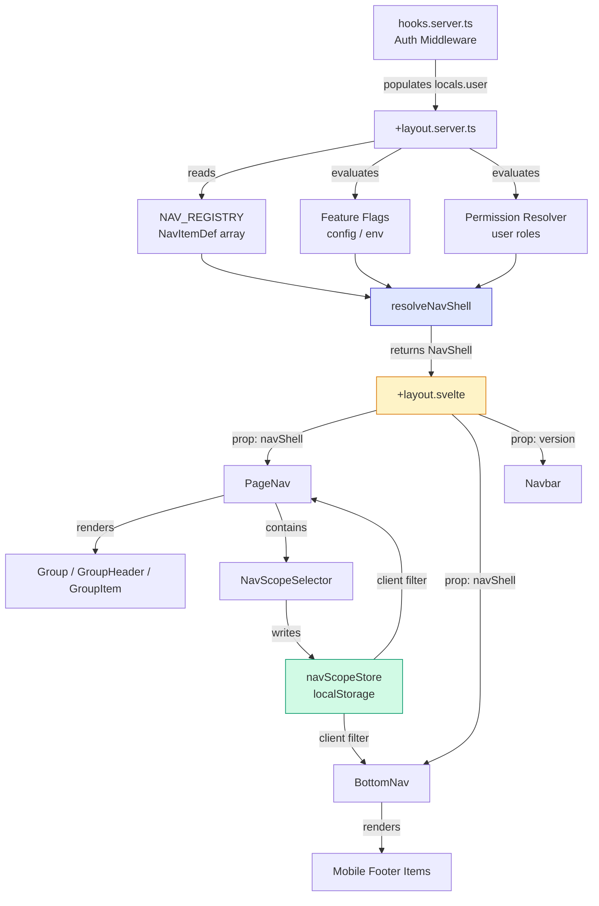
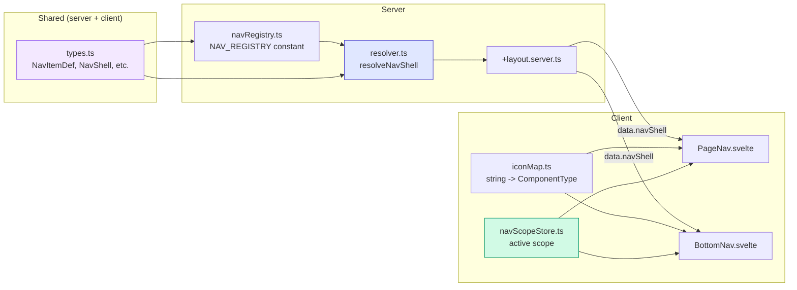

# Navigation Update -- Technical Research (v2)

## Executive Summary

The current navigation is entirely hard-coded across three Svelte components (`Navbar`, `PageNav`, `BottomNav`) assembled in `packages/praxrr-app/src/routes/+layout.svelte` behind a simple `isAuthPage` guard. `PageNav` declares nine top-level `Group`/`GroupItem` entries inline, `BottomNav` duplicates a parallel `NavItem[]` array with its own priority system, and neither component receives any data from the server -- the root `+layout.server.ts` only returns `{ version }`. This means every IA change requires touching two independent hard-coded arrays in two different files, and there is no mechanism for permission gating, feature flags, or app-scope filtering at the navigation level. The plan below specifies a config-driven registry with concrete TypeScript interfaces, a revised layout-load contract, SSR-safe hydration patterns, and the precise file-by-file change list needed to ship the hybrid IA shell described in `research-recommendations.md`.

## Relevant Files

### Navigation Components (current)

- `/packages/praxrr-app/src/routes/+layout.svelte`: Root layout. Hides nav on auth pages. Passes `data.version` to `PageNav`. Fixed `pt-16 pb-16 md:pb-0 md:pt-0 md:pl-80` padding on `<main>`.
- `/packages/praxrr-app/src/routes/+layout.server.ts`: Returns only `{ version: appInfoQueries.getVersion() }`.
- `/packages/praxrr-app/src/lib/client/ui/navigation/navbar/navbar.svelte`: Top bar with hamburger toggle, brand, AccentPicker, ThemeToggle. Fixed `z-50` mobile / `z-[80]` desktop. Width `w-full` mobile / `w-80` desktop.
- `/packages/praxrr-app/src/lib/client/ui/navigation/pageNav/pageNav.svelte`: Sidebar drawer. Hard-codes all groups inline using `Group` + `GroupItem`. DEV-only group gated by `import.meta.env.DEV`. Width `w-[90vw]` mobile / `w-80` desktop. `z-[70]`.
- `/packages/praxrr-app/src/lib/client/ui/navigation/pageNav/group.svelte`: Expandable group container. Props: `label`, `href`, `icon`, `initialOpen`, `hasItems`. Uses `slide` transition. Renders `GroupHeader` + `<slot>` children.
- `/packages/praxrr-app/src/lib/client/ui/navigation/pageNav/groupItem.svelte`: Leaf nav item. Uses Svelte 5 `$props()` and `$derived`. Supports `activePattern` (string includes or RegExp) for URL-based highlighting.
- `/packages/praxrr-app/src/lib/client/ui/navigation/pageNav/groupHeader.svelte`: Group link + optional chevron toggle. Uses `$page.url.pathname` for active state. Svelte 4 style (`export let` props).
- `/packages/praxrr-app/src/lib/client/ui/navigation/pageNav/version.svelte`: Platform/channel/version badge at sidebar bottom.
- `/packages/praxrr-app/src/lib/client/ui/navigation/bottomNav/BottomNav.svelte`: Mobile footer bar. Declares its own `NavItem[]` (9 items) with `priority: 'always' | 'medium' | 'low'` for responsive visibility. Independent from `PageNav` data.
- `/packages/praxrr-app/src/lib/client/ui/navigation/tabs/Tabs.svelte`: Secondary tab bar used by feature routes (`/arr/[id]`, `/media-management/[databaseId]`, etc.). Supports `tabs`, `backButton`, `breadcrumb`, `responsive` props. Mobile dropdown mode.

### Stores

- `/packages/praxrr-app/src/lib/client/stores/mobileNav.ts`: Boolean writable (`open`/`close`/`toggle`).
- `/packages/praxrr-app/src/lib/client/stores/navIcons.ts`: `NavIconStyle` ('emoji' | 'lucide'), persisted to localStorage. Guarded with `browser` import.
- `/packages/praxrr-app/src/lib/client/stores/sidebar.ts`: `sidebar-collapsed` boolean, persisted to localStorage.
- `/packages/praxrr-app/src/lib/client/stores/theme.ts`: Theme toggle store.
- `/packages/praxrr-app/src/lib/client/stores/accent.ts`: Accent color store with CSS custom-property application.

### Type Foundations

- `/packages/praxrr-app/src/lib/shared/pcd/types.ts`: Defines `ArrAppType` ('radarr' | 'sonarr' | 'lidarr'), `ArrType` (includes 'all'), `ARR_APP_TYPES`, `ARR_TYPES`, `isArrType()`.
- `/packages/praxrr-app/src/lib/shared/arr/capabilities.ts`: Defines `ArrFeature`, `ArrWorkflowSurface`, `ArrSyncSurface`, `ArrCapabilities`, `ArrAppMetadata`, `ARR_APPS` registry, `supportsFeature()`, `supportsArrWorkflow()`, `supportsArrSyncSurface()`.
- `/packages/praxrr-app/src/app.d.ts`: `App.Locals` has `user: User | null` and `session: Session | null`.

### Startup and Auth

- `/packages/praxrr-app/src/hooks.server.ts`: Startup sequence (config, db, migrations, PCD, jobs). Auth middleware populates `event.locals.user` and `event.locals.session`.

### Route Structure (top-level destinations)

- `/packages/praxrr-app/src/routes/databases/` -- Databases list and detail
- `/packages/praxrr-app/src/routes/arr/` -- Arr instances and per-instance tabs (sync, upgrades, rename, library, logs, settings)
- `/packages/praxrr-app/src/routes/quality-profiles/` -- Quality profiles (per-database, entity-testing)
- `/packages/praxrr-app/src/routes/custom-formats/` -- Custom formats (per-database)
- `/packages/praxrr-app/src/routes/regular-expressions/` -- Regular expressions (per-database)
- `/packages/praxrr-app/src/routes/media-management/` -- Media management (per-database, sub-sections: naming, quality-definitions, media-settings)
- `/packages/praxrr-app/src/routes/delay-profiles/` -- Delay profiles (per-database)
- `/packages/praxrr-app/src/routes/metadata-profiles/` -- Metadata profiles (per-database)
- `/packages/praxrr-app/src/routes/settings/` -- Settings hub (general, security, notifications, jobs, logs, backups, about)
- `/packages/praxrr-app/src/routes/dev/` -- Dev-only component playground (compile-time gated)

## Architecture Design

### Current Navigation Architecture

- **Dual hard-coded arrays**: `PageNav` hard-codes 9 groups inline in Svelte markup with `Group`/`GroupItem`. `BottomNav` maintains a separate `NavItem[]` constant. These are not synchronized by any shared data source.
- **No server involvement in nav**: `+layout.server.ts` returns only `version`. No permissions, feature flags, or scope metadata flow from server to nav components.
- **Client-only state**: Sidebar collapse, icon style, theme, and accent are all localStorage-backed Svelte stores initialized with `browser` guards. Mobile nav open/close is a pure writable store.
- **Svelte 4/5 mix in nav components**: `groupItem.svelte` uses Svelte 5 `$props()` and `$derived`. `group.svelte`, `groupHeader.svelte`, `pageNav.svelte` use Svelte 4 `export let` props. Both styles coexist.
- **`activePattern` matching**: `GroupItem` supports string-includes and RegExp-based active highlighting. `GroupHeader` uses simple pathname prefix matching. `BottomNav` uses `startsWith`.
- **Responsive strategy**: `BottomNav` uses `priority` enum to hide items at breakpoints via Tailwind classes (`hidden`, `hidden sm:flex`). `PageNav` is a slide-out drawer on mobile, fixed sidebar on desktop (`md:w-80 md:translate-x-0`).
- **Tabs are route-level, not nav-level**: `Tabs.svelte` is used inside nested route layouts (`/arr/[id]/+layout.svelte`, `/media-management/[databaseId]/+layout.svelte`, etc.), not controlled by the nav registry. Each route computes its own `tabs` array reactively.

### Patterns to Preserve

- **`Group`/`GroupItem`/`GroupHeader` component hierarchy**: The slide animation, chevron toggle, vertical-line children indicator, and active-state highlighting are well-tested UI primitives. The registry should feed data into these components, not replace them.
- **`BottomNav` priority system**: The `'always' | 'medium' | 'low'` enum controlling responsive visibility maps cleanly to a registry field.
- **`Tabs` independence from sidebar**: Tab bars belong to route layouts and are driven by route-specific data (database lists, instance tabs). The nav registry should not attempt to control secondary tab bars -- only the primary sidebar and bottom nav.
- **Escape key and route-change close**: `PageNav` closes the mobile drawer on `Escape` and on `$page.url.pathname` change. This behavior stays in the component.

## Data Models -- TypeScript Interfaces

The following interfaces define the navigation registry. These live in `packages/praxrr-app/src/lib/shared/navigation/types.ts` (new file) and are importable on both server and client.

```typescript
// packages/praxrr-app/src/lib/shared/navigation/types.ts

import type { ComponentType } from 'svelte';
import type { ArrType, ArrAppType } from '$shared/pcd/types.ts';
import type { ArrFeature } from '$shared/arr/capabilities.ts';

// ============================================================================
// NAV VARIANT
// ============================================================================

/** Which navigation shell variant to render */
export type NavVariant = 'legacy' | 'nav_v2';

// ============================================================================
// NAV GROUP
// ============================================================================

/** Top-level group identifiers (exhaustive for hybrid IA) */
export type NavGroupId =
  | 'overview'
  | 'apps'
  | 'policies'
  | 'automation'
  | 'operations'
  | 'settings'
  | 'dev';

/** Metadata for a nav group */
export interface NavGroupDef {
  /** Stable group identifier */
  id: NavGroupId;
  /** Display label */
  label: string;
  /** Sort order among groups (ascending) */
  order: number;
  /** Feature flag key that must be enabled for this group to appear */
  featureFlag?: string;
}

// ============================================================================
// NAV ITEM
// ============================================================================

/** Responsive visibility for bottom nav */
export type NavMobilePriority = 'always' | 'medium' | 'low';

/** Static definition of a navigation entry (code-first, not DB) */
export interface NavItemDef {
  /** Stable, unique identifier for analytics and rendering keys */
  id: string;
  /** Display label for sidebar */
  label: string;
  /** Optional shorter label for bottom nav */
  shortLabel?: string;
  /** Canonical route path */
  href: string;
  /** Group this item belongs to */
  groupId: NavGroupId;
  /** Sort order within group (ascending) */
  order: number;
  /** Arr scope filter: 'all' means visible regardless of scope */
  arrScope: ArrType;
  /** Optional capability surface required for this item to appear */
  requiredFeature?: ArrFeature;
  /** Optional permission slug evaluated server-side */
  permission?: string;
  /** Feature flag key that must be enabled for this item to appear */
  featureFlag?: string;
  /** Bottom nav priority for responsive hiding */
  mobilePriority: NavMobilePriority;
  /** Icon component reference (lucide-svelte). Used on client only. */
  icon?: ComponentType;
  /** Emoji alternative when navIconStore is 'emoji' */
  emoji?: string;
  /** Whether this item has expandable children in the sidebar */
  hasChildren: boolean;
  /** URL pattern for active-state matching (string includes or regex) */
  activePattern?: string | RegExp;
  /** Child items (rendered as GroupItem entries) */
  children?: NavChildDef[];
}

/** Child item within a nav group (sidebar sub-items) */
export interface NavChildDef {
  /** Stable identifier */
  id: string;
  /** Display label */
  label: string;
  /** Route path */
  href: string;
  /** URL pattern for active-state matching */
  activePattern?: string | RegExp;
  /** Sort order within parent */
  order: number;
  /** Feature flag key */
  featureFlag?: string;
  /** Permission slug */
  permission?: string;
}

// ============================================================================
// RESOLVED NAV SHELL (output of server evaluation)
// ============================================================================

/** A resolved child item (after permission/flag filtering) */
export interface ResolvedNavChild {
  id: string;
  label: string;
  href: string;
  activePattern?: string;
}

/** A resolved nav item ready for client rendering */
export interface ResolvedNavItem {
  id: string;
  label: string;
  shortLabel?: string;
  href: string;
  mobilePriority: NavMobilePriority;
  hasChildren: boolean;
  activePattern?: string;
  children: ResolvedNavChild[];
  /** Icon key for client-side resolution (not serializable ComponentType) */
  iconKey: string;
  emoji?: string;
}

/** A resolved nav group */
export interface ResolvedNavGroup {
  id: NavGroupId;
  label: string;
  items: ResolvedNavItem[];
}

/** The full resolved navigation shell returned from the layout loader */
export interface NavShell {
  variant: NavVariant;
  arrScopeOptions: ArrType[];
  activeArrScope: ArrType;
  groups: ResolvedNavGroup[];
}

// ============================================================================
// NAV SCOPE STORE
// ============================================================================

/** App scope selection state (client store) */
export interface NavScopeState {
  activeScope: ArrType;
  availableScopes: ArrType[];
}

// ============================================================================
// TELEMETRY
// ============================================================================

export type NavEventName =
  | 'nav_click'
  | 'nav_scope_change'
  | 'nav_group_toggle'
  | 'nav_search_select'
  | 'nav_impression';

export interface NavTelemetryEvent {
  eventName: NavEventName;
  navItemId?: string;
  arrScope: ArrType;
  variant: NavVariant;
  metadata?: Record<string, string>;
}
```

## API Design -- Layout Load Contract

### Current Contract

```typescript
// packages/praxrr-app/src/routes/+layout.server.ts (current)
export const load: LayoutServerLoad = async () => {
  return { version: appInfoQueries.getVersion() };
};
```

### Proposed Contract

```typescript
// packages/praxrr-app/src/routes/+layout.server.ts (proposed)
import type { LayoutServerLoad } from './$types';
import type { NavShell } from '$shared/navigation/types.ts';
import { appInfoQueries } from '$db/queries/appInfo.ts';
import { resolveNavShell } from '$lib/server/navigation/resolver.ts';

export const load: LayoutServerLoad = async ({ locals }) => {
  const navShell = resolveNavShell({
    user: locals.user,
    session: locals.session,
  });

  return {
    version: appInfoQueries.getVersion(),
    navShell,
  };
};
```

The `resolveNavShell` function:

1. Reads the static `NAV_REGISTRY` (typed `NavItemDef[]` defined in code).
2. Evaluates each item's `featureFlag` against the active flag provider.
3. Evaluates each item's `permission` against `locals.user` (or skips if null).
4. Filters children through the same permission/flag checks.
5. Maps `icon` ComponentTypes to serializable `iconKey` strings.
6. Returns a `NavShell` object that is pure JSON-serializable for SSR.

### Layout Consumption

```svelte
<!-- packages/praxrr-app/src/routes/+layout.svelte (proposed shape) -->
<script lang="ts">
  import Navbar from '$ui/navigation/navbar/navbar.svelte';
  import PageNav from '$ui/navigation/pageNav/pageNav.svelte';
  import BottomNav from '$ui/navigation/bottomNav/BottomNav.svelte';
  import AlertContainer from '$alerts/AlertContainer.svelte';
  import { page } from '$app/stores';

  export let data;

  $: isAuthPage = $page.url.pathname.startsWith('/auth/');
</script>

{#if !isAuthPage}
  <Navbar />
  <PageNav version={data.version} navShell={data.navShell} />
  <BottomNav navShell={data.navShell} />
{/if}
<AlertContainer />

<main class={isAuthPage ? '' : 'pt-16 pb-16 md:pb-0 md:pt-0 md:pl-80'}>
  <slot />
</main>
```

The key change: `navShell` is passed as a prop, so both `PageNav` and `BottomNav` render from the same server-resolved data instead of maintaining independent hard-coded arrays.

## System Constraints

### SSR/Hydration Safety

- **Problem**: If the registry returns different items on server vs client (e.g., a flag evaluates differently during SSR vs hydration), SvelteKit will emit hydration mismatch warnings and potentially break interactive state.
- **Solution**: All filtering (permissions, flags, scope) happens once in `+layout.server.ts`. The resolved `NavShell` is serialized as JSON through SvelteKit's data loading. The client receives the exact same shape. No client-side re-evaluation of permissions or flags during initial render.
- **Scope switching**: When the user changes the active Arr scope on the client, a lightweight client-side filter runs over the resolved items (since the server already sent all items the user has permission to see). This avoids a round-trip for scope changes but does not add items the user cannot access. The scope store lives in `localStorage` (following the pattern in `navIcons.ts` and `accent.ts`).

### Svelte 4/5 Coexistence

- **Observation**: `groupItem.svelte` already uses Svelte 5 (`$props`, `$derived`). `group.svelte`, `groupHeader.svelte`, and `pageNav.svelte` use Svelte 4 (`export let`). The project convention per `CLAUDE.md` is "Svelte 5, no runes" -- but `groupItem.svelte` already uses runes.
- **Recommendation**: Keep existing component APIs stable. New components (e.g., `NavScopeSelector.svelte`, `CommandPalette.svelte`) should use Svelte 5 `$props` style to match `groupItem.svelte`. Existing components migrate on their own timeline.

### Icon Serialization

- **Problem**: Lucide-svelte `ComponentType` references are not JSON-serializable. The server layout load cannot include `icon: FolderTree` in the returned data.
- **Solution**: The registry defines `iconKey: string` (e.g., `'FolderTree'`, `'Link'`, `'Sliders'`). A client-side `iconMap` resolves keys to component references. `PageNav` and `BottomNav` use this map at render time. The `emoji` field is already a string and serializes fine.

```typescript
// packages/praxrr-app/src/lib/client/navigation/iconMap.ts
import {
  FolderTree,
  Link,
  Sliders,
  Palette,
  Microscope,
  Tag,
  Clock,
  Settings,
  Wrench,
} from 'lucide-svelte';
import type { ComponentType } from 'svelte';

export const NAV_ICON_MAP: Record<string, ComponentType> = {
  FolderTree,
  Link,
  Sliders,
  Palette,
  Microscope,
  Tag,
  Clock,
  Settings,
  Wrench,
};

export function resolveIcon(key: string): ComponentType | undefined {
  return NAV_ICON_MAP[key];
}
```

### Responsive Parity

- **Bottom nav mobile priority**: The `mobilePriority` field on `NavItemDef` maps directly to the existing `priority` enum in `BottomNav.svelte`. The resolved `NavShell` includes this field, so `BottomNav` can apply the same Tailwind class logic (`'hidden'`, `'hidden sm:flex'`) without changes to the responsive strategy.
- **Sidebar width**: Currently fixed at `w-80` (320px). The registry does not change this. If the grouped shell needs a wider sidebar for nested groups, that is a CSS change, not a registry change.

### Feature Flag Strategy

- **No external provider required initially**: The first iteration can use a simple server-side config object or environment variable (`NAV_V2=true`). The `featureFlag` field on registry entries is a string key looked up against this config. This avoids adding OpenFeature or PostHog as hard dependencies in Phase 1.
- **Compile-time DEV guard migration**: The current `import.meta.env.DEV` check in `PageNav` for the `/dev` group becomes `featureFlag: 'dev_tools'` in the registry, evaluated as `import.meta.env.DEV` on the server side. Same behavior, but the decision lives in the resolver instead of the view.

## Sample Diagrams

### Component Architecture (ASCII)

```
+layout.server.ts
    |
    | resolveNavShell({ user, session })
    |   - reads NAV_REGISTRY (NavItemDef[])
    |   - evaluates featureFlag per item
    |   - evaluates permission per item
    |   - maps icon -> iconKey
    |   - returns NavShell (JSON-safe)
    v
+layout.svelte
    |
    +-- data.version ------> [Navbar]
    |                            |-- AccentPicker
    |                            |-- ThemeToggle
    |                            +-- Hamburger -> mobileNavOpen store
    |
    +-- data.navShell -----> [PageNav]
    |                            |-- for each group in navShell.groups:
    |                            |     [Group]
    |                            |       |-- [GroupHeader] (link + chevron)
    |                            |       +-- for each item.children:
    |                            |             [GroupItem] (leaf link)
    |                            |
    |                            +-- [NavScopeSelector] (NEW)
    |                            +-- [Version]
    |
    +-- data.navShell -----> [BottomNav]
    |                            |-- flatten groups -> items
    |                            |-- filter by mobilePriority
    |                            +-- render icons/labels
    |
    +-- <slot /> ----------> [Route Page]
                                 |-- may use [Tabs] independently
                                 |   (tabs data from route load, NOT nav registry)
```

### Data Flow (Mermaid)



### Registry to Component Mapping (Mermaid)



## Codebase Changes

### Files to Create

| File                                                                               | Purpose                                                                                                                                                               |
| ---------------------------------------------------------------------------------- | --------------------------------------------------------------------------------------------------------------------------------------------------------------------- |
| `packages/praxrr-app/src/lib/shared/navigation/types.ts`                           | Shared TypeScript interfaces (`NavItemDef`, `NavShell`, `NavVariant`, `NavGroupDef`, `NavChildDef`, `ResolvedNavItem`, `ResolvedNavGroup`, `NavTelemetryEvent`, etc.) |
| `packages/praxrr-app/src/lib/server/navigation/registry.ts`                        | Static `NAV_REGISTRY: NavItemDef[]` constant defining all nav entries. Also exports `NAV_GROUPS: NavGroupDef[]` for group ordering/metadata.                          |
| `packages/praxrr-app/src/lib/server/navigation/resolver.ts`                        | `resolveNavShell()` function: reads registry, evaluates flags/permissions, maps icons to keys, returns `NavShell`.                                                    |
| `packages/praxrr-app/src/lib/client/navigation/iconMap.ts`                         | `NAV_ICON_MAP` record and `resolveIcon(key)` helper for runtime icon resolution from serialized `iconKey`.                                                            |
| `packages/praxrr-app/src/lib/client/stores/navScope.ts`                            | `navScopeStore` writable store for active Arr scope. Persisted to localStorage. Follows `navIcons.ts` pattern.                                                        |
| `packages/praxrr-app/src/lib/client/ui/navigation/pageNav/navScopeSelector.svelte` | Scope selector dropdown (All Apps / Radarr / Sonarr / Lidarr). Reads `navShell.arrScopeOptions`, writes to `navScopeStore`.                                           |
| `packages/praxrr-app/src/routes/api/v1/navigation/events/+server.ts`               | Telemetry ingestion endpoint. Accepts `NavTelemetryEvent`, logs via server logger. Rate-limited.                                                                      |
| `packages/praxrr-app/src/lib/client/navigation/telemetry.ts`                       | Client-side telemetry helper. Batches events and sends via `navigator.sendBeacon` or `fetch`.                                                                         |

### Files to Modify

| File                                                                          | Change                                                                                                                                                                                                                                                                                             |
| ----------------------------------------------------------------------------- | -------------------------------------------------------------------------------------------------------------------------------------------------------------------------------------------------------------------------------------------------------------------------------------------------- |
| `packages/praxrr-app/src/routes/+layout.server.ts`                            | Import and call `resolveNavShell({ user: locals.user, session: locals.session })`. Return `navShell` alongside `version`.                                                                                                                                                                          |
| `packages/praxrr-app/src/routes/+layout.svelte`                               | Pass `data.navShell` as prop to `PageNav` and `BottomNav`. No other structural changes.                                                                                                                                                                                                            |
| `packages/praxrr-app/src/lib/client/ui/navigation/pageNav/pageNav.svelte`     | Accept `navShell: NavShell` prop. Replace hard-coded `Group`/`GroupItem` markup with `{#each navShell.groups}` loop. Use `resolveIcon()` from `iconMap.ts`. Insert `NavScopeSelector`. Filter items by active scope from `navScopeStore`. Keep escape-key handler, mobile drawer, version display. |
| `packages/praxrr-app/src/lib/client/ui/navigation/bottomNav/BottomNav.svelte` | Accept `navShell: NavShell` prop. Flatten groups into items array. Replace hard-coded `items` constant. Continue using `mobilePriority` for responsive classes. Use `resolveIcon()` for icon rendering.                                                                                            |
| `packages/praxrr-app/src/lib/client/ui/navigation/pageNav/group.svelte`       | No changes needed. Continues to receive `label`, `href`, `icon`, `initialOpen`, `hasItems` from parent.                                                                                                                                                                                            |
| `packages/praxrr-app/src/lib/client/ui/navigation/pageNav/groupItem.svelte`   | No changes needed. Continues to receive `label`, `href`, `activePattern` from parent.                                                                                                                                                                                                              |
| `packages/praxrr-app/src/lib/client/ui/navigation/pageNav/groupHeader.svelte` | No changes needed.                                                                                                                                                                                                                                                                                 |
| `packages/praxrr-app/src/lib/client/ui/navigation/tabs/Tabs.svelte`           | Optional: add telemetry hook on tab click. No structural changes. Tabs remain route-driven.                                                                                                                                                                                                        |
| `packages/praxrr-app/src/app.d.ts`                                            | Extend `App.PageData` to include `navShell?: NavShell` for type safety in layout data.                                                                                                                                                                                                             |
| `svelte.config.js`                                                            | Add `$nav` alias: `'$nav': './packages/praxrr-app/src/lib/shared/navigation'` for clean imports.                                                                                                                                                                                                   |

### Files Unchanged (explicitly noted)

- `packages/praxrr-app/src/lib/shared/arr/capabilities.ts` -- No changes. Nav registry imports from it.
- `packages/praxrr-app/src/lib/shared/pcd/types.ts` -- No changes. Nav types import `ArrType` and `ArrAppType` from it.
- `packages/praxrr-app/src/hooks.server.ts` -- No changes. Already populates `locals.user` which the layout loader uses.
- All existing route files under `packages/praxrr-app/src/routes/*` -- No changes. Canonical paths preserved.

## Edge Cases and Gotchas

- **`groupItem.svelte` uses Svelte 5 runes but `pageNav.svelte` uses Svelte 4 `export let`**: When passing the new `navShell` prop into `PageNav`, it must use `export let navShell` (Svelte 4 style) to match the component's existing pattern. Do not mix by adding `$props()` to `pageNav.svelte` without migrating its other props.

- **BottomNav and PageNav must stay synchronized**: Today they are independently hard-coded. After the change, both consume the same `navShell` object, but `BottomNav` flattens groups into a linear list while `PageNav` preserves the group hierarchy. A registry entry missing `mobilePriority` would cause `BottomNav` to render it with no responsive class, making it always visible.

- **Icon key mismatch is a silent failure**: If `registry.ts` references an `iconKey` that is not in `iconMap.ts`, the item renders without an icon (no crash, just missing visual). The `resolveIcon()` helper returns `undefined` in this case, which `Group`/`GroupItem` already handle (they check `{#if icon}`).

- **Active scope changes do not refetch from server**: Changing the Arr scope selector only filters the already-resolved `NavShell.groups` on the client. If a new Arr app is added while the user has the page open, they need a full page refresh (or navigation) to see it. This is acceptable because app additions are rare admin operations.

- **`media-management/+page.svelte` redirect depends on localStorage**: The redirect-to-last-database logic runs in `onMount` and reads from localStorage. The nav registry does not change this behavior, but the scope selector must not interfere -- clicking "Media Management" in the sidebar should still land on `/media-management` which then redirects.

- **Auth pages suppress nav shell entirely**: The `isAuthPage` guard in `+layout.svelte` prevents rendering `PageNav`/`BottomNav`. However, `+layout.server.ts` still runs `resolveNavShell()` even for auth pages. For efficiency, the resolver should short-circuit when no user is present (`locals.user === null`) and return a minimal empty shell, avoiding unnecessary permission evaluation.

- **`import.meta.env.DEV` must remain for dev-group gating**: The dev group should have `featureFlag: '__dev__'` in the registry, and the resolver should map this special key to `import.meta.env.DEV`. This preserves the compile-time dead-code elimination that Vite performs -- the dev group entries are tree-shaken from production builds.

- **NavShell serialization size**: With 9 top-level items plus children, the serialized NavShell is under 2KB. Not a concern for initial data transfer. Monitor if the registry grows past 50+ items.

## Other Docs

- `docs/plans/navigation-update/research-recommendations.md` -- IA strategy options and phased rollout plan
- `docs/plans/navigation-update/feature-spec.md` -- Full feature spec with user stories, API design, and risk assessment
- `docs/plans/navigation-update/research-ux.md` -- UX patterns and accessibility requirements
- `docs/plans/navigation-update/research-external.md` -- External product benchmarks
- [SvelteKit Layout Data](https://svelte.dev/docs/kit/load) -- How `+layout.server.ts` data flows to components
- [SvelteKit Advanced Routing](https://svelte.dev/docs/kit/advanced-routing) -- Route groups for URL-free layout boundaries
