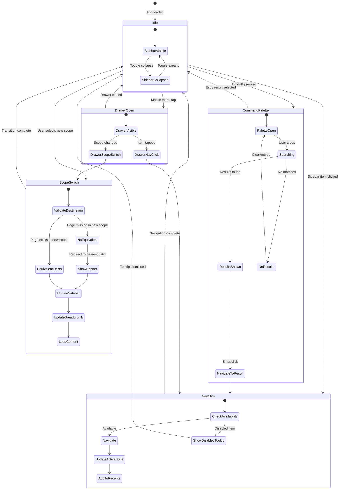

## Executive Summary

Navigation should move to a scalable, two-layer model: a stable global shell for cross-platform tasks and a contextual layer for app-specific workflows (Sonarr/Radarr/Lidarr and future providers). The recommended direction is:

- Global layer: top-level capability groups (`Overview`, `Apps`, `Automation`, `Policies`, `Operations`, `Settings`) plus universal utilities (`Search/Command`, `Create`, `Notifications`, `Help`).
- Context layer: app scope switcher (`All Apps` + specific app), then context-aware sidebar items and page-level local navigation.
- Personal layer: `Favorites` and `Recents` surfaced in both sidebar and command palette for fast return paths.

Implementation recommendation: ship this as an additive navigation shell behind a feature flag, preserve existing routes initially, and measure discoverability/task completion before route restructuring.

Practical rollout order:

1. Add global command/search and app scope switcher.
2. Add contextual sidebar with progressive disclosure groups.
3. Add favorites/recents and cross-device nav behavior (desktop + mobile).
4. Harden accessibility and state feedback patterns.

---

## User Workflows

These workflows are specific to the Arr management domain and reflect how operators actually interact with media automation platforms.

### Workflow A: Resume frequent operational work

User intent: "Take me back to what I was doing quickly."

- Entry points: `Recents`, `Favorites`, command palette.
- Arr-specific context: Users often bounce between Quality Profiles for Sonarr and Custom Formats for Radarr in the same session. The most common return targets are entity editors (a specific quality profile, a custom format rule, or a naming template) rather than index pages.
- UX requirements:
  - Recent destinations must be scoped (global + per-app) and include the entity name, not just the page title. For example, "Quality Profile: HD Bluray - Sonarr" rather than "Quality Profiles."
  - Favorites must be user-personal, reorderable, and visible near top-level navigation.
  - Command palette should bias suggestions toward recency + frequency.

### Workflow B: Cross-app policy synchronization

User intent: "Apply the same configuration pattern across my Sonarr and Radarr instances."

- Entry points: app scope selector + contextual sidebar.
- Arr-specific context: This is the core differentiator for Praxrr. Users create a quality profile or custom format set in one PCD context and need to verify/apply it across multiple Arr instances. The workflow is: select entity in app A, review, switch to app B, confirm equivalent exists or create it, then sync both.
- UX requirements:
  - Persistent app context indicator in header and breadcrumb. The indicator must differentiate between the PCD database scope and the Arr instance scope, since a user can be editing a profile in a database that targets multiple Arr types.
  - Context switch keeps user at equivalent task location when possible (for example, `Quality Profiles` Sonarr to Radarr).
  - If no equivalent exists, show an inline message explaining the gap (for example, "Metadata Profiles are not available for Radarr") and offer the nearest valid destination, not a silent redirect.

### Workflow C: Bulk operations and sync monitoring

User intent: "Run a sync across all instances and check the results."

- Entry points: Overview/dashboard, Jobs page, Sync status.
- Arr-specific context: Operators with multiple Arr instances need to trigger syncs, monitor job status, and review sync results from a single vantage point. This workflow crosses app boundaries by nature.
- UX requirements:
  - The Overview/dashboard should be a first-class navigation destination showing cross-app sync health at a glance.
  - Job status and sync results should be accessible without navigating away from the current page (slide-over panel or notification drawer).
  - The nav should surface active/failed jobs as a badge or status indicator on the relevant sidebar item.

### Workflow D: Find infrequent/advanced capabilities

User intent: "I know this exists, but I rarely use it."

- Entry points: command palette, search, expandable nav groups.
- Arr-specific context: Features like Regular Expressions, Delay Profiles, and Metadata Profiles are used during initial setup but rarely afterward. They should not occupy equal visual weight with daily-use features like Quality Profiles and Custom Formats.
- UX requirements:
  - Progressive disclosure: advanced/rare actions hidden by default but one interaction away.
  - Results should show destination type (page/action/entity) and app scope.
  - Command palette should index all destinations, even collapsed ones, so search always finds them.

### Workflow E: Mobile quick check and approval

User intent: "Check sync status or approve a quick change from my phone."

- Entry points: bottom bar for top tasks + drawer/sheet for full hierarchy.
- Arr-specific context: Mobile use for Arr management tools is primarily monitoring and quick actions, not deep editing. Users check sync health, review job failures, and occasionally navigate to a specific profile to verify a setting.
- UX requirements:
  - Keep 3-5 primary destinations in bottom nav: Overview, Profiles, Formats, Arrs, Settings.
  - Move deep/secondary items (Regex, Delay Profiles, Metadata) into expandable drawer.
  - Preserve recents and search parity with desktop.

---

## 2. Competitive Analysis: Self-Hosted Media Management Navigation

### Sonarr / Radarr (Servarr family)

**Navigation model**: Fixed left sidebar, approximately 260px wide, with flat top-level items.

- Sonarr sidebar: Series, Calendar, Activity, Wanted, Settings, System.
- Radarr sidebar: Movies, Calendar, Activity, Settings, System.
- Settings page uses a secondary tab/sub-page pattern for Media Management, Profiles, Quality, Indexers, Download Clients, etc.

**Strengths**:

- Simple, flat hierarchy. Low cognitive load for single-instance use.
- Domain-specific top-level labels (Series, Movies) immediately orient the user.
- Consistent pattern across all Arr apps reduces learning curve when switching between them.

**Weaknesses**:

- No cross-app navigation. Each instance is its own isolated UI.
- Settings pages become deep (up to 3 levels) with no breadcrumb support.
- Mobile sidebar can overlay and hide content on small viewports (documented GitHub issue #7757 in Sonarr).
- No search or command palette. Users must navigate the full tree to find features.

**Confidence**: High -- multiple primary sources (Servarr Wiki, GitHub issues, community forums).

### Prowlarr

**Navigation model**: Left sidebar matching the Servarr pattern. Primary items: Indexers, Settings, System.

- Settings sub-pages: Apps, Download Clients, Indexer Proxies, Tags, General, UI.

**Strengths**:

- Focused scope (indexer management only) means the flat sidebar works well.
- Adding indexers and apps is straightforward from the sidebar.

**Weaknesses**:

- Category management for indexers is buried under individual indexer settings, not surfaced in nav.
- No cross-app awareness. Users must separately configure connections to each Arr instance.

**Confidence**: Medium -- derived from wiki documentation and community guides.

### Jellyfin

**Navigation model**: Left sidebar with hamburger toggle. Admin dashboard uses a separate navigation context from the user-facing library view.

- Admin sidebar categories (proposed reorganization, not yet shipped): Server (General, Users, Devices, Activity, Networking), Media (Libraries, Playback, Live TV, DVR, DLNA), Other (Plugins, API Keys, Notifications, Scheduled Tasks, Logs).

**Strengths**:

- Clear separation between admin and user contexts.
- Hamburger toggle allows sidebar collapse for more content space.

**Weaknesses**:

- Admin dashboard menu organization has been criticized as illogical. Logs are hard to find (placed at bottom). Category assignments do not match user expectations (for example, "Playback" under "Media" is debated). The reorganization proposal (GitHub issue #981) was closed as "not planned" in December 2025.
- Mobile admin experience described as "clunky" by contributors.
- No search within admin dashboard.

**Confidence**: High -- GitHub issue discussion, official feature request board, community feedback.

### Overseerr / Jellyseerr

**Navigation model**: Top navbar with logo, search, and user actions. Sidebar is minimal or absent; navigation is primarily content-driven (media cards, discovery flow).

- Settings accessed via Settings page with sub-navigation: General, Plex, Services, Notifications, Users, Jobs & Cache.

**Strengths**:

- Clean, consumer-friendly interface. Mobile-optimized from the start.
- Search is a first-class citizen, prominently placed in the top bar.
- Request management workflow is streamlined: discover, request, approve.

**Weaknesses**:

- Not an admin-heavy tool. Limited applicability to Praxrr's configuration management use case.
- Settings navigation is shallow (two levels max) and would not scale to Praxrr's entity depth.

**Confidence**: Medium -- based on product documentation and GitHub repository.

### Grafana

**Navigation model**: Collapsible left sidebar with grouped categories. Breadcrumbs on all pages. Dashboard search accessible from any page.

- Sidebar categories: Dashboards, Explore, Alerting, Connections, Administration, and plugin-registered sections.

**Strengths**:

- Grouped sidebar with related tools clustered together.
- Plugin navigation customization: admins can relocate plugin pages to relevant sidebar sections.
- Breadcrumbs provide consistent wayfinding.
- Header present on all pages with search.

**Weaknesses**:

- Community feedback (GitHub Discussion #58910) reports: extra clicks required after navigation revamp (datasource access went from 1 hover + 1 click to 3-4 clicks), hamburger menu hides previously visible icons, sidebar state (docked/undocked) not centrally configurable by admins, plugin discoverability reduced under "More apps" grouping.
- Performance complaints: "All aspects of UI are slow vs old snappy feel. Coupled with extra clicks."

**Confidence**: High -- direct community discussion with specific user complaints and measurements.

### Portainer

**Navigation model**: Left sidebar with environment context switching. Clicking an environment loads its dashboard with environment-specific sidebar items.

- Global sidebar: Home, Environments, Users, Settings.
- Environment sidebar: Dashboard, App Templates, Stacks, Containers, Images, Networks, Volumes.

**Strengths**:

- Environment selector is the closest analogue to Praxrr's app scope switcher. Selecting an environment changes the entire sidebar context.
- Clear two-layer model: global administration vs. environment-specific resources.
- Dashboard per environment summarizes resource counts.

**Weaknesses**:

- Context switch is a full navigation event (loads new page). No in-place sidebar update.
- No search or command palette.
- Mobile experience is secondary.

**Confidence**: Medium -- based on documentation and community guides.

### Organizr

**Navigation model**: Tab-based navigation where each tab loads an iframe or embedded service view. Tabs can be user-permission-gated.

**Strengths**:

- Tab model is intuitive for aggregating multiple self-hosted services.
- Per-user tab visibility via permissions.

**Weaknesses**:

- iframe-based embedding creates inconsistent UX across services.
- Not a management tool; more of a portal/aggregator.

**Confidence**: Medium -- community descriptions and documentation.

### Summary comparison

| Product       | Nav model              | Scope switcher         | Search/cmd       | Mobile support  | Depth handling           |
| ------------- | ---------------------- | ---------------------- | ---------------- | --------------- | ------------------------ |
| Sonarr/Radarr | Flat sidebar           | None (single instance) | None             | Sidebar overlay | Settings sub-tabs        |
| Prowlarr      | Flat sidebar           | None                   | None             | Basic           | Settings sub-pages       |
| Jellyfin      | Sidebar + hamburger    | Admin/user split       | None in admin    | Clunky          | Proposed but rejected    |
| Overseerr     | Top bar + content      | None                   | Top bar search   | Strong          | Shallow (2 levels)       |
| Grafana       | Grouped sidebar        | Org switcher           | Dashboard search | Secondary       | Breadcrumbs + groups     |
| Portainer     | Sidebar + env selector | Environment dropdown   | None             | Secondary       | Two-layer (global + env) |
| Organizr      | Tab-based              | Per-user tabs          | None             | Responsive tabs | Flat (one level)         |

**Key takeaway for Praxrr**: No tool in this space currently combines a scope switcher with grouped contextual navigation, search/command palette, and mobile-optimized layout. This represents a genuine differentiation opportunity. Portainer's environment selector and Grafana's grouped sidebar are the closest references, but both have documented usability gaps that Praxrr can learn from.

---

## 3. Scope Switcher UX Patterns

The app scope selector is the most critical new navigation element. Research across multiple products reveals consistent patterns and pitfalls.

### Pattern analysis from real products

**PatternFly Context Selector** (Red Hat):

- Placement: masthead, next to application branding, above the main navigation. This creates the visual effect that the entire application is changing context, not just filtering a view.
- Behavior: dropdown with single selection. If more than 12 items, add a search field at the top of the dropdown.
- On small viewports: keep the context selector visible even if product branding must be sacrificed. Context clarity is more important than brand visibility.
- Key distinction: a context selector changes the content set (unlike a filter which reduces a content set). This matters for Praxrr because switching from "All Apps" to "Sonarr" changes which nav items and entity lists are available, not just which items are visible.

**Confidence**: High -- PatternFly is a well-documented, actively maintained design system (Red Hat).

**AWS Region Selector**:

- Placement: top navigation bar, persistent across all console pages.
- Behavior: dropdown with search. Region selection is sticky across sessions (stored in Unified Settings). Switching region reloads resource lists for the current service.
- Error handling: if a service is not available in the selected region, the console shows a clear message and does not silently redirect. Some global services (IAM, CloudFront) ignore region selection and show a "Global" badge.

**Confidence**: High -- official AWS documentation.

**Vercel Team/Project Switcher**:

- Placement: sidebar scope selector at top of navigation.
- Behavior: switching projects preserves the current view. If you are viewing Web Analytics, you can change projects while remaining on the same page. Users can favorite projects for rapid access.
- Evolution: originally required team selection before project selection. Updated to allow direct project navigation without team prerequisite. Keyboard support included.
- Mobile: shows only the name of the current scope to save space. Floating bottom bar for primary navigation.

**Confidence**: High -- official Vercel changelog entries with specific feature descriptions.

**GitLab Context Navigation**:

- Placement: left sidebar changes content based on whether user is viewing a project, group, or global "Your work" scope.
- Behavior: uses "Search or go to" (top bar) as the primary mechanism for switching contexts. Typing `:` followed by a project name jumps to that project. Pinned items are per-context (project pins are different from group pins).
- Key research finding: user testing showed the left sidebar was confusing because users did not understand the hierarchy change when switching contexts. GitLab responded by making the global navigation static (top bar) and keeping only the contextual sidebar dynamic. Color differentiation between global and contextual nav was critical.

**Confidence**: High -- official GitLab design blog, UX research issues, and documentation.

### Recommended scope switcher design for Praxrr

Based on the pattern analysis:

1. **Place the scope selector in the masthead (top bar), left side, next to the Praxrr logo.** This follows PatternFly and AWS placement conventions and signals that context change is application-wide.

2. **Scope options**: `All Apps`, then each configured Arr instance grouped by type (Sonarr instances, Radarr instances, Lidarr instances). If more than 8-10 instances, add a search field inside the dropdown.

3. **Sticky context**: persist the selected scope in the user's session/localStorage. Restore on next visit.

4. **View preservation on switch**: when switching scope, keep the user on the equivalent page if it exists in the new scope (Vercel pattern). If it does not exist, show an inline notice and navigate to the nearest valid destination.

5. **Visual indicator**: show the active scope label and an app-type icon/color badge in both the top bar and the breadcrumb trail. On mobile, abbreviate to icon + short label.

6. **"Global" badge**: destinations that ignore scope (Settings, Databases, Overview) should show a subtle "Global" indicator so users understand these are not filtered by app selection.

---

## 4. UI and Interaction Patterns

### Recommended navigation layout (desktop)

**Top bar** (fixed, full width, ~48-56px height):

- Left zone: Praxrr logo/home link + app scope selector dropdown.
- Center zone: command palette trigger (search input or `Cmd+K` hint).
- Right zone: sync status indicator, notifications bell, theme toggle, user avatar/menu.

**Left sidebar** (fixed, 240-280px width, full height below top bar):

- Top section: Favorites (user-pinned shortcuts, max 5-8 visible, expandable).
- Recents (last 5 visited, auto-populated, collapsible).
- Main section: capability groups with section headers:
  - Overview (dashboard/sync health)
  - Arr Instances (instance list, add instance)
  - Configuration (Quality Profiles, Custom Formats, Regular Expressions, Media Management, Delay Profiles, Metadata Profiles)
  - Databases (PCD database list)
  - Settings (General, Jobs, Logs, Backups, Notifications, Security, About)
- Bottom section: version info, collapse toggle.

**Main content area**: fluid width, scrollable, with optional local/page-level navigation (tabs or section anchors).

**Key measurements** (based on industry conventions):

- Sidebar width: 240-280px expanded, 48-64px collapsed (icon-only rail).
- Top bar height: 48-56px.
- Nav item height: 32-40px with 8-12px vertical padding.
- Touch target minimum: 44x44px (WCAG 2.5.8).
- Group header: 12px uppercase label, 60% opacity, 24px top margin for visual separation.

### Recommended navigation layout (mobile)

**Bottom bar** (fixed, safe-area-aware):

- 4-5 primary destinations: Overview, Profiles, Formats, Instances, More.
- "More" opens a bottom sheet drawer containing the full nav tree.
- Active item uses accent color + bold icon weight (current Praxrr pattern).

**Top bar** (simplified):

- Left: hamburger menu (opens drawer) + scope badge (abbreviated).
- Center: mobile alert area (existing pattern).
- Right: minimal actions (theme toggle, notifications).

**Drawer/bottom sheet**:

- Full nav tree with group headers matching desktop sidebar.
- Favorites and recents at top.
- Scope selector integrated at drawer top.
- Closes on destination selection or swipe down.

### Command palette

**Trigger**: `Cmd/Ctrl+K` globally. Optional `/` shortcut when no text input is focused.

**Design** (based on Superhuman, Linear, and GitHub patterns):

- Centered modal overlay, approximately 640px wide, max 60vh height.
- Single search input at top with placeholder: "Search pages, profiles, actions..."
- Results list below, scrollable, grouped by type:
  - Pages (route destinations)
  - Entities (specific profiles, custom formats, instances by name)
  - Actions (create profile, run sync, clear logs)
  - Recent items
- Each result shows: icon, label, scope badge (if app-specific), keyboard shortcut (if applicable).
- Ranking strategy: `exact match > scope match > recent/frequent > fuzzy`.
- Filter tokens for power users: `@app:radarr`, `#profiles`, `>action`.
- Toggle behavior: same shortcut opens and closes. `Esc` also closes.

**Confidence**: High -- patterns documented across GitHub, Linear, Superhuman, Slack, and VS Code.

### Contextual sidebars

Sidebar content should shift by context level, following GitLab's research-backed model:

- **Global context** (`All Apps` scope): show all cross-app destinations. Configuration items show entity counts per app type.
- **App context** (specific Arr selected): show only destinations valid for that app. Hide or disable items that do not apply (for example, Metadata Profiles when Radarr is selected). Show disabled items with a tooltip explaining why, rather than removing them entirely, to prevent "where did it go?" confusion.
- **Module context** (inside a specific entity editor): show local section links (tabs, anchors) and related actions (save, sync, test).

Visual cues for context changes:

- Scope badge color matches the Arr type (consistent color-coding across the UI).
- Breadcrumb trail updates to show: `Praxrr > [Scope] > [Group] > [Page] > [Entity]`.
- Sidebar section header can show the active scope label for reinforcement.

### Progressive disclosure

- Default collapsed state for low-frequency groups (Regular Expressions, Delay Profiles, Metadata Profiles).
- Use explicit, descriptive labels for disclosed groups (avoid generic "More" or "Advanced").
- Ensure discoverability: search/command palette indexes all items regardless of collapsed state. Selecting a collapsed item should expand its group and navigate to it.
- NNg research confirms: progressive disclosure reduces error rates and increases user confidence when the default state matches the 80% use case.

---

## 5. Error Handling UX

### Context-switch failures

When a user switches app scope and the current page is unavailable in the new scope:

**Pattern**: inline banner, not a modal or redirect.

- Show a non-blocking banner at the top of the content area: "This page is not available for [new scope]. Showing [nearest valid page] instead."
- The banner should include: (1) what happened, (2) where the user was redirected to, (3) a link back to the previous scope if they want to revert.
- Never silently redirect. Users must understand why their location changed. This follows the error-context principle: handle errors where they occur, not on a separate page.

**Fallback destination priority**:

1. Same capability group, different page (for example, Media Management to Quality Profiles if Media Management is not available).
2. App-scoped dashboard/overview for the new scope.
3. Global overview as last resort.

### Unavailable destinations

When a sidebar item cannot be navigated to (permissions, feature flag, or app-type incompatibility):

**Pattern**: disabled item with tooltip, not hidden item.

- Show the item in the sidebar at reduced opacity with a lock/info icon.
- On hover/focus, show a tooltip: "Not available for [scope]" or "Requires [permission]."
- Rationale (NNg): completely hiding items causes "I know I saw it somewhere" disorientation. Disabled-with-explanation preserves the user's mental model of the navigation structure.
- Exception: items behind a feature flag that the user has never seen should remain fully hidden. Only disable items the user has previously accessed or would expect to exist.

### Failed navigation actions

When a command palette action or sync trigger fails:

**Pattern**: toast notification with retry action.

- Show a toast/alert at the top or bottom of the viewport: "Failed to [action]. [Retry] [Details]."
- Do not navigate away from the current page on failure.
- Log the error for the user in the Settings > Logs page (existing pattern).

### Disconnected Arr instance

When an Arr instance in the scope selector is unreachable:

**Pattern**: degraded state indicator.

- Show the instance in the scope selector with a warning icon and "(offline)" suffix.
- If selected, show a banner: "[Instance] is not responding. Showing cached data." with a manual retry action.
- Do not remove offline instances from the selector. Users need to see them to diagnose connectivity issues.

---

## Performance UX

### Navigation loading states

**Sidebar skeleton** (during scope switch or initial load):

- Show skeleton placeholders that match the shape of nav items (rectangular blocks at nav item height and width).
- Preserve the previous sidebar state until the new state is ready. Do not clear and rebuild, which causes layout shift.
- Cross-fade from skeleton to real content (200-300ms transition).
- NNg research: skeleton screens are effective for medium-duration loads (200ms to 2s). For loads under 200ms, show nothing (instant). For loads over 2s, add a progress indicator.

**Scope switch transition**:

- Optimistic update: immediately update the scope badge in the top bar and breadcrumb.
- Start loading new sidebar content and page content in parallel.
- If sidebar items resolve first, update them while page content shows a skeleton.
- Target: scope switch should complete in under 500ms for cached data, under 2s for fresh API calls.

### Navigation data caching

- Cache the resolved nav shell (groups, items, permissions) in the SvelteKit layout load. Invalidate on scope change or permission update.
- Cache favorites and recents in localStorage with a TTL of 24 hours.
- Command palette index should be built once on initial load and incrementally updated. Do not rebuild on every keystroke.

### Performance budgets

| Operation              | Target               | Measurement                       |
| ---------------------- | -------------------- | --------------------------------- |
| Initial sidebar render | <100ms               | Layout load to first paint        |
| Scope switch (cached)  | <300ms               | Click to sidebar + content update |
| Scope switch (network) | <1.5s                | Click to full content render      |
| Command palette open   | <50ms                | Keystroke to palette visible      |
| Command palette search | <100ms per keystroke | Input to results update           |
| Favorites/recents load | <50ms                | From localStorage                 |

### Optimistic updates for user actions

- Favorite/unfavorite: update sidebar immediately, reconcile on server response. On failure, revert with a toast.
- Reorder favorites: update order immediately via drag-drop, persist on drop-end. On failure, revert.
- Recents: append on navigation, no server round-trip needed (client-side only).

---

## 7. Accessibility Considerations

### Landmarks and structure

- Use semantic landmarks (`header`, `nav`, `main`) and named navigation regions.
- Preserve meaningful hierarchy in nested navigation lists.
- Multiple `nav` elements must have distinct `aria-label` values: "Global navigation" (top bar), "Main navigation" (sidebar), "Page navigation" (local/tabs), "Mobile navigation" (bottom bar).

### Keyboard model

- Full keyboard traversal for global nav, sidebar, disclosure controls, and command palette.
- Predictable arrow/tab behavior in hierarchical nav and visible focus states.
- `Esc` should close overlays (palette/drawer) and return focus to trigger.
- Scope selector: `Enter`/`Space` to open, arrow keys to navigate options, `Enter` to select, `Esc` to close without change.

### Screen reader support

- Current location announced (`aria-current="page"` in breadcrumb/nav links).
- Disclosure states exposed (`aria-expanded`, `aria-controls`).
- Status updates (for example "18 results", "Saved to favorites") surfaced via polite live regions when focus does not move.
- Scope change: announce "Switched to [scope name]" via assertive live region.
- Disabled nav items: use `aria-disabled="true"` with descriptive `title` or `aria-describedby` linking to the reason text.

### Contrast and target size

- Meet WCAG AA color contrast for text/icons and non-text UI indicators.
- Ensure touch targets remain accessible on compact layouts (minimum 44x44px per WCAG 2.5.8).
- Scope selector dropdown items: minimum 40px height for touch accessibility.

---

## Feedback and State Design

### Navigation loading states

- Skeletons for sidebar sections during context switch or permission fetch.
- Preserve previous nav state until next state is ready to reduce layout jank.

### Empty and zero-result states

- Empty favorites: offer one-click "Pin current page" and suggestions (top 3 most-visited pages).
- Empty recents: show commonly used destinations for the current scope.
- Search no-results: provide fallback suggestions, token examples (`@app:radarr #profiles`), and a "Browse all pages" link.

### Confirmation and system feedback

- Lightweight confirmation for star/unstar, pin/unpin, reorder (subtle animation, not modal).
- Clear success/error feedback for command palette actions.
- Show active scope and effective filters prominently when they affect results.

---

## 9. UX Risks

- Risk: Over-complex IA during transition.
  - Mitigation: keep global taxonomy small (6-7 top-level groups max); enforce maximum top-level groups; defer deep restructuring.
- Risk: Hidden navigation reduces discoverability.
  - Mitigation: never hide all top-level categories on desktop; provide visible primary wayfinding. Grafana's experience shows that collapsing sidebar behind hamburger increases clicks and frustrates users.
- Risk: Context confusion between global and app-specific areas.
  - Mitigation: persistent context indicator + contextual breadcrumb + scoped labels in search results. GitLab research confirms color differentiation between global and contextual nav is critical.
- Risk: Favorites/recents become noisy or stale.
  - Mitigation: cap list sizes (5 recents, 8 favorites visible), support dismiss/reorder, decay old recents after 14 days.
- Risk: Desktop/mobile divergence creates cognitive friction.
  - Mitigation: keep destination taxonomy consistent; change container pattern only (sidebar vs bottom+drawer).
- Risk: Accessibility regressions in dynamic navigation.
  - Mitigation: test keyboard/screen-reader flows for command palette, disclosure nav, and context switches in CI.
- Risk: Scope switch performance causes perceived sluggishness.
  - Mitigation: optimistic UI updates, cached nav shell, skeleton transitions, and performance budgets with monitoring. Learn from Grafana community feedback: "slow UI coupled with extra clicks slows things down massively."
- Risk: Disabled nav items frustrate users who do not understand why.
  - Mitigation: always show a reason via tooltip or inline text. Never disable without explanation.

---

## 10. Sample Diagrams

### Desktop Navigation Layout (ASCII Wireframe)

```
+------------------------------------------------------------------+
| [Logo]  [Scope: v Sonarr ]  [  Cmd+K Search...  ]  [N] [T] [U]  |
+------------------+-----------------------------------------------+
|                  |                                                |
|  * Favorites     |  Breadcrumb: Praxrr > Sonarr > Config > QP    |
|    > HD Bluray   |  +-----------------------------------------+  |
|    > Anime CF    |  |                                         |  |
|                  |  |  Quality Profiles                       |  |
|  * Recents       |  |                                         |  |
|    > Naming...   |  |  [Tab: Overview] [Tab: Scores] [Tab:..] |  |
|                  |  |                                         |  |
|  OVERVIEW        |  |  +-----------------------------------+  |  |
|    Dashboard     |  |  |  Profile: HD Bluray               |  |  |
|                  |  |  |  ...                               |  |  |
|  INSTANCES       |  |  |                                    |  |  |
|    > Sonarr-1    |  |  +-----------------------------------+  |  |
|    > Radarr-1    |  |                                         |  |
|                  |  |                                         |  |
|  CONFIGURATION   |  +-----------------------------------------+  |
|    Profiles  (3) |                                                |
|    Formats   (8) |                                                |
|    Regex         |                                                |
|  v Media Mgmt    |                                                |
|      Naming      |                                                |
|      Quality Def |                                                |
|    Delay Prof.   |                                                |
|    Metadata [!]  |  [!] = disabled, tooltip: "Not available      |
|                  |         for Radarr"                            |
|  DATABASES       |                                                |
|    > PCD Main    |                                                |
|                  |                                                |
|  SETTINGS        |                                                |
|  v General       |                                                |
|    Jobs          |                                                |
|    Logs          |                                                |
|    ...           |                                                |
|                  |                                                |
|  [v0.2.0-dev]    |                                                |
+------------------+-----------------------------------------------+

Legend:
  [Logo]       - Praxrr home link
  [Scope: v ]  - App scope selector dropdown
  [Cmd+K ...]  - Command palette trigger
  [N][T][U]    - Notifications, Theme toggle, User menu
  v            - Collapsible group (expanded)
  >            - Link item
  (3)          - Entity count badge
  [!]          - Disabled item with tooltip
```

### Mobile Navigation Layout (ASCII Wireframe)

```
+----------------------------------+
| [=] [Sonarr] [alert...]  [T][N] |   <- Top bar (simplified)
+----------------------------------+
|                                  |
|  Breadcrumb: QP > HD Bluray     |
|                                  |
|  +----------------------------+  |
|  |  Quality Profiles          |  |
|  |                            |  |
|  |  [Overview] [Scores] [...] |  |
|  |                            |  |
|  |  Profile content...        |  |
|  |                            |  |
|  |                            |  |
|  +----------------------------+  |
|                                  |
+----------------------------------+
| [Home] [Prof] [Fmt] [Arr] [***] |   <- Bottom bar
+----------------------------------+

[=] opens drawer:
+----------------------------------+
| [X]  praxrr                      |
| [Scope: v All Apps         ]     |
|                                  |
|  * Favorites                     |
|    HD Bluray Profile             |
|    Anime Custom Format           |
|                                  |
|  * Recents                       |
|    Naming Settings               |
|                                  |
|  OVERVIEW                        |
|    Dashboard                     |
|  INSTANCES                       |
|    Sonarr-1                      |
|    Radarr-1                      |
|  CONFIGURATION                   |
|    Quality Profiles              |
|    Custom Formats                |
|    Regular Expressions           |
|    Media Management              |
|    Delay Profiles                |
|    Metadata Profiles             |
|  DATABASES                       |
|    PCD Main                      |
|  SETTINGS                        |
|    General                       |
|    Jobs                          |
|    Logs                          |
|    ...                           |
|                                  |
|  [v0.2.0-dev]                    |
+----------------------------------+

[***] = "More" button that opens the drawer
```

### Navigation State Flow (Mermaid)



---

## 11. Sources

### Primary research references

- Nielsen Norman Group, "Progressive Disclosure": https://www.nngroup.com/articles/progressive-disclosure/
- Nielsen Norman Group, "Local Navigation Is a Valuable Orientation and Wayfinding Aid": https://www.nngroup.com/articles/local-navigation/
- Nielsen Norman Group, "Navigation: You Are Here": https://www.nngroup.com/articles/navigation-you-are-here/
- Nielsen Norman Group, "Skeleton Screens 101": https://www.nngroup.com/articles/skeleton-screens/

### Design system references

- PatternFly v3, "Context Selector": https://pf3.patternfly.org/v3/pattern-library/navigation/context-selector/
- PatternFly, "Context Selector Design Guidelines": https://www.patternfly.org/components/menus/context-selector/design-guidelines/
- Carbon Design System, "Content Switcher": https://carbondesignsystem.com/components/content-switcher/usage/
- Carbon Design System, "Loading Patterns": https://carbondesignsystem.com/patterns/loading-pattern/
- W3C APG, "Disclosure Navigation Menu": https://www.w3.org/WAI/ARIA/apg/patterns/disclosure/examples/disclosure-navigation/
- W3C APG, "Tree View Pattern": https://www.w3.org/WAI/ARIA/apg/patterns/treeview/
- W3C WCAG 2.2 Quickref: https://www.w3.org/WAI/WCAG22/quickref/
- W3C, "Understanding SC 4.1.3: Status Messages": https://www.w3.org/WAI/WCAG21/Understanding/status-messages
- USWDS, "Breadcrumb" guidance: https://designsystem.digital.gov/components/breadcrumb/
- Microsoft Learn, "NavigationView": https://learn.microsoft.com/en-us/windows/apps/develop/ui/controls/navigationview
- Android Developers, "Build adaptive navigation": https://developer.android.com/develop/ui/compose/layouts/adaptive/build-adaptive-navigation

### Product navigation references

- GitLab, "Redesigning GitLab's Navigation" (2017): https://about.gitlab.com/blog/2017/07/17/redesigning-gitlabs-navigation/
- GitLab Docs, "Tutorial: Navigate the GitLab interface": https://docs.gitlab.com/tutorials/left_sidebar/
- GitLab, "Navigation Sidebar" (development reference): https://docs.gitlab.com/development/navigation_sidebar/
- GitHub Docs, "GitHub Command Palette": https://docs.github.com/en/get-started/accessibility/github-command-palette
- Vercel, "Improved experience for moving between teams and projects": https://vercel.com/changelog/improved-experience-for-moving-between-your-teams-and-projects
- Vercel, "New dashboard navigation available": https://vercel.com/changelog/new-dashboard-navigation-available
- Vercel, "Favorite teams and projects": https://vercel.com/changelog/favorite-teams-and-projects-to-appear-in-your-dashboard
- AWS, "Choosing your Region" (region selector): https://docs.aws.amazon.com/awsconsolehelpdocs/latest/gsg/select-region.html
- Atlassian, "Navigate to your work" (starred/recents/shortcuts): https://support.atlassian.com/jira-software-cloud/docs/navigate-to-your-work/
- Grafana, "Navigation Feedback" (community discussion): https://github.com/grafana/grafana/discussions/58910
- Grafana, "Customize navigation placement of plugin pages": https://grafana.com/docs/grafana/latest/administration/plugin-management/customize-nav-bar/
- Portainer, "Environments": https://docs.portainer.io/admin/environments/environments

### Self-hosted media management references

- Servarr Wiki (Sonarr/Radarr/Prowlarr): https://wiki.servarr.com/
- Sonarr Settings: https://wiki.servarr.com/sonarr/settings
- Radarr Settings: https://wiki.servarr.com/radarr/settings
- Prowlarr Settings: https://wiki.servarr.com/prowlarr/settings
- Jellyfin, "Rework the admin dashboard menu" (issue #981): https://github.com/jellyfin/jellyfin-web/issues/981
- Jellyfin, "Easier navigation in dashboard" (feature request): https://features.jellyfin.org/posts/2167/easier-navigation-in-dashboard
- Overseerr: https://overseerr.dev/
- Sonarr sidebar mobile responsive issue (#7757): https://github.com/Sonarr/Sonarr/issues/7757

### Command palette references

- Superhuman, "How to build a remarkable command palette": https://blog.superhuman.com/how-to-build-a-remarkable-command-palette/
- Maggie Appleton, "Command K Bars": https://maggieappleton.com/command-bar
- Mobbin, "Command Palette UI Design": https://mobbin.com/glossary/command-palette

### Sidebar and admin navigation references

- UX Planet, "Best UX Practices for Designing a Sidebar": https://uxplanet.org/best-ux-practices-for-designing-a-sidebar-9174ee0ecaa2
- navbar.gallery, "Best Sidebar Menu Design Examples of 2025": https://www.navbar.gallery/blog/best-side-bar-navigation-menu-design-examples
- AppMySite, "Bottom navigation bar in mobile apps: The complete 2025 guide": https://blog.appmysite.com/bottom-navigation-bar-in-mobile-apps-heres-all-you-need-to-know/
