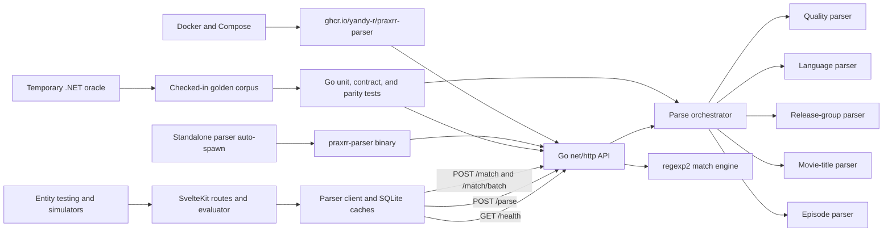

# Technical Specifications: Praxrr Parser Go

## Executive Summary

Issues [#1](https://github.com/yandy-r/praxrr/issues/1) through
[#5](https://github.com/yandy-r/praxrr/issues/5) should replace the optional
.NET 8 parser service with a Go service without changing its network address,
executable name, container image, JSON contract, parser results, or
regular-expression behavior. The safest architecture is an in-place
implementation in `packages/praxrr-parser/`: add a Go module beside the C#
oracle, prove parity with checked-in golden fixtures and dual-runtime contract
tests, switch every build surface to Go, and delete the C# files only in the
final cutover.

Use `github.com/dlclark/regexp2/v2` in its default .NET-compatible mode. Do
**not** enable its `RE2` or `ECMAScript` modes. Pin Go 1.25 and `regexp2/v2`
v2.3.0, set `MatchTimeout` to 100 ms on user-supplied patterns, and handle
timeout and compile errors as `false`, matching the current service. `regexp2`
is intentionally chosen over Go's standard `regexp` package because the parser
depends on .NET named captures, lookarounds, backreferences, inline option
changes, replacement syntax, and capture collections. Its upstream documentation
explicitly warns that matching is backtracking and unbounded unless
`MatchTimeout` is set; this makes timeout tests a release gate, not an optional
hardening task.

The Go port must remain a behavioral translation. It must not simplify regexes,
normalize output, deduplicate languages, change date handling, add request
validation, or “correct” odd legacy results. The app caches parse results by the
version returned from `/health`, so health/version behavior is also part of the
compatibility boundary.

## Architecture Design

Request flow is deliberately unchanged:

1. `packages/praxrr-app` computes `http://${PARSER_HOST}:${PARSER_PORT}`,
   defaults to `localhost:5000`, and calls the parser through its singleton
   client.
2. `/parse` applies quality, language, and release-group parsing to every valid
   request, then dispatches explicitly on `type`: movie requests use the
   movie-title parser; series requests use the episode parser.
3. `/match` compiles each supplied pattern case-insensitively and evaluates it
   with a 100 ms timeout. `/match/batch` compiles each unique dictionary key
   once and applies it to every text.
4. The app maps response enum names to its numeric TypeScript enums and caches
   parsed/matched results. No SvelteKit API or persistence contract changes are
   needed.

## Components and Boundaries

### Go command and HTTP boundary

`cmd/praxrr-parser/main.go` owns process configuration, logging, signal-aware
shutdown, and the HTTP server. `internal/api` owns routing, JSON binding,
validation, status codes, headers, and response serialization. Handlers must
depend on interfaces for parsing and regex matching so HTTP contract tests do
not need a subprocess.

The listening-address precedence should be:

1. `PARSER_ADDR`, using Go `host:port` syntax.
2. Legacy `ASPNETCORE_URLS`, accepting the current `http://localhost:<port>` and
   `http://+:<port>` forms during migration.
3. `:5000`.

Supporting `ASPNETCORE_URLS` keeps existing standalone launchers usable while
`spawn.ts` and development tasks move to `PARSER_ADDR`. The public host and port
contract remains `PARSER_HOST`/`PARSER_PORT` on the app side.

### Models

`internal/model` owns request, response, parser-result, and enum types. JSON
DTOs are separate from internal parser results where nullability differs. Enum
values and `String()` output are contract data: `Unknown`, `Cam`, `Telesync`,
`Telecine`, `Workprint`, `DVD`, `TV`, `WebDL`, `WebRip`, `Bluray`; `None`,
`Regional`, `Screener`, `RawHD`, `BRDisk`, `Remux`; all 59 language names; and
`Unknown`, `SingleEpisode`, `MultiEpisode`, `SeasonPack`.

### Regex compatibility layer

`internal/regexutil` is the only package that imports `regexp2`. It should
provide:

- compile helpers mapping legacy `IgnoreCase`, `IgnorePatternWhitespace`, and
  other used options;
- `IsMatch`, all-match iteration, named-group/capture access, split, and
  replacement helpers;
- a `RegexReplace` equivalent with `Replace` and `TryReplace` semantics;
- explicit timeout classification for user-supplied matching;
- no `RE2` compatibility flag and no silent fallback to `regexp`.

Static parser regexes should compile during package initialization and fail
tests/builds if a ported pattern is invalid. User patterns return `false` on
compile error or timeout. Internal parser functions retain the current
fail-closed behavior: unexpected parsing errors result in absent movie/episode
data rather than a 500 response.

### Domain parsers

`internal/parser` contains direct ports of:

- common cleanup and file-extension handling;
- quality source, resolution, modifier, and revision detection;
- language detection, including full-word checks, case-sensitive abbreviations,
  `DL`/`ML` German rules, ordering, and duplicates;
- release-group extraction and exception cleanup;
- movie title/year/edition, alternate title, hardcoded subtitle, IMDb/TMDb ID,
  and release hash parsing;
- series season/episode/absolute episode, date, multi-season, partial-season,
  miniseries, special, and release-type parsing.

Preserve rule order. Many patterns overlap, and the first successful
title/episode regex determines the result. Preserve .NET-specific string
behavior where the fixture corpus exposes it, especially case folding,
`char.IsLetterOrDigit`, UTF-16-versus-rune indexing, named capture collections,
replacement expansion, decimal parsing, and the episode parser's current-date
boundary.

### Parity harness

The harness has three layers:

1. Table tests for every parser and regex utility.
2. Golden JSONL fixtures generated from the unmodified .NET service for
   successful, rejected, malformed, timeout, Unicode, and boundary cases.
3. HTTP contract tests that compare decoded JSON and separately pin status,
   content type, error body, method behavior, null/default emission, and
   health/version output.

Golden files must record the source commit, oracle runtime, request, status,
response headers used as contract, and response body. Normalize only
nondeterministic transport headers. JSON object key order is not semantic, but
array order, duplicate array entries, null versus zero/empty values, and
dictionary overwrite behavior are semantic. Because a local .NET SDK is not
guaranteed, fixture generation must also run in the pinned .NET 8 SDK container
used by the legacy Docker build.

## Data Models

### Requests

| Endpoint            | JSON model                                    | Validation                                                                                                                    |
| ------------------- | --------------------------------------------- | ----------------------------------------------------------------------------------------------------------------------------- |
| `POST /parse`       | `{ "title": string, "type": string \| null }` | `title` must not be null, empty, or whitespace. `type` must be exactly `movie` or `series` (lowercase).                       |
| `POST /match`       | `{ "text": string, "patterns": string[] }`    | `text` must not be null, empty, or whitespace. `patterns` must contain at least one item. An empty string is a valid pattern. |
| `POST /match/batch` | `{ "texts": string[], "patterns": string[] }` | Both arrays must contain at least one item. Empty text items are evaluated; only the array itself is required to be nonempty. |
| `GET /health`       | none                                          | none                                                                                                                          |

The Go decoder should match System.Text.Json defaults: accept property names
case-insensitively, ignore unknown properties, and reject wrong JSON types. Do
not turn on `DisallowUnknownFields`. Limits, malformed JSON, missing bodies,
`null`, duplicate JSON properties, and trailing JSON values must be
characterized against the oracle before freezing handler behavior.

### Parse response

All fields are emitted for every successful parse. Movie and series responses
use the same outer shape.

| Field           | JSON type           | Movie behavior                                            | Series behavior        |
| --------------- | ------------------- | --------------------------------------------------------- | ---------------------- |
| `title`         | string              | original input                                            | original input         |
| `type`          | `movie` or `series` | `movie`                                                   | `series`               |
| `source`        | enum-name string    | parsed or `Unknown`                                       | parsed or `Unknown`    |
| `resolution`    | integer             | `0`, `360`, `480`, `540`, `576`, `720`, `1080`, or `2160` | same                   |
| `modifier`      | enum-name string    | parsed or `None`                                          | same                   |
| `revision`      | object              | `{version, real, isRepack}`; version defaults to `1`      | same                   |
| `languages`     | string[]            | ordered parser results                                    | same                   |
| `releaseGroup`  | string or null      | parsed group                                              | parsed group           |
| `movieTitles`   | string[]            | primary followed by alternatives, or empty                | always empty           |
| `year`          | integer             | parsed year or `0`                                        | always `0`             |
| `edition`       | string or null      | parsed edition                                            | null                   |
| `imdbId`        | string or null      | parsed ID                                                 | null                   |
| `tmdbId`        | integer             | parsed ID or `0`                                          | `0`                    |
| `hardcodedSubs` | string or null      | parsed value                                              | null                   |
| `releaseHash`   | string or null      | parsed hash                                               | null                   |
| `episode`       | object or null      | null                                                      | parsed episode or null |

`episode`, when non-null, always emits `seriesTitle`, `seasonNumber`,
`episodeNumbers`, `absoluteEpisodeNumbers`, `airDate`, `fullSeason`,
`isPartialSeason`, `isMultiSeason`, `isMiniSeries`, `special`, and
`releaseType`. Empty slices must serialize as `[]`, not `null`.

### Match responses

- `/match`: `{ "results": { "<pattern>": boolean } }`.
- `/match/batch`: `{ "results": { "<text>": { "<pattern>": boolean } } }`.

Invalid and timed-out patterns remain present with `false`. Repeated pattern
strings collapse to one object key. Repeated text strings in a batch collapse to
one object key. Tests compare decoded maps because JSON object order is not
guaranteed.

## Exact Endpoint Contract and Errors

| Method and path     | Success                                                                         | Explicit validation error                                                                                 |
| ------------------- | ------------------------------------------------------------------------------- | --------------------------------------------------------------------------------------------------------- |
| `POST /parse`       | `200 application/json` with `ParseResponse`                                     | `400 {"error":"Title is required"}` or `400 {"error":"Type is required and must be 'movie' or 'series'"}` |
| `POST /match`       | `200 application/json` with `MatchResponse`                                     | `400 {"error":"Text is required"}` or `400 {"error":"At least one pattern is required"}`                  |
| `POST /match/batch` | `200 application/json` with `BatchMatchResponse`                                | `400 {"error":"At least one text is required"}` or `400 {"error":"At least one pattern is required"}`     |
| `GET /health`       | `200 application/json` with `{"status":"healthy","version":"1.0.0"}` by default | none                                                                                                      |

Validation order is contract: `/parse` checks title before type; `/match` checks
text before patterns; `/match/batch` checks texts before patterns. Regex
compilation failures and regex timeouts are successful HTTP requests whose
affected result values are `false`; they are never 4xx or 5xx responses.

The oracle test suite must pin framework-generated cases before ASP.NET is
removed: malformed or empty JSON, JSON `null`, wrong field types, unsupported
methods, unknown paths, unacceptable media types, and oversized bodies.
Implement the observed status, `Content-Type`, `Allow` header, and body rather
than assuming `net/http` defaults match ASP.NET. Only the three explicit
`{error: ...}` bodies above may be treated as already specified by source.

## System Constraints and Non-Functional Requirements

- **Behavioral parity:** Every checked-in parse and regex fixture must produce
  an equivalent status and decoded body. No known mismatch may be waived without
  a documented contract decision.
- **Regex safety:** Apply a 100 ms `regexp2.MatchTimeout` to every user-supplied
  match. Test invalid patterns, catastrophic backtracking, and concurrent batch
  use. Call `regexp2.StopTimeoutClock()` from test teardown when leak checks are
  used; upstream documents the shared timeout clock.
- **Concurrency:** A compiled `regexp2.Regexp` is safe for concurrent use. Batch
  work should use a bounded worker pool (default `max(1, GOMAXPROCS)`) rather
  than one goroutine per input. Output semantics must remain dictionary-based.
- **Availability:** Preserve `/health`, port 5000, container DNS names, image
  name, and the `praxrr-parser[.exe]` standalone filename. The app continues to
  degrade gracefully when the optional parser is absent.
- **Client compatibility:** Keep the existing 30-second app-client timeout, two
  retries, cache keys, and parser-version invalidation behavior unchanged.
- **Resource bounds:** Add HTTP read-header/read/write/idle timeouts and a body
  limit only after characterizing the old observable contract. A recommended 32
  MiB maximum mirrors the default scale of Kestrel's request-body limit, but the
  oracle is authoritative.
- **Platforms:** Release binaries remain Linux x64/arm64, macOS x64/arm64, and
  Windows x64. Docker remains Linux amd64 until the existing workflow re-enables
  arm64.
- **Security:** Run the container as UID/GID 1000, bind no public host port in
  the provided Compose stacks, log no request payloads or regex contents at info
  level, and retain the container health check.
- **Versioning:** Default health version remains `1.0.0` for strict contract
  parity. Make it overrideable at build time with
  `-ldflags -X main.version=<value>` and by `PARSER_VERSION` only if contract
  tests establish the intended precedence. Any changed version intentionally
  invalidates app caches.
- **Reproducibility:** Pin Go 1.25.x and `regexp2/v2` v2.3.0; commit `go.sum`;
  run `go mod verify`, `go test -race ./...`, `go vet ./...`, and builds for
  every release target in CI.

## Concrete File Plan

### Create

- `packages/praxrr-parser/go.mod` and `go.sum` — Go 1.25 module and pinned
  regexp2 dependency.
- `packages/praxrr-parser/cmd/praxrr-parser/main.go` — process entry point and
  version injection.
- `packages/praxrr-parser/internal/api/handler.go`, `server.go`, and
  corresponding `_test.go` files — routes, binding, errors, response
  serialization, and shutdown.
- `packages/praxrr-parser/internal/model/{request,response,types}.go` — contract
  and domain types.
- `packages/praxrr-parser/internal/regexutil/{regex,replace}.go` and tests — the
  only regexp2 boundary.
- `packages/praxrr-parser/internal/parser/{common,quality,language,release_group,title,episode,parse}.go`
  and focused tests — direct domain ports and orchestration.
- `packages/praxrr-parser/testdata/golden/{parse,match,match_batch,http_errors}.jsonl`
  — immutable oracle output.
- `packages/praxrr-parser/internal/parity/golden_test.go` — decoded semantic
  comparison plus exact HTTP metadata assertions.
- `packages/praxrr-parser/tools/golden/` — temporary oracle runner and manifest
  generation; remove only if fixtures can still be reproducibly regenerated from
  the tagged parent commit.
- `packages/praxrr-parser/README.md` — endpoint contract, development, parity
  regeneration, and build instructions.

### Modify

- `Dockerfile.parser` — Go builder and minimal non-root runtime, retaining image
  labels, port, health check, and binary name.
- `deno.json` — replace `dotnet watch/publish` in `dev:parser`, standalone
  Linux, and standalone Windows tasks with `go run`/`go build`; remove commands
  that mutate tracked build props.
- `scripts/dev.ts` — detect Go, launch the Go command, and retain parser/server
  labeled output.
- `packages/praxrr-app/src/lib/server/utils/parser/spawn.ts` — set `PARSER_ADDR`
  instead of ASP.NET variables; do not change binary discovery or health
  waiting.
- `packages/praxrr-app/src/lib/server/utils/arr/parser/{client,index,types}.ts`
  — update stale C# comments only; functional changes require a demonstrated
  contract mismatch.
- `.github/workflows/compatibility.yml` — install pinned Go, run parser
  tests/race/vet when parser paths change, and include Go module/build files in
  path filters.
- `.github/workflows/release.yml` — replace .NET setup/RID publishing with
  `GOOS`, `GOARCH`, and `CGO_ENABLED=0` builds while preserving archive and
  executable names.
- `.github/workflows/docker.yml` — keep the parser image matrix entry; add any
  Go build metadata required by `Dockerfile.parser`.
- `.dockerignore` and `.gitignore` — replace .NET artifact rules with Go
  coverage/test-binary rules without excluding golden fixtures.
- `compose.dev.yml` — retain service identity and health dependency; ensure
  watch paths cover Go module files. `compose.yml` should not need a functional
  change because image, DNS, and port stay stable.
- `README.md`, `.github/copilot-instructions.md`, `docs/ARCHITECTURE.md`,
  `docs/architecture/{overview,components,data-flow}.md`, and
  `docs/site/src/content/docs/{app/development,getting-started/installation}.md`
  — replace .NET/C# prerequisites and source references with Go equivalents.
- `ROADMAP.md` — mark #2 through #5 and parent #1 complete only as their gates
  pass; retain issue linkage and describe the completed cutover.

### Delete at final cutover only

- `packages/praxrr-parser/Program.cs`, `Parser.csproj`, `Directory.Build.props`,
  and `appsettings.json`.
- `packages/praxrr-parser/Endpoints/*.cs`, `Models/*.cs`, `Parsers/**/*.cs`, and
  `Logging/*.cs`.
- All remaining .NET setup, `dotnet` commands, ASP.NET-only configuration, and
  C#-specific docs found by a final
  `rg 'dotnet|\.NET|C#|Parser\.csproj|ASPNETCORE_'` audit, except intentionally
  historical planning material and temporary compatibility parsing if explicitly
  retained.

## Technical Decisions

| Decision             | Options considered                                                    | Recommendation and rationale                                                                                                                                                                                        |
| -------------------- | --------------------------------------------------------------------- | ------------------------------------------------------------------------------------------------------------------------------------------------------------------------------------------------------------------- |
| Source location      | New `packages/praxrr-parser-go`; replace existing package in place    | Replace in place. Keeping `packages/praxrr-parser`, image name, service name, and binary name avoids churn in Compose, releases, auto-spawn, stats, and docs. Coexistence of Go and C# during parity work is valid. |
| Regex engine         | Go `regexp`; regexp2 default; regexp2 RE2 mode                        | Use regexp2 default .NET mode. Standard regexp cannot express required patterns; RE2 mode deliberately changes character classes and anchors.                                                                       |
| Dependency line      | regexp2 v1 on older Go; regexp2/v2 v2.3.0 on Go 1.25                  | Use v2.3.0 and Go 1.25. It is the maintained major version and exposes the needed timeout/options API. Pin both and validate Unicode cases because regexp2 documents rune/string differences from .NET.             |
| HTTP stack           | Gin/Echo/Fiber; standard `net/http`                                   | Use `net/http`. Four endpoints do not justify framework behavior that would make exact ASP.NET error emulation harder.                                                                                              |
| Porting method       | Rewrite/simplify; generated translation; line-oriented manual port    | Use a line-oriented manual port with rule order and names preserved. Simplification creates silent parser drift; generated C# translation is not maintainable.                                                      |
| Parity comparison    | Raw bytes only; decoded JSON only; hybrid                             | Use hybrid comparison: decoded JSON for success maps/objects, exact status/content type/error bodies/array ordering/nullability for transport contract.                                                             |
| Golden source        | Hand-authored expected values; only Go tests; .NET oracle capture     | Capture from the pinned .NET oracle, then review and commit. Hand-authored fixtures encode assumptions rather than existing behavior.                                                                               |
| Batch execution      | Sequential; goroutine per cell; bounded workers                       | Compile patterns once and use a GOMAXPROCS-sized worker pool over texts. This matches bounded .NET parallelism and prevents attacker-controlled goroutine growth.                                                   |
| Cutover              | Big-bang rewrite; permanent dual runtime; gated one-way cutover       | Keep C# only as a temporary oracle, switch all artifacts after parity gates, then delete it. Permanent dual runtime defeats the resource/dependency goal.                                                           |
| Server configuration | New flag only; legacy ASP.NET variable only; compatibility precedence | Introduce `PARSER_ADDR` but accept `ASPNETCORE_URLS` during the migration. Update in-repo launchers before deleting the compatibility parser.                                                                       |
| Version              | Keep `1.0.0`; use app release version; use Go-specific version        | Keep `1.0.0` for initial strict parity unless product owners intentionally choose cache invalidation. Add deterministic build-time injection for a later version policy.                                            |

## Rollout and Cutover Strategy

### Phase 1 — Issue #2: foundation and oracle

1. Freeze the source commit and build the .NET oracle in its SDK container.
2. Create the fixture taxonomy from real release titles, each parser regex
   branch, known rejects, overlapping rules, filenames, anime forms, daily
   dates, Unicode/surrogate cases, invalid regexes, timeouts, duplicate keys,
   and all HTTP failures.
3. Add the Go module, exact models, regex compatibility layer, and golden
   harness.
4. Gate: utilities and fixture reader pass; every fixture can be regenerated
   with a provenance manifest; no domain-parity claim is made yet.

### Phase 2A — Issue #3: domain parsers

Port common, quality, language, release-group, movie, and episode logic in
dependency order. Add a focused test whenever a regex or .NET string semantic
requires adaptation. Gate: every parser fixture passes, including ordering,
duplicates, nulls, date boundaries, rejects, and Unicode.

### Phase 2B — Issue #4: orchestration and HTTP

Implement `/parse`, `/match`, `/match/batch`, and `/health`. Run the .NET and Go
servers on separate loopback ports and replay the full corpus plus
fuzz-generated valid JSON to both. Gate: zero known semantic diffs; explicit
transport/error contract cases pass; race tests and timeout stress pass.

### Phase 3 — Issue #5: integration and retirement

1. Change dev tasks, standalone builds, release matrices, Docker, Compose
   development watch, and auto-spawn to the Go binary while retaining names and
   ports.
2. Build and smoke-test all five standalone target archives. Build the parser
   container and verify it becomes healthy and the app's `/api/v1/parser/health`
   reports availability.
3. Run `go test -race ./...`, `go vet ./...`, app lint/check/unit tests, Docker
   smoke tests, and the relevant entity-testing and score/impact simulator E2E
   tests.
4. Delete the .NET implementation and CI/toolchain references. Re-run the entire
   suite from a clean checkout and confirm no runtime `dotnet` dependency
   remains.
5. Update `ROADMAP.md`, docs, issue checklists, and release notes. Ship under
   the existing image and archive names. Monitor parser health, error rate,
   match timeout rate, and app cache behavior.

Rollback is operationally simple before merge: point builds back to the C#
oracle. After release, republish the previous `praxrr-parser` image tag and
standalone archive or revert the cutover commit; no database migration is
involved. A parser version change may invalidate caches but does not make them
unreadable.

## Open Questions

1. Should the initial Go health version remain exactly `1.0.0`, or should the
   cutover intentionally return a new version to invalidate all existing
   parsed-release and pattern-match caches?
2. Is parity defined as semantic JSON plus pinned transport metadata, or do any
   consumers require byte-for-byte property ordering and framework-generated
   Problem Details bodies?
3. May the minimum supported developer Go version move to 1.25, as required by
   regexp2/v2, or must the implementation use the v1 module line to support an
   older toolchain?
4. Should `ASPNETCORE_URLS` compatibility remain for one release after cutover,
   or be removed in the same PR once every in-repo launcher uses `PARSER_ADDR`?
5. What body-size limit should be treated as parity for malformed/oversized
   requests after the oracle measurement? The proposed 32 MiB limit should not
   be adopted without that evidence.
6. Do release gates require every existing Playwright E2E test, or a focused
   parser-dependent E2E subset plus the full Deno unit/check/build suite? The
   final CI workflow should state this explicitly rather than relying on
   developer convention.
7. Should the golden-generation tool remain in the repository after C# deletion,
   pointing at a tagged legacy container, or should fixtures become append-only
   and be reviewed manually for future parser changes?

## External Technical References

- [regexp2 upstream repository](https://github.com/dlclark/regexp2) — .NET
  compatibility, backtracking, compile modes, concurrency, and timeout-clock
  behavior.
- [regexp2/v2 package documentation](https://pkg.go.dev/github.com/dlclark/regexp2/v2)
  — current API, Go version, regex options, and `MatchTimeout` semantics.
