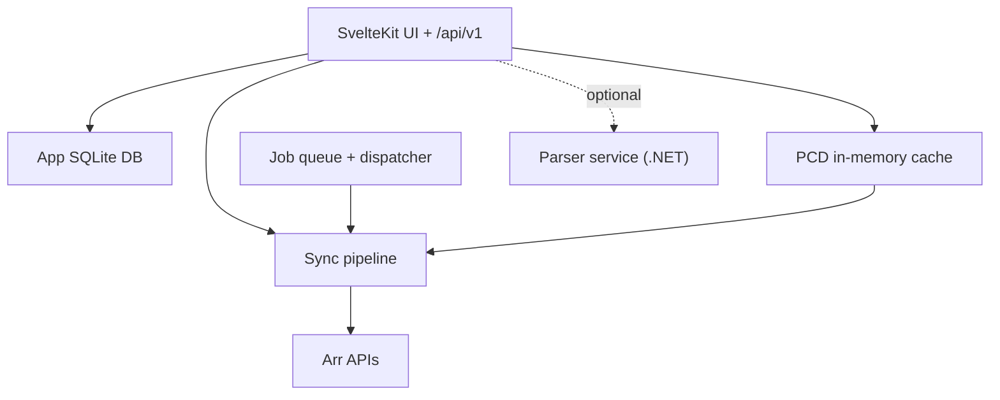

Praxrr is a Deno and SvelteKit application that manages configuration state for Radarr,
Sonarr, and Lidarr instances. The runtime app owns local SQLite state, compiles portable
configuration database (PCD) content into an in-memory cache, dispatches background jobs,
and pushes Arr-type-specific sync operations. This page is the contributor hub for the
**job dispatcher**, **sync pipeline**, **PCD compiler**, **notification manager**, and
**hooks.server.ts** startup sequence.

User-facing sync workflows live in [Syncing Profiles](/guides/syncing-profiles/). This
section explains internal modules and data flow.

## System Context

The diagram below shows how the SvelteKit app, app database, PCD cache, job queue, sync
pipeline, and optional parser service relate at runtime.

In prose: the UI and API read/write the app database and compiled PCD cache. Background
jobs enqueue sync work. The sync pipeline reads compiled PCD state and calls Arr APIs.
The parser is optional for custom-format testing.

## Runtime Shape

| Component          | Role                                                                                                 |
| ------------------ | ---------------------------------------------------------------------------------------------------- |
| **SvelteKit app**  | Serves UI and `/api/v1` endpoints from `packages/praxrr-app`.                                        |
| **App database**   | Stores settings, Arr instances, jobs, snapshots, and preferences in SQLite via Kysely migrations.    |
| **PCD cache**      | Replays append-only base and user ops into in-memory SQLite for validated reads and writes.          |
| **Job queue**      | Persists scheduled work in `job_queue`; the dispatcher claims due jobs and runs registered handlers. |
| **Sync pipeline**  | Resolves compiled PCD state into explicit, per-`arr_type` Arr API operations.                        |
| **Parser service** | Optional .NET microservice for release-title parsing during CF/profile testing.                      |

## Module Map

Server code is organized under path aliases in `deno.json` and `svelte.config.js`:

| Alias             | Path                        | Responsibility                                      |
| ----------------- | --------------------------- | --------------------------------------------------- |
| `$db/`            | `lib/server/db/`            | App SQLite schema, migrations, queries              |
| `$pcd/`           | `lib/server/pcd/`           | Ops compiler, cache, writer, entity CRUD            |
| `$sync/`          | `lib/server/sync/`          | Preview, execution, section registry, Arr dispatch  |
| `$jobs/`          | `lib/server/jobs/`          | Queue persistence, dispatcher, handlers, scheduling |
| `$notifications/` | `lib/server/notifications/` | Notification manager and notifier plugins           |
| `$arr/`           | `lib/server/utils/arr/`     | Arr HTTP clients and instance helpers               |
| `$auth/`          | `lib/server/utils/auth/`    | Session middleware and auth modes                   |

Client UI lives under `$ui/` and `$stores/`; shared types under `$shared/`.

## Data Flow Summary

1. **Startup** — Configuration, database migrations, PCD/TRaSH cache compile, job
   dispatcher start, then auth middleware. See [Startup Sequence](/app/startup/).
2. **PCD writes** — Entity handlers compile Kysely queries to SQL ops, validate against
   the cache, persist to `pcd_ops`, and recompile. See [PCD System](/app/pcd-system/).
3. **Sync preview** — Read-only diff against live Arr state via
   `/api/v1/sync/preview`. See [Sync Pipeline](/app/sync-pipeline/).
4. **Sync execution** — `arr.sync.*` jobs run section syncers that push changes to Arr.
5. **Notifications** — Handlers call `notificationManager.notify()` after upgrade/rename
   events. See [Notifications](/app/notifications/).

## Contract Boundaries

OpenAPI schemas, runtime validators, and portable entity handlers must stay in lockstep.
Arr semantics are validated per target `arr_type`; shared payload shapes do not imply
shared domain behavior. Sync section support is declared per app in `sync/mappings.ts`
and fails fast when a section is unsupported.

Portable table contracts are documented in the [PCD schema structure](/schema/structure/).
API endpoints are generated from the same OpenAPI spec as runtime types.

## Read Next

Contributor deep dives, in recommended order:

1. [Startup Sequence](/app/startup/) — init order from `hooks.server.ts`
2. [Development Setup](/app/development/) — local tasks and environment variables
3. [PCD System](/app/pcd-system/) — ops compiler, cache, writer, value guards
4. [Job System](/app/jobs/) — queue, dispatcher, handlers
5. [Sync Pipeline](/app/sync-pipeline/) — preview vs execution, per-`arr_type` dispatch
6. [Notifications](/app/notifications/) — manager, notifiers, configuration
7. [Testing](/app/testing/) — unit tests, aliases, e2e

## Source References

- App runtime: `packages/praxrr-app/src`
- Startup: `packages/praxrr-app/src/hooks.server.ts`
- PCD: `packages/praxrr-app/src/lib/server/pcd/`
- Sync: `packages/praxrr-app/src/lib/server/sync/`
- Jobs: `packages/praxrr-app/src/lib/server/jobs/`
- API spec: `docs/api/v1/openapi.yaml`

## Related

- [Syncing Profiles](/guides/syncing-profiles/) — user guide for preview and sync triggers
- [PCD Schema Structure](/schema/structure/) — portable table contracts
- [Development Setup](/app/development/) — contributor environment
- [Troubleshooting](/guides/troubleshooting/) — operational diagnostics
- [API Reference](/api/) — `/api/v1` OpenAPI endpoints
