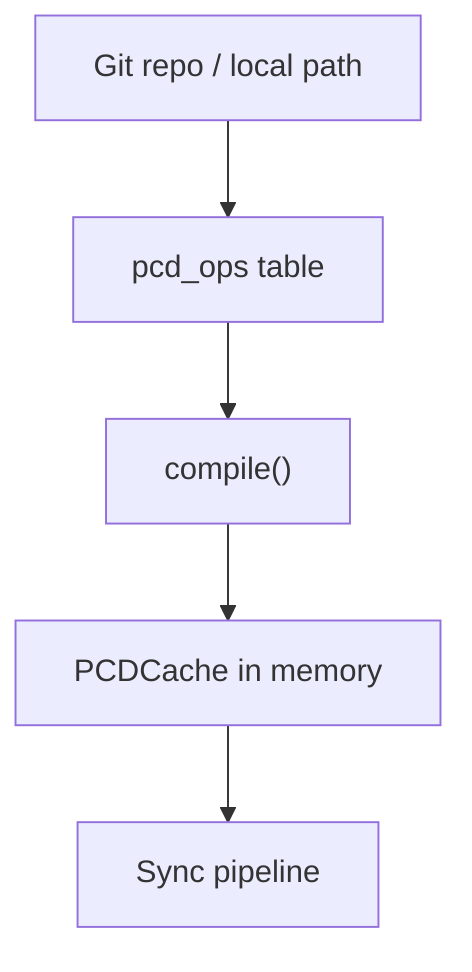

The **PCD system** (`$pcd/`) manages Praxrr Compliant Databases: Git-linked repositories
whose state is stored as append-only SQL **ops** in `pcd_ops` and replayed into an
in-memory SQLite **PCDCache** on each compile. Portable table contracts are documented in
[PCD schema structure](/schema/structure/).

## Ops Layers

| Layer        | Origin                                        | Persistence                    |
| ------------ | --------------------------------------------- | ------------------------------ |
| **Base ops** | Published repo state, imports, built-in seeds | `pcd_ops` with `origin='base'` |
| **User ops** | Local overrides                               | `pcd_ops` with `origin='user'` |

User ops survive upstream syncs. Updates and deletes use **value guards** (old-value
checks) to detect upstream changes and surface conflicts instead of silently overwriting.

## Compile Pipeline

`compile()` in `database/compiler.ts`:

1. Load ops for the database instance from `pcd_ops`
2. Build a fresh `PCDCache` (in-memory SQLite)
3. Replay ops in order; validate FK integrity
4. Optionally auto-resolve conflicts when `conflict_strategy='override'`
5. Register cache in `database/registry.ts` via `setCache()`

`pcdManager.initialize()` compiles all linked databases during startup. Invalidation
(`invalidate()`) drops cached state before recompile after writes or pulls.

## Writer Pipeline

Entity CRUD flows through `ops/writer.ts`:

1. Kysely query → SQL compile
2. Validate against current cache
3. Evaluate **value guards** via `migration/valueGuardGate.ts`
4. Insert op row into `pcd_ops`
5. Recompile cache

`writeOperation()` respects layer (`base` vs `user`), origin, and repo-import context.
Base writes require explicit permission (`canWriteToBase()`).

Blocking value-guard statuses prevent apply until the operator resolves the conflict.

## Conflict Strategies

Per-database `conflict_strategy` on link:

| Strategy   | Behavior                                                          |
| ---------- | ----------------------------------------------------------------- |
| `override` | Auto-resolve published user conflicts on compile (bounded rounds) |
| `align`    | Align local ops with upstream via auto-align helpers              |
| `ask`      | Surface conflicts in UI for manual resolution                     |

Conflict detection and override utilities live under `pcd/conflicts/`.

## Lifecycle Overview

In prose: repository changes import into ops storage; compile replays ops into the cache;
sync reads compiled state when pushing to Arr.

## Manager Responsibilities

`pcd/core/manager.ts` orchestrates link, pull, push, dependency sync, and snapshot
service integration. Successful pulls call `triggerSyncs()` for configured instances.

Built-in base-op migrations are registered in `ops/seedBuiltInBaseOps.ts` so fresh
databases receive them without rerunning app migrations.

## Source References

- `packages/praxrr-app/src/lib/server/pcd/core/manager.ts`
- `packages/praxrr-app/src/lib/server/pcd/database/compiler.ts`
- `packages/praxrr-app/src/lib/server/pcd/database/cache.ts`
- `packages/praxrr-app/src/lib/server/pcd/ops/writer.ts`
- `packages/praxrr-app/src/lib/server/pcd/migration/valueGuardGate.ts`

## Related

- [PCD Schema Structure](/schema/structure/) — table contracts and OSQL model
- [Sync Pipeline](/app/sync-pipeline/) — consumes compiled cache
- [Architecture Overview](/app/architecture/) — data flow
- [Job System](/app/jobs/) — `pcd.sync` scheduled pulls
- [Troubleshooting](/guides/troubleshooting/) — pull/link failures
