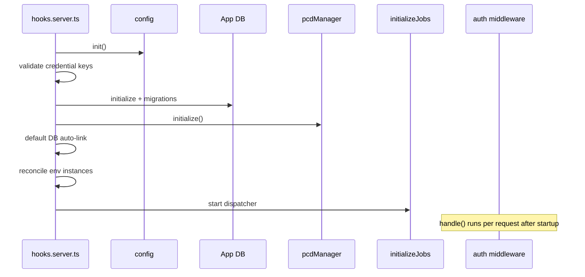

Praxrr initializes synchronously in `hooks.server.ts` before the SvelteKit server accepts
requests. Understanding **fail-fast** vs **warn-and-continue** steps helps diagnose
startup logs and encryption or PCD auto-link failures.

## Init Order

| Step | Action                                                                | On failure                                         |
| ---- | --------------------------------------------------------------------- | -------------------------------------------------- |
| 1    | Parser auto-spawn import (standalone builds)                          | Depends on build mode                              |
| 2    | `config.init()`                                                       | Startup aborts                                     |
| 3    | `getActiveArrCredentialKeyVersion()`                                  | **Fail-fast** — logs error and throws              |
| 4    | `db.initialize()` + `runMigrations()`                                 | Startup aborts                                     |
| 5    | `appInfoQueries.updateVersion()`                                      | Startup aborts                                     |
| 6    | `logSettings.load()`                                                  | Startup aborts                                     |
| 7    | `logContainerConfig()` (Docker metadata)                              | Continues                                          |
| 8    | `pcdManager.initialize()`                                             | Startup aborts                                     |
| 9    | `trashGuideManager.initialize()`                                      | Startup aborts                                     |
| 10   | Default PCD auto-link (first run only)                                | **Warn-and-continue** — marks attempted            |
| 11   | `reconcileEnvInstances()`                                             | **Warn-and-continue** — logs reconciliation errors |
| 12   | `initializeJobs()` — recover running jobs, schedule, start dispatcher | Startup aborts                                     |
| 13   | Optional `arr.pull.startup` job when `pullOnStart` enabled            | **Warn-and-continue**                              |
| 14   | `cleanupExpiredSessions()`                                            | Continues                                          |
| 15   | Server ready log + startup banner                                     | —                                                  |
| 16   | Auth middleware (`handle` export)                                     | Per-request                                        |

Empty `PRAXRR_DEFAULT_DB_URL` disables auto-link by design and marks setup complete
without retrying on every boot.

## Sequence Diagram

In prose: configuration and encryption validation run first, then the database and PCD
caches compile, optional setup steps warn instead of aborting, the job dispatcher starts,
and authentication applies on each HTTP request.

## Fail-Fast vs Warn-and-Continue

**Fail-fast** steps prevent the server from starting with invalid encryption material or
an inconsistent database/PCD state. Fix `ARR_CREDENTIAL_MASTER_KEY` configuration before
retrying.

**Warn-and-continue** steps include default database auto-link, environment instance
reconciliation, and optional startup pull job enqueue. These log warnings but allow the UI
to come up so operators can fix configuration in settings.

## Auth Middleware

After startup, every request passes through `handle`:

- First-run setup redirect when no admin user exists
- `AUTH=off` or local-network bypass after setup (dev-only modes)
- Public path allowlist
- Session sliding expiration for authenticated users
- 401 for unauthenticated API calls

See [Development Setup](/app/development/) for auth mode warnings.

## Source References

- `packages/praxrr-app/src/hooks.server.ts`
- `packages/praxrr-app/src/lib/server/jobs/init.ts`
- `packages/praxrr-app/src/lib/server/pcd/index.ts`
- `packages/praxrr-app/src/lib/server/utils/encryption/keys.ts`

## Related

- [Architecture Overview](/app/architecture/) — system context
- [Job System](/app/jobs/) — dispatcher started during init
- [PCD System](/app/pcd-system/) — cache compile on startup
- [Development Setup](/app/development/) — environment variables
- [Troubleshooting](/guides/troubleshooting/) — migration and auth errors
