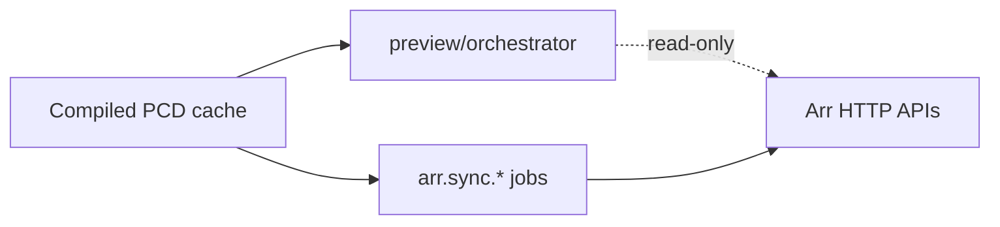

The **sync pipeline** transforms compiled PCD state into Arr API operations. Preview
(dry-run) and execution are separate code paths. Section support is declared per
`arr_type` in `mappings.ts` — Radarr, Sonarr, and Lidarr do not share identical
semantics even when API shapes look similar.

User workflows: [Syncing Profiles](/guides/syncing-profiles/). This page covers internals.

## Section Registry

Sync work is organized into sections registered in `sync/registry.ts`:

| Section            | Handler import                |
| ------------------ | ----------------------------- |
| `qualityProfiles`  | `qualityProfiles/handler.ts`  |
| `delayProfiles`    | `delayProfiles/handler.ts`    |
| `mediaManagement`  | `mediaManagement/handler.ts`  |
| `metadataProfiles` | `metadataProfiles/handler.ts` |

Each section implements `SectionHandler` with syncers extending `BaseSyncer`. Handlers
register via side-effect imports in `sync/processor.ts`.

## Per-`arr_type` Dispatch

`sync/mappings.ts` defines supported sections per app:

| Arr type | Supported sections                              |
| -------- | ----------------------------------------------- |
| `radarr` | qualityProfiles, delayProfiles, mediaManagement |
| `sonarr` | qualityProfiles, delayProfiles, mediaManagement |
| `lidarr` | all four including metadataProfiles             |

`isSyncSectionSupported()` and related helpers **fail fast** with explicit error messages
when a section is requested for an unsupported `arr_type`. Media management subsections
(mediaSettings, naming, qualityDefinitions) are also gated per app.

## Preview Path (Read-Only)

Preview never mutates Arr state:

1. API: `POST /api/v1/sync/preview` (see OpenAPI reference)
2. `processor.ts` → `generatePreview()` in `preview/orchestrator.ts`
3. Orchestrator walks `SYNC_SECTION_ORDER`, invokes section syncers in preview mode
4. Returns per-section creates/updates/deletes and accumulated errors

Preview is safe to repeat while resolving PCD conflicts or selection mismatches.

## Reviewed Preview Apply Boundary

Creating a Sync Preview also creates a private, versioned review binding in the
process-local TTL preview store. The binding is not returned by the preview API and is
not written to the application database. A process restart or normal preview expiry
therefore invalidates it safely rather than restoring an old authorization.

The binding covers the exact reviewed:

- instance ID and explicit `arr_type`
- successfully generated section set and the subset selected for Apply
- effective per-section configuration, including transient preview configuration
- desired PCD/config evidence, relevant live Arr evidence, and material plan for each
  section

Apply first atomically claims the ready preview (`ready` → `applying`). The reviewed
executor then claims every selected section as one operation without resetting another
sync's active claim. After the claims are held, it reloads the exact enabled instance,
dispatches through its stored Radarr, Sonarr, or Lidarr type, and re-materializes separate
PCD/config, live Arr, and material-plan evidence for every selected section. Every
selected section must match before Praxrr creates snapshots, captures Sync History,
records confirmed outcomes, or performs the first Arr write.

A PCD-only, Arr-only, combined, scope, or unverifiable mismatch returns a typed 422
invalidation. The entire selected apply is rejected with zero writes, no Sync History
run, and no confirmed entity outcomes. The old diff remains read-only; the UI states
that nothing was applied and requires the operator to generate and review a new preview.

On a match, each syncer receives the prepared values produced during revalidation and
the same effective section configuration that was reviewed. The planned changes remain
review evidence, not proof of execution. Only actual writer results become confirmed
entity outcomes and Sync History evidence.

This is an all-selected-before-any-write application boundary, not a transaction across
upstream Arr APIs. Radarr, Sonarr, and Lidarr do not expose one common conditional-write
contract, so an external actor can still change Arr state after Praxrr's final validation
read and before a write. Praxrr narrows that interval with prepared values and available
value guards, but does not claim durable preview authorization or upstream atomicity.

## Execution Path

Execution runs through job handlers and direct processor calls:

| Trigger     | Entry point                                                       |
| ----------- | ----------------------------------------------------------------- |
| `on_pull`   | `triggerSyncs()` after PCD git pull                               |
| `on_change` | `triggerSyncs()` after PCD file/ops change                        |
| `schedule`  | Cron evaluation in `evaluateScheduledSyncs()` → `arr.sync.*` jobs |
| Manual      | UI or API enqueue of sync jobs                                    |

`arr.sync.*` job handlers invoke section syncers with live Arr clients from
`arrInstanceClients.ts`. Concurrency for multi-instance preview is bounded; execution
uses similar batching in `processor.ts`.

Startup pull marks instances active to prevent redundant `on_pull` fanout while
reconstructing selections from live Arr state.

## Pipeline Flow

In prose: both preview and execution read compiled PCD state. Preview diffs against Arr
without writes. Reviewed Preview Apply adds the private validation boundary above before
calling the existing writers. Jobs and matched reviewed applies perform the actual push.

## Contract Notes

- Do not assume cross-Arr field parity when reading or extending syncers.
- Config names used as sync lookup keys must match persisted identifiers exactly.
- Quality profile compatibility filtering uses app-compatible quality names, not
  `arr_type='all'` scores alone.
- Reviewed validation and execution always dispatch through the binding's explicit
  `arr_type`; there is no sibling-Arr fallback.
- A reviewed preview authorizes a bounded attempt only while its private TTL binding and
  all selected evidence still match. Confirmed outcomes describe actual writes and are a
  separate contract.

## Source References

- `packages/praxrr-app/src/lib/server/sync/processor.ts`
- `packages/praxrr-app/src/lib/server/sync/preview/orchestrator.ts`
- `packages/praxrr-app/src/lib/server/sync/preview/reviewBinding.ts`
- `packages/praxrr-app/src/lib/server/sync/preview/store.ts`
- `packages/praxrr-app/src/lib/server/sync/mappings.ts`
- `packages/praxrr-app/src/lib/server/sync/registry.ts`
- `packages/praxrr-app/src/lib/server/jobs/handlers/arrSync.ts`

## Related

- [PCD System](/app/pcd-system/) — compiled state preview and sync read from
- [Job System](/app/jobs/) — `arr.sync.*` scheduling and execution
- [Syncing Profiles](/guides/syncing-profiles/) — user guide
- [Architecture Overview](/app/architecture/) — data flow summary
- [Troubleshooting](/guides/troubleshooting/) — preview and sync errors
