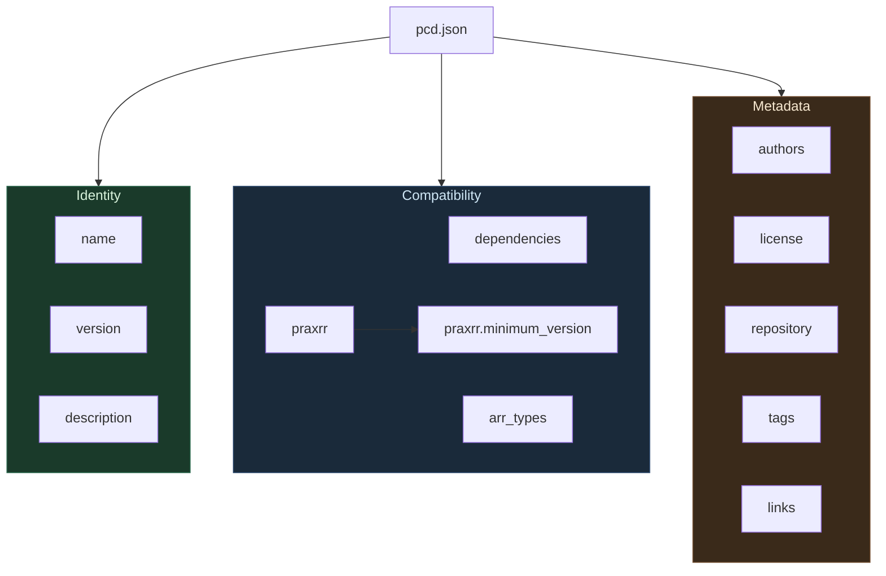
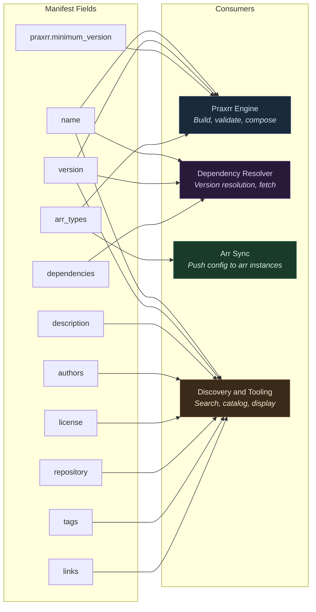
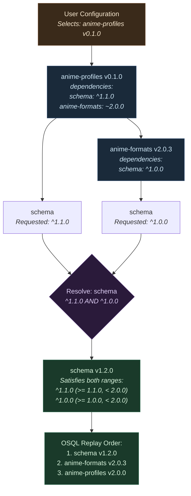
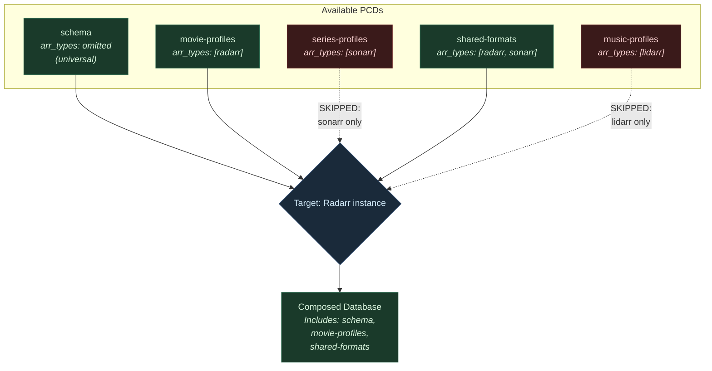
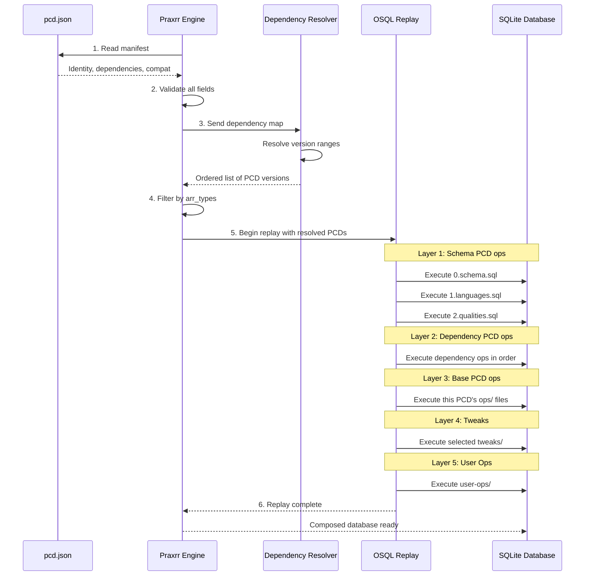
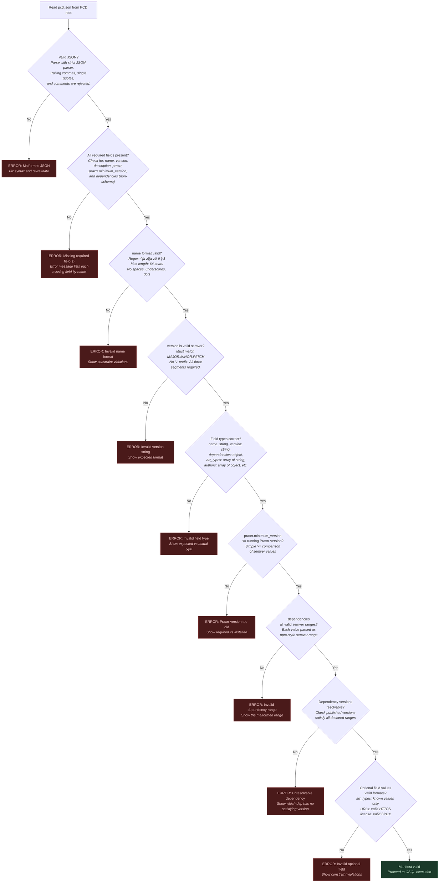

> Source: `packages/praxrr-schema/docs/manifest.md`

## Manifest Specification (`pcd.json`)

## Table of Contents

- [Introduction](#introduction)
- [Field Reference Quick Table](#field-reference-quick-table)
- [Manifest in the PCD Lifecycle](#manifest-in-the-pcd-lifecycle)
- [Manifest Structure Overview](#manifest-structure-overview)
- [Field Consumers](#field-consumers)
- [Required Fields](#required-fields)
  - [`name`](#name)
  - [`version`](#version)
  - [`description`](#description)
  - [`dependencies`](#dependencies)
  - [`praxrr`](#praxrr)
- [Optional Fields](#optional-fields)
  - [`arr_types`](#arr_types)
  - [`authors`](#authors)
  - [`license`](#license)
  - [`repository`](#repository)
  - [`tags`](#tags)
  - [`links`](#links)
- [Dependency Resolution](#dependency-resolution)
  - [Dependency Declaration Patterns](#dependency-declaration-patterns)
  - [Dependency Tree Resolution](#dependency-tree-resolution)
- [Arr-Type Filtering](#arr-type-filtering)
- [Manifest and OSQL Replay](#manifest-and-osql-replay)
- [Validation Rules](#validation-rules)
  - [Validation Flow](#validation-flow)
  - [Common Validation Errors](#common-validation-errors)
- [Versioning](#versioning)
  - [When to Bump MAJOR](#when-to-bump-major)
  - [When to Bump MINOR](#when-to-bump-minor)
  - [When to Bump PATCH](#when-to-bump-patch)
- [Best Practices](#best-practices)
  - [When to Update the Version](#when-to-update-the-version)
  - [Handling Breaking Changes](#handling-breaking-changes)
  - [Manifest Hygiene](#manifest-hygiene)
- [Examples](#examples)
  - [Minimal Manifest](#minimal-manifest)
  - [Full Manifest](#full-manifest)
  - [Schema Manifest (This Repository)](#schema-manifest-this-repository)
- [Related Documentation](#related-documentation)

---

## Introduction

Every Praxrr Compliant Database (PCD) must include a `pcd.json` manifest file in its root directory.
The manifest is the single source of truth for a PCD's identity, compatibility requirements, and
relationship to other PCDs in the ecosystem. For a high-level overview of PCDs and their operational
model, see the [project README](../README.md).

The manifest serves three critical purposes:

1. **Identity** -- uniquely identifies the PCD by name and version so that Praxrr can distinguish
   between databases and track their releases over time.
2. **Compatibility** -- declares which version of Praxrr is required to process the PCD and which
   schema version the PCD targets, preventing runtime failures from version mismatches.
3. **Metadata** -- provides authorship, licensing, and discovery information so that users and
   tooling can catalog, search, and attribute PCDs correctly.

Without a valid `pcd.json`, Praxrr will refuse to load a database. The manifest is parsed and
validated **before** any [OSQL operations](structure.md#2-operational-sql-osql) are executed.

---

## Field Reference Quick Table

A summary of every manifest field, its type, whether it is required, and a short description.

| Field                    | Type              | Required | Default       | Description                                        |
| ------------------------ | ----------------- | -------- | ------------- | -------------------------------------------------- |
| `name`                   | `string`          | Yes      | --            | Unique PCD identifier (lowercase, hyphens, digits) |
| `version`                | `string`          | Yes      | --            | Semver version of the PCD                          |
| `description`            | `string`          | Yes      | --            | Human-readable summary of the PCD                  |
| `dependencies`           | `object`          | Yes\*    | --            | Map of PCD names to semver ranges                  |
| `praxrr`                 | `object`          | Yes      | --            | Praxrr application compatibility settings          |
| `praxrr.minimum_version` | `string`          | Yes      | --            | Minimum Praxrr version required                    |
| `arr_types`              | `array of string` | No       | All arr types | Which arr applications this PCD supports           |
| `authors`                | `array of object` | No       | `[]`          | List of contributors                               |
| `license`                | `string`          | No       | --            | SPDX license identifier                            |
| `repository`             | `string`          | No       | --            | Source code repository URL                         |
| `tags`                   | `array of string` | No       | `[]`          | Keywords for categorization and discovery          |
| `links`                  | `object`          | No       | `{}`          | URLs to homepage, documentation, and issues        |

> \*The `dependencies` field is required for all PCDs except the root `schema` PCD, which has no
> dependencies. The schema PCD may omit this field entirely.

---

## Manifest in the PCD Lifecycle

The `pcd.json` manifest is the entry point for all PCD processing. The following diagram shows where
the manifest fits within the broader PCD build lifecycle, from discovery through to a fully composed
database.

```mermaid
flowchart TD
    A["PCD Repository<br/><em>Source code, ops/, tweaks/</em>"] --> B["pcd.json<br/><em>Manifest: identity, deps, compat</em>"]
    B --> C{"Praxrr reads manifest"}
    C --> D["Validate manifest<br/><em>JSON syntax, required fields,<br/>semver format, name constraints</em>"]
    D --> E["Check Praxrr compatibility<br/><em>praxrr.minimum_version <= running version</em>"]
    E --> F["Resolve dependencies<br/><em>Fetch required PCD versions<br/>that satisfy declared ranges</em>"]
    F --> G["Filter by arr_types<br/><em>Skip PCDs that do not<br/>apply to the target arr</em>"]
    G --> H["Determine layer order<br/><em>Schema first, then deps,<br/>then base PCD</em>"]
    H --> I["OSQL Replay<br/><em>Execute all ops in layer<br/>order against empty SQLite</em>"]
    I --> J["Apply Tweaks<br/><em>User-selected optional<br/>adjustment operations</em>"]
    J --> K["Apply User Ops<br/><em>Per-instance customizations</em>"]
    K --> L["Composed PCD Database<br/><em>Ready for arr sync</em>"]

    style A fill:#2a2a3a,stroke:#5a5a8a,color:#d0d0f0
    style B fill:#1a3a2a,stroke:#2d6a4f,color:#d8f3dc
    style L fill:#1a3a2a,stroke:#2d6a4f,color:#d8f3dc
    style D fill:#1a2a3a,stroke:#2d4a6f,color:#d0e8f7
    style E fill:#1a2a3a,stroke:#2d4a6f,color:#d0e8f7
    style F fill:#1a2a3a,stroke:#2d4a6f,color:#d0e8f7
    style G fill:#1a2a3a,stroke:#2d4a6f,color:#d0e8f7
    style H fill:#1a2a3a,stroke:#2d4a6f,color:#d0e8f7
    style I fill:#3a2a1a,stroke:#6f4a2d,color:#f7e8d0
    style J fill:#3a2a1a,stroke:#6f4a2d,color:#f7e8d0
    style K fill:#3a2a1a,stroke:#6f4a2d,color:#f7e8d0
```



The manifest acts as a gatekeeper: if any validation step fails, OSQL replay never begins. This
fail-fast design prevents partial database states caused by incompatible or malformed PCDs. For
details on how OSQL replay works, see
[Structure - Operational SQL](structure.md#2-operational-sql-osql).

---

## Manifest Structure Overview

The following diagram illustrates how the manifest fields are organized into logical groups.



All fields within the **Identity** and **Compatibility** groups are required. All fields within the
**Metadata** group are optional but strongly recommended for published PCDs.

---

## Field Consumers

Different parts of the Praxrr ecosystem consume different manifest fields. The following diagram
maps each field to the systems that read it, helping PCD authors understand why each field matters
and who depends on it.



Key takeaways:

- **`name`** is the most widely consumed field -- it serves as the primary key for PCDs across the
  engine, resolver, and discovery systems.
- **`version`** is consumed by the engine for cache invalidation and by the resolver for range
  matching. It also appears in discovery listings.
- **`arr_types`** bridges the manifest and the arr sync layer. It determines which arr instances
  receive configuration from this PCD.
- **Metadata fields** (`authors`, `license`, `repository`, `tags`, `links`) are consumed exclusively
  by discovery and tooling. They do not affect build behavior but are essential for a healthy
  ecosystem.

---

## Required Fields

These fields must be present in every `pcd.json`. Omitting any required field will cause a
validation error and Praxrr will refuse to load the PCD.

### `name`

The unique identifier for the PCD within the Praxrr ecosystem.

| Property        | Value                                                         |
| --------------- | ------------------------------------------------------------- |
| **Type**        | `string`                                                      |
| **Required**    | Yes                                                           |
| **Constraints** | Lowercase ASCII letters, digits, and hyphens only. No spaces. |
| **Max length**  | 64 characters                                                 |
| **Must be**     | Unique across all published PCDs                              |

The name is used as the dependency key when other PCDs reference this database. Choose a name that
is descriptive, concise, and unlikely to collide with other projects. The name is immutable once
published -- renaming a PCD is a breaking change because every downstream `dependencies` entry
references it by name.

**Edge cases and guidance:**

- Names must begin with a lowercase letter, not a digit or hyphen. `3d-profiles` is invalid;
  `three-d-profiles` or `profiles-3d` are valid alternatives.
- Single-character names are technically valid but strongly discouraged. They provide no descriptive
  value and are likely to collide.
- The name `schema` is reserved for the foundational schema PCD maintained in this repository. Do
  not use it for other PCDs.
- Hyphens are the only separator. Underscores (`_`), dots (`.`), and camelCase are not permitted.
  This ensures consistent, predictable naming across the ecosystem.

**Examples:**

```json
"name": "schema"
"name": "db"
"name": "anime-profiles"
"name": "4k-remux-collection"
```

**Invalid examples:**

```json
"name": "My Database"      // spaces not allowed
"name": "DB"               // uppercase not allowed
"name": "db_profiles"      // underscores not allowed (use hyphens)
"name": "-leading-hyphen"  // must start with a letter
"name": "123-digits-first" // must start with a letter
```

---

### `version`

The current release version of the PCD, following [Semantic Versioning 0.1.0](https://semver.org).

| Property        | Value                                                                                                                              |
| --------------- | ---------------------------------------------------------------------------------------------------------------------------------- |
| **Type**        | `string`                                                                                                                           |
| **Required**    | Yes                                                                                                                                |
| **Format**      | `MAJOR.MINOR.PATCH` (e.g., `1.0.0`, `2.1.35`)                                                                                      |
| **Constraints** | Must be a valid semver string. Pre-release and build metadata segments (e.g., `1.0.0-beta.1`) are permitted but not commonly used. |

The version determines how Praxrr resolves dependency ranges and whether an upgrade is
backwards-compatible. See the [Versioning](#versioning) section for guidance on when to bump each
component.

**Edge cases and guidance:**

- Do not prefix the version with `v`. The semver spec does not include a prefix, and Praxrr rejects
  strings like `v1.0.0`. Use `1.0.0` instead.
- Two-segment versions like `1.0` are invalid. All three segments (`MAJOR.MINOR.PATCH`) are
  required.
- Pre-release versions (e.g., `1.0.0-beta.1`, `2.0.0-rc.3`) are parsed correctly but have lower
  precedence than the release version. Use them during development and testing, not for published
  PCDs.
- Build metadata (e.g., `1.0.0+build.42`) is permitted but ignored during version comparison. It is
  informational only.
- The version must be monotonically increasing for each published release. Publishing `1.2.0` after
  `1.3.0` causes confusion and may break dependency resolution.

**Examples:**

```json
"version": "1.0.0"
"version": "2.1.35"
"version": "3.0.0-rc.1"
```

---

### `description`

A brief, human-readable summary of what the PCD provides.

| Property        | Value                        |
| --------------- | ---------------------------- |
| **Type**        | `string`                     |
| **Required**    | Yes                          |
| **Max length**  | 256 characters (recommended) |
| **Constraints** | Non-empty string             |

The description appears in tooling output, package listings, and search results. Write it as a
single sentence or short phrase that communicates the PCD's purpose at a glance.

**Edge cases and guidance:**

- The description must not be an empty string. A PCD with `"description": ""` will fail validation.
- Whitespace-only strings (e.g., `"description": "   "`) are also rejected after trimming.
- Keep the description factual and specific. Avoid generic phrases like "A Praxrr database" that do
  not differentiate the PCD from others.
- The 256-character limit is a recommendation, not a hard constraint. Descriptions exceeding this
  length will be truncated in some tooling displays.
- Descriptions are not searchable by tag -- use the `tags` field for keyword discovery.

**Examples:**

```json
"description": "Base schema for all Praxrr Compliant Databases - defines the structural foundation that all PCDs build upon"
"description": "Seraphys' OCD Playground"
"description": "Anime-focused quality profiles with granular subtitle scoring"
```

---

### `dependencies`

An object mapping PCD names to semver version ranges. Declares which other PCDs this database
requires at build time.

| Property     | Value                                                     |
| ------------ | --------------------------------------------------------- |
| **Type**     | `object`                                                  |
| **Required** | Yes (for all non-schema PCDs)                             |
| **Keys**     | PCD names (must match the `name` field of the dependency) |
| **Values**   | Semver range strings                                      |

Every PCD except the root `schema` PCD must declare a dependency on `schema` at minimum. The schema
PCD itself omits this field entirely since it has no dependencies. For architectural background on
how dependencies fit into the PCD layer system, see
[Structure - Dependencies](structure.md#9-dependencies).

When Praxrr composes a database, it resolves dependencies, downloads the required PCD versions, and
replays their [OSQL operations](structure.md#2-operational-sql-osql) in
[layer order](structure.md#4-layers) before the dependent PCD's own operations.

**Edge cases and guidance:**

- An empty object `{}` is not valid for non-schema PCDs. You must declare at least `"schema"` as a
  dependency.
- Dependency keys must exactly match the `name` field of the target PCD. A typo in the key (e.g.,
  `"shcema"` instead of `"schema"`) results in an unresolvable dependency error.
- Circular dependencies are detected and rejected. If PCD A depends on PCD B and PCD B depends on
  PCD A, both fail validation.
- Self-dependencies (e.g., `"my-pcd": "^1.0.0"` in the manifest for `my-pcd`) are rejected.

#### Semver Range Syntax

Dependency version ranges follow the same conventions as npm/Node.js semver ranges:

| Range            | Meaning                                 | Example match for `^1.1.0` |
| ---------------- | --------------------------------------- | -------------------------- |
| `^1.1.0`         | Compatible with 1.1.0 (>=1.1.0, <2.0.0) | 1.1.0, 1.2.0, 1.99.0       |
| `~1.1.0`         | Approximately 1.1.0 (>=1.1.0, <1.2.0)   | 1.1.0, 1.1.5               |
| `>=1.0.0`        | Any version 1.0.0 or higher             | 1.0.0, 2.0.0, 99.0.0       |
| `1.0.0`          | Exactly version 1.0.0                   | 1.0.0 only                 |
| `>=1.0.0 <2.0.0` | Explicit range                          | 1.0.0, 1.5.3               |

The caret range (`^`) is the recommended default. It allows non-breaking updates while pinning to
the current major version, which aligns with the PCD versioning guarantees described in
[Versioning](#versioning).

**Examples:**

```json
"dependencies": {
  "schema": "^1.0.0"
}
```

```json
"dependencies": {
  "schema": "^1.1.0",
  "anime-base": "~2.0.0"
}
```

> **Note:** Dependency resolution is planned for Praxrr 2.1+. At current ecosystem scale, PCDs
> declare their schema dependency for forward compatibility, and Praxrr validates the declared range
> against the schema version available at build time. See
> [Structure - Dependencies](structure.md#9-dependencies) for background.

---

### `praxrr`

An object containing Praxrr application compatibility settings.

| Property     | Value    |
| ------------ | -------- |
| **Type**     | `object` |
| **Required** | Yes      |

Currently contains a single required sub-field: `minimum_version`. Future Praxrr releases may add
additional sub-fields (e.g., feature flags or capability declarations). Unknown sub-fields are
currently ignored during validation to allow forward compatibility.

#### `praxrr.minimum_version`

The minimum version of the Praxrr application required to process this PCD.

| Property     | Value                         |
| ------------ | ----------------------------- |
| **Type**     | `string`                      |
| **Required** | Yes                           |
| **Format**   | Semver string (e.g., `2.0.0`) |

Praxrr checks this field at load time. If the running Praxrr version is lower than the declared
minimum, it will reject the PCD with an incompatibility error rather than risk silent failures from
unsupported features.

**Compatibility scenarios:**

| PCD minimum_version | Praxrr version | Result                                    |
| ------------------- | -------------- | ----------------------------------------- |
| `2.0.0`             | `2.0.0`        | Loaded successfully                       |
| `2.0.0`             | `2.1.0`        | Loaded successfully (newer is fine)       |
| `2.0.0`             | `3.0.0`        | Loaded successfully (newer major is fine) |
| `2.1.0`             | `2.0.0`        | **Rejected** -- Praxrr too old            |
| `3.0.0`             | `2.5.0`        | **Rejected** -- Praxrr too old            |

**Edge cases and guidance:**

- Set this to the **lowest** Praxrr version that supports all features your PCD uses. Do not set it
  higher than necessary, as that unnecessarily restricts users on older Praxrr versions.
- If your PCD uses only features from Praxrr 2.0.0, set `"minimum_version": "2.0.0"` even if you
  developed it against Praxrr 2.3.0. The minimum version is about feature requirements, not
  development environment.
- This is a simple `>=` comparison, not a semver range. You cannot declare a maximum Praxrr version.
  Praxrr is expected to maintain backwards compatibility within a major version.
- An empty `praxrr` object `{}` will fail validation because `minimum_version` is required.

**Example:**

```json
"praxrr": {
  "minimum_version": "0.1.0"
}
```

---

## Optional Fields

These fields are not required for a valid manifest but are strongly recommended for any PCD that
will be published or shared. They improve discoverability, attribution, and interoperability.

### `arr_types`

Declares which \*arr applications this PCD supports.

| Property         | Value                                                         |
| ---------------- | ------------------------------------------------------------- |
| **Type**         | `array` of `string`                                           |
| **Required**     | No                                                            |
| **Valid values** | `"radarr"`, `"sonarr"`, `"lidarr"`, `"whisparr"`              |
| **Default**      | When omitted, the PCD is assumed to support **all** arr types |

Use this field to restrict your PCD to specific applications. For example, a PCD containing only
Sonarr-specific quality profiles should declare `["sonarr"]` so that Praxrr does not attempt to
apply it to a Radarr instance. See [Arr-Type Filtering](#arr-type-filtering) for a detailed
explanation of how this field affects PCD composition.

**Behavior when omitted:** The PCD is treated as universally compatible. All arr applications will
accept it. This is appropriate for foundational PCDs like the schema.

**Edge cases and guidance:**

- An empty array `[]` is **not equivalent** to omitting the field. An empty `arr_types` array means
  the PCD supports **no** arr types, which makes it effectively unusable. This will produce a
  validation warning.
- Values are case-sensitive. `"Radarr"` and `"RADARR"` are invalid; use only lowercase.
- Duplicate values (e.g., `["sonarr", "sonarr"]`) are silently deduplicated during validation but
  indicate a manifest authoring error.
- Adding an arr type to this array is a minor version change (new capability). Removing an arr type
  is a **major** version change (breaking for users who relied on that support).

**Examples:**

```json
"arr_types": ["radarr", "sonarr"]
```

```json
"arr_types": ["sonarr"]
```

```json
"arr_types": ["radarr", "sonarr", "lidarr"]
```

```json
"arr_types": ["radarr", "sonarr", "whisparr"]
```

> **Tip:** Only include arr types that your PCD has been tested against. Declaring an unsupported
> arr type can lead to runtime errors when Praxrr attempts to apply arr-specific operations (e.g.,
> quality definitions, naming conventions, or media settings) that your PCD does not provide.

---

### `authors`

A list of contributors to the PCD.

| Property     | Value               |
| ------------ | ------------------- |
| **Type**     | `array` of `object` |
| **Required** | No                  |

Each author object has the following schema:

| Sub-field | Type     | Required | Description              |
| --------- | -------- | -------- | ------------------------ |
| `name`    | `string` | Yes      | Display name or username |
| `email`   | `string` | No       | Contact email address    |

**Edge cases and guidance:**

- An empty array `[]` is valid but provides no attribution.
- Each author object must have at least a `name` field. An object with only `email` and no `name`
  will fail validation.
- Author names are free-form strings. They do not need to follow the same naming constraints as PCD
  names. Both `"yandy-r"` and `"Yandy R."` are valid.
- The email field is used for attribution purposes only. It is never used for automated
  communication by Praxrr or tooling.

**Examples:**

```json
"authors": [
  {
    "name": "yandy-r",
    "email": "yandy_ra@proton.me"
  }
]
```

```json
"authors": [
  {
    "name": "yandy-r"
  },
  {
    "name": "contributor-two",
    "email": "contrib@example.com"
  }
]
```

---

### `license`

The license under which the PCD is distributed.

| Property     | Value                                                 |
| ------------ | ----------------------------------------------------- |
| **Type**     | `string`                                              |
| **Required** | No                                                    |
| **Format**   | [SPDX license identifier](https://spdx.org/licenses/) |

Use a standard SPDX identifier so that tooling can programmatically determine license compatibility.

**Edge cases and guidance:**

- SPDX expressions with operators (e.g., `"MIT OR Apache-2.0"`) are not currently supported. Use a
  single identifier.
- If your PCD is not open source, omit this field rather than using a non-standard value.
- The license declared here applies to the PCD content (profiles, formats, scores), not to the
  schema itself. The schema is always MIT-licensed regardless of downstream PCD licenses.

**Examples:**

```json
"license": "MIT"
"license": "GPL-3.0-only"
"license": "Apache-2.0"
```

---

### `repository`

The URL of the PCD's source code repository.

| Property     | Value           |
| ------------ | --------------- |
| **Type**     | `string`        |
| **Required** | No              |
| **Format**   | Valid HTTPS URL |

**Edge cases and guidance:**

- Only HTTPS URLs are accepted. SSH-style URLs (e.g., `git@github.com:user/repo.git`) are rejected.
- The URL should point to the repository root, not to a specific file or branch.
- If the PCD is hosted in a monorepo alongside other PCDs, point to the monorepo root and use
  `links.documentation` to link to the PCD-specific directory or documentation.

**Example:**

```json
"repository": "https://github.com/yandy-r/praxrr-schema"
```

---

### `tags`

An array of descriptive keywords for categorization and discovery.

| Property        | Value                                        |
| --------------- | -------------------------------------------- |
| **Type**        | `array` of `string`                          |
| **Required**    | No                                           |
| **Constraints** | Lowercase strings. Short, descriptive terms. |

Tags help users find PCDs that match their interests. Choose tags that describe the content focus,
quality tier, or use case of the PCD.

**Edge cases and guidance:**

- Tags should be lowercase, single words or short hyphenated phrases. Multi-word tags like
  `"high quality"` are less useful for search than `"high-quality"` or separate `"high"` and
  `"quality"` tags.
- Avoid overly generic tags like `"database"` or `"pcd"` -- every PCD is a database. Use tags that
  differentiate.
- There is no hard limit on the number of tags, but 3-8 tags is the practical sweet spot. Too many
  tags dilute their value.
- Duplicate tags are silently deduplicated.

**Examples:**

```json
"tags": ["schema", "foundation", "base"]
```

```json
"tags": ["4k", "hdr", "remux", "quality", "archival"]
```

```json
"tags": ["anime", "sonarr", "subtitle-scoring", "dual-audio"]
```

---

### `links`

An object containing URLs to external resources related to the PCD.

| Property     | Value    |
| ------------ | -------- |
| **Type**     | `object` |
| **Required** | No       |

Supported keys:

| Key             | Description                                            |
| --------------- | ------------------------------------------------------ |
| `homepage`      | Primary web page or landing page for the PCD           |
| `documentation` | URL to detailed documentation                          |
| `issues`        | Issue tracker URL for bug reports and feature requests |

All values must be valid HTTPS URLs. Additional keys may be added in future Praxrr versions; unknown
keys are currently ignored during validation.

**Edge cases and guidance:**

- You do not need to include all three keys. Include only the links that are relevant and
  maintained. A stale documentation link is worse than no link at all.
- The `homepage` and `repository` fields can point to the same URL if the repository root serves as
  the project homepage (common for GitHub-hosted projects).
- The `issues` URL should point to a public issue tracker where users can report problems.

**Example:**

```json
"links": {
  "homepage": "https://github.com/yandy-r/praxrr-db",
  "documentation": "https://github.com/yandy-r/praxrr-db/wiki",
  "issues": "https://github.com/yandy-r/praxrr-db/issues"
}
```

---

## Dependency Resolution

### Dependency Declaration Patterns

PCDs declare dependencies to express requirements on other PCDs in the ecosystem. Below are the
common patterns for declaring dependencies, from simplest to most constrained.

#### Pattern 1: Single Schema Dependency (Most Common)

The simplest and most common pattern. Every non-schema PCD must declare at least this:

```json
{
  "name": "my-pcd",
  "version": "1.0.0",
  "description": "A simple PCD with one dependency",
  "dependencies": {
    "schema": "^1.0.0"
  },
  "praxrr": {
    "minimum_version": "0.1.0"
  }
}
```

The caret range `^1.0.0` means "any version >= 1.0.0 and < 2.0.0". This gives maximum flexibility
while protecting against breaking changes introduced in a major version bump.

#### Pattern 2: Multiple Dependencies with Mixed Ranges

A PCD that builds on both the schema and a shared formats library:

```json
{
  "name": "anime-profiles",
  "version": "2.0.0",
  "description": "Anime-focused quality profiles with shared format definitions",
  "dependencies": {
    "schema": "^1.1.0",
    "anime-formats": "~2.0.0"
  },
  "praxrr": {
    "minimum_version": "2.1.0"
  }
}
```

Here, `schema` uses a caret range (accept any compatible 1.x release >= 1.1.0), while
`anime-formats` uses a tilde range `~2.0.0` (accept only 2.0.x patch releases). The tilde is more
conservative -- useful when you have tightly coupled logic that depends on specific minor-version
behavior.

#### Pattern 3: Exact Version Pinning

When you need a precise version of a dependency, use an exact version string:

```json
{
  "name": "certified-profiles",
  "version": "1.0.0",
  "description": "Profiles certified against a specific schema version",
  "dependencies": {
    "schema": "1.1.0"
  },
  "praxrr": {
    "minimum_version": "0.1.0"
  }
}
```

Exact pinning (`"1.1.0"`) means only version 1.1.0 satisfies the range. This is appropriate for
certified or audited configurations where any schema change, even a backwards-compatible one, must
be explicitly reviewed. Use this sparingly -- it creates fragile dependency chains.

#### Pattern 4: Floor Range (Open-Ended)

For PCDs that are broadly compatible and do not depend on specific schema features:

```json
{
  "name": "universal-tweaks",
  "version": "1.0.0",
  "description": "Broadly compatible tweaks for any schema version",
  "dependencies": {
    "schema": ">=1.0.0"
  },
  "praxrr": {
    "minimum_version": "0.1.0"
  }
}
```

The `>=1.0.0` range accepts any version from 1.0.0 onward, including future major versions. This is
the most permissive range and should only be used when the PCD truly has no version-sensitive logic.
In practice, caret ranges are almost always preferable.

#### Pattern 5: Explicit Bounded Range

When you need to express a specific window of compatibility:

```json
{
  "name": "legacy-profiles",
  "version": "3.0.0",
  "description": "Profiles compatible with schema 0.x only",
  "dependencies": {
    "schema": ">=0.0.0 <0.1.0"
  },
  "praxrr": {
    "minimum_version": "0.1.0"
  }
}
```

This is functionally equivalent to `^1.0.0` but makes the upper bound explicit. Use this when
clarity matters more than brevity, such as in documentation or certified configurations.

### Dependency Tree Resolution

When multiple PCDs are composed together, their dependency trees must be resolved to determine which
versions to use. The following diagram illustrates how Praxrr resolves a dependency tree with
multiple PCDs.



**Resolution rules:**

1. **Intersection.** When multiple PCDs request different ranges for the same dependency, the
   resolved version must satisfy **all** declared ranges simultaneously. The intersection of
   `^1.1.0` and `^1.0.0` is `>=1.1.0, <2.0.0`.
2. **Highest satisfying.** Within the intersected range, Praxrr selects the highest available
   version. If schema versions 1.0.0, 1.1.0, 1.2.0, and 2.0.0 are published, the resolved version
   for `>=1.1.0, <2.0.0` is 1.2.0.
3. **Unresolvable conflicts.** If ranges do not intersect (e.g., `^1.0.0` and `^2.0.0`), the
   dependency is unresolvable and the build fails with an error identifying the conflicting PCDs.
4. **No circular dependencies.** If PCD A depends on PCD B and PCD B depends on PCD A, both are
   rejected.

> **Note:** Full dependency resolution with multi-PCD trees is planned for Praxrr 2.1+. The current
> implementation validates the declared schema range against the available schema version at build
> time. The resolution rules above describe the target behavior for the full resolver. See
> [Structure - Dependencies](structure.md#9-dependencies) for details.

---

## Arr-Type Filtering

The `arr_types` field controls which arr application instances a PCD is applied to during
composition. The following diagram illustrates how Praxrr filters PCDs based on their declared arr
types when building a database for a specific arr instance.



**Filtering rules:**

| PCD `arr_types`        | Target arr | Included? | Reason                                   |
| ---------------------- | ---------- | --------- | ---------------------------------------- |
| Omitted (field absent) | Any        | Yes       | Universal PCDs apply to all arr types    |
| `["radarr"]`           | Radarr     | Yes       | Direct match                             |
| `["radarr"]`           | Sonarr     | No        | PCD does not support Sonarr              |
| `["radarr", "sonarr"]` | Sonarr     | Yes       | Sonarr is in the supported list          |
| `["lidarr"]`           | Radarr     | No        | PCD only supports Lidarr                 |
| `[]` (empty array)     | Any        | No        | Empty array means no arr types supported |

Arr-type filtering happens **after** dependency resolution and **before** OSQL replay. If a PCD is
excluded by arr-type filtering, its OSQL operations are never executed. However, the PCD must still
be resolvable as a dependency -- a dependent PCD that is excluded from an arr type does not remove
the requirement to resolve it.

This mechanism is important for PCDs that contain arr-specific operations such as
[quality definitions, naming conventions, or media settings](structure.md#6-schema-architecture),
which are defined in separate tables per arr type.

---

## Manifest and OSQL Replay

The manifest and the OSQL replay system are deeply intertwined. The manifest governs **what** gets
replayed and in **what order**, while OSQL defines **how** operations are applied. Understanding
their interaction is essential for PCD authors.



Key interactions between the manifest and OSQL replay:

1. **Manifest determines replay inputs.** The `dependencies` field defines which PCDs participate in
   the replay. The `version` field determines which specific release of each PCD is used.

2. **Layer ordering derives from the dependency graph.** The schema PCD always runs first (Layer 1).
   Dependencies run in topologically sorted order (Layer 2). The base PCD runs next (Layer 3). This
   ordering is entirely determined by the manifest's dependency declarations. See
   [Structure - Layers](structure.md#4-layers) for the full layer model.

3. **`praxrr.minimum_version` gates replay.** If the Praxrr engine is too old for a PCD, replay
   never starts. This prevents the engine from encountering OSQL constructs or table structures it
   does not understand.

4. **`arr_types` filters replay participants.** PCDs excluded by arr-type filtering have their OSQL
   operations skipped entirely, reducing build time and preventing irrelevant operations from
   polluting the database.

5. **Version is embedded in the result.** After successful replay, the manifest's `name` and
   `version` are recorded in the composed database metadata, enabling Praxrr to detect when a
   recompose is needed due to upstream version changes.

---

## Validation Rules

Praxrr validates every `pcd.json` before processing the PCD. A manifest must pass all validation
checks or the PCD will be rejected entirely.

### Validation Flow

The following diagram shows the complete sequence of validation steps that Praxrr performs when
loading a PCD manifest, with detail on what each step checks.



### Common Validation Errors

| Error                     | Cause                                                                                      | Fix                                                                                                              |
| ------------------------- | ------------------------------------------------------------------------------------------ | ---------------------------------------------------------------------------------------------------------------- |
| Malformed JSON            | Syntax error in `pcd.json` (trailing comma, missing quote, comments)                       | Run the file through a strict JSON linter (no JSON5 features)                                                    |
| Missing required field    | A required field (`name`, `version`, `description`, `dependencies`, or `praxrr`) is absent | Add the missing field with a valid value                                                                         |
| Invalid name format       | Name contains uppercase letters, spaces, underscores, or starts with a non-letter          | Use only lowercase letters, digits, and hyphens; must start with a letter                                        |
| Invalid version string    | Version does not conform to semver (e.g., `1.0`, `v1.0.0`, `1`)                            | Use the `MAJOR.MINOR.PATCH` format without a `v` prefix                                                          |
| Invalid field type        | A field has the wrong JSON type (e.g., `version` is a number, `arr_types` is a string)     | Ensure each field matches the expected type from the [Field Reference Quick Table](#field-reference-quick-table) |
| Praxrr version too old    | `praxrr.minimum_version` exceeds the installed Praxrr version                              | Upgrade Praxrr or lower the minimum version requirement                                                          |
| Invalid dependency range  | A dependency value is not a valid semver range string                                      | Use valid range syntax (`^1.0.0`, `~2.1.0`, `>=1.0.0`)                                                           |
| Unresolvable dependency   | No published version of a dependency satisfies the declared range                          | Widen the range or verify the dependency name is correct                                                         |
| Invalid `arr_types` value | An entry in `arr_types` is not a recognized application                                    | Use only `radarr`, `sonarr`, `lidarr`, or `whisparr`                                                             |
| Invalid URL format        | A URL in `repository` or `links` is not a valid HTTPS URL                                  | Ensure the URL starts with `https://` and is well-formed                                                         |

---

## Versioning

PCD versions follow [Semantic Versioning 2.0.0](https://semver.org). The version string communicates
the nature of changes to both Praxrr and to dependent PCDs.

### When to Bump MAJOR

Increment the major version (`X.0.0`) when the PCD introduces **breaking changes** that will cause
dependent PCDs or existing user configurations to fail or behave differently.

Examples of breaking changes:

- Removing or renaming a quality profile that other PCDs reference
- Removing or renaming a custom format used in scoring
- Changing a table schema in a way that invalidates existing operations
- Removing support for an arr type previously declared in `arr_types`
- Renaming the PCD itself (effectively a new PCD; the old name becomes a dead dependency)

When you bump major, reset minor and patch to zero (`2.0.0`, not `2.1.3`). Dependents using caret
ranges (`^1.x.x`) will not automatically accept the new major version, which is the intended
behavior -- they must explicitly opt in.

### When to Bump MINOR

Increment the minor version (`x.Y.0`) when the PCD introduces **new functionality** in a
backwards-compatible manner. Existing dependent PCDs continue to work without modification.

Examples of minor changes:

- Adding a new quality profile
- Adding new custom formats
- Adding support for an additional arr type
- Adding new seed data (languages, qualities)
- Adding new tweak files

When you bump minor, reset patch to zero (`1.3.0`, not `1.3.2`). Dependents using caret ranges will
automatically accept the new minor version.

### When to Bump PATCH

Increment the patch version (`x.y.Z`) for **backwards-compatible bug fixes** and minor adjustments
that do not introduce new features.

Examples of patch changes:

- Fixing a typo in a profile name or description
- Adjusting a custom format score
- Correcting an incorrect quality definition value
- Updating documentation metadata (tags, links, description)
- Fixing a value guard in a tweak or user op

---

## Best Practices

### When to Update the Version

The version in `pcd.json` should be updated **at release time**, not on every commit. During active
development on a branch, the version in the manifest reflects the **next planned release**. The
version bump happens as part of the release preparation process, typically in the final commit or a
dedicated release commit.

**Workflow:**

1. Develop changes on a feature branch. The version in `pcd.json` remains at the current release
   version during development.
2. When ready to release, determine the appropriate version bump (major, minor, or patch) based on
   the changes since the last release.
3. Update the `version` field in `pcd.json` and the `CHANGELOG.md` in a single commit.
4. Tag the commit with the version (e.g., `git tag v1.2.0`).
5. Push the tag to trigger any release automation.

**Anti-patterns to avoid:**

- Bumping the version on every commit during development. This wastes version numbers and makes the
  changelog unreadable.
- Forgetting to bump the version before publishing. Praxrr uses the version for cache invalidation
  and dependency resolution. Publishing new content under an old version causes stale cache hits.
- Bumping major when minor would suffice. Unnecessary major bumps force all dependents to update
  their dependency ranges, creating churn across the ecosystem. See
  [CONTRIBUTING.md](../CONTRIBUTING.md) for guidance on change impact analysis.

### Handling Breaking Changes

Breaking changes require a major version bump and careful coordination with downstream PCD authors.
Because PCDs use [OSQL (append-only operations)](structure.md#2-operational-sql-osql), breaking
changes cannot be silently absorbed -- they ripple through the dependency tree.

**Checklist for breaking changes:**

1. Document the breaking change in detail in the changelog. Explain what changed, why, and what
   downstream authors need to do.
2. If renaming an entity (profile, format, quality), provide the old and new names so that
   downstream PCDs can update their references.
3. Bump the major version in `pcd.json`.
4. Consider providing a migration guide as a separate document if the changes are extensive.
5. Announce the breaking change in the appropriate discussion channel before publishing.

**Example: Renaming a quality profile**

If version 1.x had a profile named `"1080p HDR"` and version 2.0.0 renames it to
`"1080p Quality HDR"`, every downstream PCD that references `"1080p HDR"` in its OSQL operations
will break on replay. The downstream fix is to append an UPDATE or adjust references in new ops.
This is exactly the kind of change that requires a major version bump and advance notice.

### Manifest Hygiene

- **Keep `description` current.** If the PCD's scope changes, update the description. A misleading
  description is worse than a vague one.
- **Update `arr_types` when adding support.** If you add Lidarr-specific operations to a PCD that
  previously only supported Radarr and Sonarr, add `"lidarr"` to the `arr_types` array and bump the
  minor version.
- **Prune stale `links`.** Dead links in the `homepage`, `documentation`, or `issues` fields erode
  trust. Remove links that no longer resolve.
- **Keep `tags` relevant.** If the PCD pivots from anime-focused to general-purpose, update the tags
  to reflect the new scope.
- **Do not commit draft manifests.** The `pcd.json` on the `main` branch should always represent a
  valid, publishable state. If you are experimenting with new fields or values, do so on a feature
  branch.

---

## Examples

### Minimal Manifest

The simplest valid manifest for a PCD that depends on the schema. This includes only the required
fields.

```json
{
  "name": "my-pcd",
  "version": "1.0.0",
  "description": "A minimal Praxrr Compliant Database",

  "dependencies": {
    "schema": "^1.0.0"
  },

  "praxrr": {
    "minimum_version": "2.0.0"
  }
}
```

### Full Manifest

A complete manifest using all available fields, representing a published PCD with full metadata.

```json
{
  "name": "db",
  "version": "2.1.35",
  "description": "Seraphys' OCD Playground",
  "arr_types": ["radarr", "sonarr", "whisparr"],

  "dependencies": {
    "schema": "^1.1.0"
  },

  "authors": [
    {
      "name": "yandy-r",
      "email": "yandy_ra@proton.me"
    }
  ],

  "license": "MIT",
  "repository": "https://github.com/yandy-r/praxrr-db",

  "tags": ["4k", "hdr", "remux", "quality", "archival"],

  "links": {
    "homepage": "https://github.com/yandy-r/praxrr-db",
    "documentation": "https://github.com/yandy-r/praxrr-db/wiki",
    "issues": "https://github.com/yandy-r/praxrr-db/issues"
  },

  "praxrr": {
    "minimum_version": "2.0.0"
  }
}
```

### Schema Manifest (This Repository)

The `pcd.json` from the `praxrr-schema` repository itself. Note that the schema PCD is the root of
the dependency tree and therefore has **no `dependencies` field**.

```json
{
  "name": "schema",
  "version": "1.0.0",
  "description": "Base schema for all Praxrr Compliant Databases - defines the structural foundation that all PCDs build upon",
  "arr_types": ["radarr", "sonarr", "lidarr"],

  "authors": [
    {
      "name": "yandy-r"
    }
  ],

  "license": "MIT",
  "repository": "https://github.com/yandy-r/praxrr-schema",

  "tags": ["schema", "foundation", "base"],

  "links": {
    "homepage": "https://github.com/yandy-r/praxrr-schema",
    "issues": "https://github.com/yandy-r/praxrr-schema/issues"
  },

  "praxrr": {
    "minimum_version": "2.0.0"
  }
}
```

> **Note:** The schema PCD omits `dependencies` because it is the foundational layer that all other
> PCDs depend on. It defines the DDL (tables, constraints, indexes) and seed data that every PCD
> builds upon. There is nothing below it in the dependency tree. For details on what the schema PCD
> contains, see [Structure - Schema Architecture](structure.md#6-schema-architecture).

---

## Related Documentation

| Document                                                  | Relevance to Manifests                                     |
| --------------------------------------------------------- | ---------------------------------------------------------- |
| [PCD Architecture](structure.md)                          | OSQL, CDD, Layers -- how manifests drive the build         |
| [Layers](structure.md#4-layers)                           | Layer ordering that the manifest's dependencies define     |
| [Dependencies](structure.md#9-dependencies)               | Future dependency resolution design and current status     |
| [Schema Architecture](structure.md#6-schema-architecture) | Table groups that arr_types filtering interacts with       |
| [Contributing](../CONTRIBUTING.md)                        | Change process, proposal requirements, commit conventions  |
| [Changelog](../CHANGELOG.md)                              | Version history and schema evolution                       |
| [Project README](../README.md)                            | Project overview, validation, CI, and repository structure |
