> Source: `packages/praxrr-schema/docs/structure.md`

## Praxrr Compliant Databases (PCDs)

> Canonical architecture reference for the PCD system, its operational model, schema design, and
> development workflow.

---

## Table of Contents

- [1. Introduction](#1-introduction)
- [2. Operational SQL (OSQL)](#2-operational-sql-osql)
- [3. Change-Driven Development (CDD)](#3-change-driven-development-cdd)
- [4. Layers](#4-layers)
- [5. Repository Layout](#5-repository-layout)
- [6. Schema Architecture](#6-schema-architecture)
- [7. Condition Type System](#7-condition-type-system)
- [8. Key Design Decisions](#8-key-design-decisions)
- [9. Dependencies](#9-dependencies)

---

## 1. Introduction

### What Is a PCD?

A **Praxrr Compliant Database (PCD)** is a SQLite database described entirely as a sequence of SQL
operations rather than as a final data snapshot. The stored artifact is **how to build the state**,
not **the state itself**. This operational approach means any PCD can be rebuilt from scratch at any
time by replaying its operations in order, producing a deterministic, identical result.

PCDs exist to solve a fundamental problem in media automation: managing complex, interrelated
configurations for applications like Radarr, Sonarr, and Lidarr in a way that is **versionable**,
**composable**, **auditable**, and **conflict-aware**.

### PCD Lifecycle

The following diagram shows the complete lifecycle of a PCD, from authored SQL operations to a
running database instance that Praxrr syncs to arr applications.

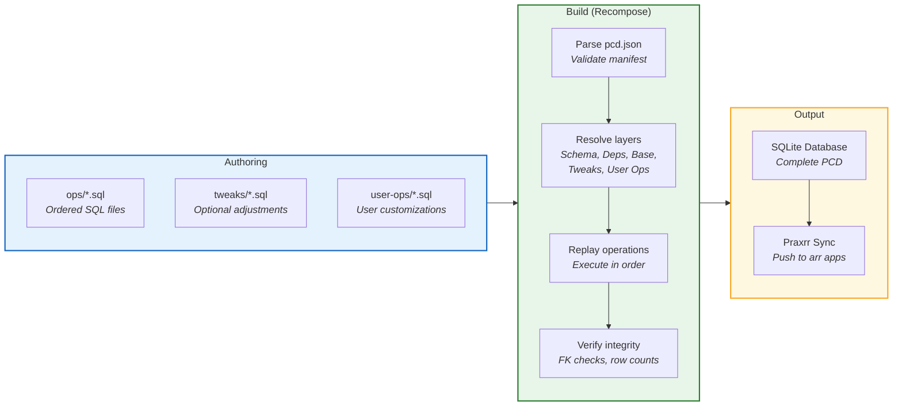

### Why PCDs Exist

Traditional configuration management for arr applications relies on exporting and importing JSON
blobs or manually editing settings through web interfaces. This approach has critical shortcomings:

- **No version history.** A JSON export is a snapshot. There is no record of what changed, when, or
  why.
- **No composability.** Two people cannot independently modify configurations and merge them without
  manual, error-prone diffing.
- **No conflict detection.** If an upstream profile changes a score from 400 to 500, and a user has
  locally changed it to 600, there is no mechanism to surface this conflict.
- **No layering.** There is no way to separate the base schema from shipped content from user
  customizations.

PCDs address all of these by treating the database as a **build artifact** produced by an ordered
sequence of idempotent, append-only SQL operations. The operations are the source of truth, not the
resulting database.

### Core Principles

| Principle          | Description                                                              |
| ------------------ | ------------------------------------------------------------------------ |
| **Operational**    | The database is defined by its build operations, not its final state     |
| **Append-only**    | Operations are never edited or deleted; new operations override old ones |
| **Ordered**        | Operations execute in a strict, defined sequence                         |
| **Replayable**     | Anyone can rebuild the database identically by replaying operations      |
| **Conflict-aware** | Value guards make upstream/downstream conflicts explicit                 |
| **Layered**        | Schema, content, tweaks, and user ops are cleanly separated              |

---

## 2. Operational SQL (OSQL)

### Overview

**Operational SQL (OSQL)** is the append-only, ordered, replayable approach to database construction
used by all PCDs. Instead of storing final data and applying migrations, OSQL stores the complete
history of operations that produce the data. This gives what we call **Mutable Immutability**:
history is immutable, but results are mutable because new operations can always be appended to
override earlier effects.

### The Four Properties

1. **Append-only.** Once an operation exists, it is never edited or deleted. To change behavior, a
   new operation is appended that overrides the effect of the earlier one.

2. **Ordered.** Operations run in a strictly defined order. File names encode this order (e.g.,
   `0.schema.sql`, `1.languages.sql`, `2.qualities.sql`). Within a file, statements execute
   top-to-bottom. Later operations can override the effects of earlier ones.

3. **Replayable.** Anyone can rebuild the database by replaying all operations in order against a
   fresh SQLite file. The result is deterministic: the same operations always produce the same
   database.

4. **Relational.** Operations target real tables, columns, and rows. Standard relational constraints
   (foreign keys, CHECK constraints, UNIQUE constraints) are enforced throughout the replay process.
   This means operations that violate constraints will fail loudly rather than silently corrupt
   data.

### How Replay Works

The replay process transforms a set of ordered SQL operation files into a complete, usable SQLite
database. Each layer's operations execute in sequence, building upon the results of the previous
layer.

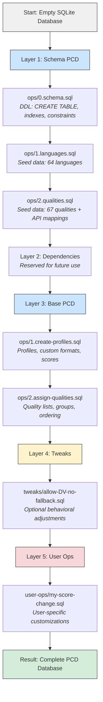

The detailed replay process shows what happens internally during each phase of execution.

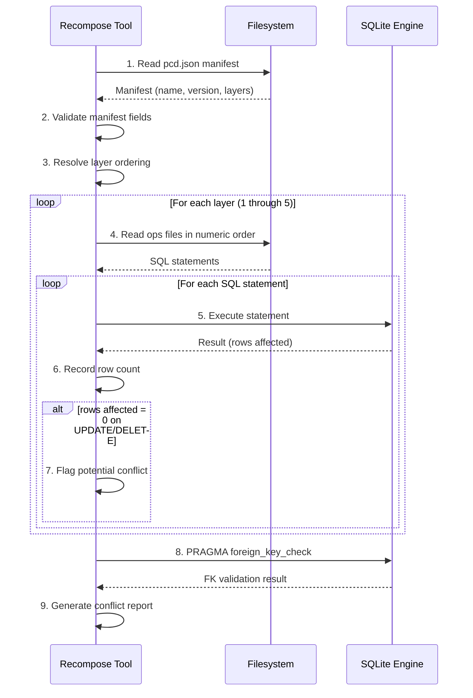

### OSQL Operation Types

Operations within OSQL files are standard SQL statements, but they follow specific conventions.
The following table describes each operation type with concrete examples from the schema.

| Operation      | Purpose                           | Example                                       |
| -------------- | --------------------------------- | --------------------------------------------- |
| `CREATE TABLE` | Define schema structure           | Used in the Schema layer only                 |
| `INSERT`       | Add new data                      | Adding a quality profile, language, or format |
| `UPDATE`       | Override a previous value         | Changing a score, toggling a flag             |
| `DELETE`       | Remove data from a previous layer | Removing a quality from a profile             |

#### CREATE TABLE Examples

Schema definitions use `CREATE TABLE` with all constraints inline. Every table includes an
autoincrement `id` for internal use, a UNIQUE `name` for stable references, and timestamp columns
for metadata.

```sql
-- From ops/0.schema.sql: Core entity with no FK dependencies
CREATE TABLE tags (
    id INTEGER PRIMARY KEY AUTOINCREMENT,
    name VARCHAR(50) UNIQUE NOT NULL,
    created_at TEXT NOT NULL DEFAULT CURRENT_TIMESTAMP
);

-- From ops/0.schema.sql: Junction table with composite PK
CREATE TABLE quality_profile_custom_formats (
    quality_profile_name VARCHAR(100) NOT NULL,
    custom_format_name VARCHAR(100) NOT NULL,
    arr_type VARCHAR(20) NOT NULL,  -- 'radarr', 'sonarr', 'all'
    score INTEGER NOT NULL,
    PRIMARY KEY (quality_profile_name, custom_format_name, arr_type),
    FOREIGN KEY (quality_profile_name) REFERENCES quality_profiles(name)
        ON DELETE CASCADE ON UPDATE CASCADE,
    FOREIGN KEY (custom_format_name) REFERENCES custom_formats(name)
        ON DELETE CASCADE ON UPDATE CASCADE
);
```

#### INSERT Examples

Inserts add new entities and relationships. Seed data operations insert foundational reference data
that downstream PCDs depend on.

```sql
-- From ops/1.languages.sql: Seeding core reference data
INSERT INTO languages (name) VALUES
('Unknown'),
('English'),
('French'),
('Spanish'),
('German');

-- From ops/2.qualities.sql: Seeding with arr-specific API mappings
INSERT INTO quality_api_mappings (quality_name, arr_type, api_name)
SELECT name, 'sonarr', 'Bluray-1080p Remux'
FROM qualities WHERE name = 'Remux-1080p';

-- Base PCD: Creating a quality profile
INSERT INTO quality_profiles (name, upgrades_allowed, minimum_custom_format_score, upgrade_until_score)
VALUES ('1080p Quality HDR', 1, 0, 10000);

-- Base PCD: Assigning a custom format score
INSERT INTO quality_profile_custom_formats
    (quality_profile_name, custom_format_name, arr_type, score)
VALUES ('1080p Quality HDR', 'Dolby Atmos', 'all', 400);
```

#### UPDATE Examples

Updates override values established by earlier operations. In OSQL, you never edit the original
INSERT. You append an UPDATE that changes the resulting state.

```sql
-- Tweak: Override a score from the Base PCD
UPDATE quality_profile_custom_formats
SET score = 1200
WHERE quality_profile_name = '1080p Quality HDR'
  AND custom_format_name = 'Dolby Atmos'
  AND arr_type = 'all';

-- User Op: Disable upgrades for a profile
UPDATE quality_profiles
SET upgrades_allowed = 0
WHERE name = '1080p Quality HDR';

-- User Op with value guard: Change minimum CF score (expects current = 0)
UPDATE quality_profiles
SET minimum_custom_format_score = 100
WHERE name = '1080p Quality HDR'
  AND minimum_custom_format_score = 0;  -- Value guard
```

#### DELETE Examples

Deletes remove data established by earlier operations. Because FKs use `ON DELETE CASCADE`, deleting
a parent entity removes all related junction table rows.

```sql
-- Tweak: Remove a quality from a profile's quality list
DELETE FROM quality_profile_qualities
WHERE quality_profile_name = '1080p Quality HDR'
  AND quality_name = 'CAM';

-- User Op: Remove a custom format scoring entry
DELETE FROM quality_profile_custom_formats
WHERE quality_profile_name = '1080p Quality HDR'
  AND custom_format_name = 'Bad Dual Groups'
  AND arr_type = 'radarr';
```

### Mutable Immutability in Practice

Consider a score assignment in a Base PCD:

```sql
-- Base PCD: ops/1.create-profiles.sql
INSERT INTO quality_profile_custom_formats
    (quality_profile_name, custom_format_name, arr_type, score)
VALUES ('1080p Quality HDR', 'Dolby Atmos', 'all', 400);
```

A later Tweak can override this without editing the original:

```sql
-- Tweak: tweaks/boost-atmos.sql
UPDATE quality_profile_custom_formats
SET score = 1200
WHERE quality_profile_name = '1080p Quality HDR'
  AND custom_format_name = 'Dolby Atmos'
  AND arr_type = 'all';
```

The original INSERT still exists in the operation history. The UPDATE is appended after it. On
replay, both execute in order: the INSERT creates the row, and the UPDATE modifies it. The final
database has a score of 1200.

A user can then override the tweak:

```sql
-- User Op: user-ops/my-atmos-preference.sql
UPDATE quality_profile_custom_formats
SET score = 2000
WHERE quality_profile_name = '1080p Quality HDR'
  AND custom_format_name = 'Dolby Atmos'
  AND arr_type = 'all'
  AND score = 1200;  -- Value guard: expects the tweak's value
```

The final state after all three layers: score = 2000. If the tweak author later changes 1200 to
1500, the user op's value guard (`AND score = 1200`) will match zero rows, surfacing the conflict.

---

## 3. Change-Driven Development (CDD)

### Overview

**Change-Driven Development (CDD)** is the workflow for producing OSQL operations. Every operation
originates from a concrete, describable change. CDD enforces discipline: you never open an editor
and start writing SQL. You start from a change, express it as an operation, and append it to the
correct layer.

### The CDD Workflow

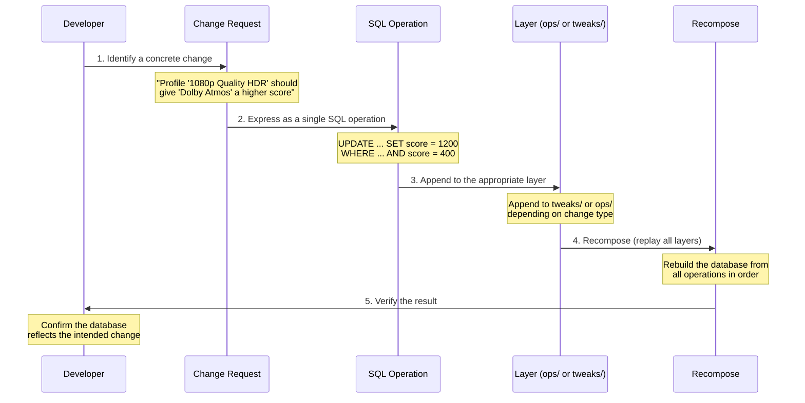

### Step-by-Step Breakdown

**Step 1: Start from a change.** Every operation begins with a concrete, human-readable description
of what needs to change. Examples:

- "Profile '1080p Quality HDR' should give 'Dolby Atmos' a higher score."
- "Add a new custom format for 'DTS-HD MA' audio."
- "Disable 'CAM' quality in all profiles."
- "Add French as a required language in the 'Multi-Language HD' profile."
- "Set preferred file size for Bluray-1080p to 15 GB in Radarr quality definitions."

**Step 2: Express as a single SQL operation.** The change is translated into exactly one SQL
statement. This operation includes a **value guard** when overriding an existing value:

```sql
UPDATE quality_profile_custom_formats
SET score = 1200
WHERE quality_profile_name = '1080p Quality HDR'
  AND custom_format_name = 'Dolby Atmos'
  AND arr_type = 'all'
  AND score = 400;  -- Value guard: expected previous value
```

The value guard (`AND score = 400`) is critical. If the upstream Base PCD changes the score from 400
to 500 in a new version, this UPDATE will affect zero rows. The recompose tool detects this and
alerts the user to the conflict.

**Step 3: Append to the appropriate layer.** The operation is appended to a file in the correct
layer directory. Schema changes go to `ops/` in the Schema PCD. Profile data goes to `ops/` in a
Base PCD. Optional adjustments go to `tweaks/`. User customizations go to user ops.

**Step 4: Recompose.** The database is rebuilt from scratch by replaying all operations across all
layers in order. This is a full rebuild, not an incremental migration.

**Step 5: Verify.** The developer confirms that the resulting database reflects the intended change.

### Value Guards and Conflict Detection

Value guards are the mechanism that makes CDD conflict-aware. By asserting the expected current
value of a field in the WHERE clause, an UPDATE will silently fail (affect zero rows) if the
upstream value has changed. The recompose tool tracks affected row counts and flags operations that
affected zero rows as potential conflicts.

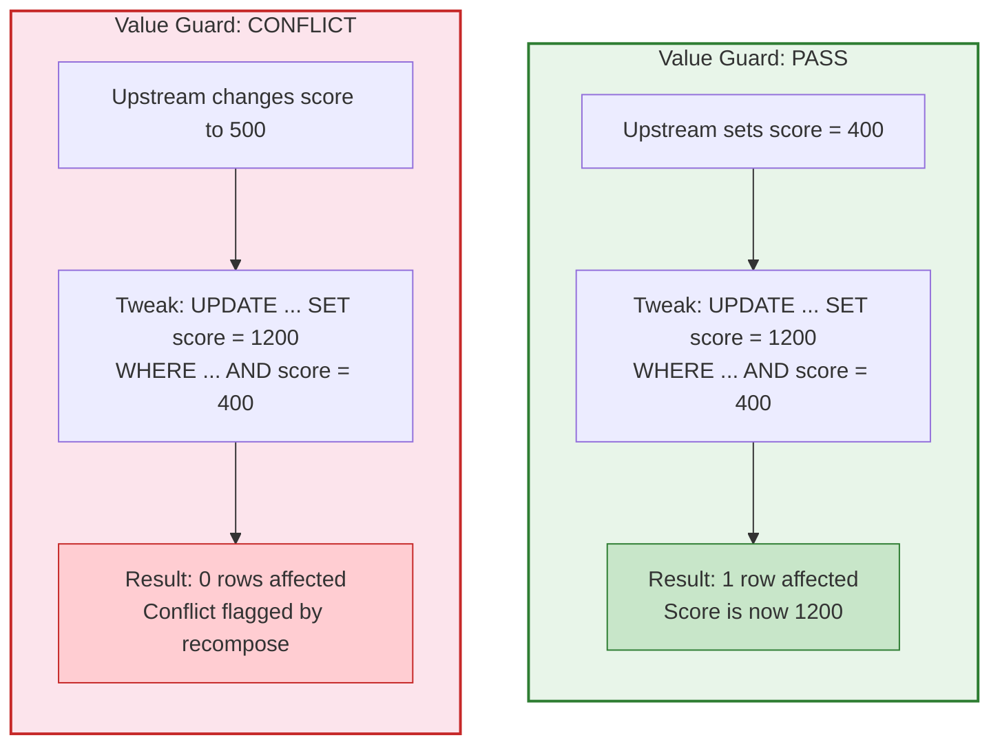

```sql
-- This will affect 0 rows if upstream changed score from 400 to 500
UPDATE quality_profile_custom_formats
SET score = 1200
WHERE quality_profile_name = '1080p Quality HDR'
  AND custom_format_name = 'Dolby Atmos'
  AND score = 400;  -- Guard: breaks if upstream changes this value
```

This approach is intentionally strict. False positives (flagged conflicts that turn out to be fine)
are preferable to silent data corruption.

### Multi-Step Change Scenarios

Some logical changes require multiple SQL operations executed in sequence. CDD handles these by
appending multiple statements to the same file, maintaining the single-file-per-change principle.

**Scenario: Adding a new custom format with conditions and scoring**

This requires inserting the format, its conditions, the condition type data, and the profile
scoring in the correct order (respecting FK dependencies).

```sql
-- Step 1: Create the custom format
INSERT INTO custom_formats (name, description)
VALUES ('DTS-HD MA', 'Matches DTS-HD Master Audio tracks');

-- Step 2: Create the regex it will use
INSERT INTO regular_expressions (name, pattern)
VALUES ('DTS-HD MA Pattern', '(?i)\bDTS[-. ]?HD[-. ]?MA\b');

-- Step 3: Create the parent condition
INSERT INTO custom_format_conditions (custom_format_name, name, type)
VALUES ('DTS-HD MA', 'Has DTS-HD MA', 'pattern');

-- Step 4: Create the child condition (dispatches to condition_patterns)
INSERT INTO condition_patterns (custom_format_name, condition_name, regular_expression_name)
VALUES ('DTS-HD MA', 'Has DTS-HD MA', 'DTS-HD MA Pattern');

-- Step 5: Score it in a profile
INSERT INTO quality_profile_custom_formats
    (quality_profile_name, custom_format_name, arr_type, score)
VALUES ('1080p Quality HDR', 'DTS-HD MA', 'all', 500);
```

**Scenario: Resolving a conflict after upstream version upgrade**

When a value guard fires (0 rows affected), the developer must review the upstream change, decide
on the correct value, and write a new operation without the stale guard.

```sql
-- Original user op (now conflicting because upstream changed 400 to 500):
-- UPDATE quality_profile_custom_formats
-- SET score = 1200
-- WHERE ... AND score = 400;  -- 0 rows: guard failed

-- Resolution: new op that accounts for the upstream change
UPDATE quality_profile_custom_formats
SET score = 1200
WHERE quality_profile_name = '1080p Quality HDR'
  AND custom_format_name = 'Dolby Atmos'
  AND arr_type = 'all'
  AND score = 500;  -- Updated guard reflects new upstream value
```

---

## 4. Layers

### Overview

PCDs run in layers. Every layer is independently append-only, but later layers can override the
effects of earlier ones. Layers provide clean separation of concerns: structure, content,
customization, and user personalization each have a designated place.

### Layer Ordering and Override Relationships

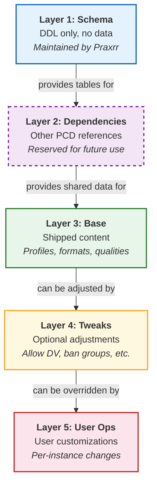

### Layer Descriptions

#### Layer 1: Schema

The Schema layer contains all DDL (Data Definition Language) for the PCD system. It creates tables,
foreign keys, indexes, CHECK constraints, and UNIQUE constraints. It contains **no data**. This
layer is created and maintained by the Praxrr project itself and is shared by all PCDs.

The Schema PCD (`praxrr-schema`) also includes seed data operations for foundational reference data:

| Operation File    | Content                                          | Record Count |
| ----------------- | ------------------------------------------------ | ------------ |
| `0.schema.sql`    | All 36 table definitions, indexes, constraints   | 36 tables    |
| `1.languages.sql` | 64 languages sourced from Radarr/Sonarr upstream | 64 rows      |
| `2.qualities.sql` | 67 qualities + arr-specific API name mappings    | 67 + 90 rows |

**What goes in this layer:**

- `CREATE TABLE` statements for all entity tables
- `CREATE INDEX` and `CREATE UNIQUE INDEX` statements
- CHECK constraints for enum-like columns
- Foreign key definitions with `ON DELETE CASCADE ON UPDATE CASCADE`
- Seed data for languages (sourced from Radarr/Sonarr upstream `Language.cs`)
- Seed data for qualities (31 video qualities from Radarr/Sonarr, 36 audio qualities from Lidarr)
- Quality API mappings (30 Radarr, 22 Sonarr, 38 Lidarr)

**What does NOT go in this layer:**

- Quality profiles, custom formats, or any content-level data
- Application-specific configurations (naming, media settings)
- Any data that varies between PCDs

#### Layer 2: Dependencies

Reserved for future use. When implemented (post-2.0), this layer will allow PCDs to compose with
other PCDs, importing shared definitions without duplication. See
[Section 9: Dependencies](#9-dependencies) for details.

**Anticipated use cases:**

- A shared "HDR Formats" PCD that defines common HDR-related custom formats and regex patterns
- A shared "Audio Formats" PCD with DTS, Atmos, and TrueHD format definitions
- Regional language packs with pre-configured language profiles

#### Layer 3: Base

The Base layer contains the actual shipped content of a PCD: quality profiles, custom format
definitions, scoring assignments, quality ordering, and all other configuration data. This is the
primary content layer that defines what a PCD provides.

**What goes in this layer:**

- Quality profile definitions with upgrade settings
- Custom format definitions with conditions and regex patterns
- Custom format scoring per profile (per arr type when needed)
- Quality group definitions and member assignments
- Quality ordering within profiles (position, enabled, upgrade_until)
- Language assignments per profile
- Tag assignments to profiles, formats, and regex patterns
- Quality definitions (size limits) for Radarr/Sonarr/Lidarr
- Naming configurations per arr type
- Media settings per arr type
- Delay profile configurations
- Custom format test cases
- Test entities and test releases

**Example operations in a Base PCD:**

```sql
-- ops/1.create-profiles.sql
INSERT INTO quality_profiles
    (name, description, upgrades_allowed, minimum_custom_format_score, upgrade_until_score)
VALUES ('1080p Quality HDR', 'Prefer 1080p with HDR scoring', 1, 0, 10000);

INSERT INTO quality_profiles
    (name, description, upgrades_allowed, minimum_custom_format_score, upgrade_until_score)
VALUES ('2160p REMUX HDR', 'Target 4K REMUX with HDR preference', 1, 100, 20000);

-- ops/2.assign-qualities.sql
INSERT INTO quality_profile_qualities
    (quality_profile_name, quality_name, position, enabled, upgrade_until)
VALUES ('1080p Quality HDR', 'Bluray-1080p', 1, 1, 0);

INSERT INTO quality_profile_qualities
    (quality_profile_name, quality_name, position, enabled, upgrade_until)
VALUES ('1080p Quality HDR', 'Remux-1080p', 2, 1, 1);  -- upgrade ceiling

-- ops/3.custom-formats.sql
INSERT INTO custom_formats (name, description)
VALUES ('Dolby Vision', 'Matches releases with Dolby Vision HDR');

INSERT INTO regular_expressions (name, pattern)
VALUES ('DV Pattern', '(?i)\b(DV|DoVi|Dolby[-. ]?Vision)\b');

INSERT INTO custom_format_conditions (custom_format_name, name, type)
VALUES ('Dolby Vision', 'Has DV', 'pattern');

INSERT INTO condition_patterns (custom_format_name, condition_name, regular_expression_name)
VALUES ('Dolby Vision', 'Has DV', 'DV Pattern');
```

#### Layer 4: Tweaks

Tweaks are optional, append-only operations that adjust the behavior of the Base layer. They allow
PCD authors to ship optional modifications that users can selectively apply. Examples:

- `allow-DV-no-fallback.sql` -- Enable Dolby Vision without HDR10 fallback requirement
- `ban-megusta.sql` -- Block a specific release group
- `boost-atmos.sql` -- Increase the score for Dolby Atmos audio

Tweaks are separate files that users opt into. They are not applied by default.

**Example tweak file:**

```sql
-- tweaks/boost-atmos.sql
-- Increases Dolby Atmos scoring from 400 to 1200 across all profiles that use it

UPDATE quality_profile_custom_formats
SET score = 1200
WHERE custom_format_name = 'Dolby Atmos'
  AND arr_type = 'all'
  AND score = 400;  -- Value guard: only override the default score
```

**Example tweak: banning a release group**

```sql
-- tweaks/ban-megusta.sql
-- Adds a custom format that penalizes releases from the MeGusta group

INSERT INTO custom_formats (name, description)
VALUES ('Bad Release Group: MeGusta', 'Penalize MeGusta releases');

INSERT INTO regular_expressions (name, pattern)
VALUES ('MeGusta Group', '(?i)\bMeGusta\b');

INSERT INTO custom_format_conditions (custom_format_name, name, type)
VALUES ('Bad Release Group: MeGusta', 'Is MeGusta', 'pattern');

INSERT INTO condition_patterns (custom_format_name, condition_name, regular_expression_name)
VALUES ('Bad Release Group: MeGusta', 'Is MeGusta', 'MeGusta Group');

-- Score it negatively in all profiles
INSERT INTO quality_profile_custom_formats
    (quality_profile_name, custom_format_name, arr_type, score)
VALUES ('1080p Quality HDR', 'Bad Release Group: MeGusta', 'all', -10000);
```

#### Layer 5: User Ops

User operations are customizations created for a specific instantiation of a database. They make
heavy use of value guards to detect conflicts when the upstream Base or Tweaks layers change. User
ops are the most volatile layer and are expected to require review when upgrading to a new PCD
version.

**Example user op:**

```sql
-- user-ops/my-score-tweaks.sql
-- Personal preference: boost Atmos even higher than the tweak

UPDATE quality_profile_custom_formats
SET score = 2000
WHERE quality_profile_name = '1080p Quality HDR'
  AND custom_format_name = 'Dolby Atmos'
  AND arr_type = 'all'
  AND score = 1200;  -- Guard: expects the tweak's value, not the base's

-- Personal preference: require a minimum CF score for upgrades
UPDATE quality_profiles
SET minimum_custom_format_score = 50
WHERE name = '1080p Quality HDR'
  AND minimum_custom_format_score = 0;  -- Guard: expects the base default
```

---

## 5. Repository Layout

### Schema PCD Repository

The Schema PCD (`praxrr-schema`) is the foundation that all other PCDs build upon. Its repository
structure reflects its role as the structural base.

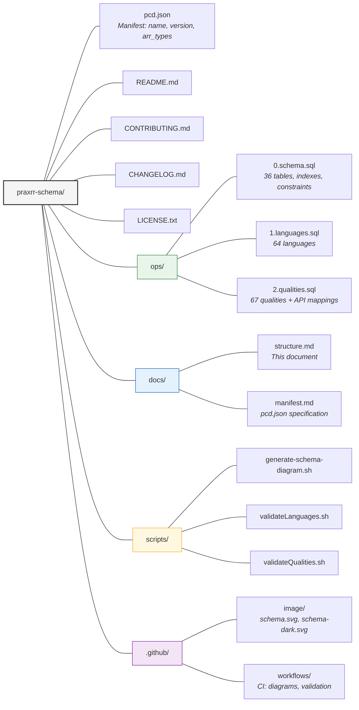

### Generic PCD Repository

A typical Base PCD repository follows the same structure with content-specific operations and
optional tweaks.

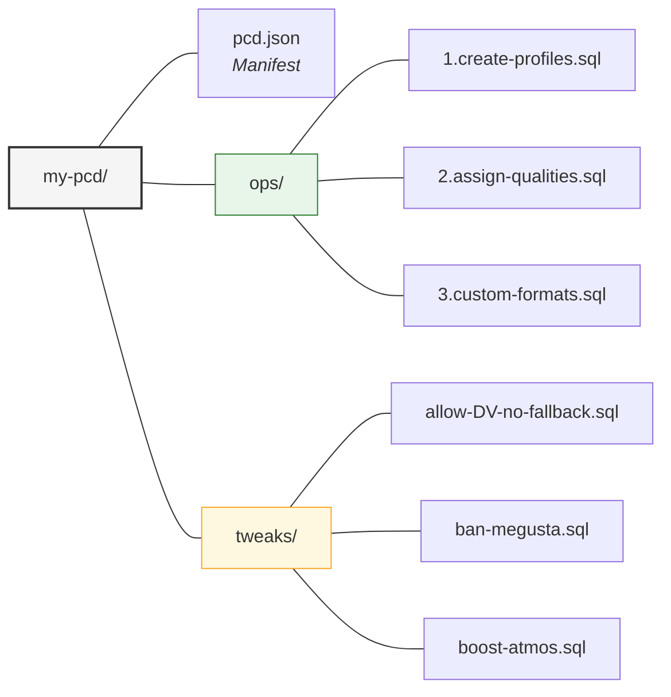

### The Manifest (`pcd.json`)

Every PCD repository contains a `pcd.json` manifest at the root. For the Schema PCD:

```json
{
  "name": "schema",
  "version": "1.0.0",
  "description": "Base schema for all Praxrr Compliant Databases",
  "arr_types": ["radarr", "sonarr", "lidarr"],
  "authors": [{ "name": "yandy-r" }],
  "license": "MIT",
  "repository": "https://github.com/yandy-r/praxrr-schema",
  "praxrr": { "minimum_version": "2.0.0" }
}
```

The manifest declares the PCD's identity, supported arr types, and the minimum Praxrr version
required for compatibility. See [`docs/manifest.md`](manifest.md) for the full specification,
including required fields, validation rules, and versioning guidelines.

---

## 6. Schema Architecture

The Schema PCD defines **36 tables** organized into six functional groups. These groups reflect the
dependency hierarchy: Core Entities have no foreign key dependencies, Dependent Entities reference
Core Entities, Junction Tables connect entities, and so on.

### Table Group Overview

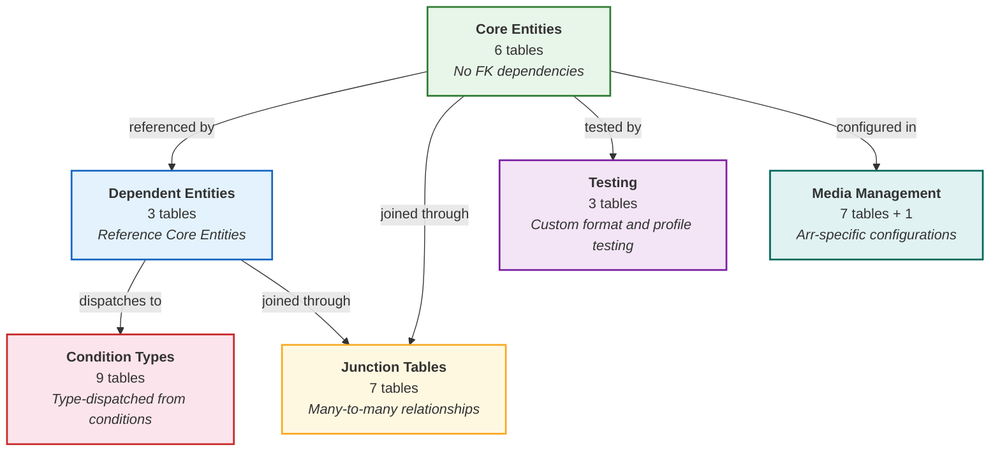

### Foreign Key Dependency Graph

The following diagram shows every foreign key relationship in the schema. Arrows point from the
referencing table (child) to the referenced table (parent).

```mermaid
graph TD
    subgraph core["Core Entities"]
        tags["tags"]
        languages["languages"]
        regex["regular_expressions"]
        qualities["qualities"]
        cf["custom_formats"]
    end

    subgraph dependent["Dependent Entities"]
        qp["quality_profiles"]
        qg["quality_groups"]
        cfc["custom_format_conditions"]
    end

    subgraph junction["Junction Tables"]
        ret["regular_expression_tags"]
        cft["custom_format_tags"]
        qpt["quality_profile_tags"]
        qpl["quality_profile_languages"]
        qgm["quality_group_members"]
        qpq["quality_profile_qualities"]
        qpcf["quality_profile_custom_formats"]
    end

    subgraph condition["Condition Type Tables"]
        cp["condition_patterns"]
        cl["condition_languages"]
        ci["condition_indexer_flags"]
        cs["condition_sources"]
        cr["condition_resolutions"]
        cqm["condition_quality_modifiers"]
        csz["condition_sizes"]
        crt["condition_release_types"]
        cy["condition_years"]
    end

    subgraph testing["Testing Tables"]
        cft2["custom_format_tests"]
        te["test_entities"]
        tr["test_releases"]
    end

    subgraph media["Media Management"]
        rqd["radarr_quality_definitions"]
        sqd["sonarr_quality_definitions"]
        lqd["lidarr_quality_definitions"]
        qam["quality_api_mappings"]
    end

    %% Dependent -> Core
    qg -->|"quality_profile_name"| qp
    cfc -->|"custom_format_name"| cf

    %% Junction -> Core
    ret -->|"regular_expression_name"| regex
    ret -->|"tag_name"| tags
    cft -->|"custom_format_name"| cf
    cft -->|"tag_name"| tags
    qpt -->|"quality_profile_name"| qp
    qpt -->|"tag_name"| tags
    qpl -->|"quality_profile_name"| qp
    qpl -->|"language_name"| languages
    qgm -->|"(profile, group)"| qg
    qgm -->|"quality_name"| qualities
    qpq -->|"quality_profile_name"| qp
    qpq -->|"quality_name"| qualities
    qpq -->|"(profile, group)"| qg
    qpcf -->|"quality_profile_name"| qp
    qpcf -->|"custom_format_name"| cf

    %% Condition Types -> Conditions
    cp -->|"(format, condition)"| cfc
    cl -->|"(format, condition)"| cfc
    ci -->|"(format, condition)"| cfc
    cs -->|"(format, condition)"| cfc
    cr -->|"(format, condition)"| cfc
    cqm -->|"(format, condition)"| cfc
    csz -->|"(format, condition)"| cfc
    crt -->|"(format, condition)"| cfc
    cy -->|"(format, condition)"| cfc

    %% Condition Types -> Core
    cp -->|"regular_expression_name"| regex
    cl -->|"language_name"| languages

    %% Testing
    cft2 -->|"custom_format_name"| cf
    tr -->|"(type, tmdb_id)"| te

    %% Media Management -> Core
    rqd -->|"quality_name"| qualities
    sqd -->|"quality_name"| qualities
    lqd -->|"quality_name"| qualities
    qam -->|"quality_name"| qualities

    style core fill:#e8f5e9,stroke:#2e7d32,stroke-width:2px
    style dependent fill:#e3f2fd,stroke:#1565c0,stroke-width:2px
    style junction fill:#fff8e1,stroke:#f9a825,stroke-width:2px
    style condition fill:#fce4ec,stroke:#c62828,stroke-width:2px
    style testing fill:#f3e5f5,stroke:#7b1fa2,stroke-width:2px
    style media fill:#e0f2f1,stroke:#00695c,stroke-width:2px
```

### Entity-Relationship Diagram

The following diagram shows the major tables, their key columns, and the relationships between them.

```mermaid
erDiagram
    tags {
        INTEGER id PK
        VARCHAR name UK
    }
    languages {
        INTEGER id PK
        VARCHAR name UK
    }
    regular_expressions {
        INTEGER id PK
        VARCHAR name UK
        TEXT pattern
        VARCHAR regex101_id
    }
    qualities {
        INTEGER id PK
        VARCHAR name UK
    }
    quality_api_mappings {
        VARCHAR quality_name PK_FK
        VARCHAR arr_type PK
        VARCHAR api_name
    }
    custom_formats {
        INTEGER id PK
        VARCHAR name UK
        TEXT description
        INTEGER include_in_rename
    }

    quality_profiles {
        INTEGER id PK
        VARCHAR name UK
        INTEGER upgrades_allowed
        INTEGER minimum_custom_format_score
        INTEGER upgrade_until_score
        INTEGER upgrade_score_increment
    }
    quality_groups {
        INTEGER id PK
        VARCHAR quality_profile_name FK
        VARCHAR name
    }
    custom_format_conditions {
        INTEGER id PK
        VARCHAR custom_format_name FK
        VARCHAR name
        VARCHAR type
        VARCHAR arr_type
        INTEGER negate
        INTEGER required
    }

    regular_expression_tags {
        VARCHAR regular_expression_name PK_FK
        VARCHAR tag_name PK_FK
    }
    custom_format_tags {
        VARCHAR custom_format_name PK_FK
        VARCHAR tag_name PK_FK
    }
    quality_profile_tags {
        VARCHAR quality_profile_name PK_FK
        VARCHAR tag_name PK_FK
    }
    quality_profile_languages {
        VARCHAR quality_profile_name PK_FK
        VARCHAR language_name PK_FK
        VARCHAR type
    }
    quality_group_members {
        VARCHAR quality_profile_name PK_FK
        VARCHAR quality_group_name PK_FK
        VARCHAR quality_name PK_FK
    }
    quality_profile_qualities {
        INTEGER id PK
        VARCHAR quality_profile_name FK
        VARCHAR quality_name FK
        VARCHAR quality_group_name FK
        INTEGER position
        INTEGER enabled
        INTEGER upgrade_until
    }
    quality_profile_custom_formats {
        VARCHAR quality_profile_name PK_FK
        VARCHAR custom_format_name PK_FK
        VARCHAR arr_type PK
        INTEGER score
    }

    condition_patterns {
        VARCHAR custom_format_name PK_FK
        VARCHAR condition_name PK_FK
        VARCHAR regular_expression_name FK
    }
    condition_languages {
        VARCHAR custom_format_name PK_FK
        VARCHAR condition_name PK_FK
        VARCHAR language_name FK
    }
    condition_indexer_flags {
        VARCHAR custom_format_name PK_FK
        VARCHAR condition_name PK_FK
        VARCHAR flag
    }
    condition_sources {
        VARCHAR custom_format_name PK_FK
        VARCHAR condition_name PK_FK
        VARCHAR source
    }
    condition_resolutions {
        VARCHAR custom_format_name PK_FK
        VARCHAR condition_name PK_FK
        VARCHAR resolution
    }
    condition_quality_modifiers {
        VARCHAR custom_format_name PK_FK
        VARCHAR condition_name PK_FK
        VARCHAR quality_modifier
    }
    condition_sizes {
        VARCHAR custom_format_name PK_FK
        VARCHAR condition_name PK_FK
        INTEGER min_bytes
        INTEGER max_bytes
    }
    condition_release_types {
        VARCHAR custom_format_name PK_FK
        VARCHAR condition_name PK_FK
        VARCHAR release_type
    }
    condition_years {
        VARCHAR custom_format_name PK_FK
        VARCHAR condition_name PK_FK
        INTEGER min_year
        INTEGER max_year
    }

    custom_format_tests {
        INTEGER id PK
        VARCHAR custom_format_name FK
        TEXT title
        VARCHAR type
        INTEGER should_match
    }
    test_entities {
        INTEGER id PK
        TEXT type
        INTEGER tmdb_id
        TEXT title
    }
    test_releases {
        INTEGER id PK
        TEXT entity_type FK
        INTEGER entity_tmdb_id FK
        TEXT title
    }

    radarr_quality_definitions {
        VARCHAR name PK
        VARCHAR quality_name PK_FK
        INTEGER min_size
        INTEGER max_size
        INTEGER preferred_size
    }
    sonarr_quality_definitions {
        VARCHAR name PK
        VARCHAR quality_name PK_FK
        INTEGER min_size
        INTEGER max_size
        INTEGER preferred_size
    }
    lidarr_quality_definitions {
        VARCHAR name PK
        VARCHAR quality_name PK_FK
        INTEGER min_size
        INTEGER max_size
        INTEGER preferred_size
    }
    delay_profiles {
        INTEGER id PK
        VARCHAR name UK
        VARCHAR preferred_protocol
        INTEGER usenet_delay
        INTEGER torrent_delay
    }

    qualities ||--o{ quality_api_mappings : "maps to arr APIs"
    quality_profiles ||--o{ quality_groups : "contains"
    custom_formats ||--o{ custom_format_conditions : "has"
    regular_expressions ||--o{ regular_expression_tags : "tagged"
    tags ||--o{ regular_expression_tags : "applied to"
    custom_formats ||--o{ custom_format_tags : "tagged"
    tags ||--o{ custom_format_tags : "applied to"
    quality_profiles ||--o{ quality_profile_tags : "tagged"
    tags ||--o{ quality_profile_tags : "applied to"
    quality_profiles ||--o{ quality_profile_languages : "uses"
    languages ||--o{ quality_profile_languages : "selected in"
    quality_groups ||--o{ quality_group_members : "contains"
    qualities ||--o{ quality_group_members : "member of"
    quality_profiles ||--o{ quality_profile_qualities : "orders"
    qualities ||--o{ quality_profile_qualities : "listed in"
    quality_groups ||--o{ quality_profile_qualities : "listed in"
    quality_profiles ||--o{ quality_profile_custom_formats : "scores"
    custom_formats ||--o{ quality_profile_custom_formats : "scored in"
    custom_format_conditions ||--o| condition_patterns : "type = pattern"
    custom_format_conditions ||--o| condition_languages : "type = language"
    custom_format_conditions ||--o| condition_indexer_flags : "type = indexer_flag"
    custom_format_conditions ||--o| condition_sources : "type = source"
    custom_format_conditions ||--o| condition_resolutions : "type = resolution"
    custom_format_conditions ||--o| condition_quality_modifiers : "type = quality_modifier"
    custom_format_conditions ||--o| condition_sizes : "type = size"
    custom_format_conditions ||--o| condition_release_types : "type = release_type"
    custom_format_conditions ||--o| condition_years : "type = year"
    condition_patterns }o--|| regular_expressions : "uses regex"
    condition_languages }o--|| languages : "checks language"
    custom_formats ||--o{ custom_format_tests : "tested by"
    test_entities ||--o{ test_releases : "has releases"
    qualities ||--o{ radarr_quality_definitions : "sized for radarr"
    qualities ||--o{ sonarr_quality_definitions : "sized for sonarr"
    qualities ||--o{ lidarr_quality_definitions : "sized for lidarr"
```

### Table Group Details

#### Core Entities (6 tables)

These tables have no foreign key dependencies and form the foundation of the schema. They can be
populated in any order.

| Table                  | Purpose                                          | Key Data                         |
| ---------------------- | ------------------------------------------------ | -------------------------------- |
| `tags`                 | Reusable labels applied to multiple entity types | name                             |
| `languages`            | Languages for profiles and conditions            | 64 entries from upstream         |
| `regular_expressions`  | Regex patterns with optional regex101 links      | name, pattern, regex101_id       |
| `qualities`            | Individual quality definitions                   | 67 entries (31 video + 36 audio) |
| `quality_api_mappings` | Maps canonical names to arr-specific API names   | (quality_name, arr_type)         |
| `custom_formats`       | Pattern/condition definitions for media matching | name, description                |

**Column-level detail:**

`tags` -- Minimal table for labeling. The `name` column is the only data column. Tags are applied
to regular expressions, custom formats, and quality profiles through dedicated junction tables.

```sql
CREATE TABLE tags (
    id INTEGER PRIMARY KEY AUTOINCREMENT,
    name VARCHAR(50) UNIQUE NOT NULL,
    created_at TEXT NOT NULL DEFAULT CURRENT_TIMESTAMP
);
```

`languages` -- Seeded with 64 languages sourced from the Radarr and Sonarr `Language.cs` source
files. Includes special values `Unknown`, `Any`, and `Original` alongside standard languages like
`English`, `French`, `Japanese`, etc. The `name` column serves as the FK target for
`quality_profile_languages` and `condition_languages`.

`regular_expressions` -- Stores named regex patterns used in pattern-type conditions. The
`regex101_id` column provides an optional link to regex101.com for interactive pattern testing.
The `description` column documents the pattern's purpose.

`qualities` -- Contains 31 video qualities (from `Unknown` through `Raw-HD`) and 36 audio qualities
(from `MP3-8` through `WAV`). Video qualities come from Radarr/Sonarr; audio qualities come from
Lidarr. The canonical `name` is used across all tables as the stable FK reference.

`quality_api_mappings` -- Translates canonical Praxrr quality names to arr-specific API names.
Most names are identical across applications, but some differ. For example, `Remux-1080p` in
Praxrr maps to `Bluray-1080p Remux` in Sonarr. Absence of a row means the quality does not
exist for that arr type.

`custom_formats` -- Defines pattern/condition groups for media matching. Each custom format has a
`name`, optional `description`, and an `include_in_rename` flag controlling whether the format
name appears in renamed filenames.

#### Dependent Entities (3 tables)

These tables reference Core Entities and establish the primary content hierarchy.

| Table                      | Depends On       | Purpose                                         |
| -------------------------- | ---------------- | ----------------------------------------------- |
| `quality_profiles`         | (standalone)     | Media acquisition strategy definitions          |
| `quality_groups`           | quality_profiles | Groups of equivalent qualities within a profile |
| `custom_format_conditions` | custom_formats   | Matching logic dispatched to type tables        |

**Column-level detail:**

`quality_profiles` -- Defines complete media acquisition strategies. Key columns:

| Column                        | Type    | Purpose                                                       |
| ----------------------------- | ------- | ------------------------------------------------------------- |
| `name`                        | VARCHAR | UNIQUE identifier, FK target for junction tables              |
| `description`                 | TEXT    | Human-readable description of the profile's purpose           |
| `upgrades_allowed`            | INTEGER | Boolean: whether Praxrr should upgrade existing downloads     |
| `minimum_custom_format_score` | INTEGER | Minimum CF score a release must achieve to be considered      |
| `upgrade_until_score`         | INTEGER | Stop upgrading once a release reaches this CF score           |
| `upgrade_score_increment`     | INTEGER | Minimum score improvement required for an upgrade (CHECK > 0) |

`quality_groups` -- Groups multiple qualities that are treated as equivalent within a single
profile. Groups are **profile-scoped**: the UNIQUE constraint is on
`(quality_profile_name, name)`, meaning two profiles can each have a group called "HD" with
different member qualities.

`custom_format_conditions` -- The parent table for the type-dispatched condition system. Each row
defines a condition that belongs to a custom format and dispatches to exactly one of nine child
tables based on the `type` column. The `arr_type` column scopes conditions to a specific arr
application or to all (`'all'`). The `negate` and `required` flags control matching logic.

#### Junction Tables (7 tables)

Junction tables implement many-to-many relationships using composite name-based primary keys.

| Table                            | Connects                            | Notable Columns                  |
| -------------------------------- | ----------------------------------- | -------------------------------- |
| `regular_expression_tags`        | regular_expressions + tags          |                                  |
| `custom_format_tags`             | custom_formats + tags               |                                  |
| `quality_profile_tags`           | quality_profiles + tags             |                                  |
| `quality_profile_languages`      | quality_profiles + languages        | type (must/only/not/simple)      |
| `quality_group_members`          | quality_groups + qualities          |                                  |
| `quality_profile_qualities`      | quality_profiles + qualities/groups | position, enabled, upgrade_until |
| `quality_profile_custom_formats` | quality_profiles + custom_formats   | arr_type, score                  |

The following diagram shows how junction tables connect core entities. Each junction table sits
between two entities, holding the composite key from both sides.

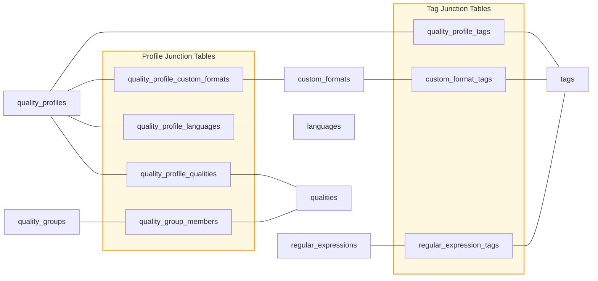

**Key junction table details:**

`quality_profile_languages` -- The `type` column controls language matching behavior:

| Type     | Behavior                                            |
| -------- | --------------------------------------------------- |
| `simple` | Default language preference (no enforcement)        |
| `must`   | Release must contain this language                  |
| `only`   | Release must contain only this language (exclusive) |
| `not`    | Release must not contain this language              |

`quality_profile_qualities` -- Orders qualities within a profile. Each row represents either a
single quality (`quality_name` is set, `quality_group_name` is NULL) or a quality group
(`quality_group_name` is set, `quality_name` is NULL). A CHECK constraint enforces that exactly
one of the two is set. The `position` column defines display and priority order. The
`upgrade_until` flag marks the quality ceiling for upgrades (at most one per profile, enforced by
a partial unique index).

`quality_profile_custom_formats` -- Assigns scores to custom formats within a profile. The
`arr_type` column allows different scores for the same format in different arr applications. For
example, a "DTS-HD MA" format might score 500 in Radarr but 0 in Sonarr.

### Quality Profile System

The quality profile system is the most complex relationship structure in the schema. A profile
defines a complete media acquisition strategy through four interconnected mechanisms: quality
ordering, quality grouping, language requirements, and custom format scoring.

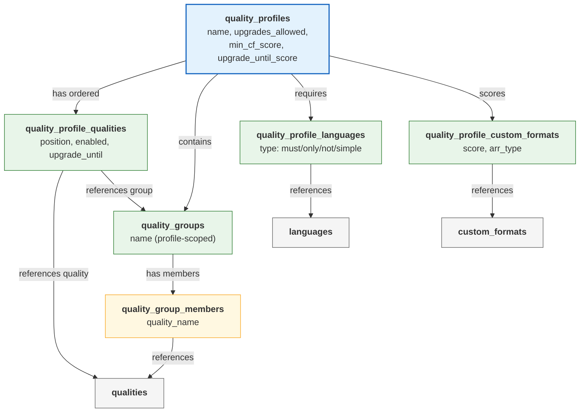

**How the pieces fit together:**

1. A **quality profile** defines the overall strategy (upgrade limits, minimum scores).
2. **Quality groups** bundle multiple qualities treated as equivalent (e.g., an "HD" group
   containing `HDTV-1080p`, `WEBDL-1080p`, `WEBRip-1080p`, and `Bluray-1080p`).
3. **Quality profile qualities** orders individual qualities and groups by priority (`position`),
   marks which are enabled, and designates the upgrade ceiling (`upgrade_until`).
4. **Quality profile languages** specifies language requirements for releases.
5. **Quality profile custom formats** assigns scores to custom formats, determining which release
   characteristics are preferred or penalized.

#### Testing Tables (3 tables)

The testing tables enable validation of custom format matching logic and quality profile behavior
against realistic data.

| Table                 | Purpose                                           |
| --------------------- | ------------------------------------------------- |
| `custom_format_tests` | Test cases validating custom format matching      |
| `test_entities`       | Movies/series from TMDB for profile testing       |
| `test_releases`       | Sample release titles for testing against formats |

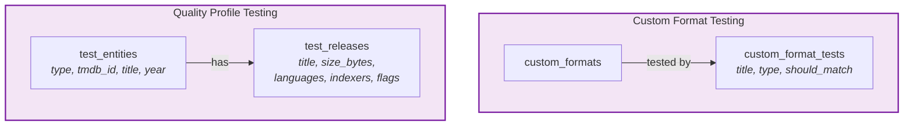

**Column-level detail:**

`custom_format_tests` -- Each test case belongs to a custom format and specifies a release title
that should or should not match. The `type` column (`movie` or `series`) sets the parser context.
The `should_match` flag (1 or 0) declares the expected result. The `description` column documents
which edge case the test covers. UNIQUE on `(custom_format_name, title, type)` prevents
duplicate tests.

```sql
-- Example: testing a Dolby Vision custom format
INSERT INTO custom_format_tests (custom_format_name, title, type, should_match, description)
VALUES ('Dolby Vision', 'Movie.2024.2160p.WEB-DL.DV.HDR.DDP5.1.H.265-GROUP', 'movie', 1,
        'Standard DV release with HDR fallback');

INSERT INTO custom_format_tests (custom_format_name, title, type, should_match, description)
VALUES ('Dolby Vision', 'Movie.2024.1080p.BluRay.x264-GROUP', 'movie', 0,
        'Standard 1080p BluRay without DV should not match');
```

`test_entities` -- Stores real movies and series from TMDB. The composite UNIQUE on
`(type, tmdb_id)` ensures each entity is registered once. Includes `year` and `poster_path` for
display purposes.

`test_releases` -- Sample releases attached to test entities via the composite FK
`(entity_type, entity_tmdb_id)`. The `languages`, `indexers`, and `flags` columns store JSON
arrays as TEXT, enabling flexible metadata without additional junction tables. An index on
`(entity_type, entity_tmdb_id)` optimizes lookups.

```sql
-- Example: registering a test entity and release
INSERT INTO test_entities (type, tmdb_id, title, year)
VALUES ('movie', 603, 'The Matrix', 1999);

INSERT INTO test_releases (entity_type, entity_tmdb_id, title, size_bytes, languages)
VALUES ('movie', 603, 'The.Matrix.1999.2160p.UHD.BluRay.REMUX.DV.HDR.DTS-HD.MA.7.1-GROUP',
        85899345920, '["English"]');
```

#### Media Management Tables (7 tables + 1)

Arr-specific configuration tables. These are separated by arr type because each application has
different configuration requirements.

| Table                        | Arr Type | Purpose                        |
| ---------------------------- | -------- | ------------------------------ |
| `radarr_quality_definitions` | Radarr   | Quality size limits for movies |
| `sonarr_quality_definitions` | Sonarr   | Quality size limits for series |
| `lidarr_quality_definitions` | Lidarr   | Quality size limits for music  |
| `radarr_naming`              | Radarr   | File/folder naming conventions |
| `sonarr_naming`              | Sonarr   | File/folder naming conventions |
| `radarr_media_settings`      | Radarr   | Propers/repacks, media info    |
| `sonarr_media_settings`      | Sonarr   | Propers/repacks, media info    |
| `delay_profiles`             | All      | Download timing and protocol   |

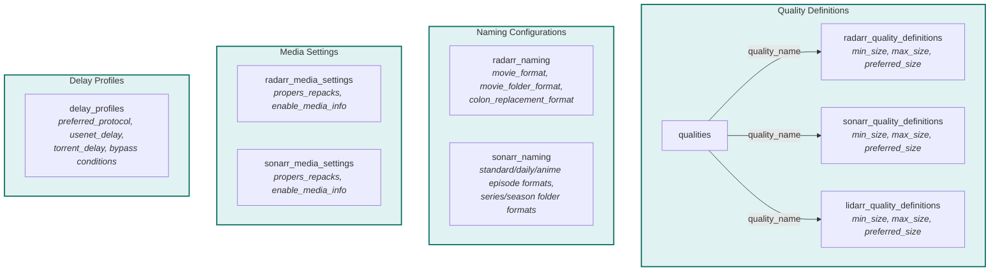

**Column-level detail for quality definitions:**

All three quality definition tables (`radarr_`, `sonarr_`, `lidarr_`) share the same structure.
The composite PK `(name, quality_name)` supports multiple named configurations (e.g., "default"
and "archival") each with different size limits per quality.

| Column           | Type    | Purpose                                          |
| ---------------- | ------- | ------------------------------------------------ |
| `name`           | VARCHAR | Configuration name (e.g., "default", "archival") |
| `quality_name`   | VARCHAR | FK to qualities table                            |
| `min_size`       | INTEGER | Minimum acceptable file size (MB/min for video)  |
| `max_size`       | INTEGER | Maximum acceptable file size                     |
| `preferred_size` | INTEGER | Ideal target file size                           |

**Column-level detail for naming tables:**

`radarr_naming` supports named configurations with movie-specific formatting:

| Column                       | Purpose                          | CHECK Constraint                                                |
| ---------------------------- | -------------------------------- | --------------------------------------------------------------- |
| `movie_format`               | Template for movie file names    |                                                                 |
| `movie_folder_format`        | Template for movie folder names  |                                                                 |
| `colon_replacement_format`   | How colons in titles are handled | `IN ('delete', 'dash', 'spaceDash', 'spaceDashSpace', 'smart')` |
| `replace_illegal_characters` | Replace OS-illegal characters    |                                                                 |

`sonarr_naming` has additional fields for series-specific formatting:

| Column                    | Purpose                                |
| ------------------------- | -------------------------------------- |
| `standard_episode_format` | Template for standard episodes         |
| `daily_episode_format`    | Template for daily/date-based episodes |
| `anime_episode_format`    | Template for anime episodes            |
| `series_folder_format`    | Template for series root folders       |
| `season_folder_format`    | Template for season subfolders         |
| `multi_episode_style`     | How multi-episode files are named      |

**Column-level detail for delay profiles:**

The `delay_profiles` table controls download timing with several interlinked CHECK constraints:

```sql
CREATE TABLE delay_profiles (
    id INTEGER PRIMARY KEY AUTOINCREMENT,
    name VARCHAR(100) UNIQUE NOT NULL,
    preferred_protocol VARCHAR(20) NOT NULL CHECK (
        preferred_protocol IN ('prefer_usenet', 'prefer_torrent', 'only_usenet', 'only_torrent')
    ),
    usenet_delay INTEGER,    -- NULL if and only if only_torrent
    torrent_delay INTEGER,   -- NULL if and only if only_usenet
    bypass_if_highest_quality INTEGER NOT NULL DEFAULT 0,
    bypass_if_above_custom_format_score INTEGER NOT NULL DEFAULT 0,
    minimum_custom_format_score INTEGER,  -- Required when bypass enabled
    -- ...CHECK constraints enforce valid combinations
);
```

The CHECK constraints enforce logical consistency:

| Rule                                  | Constraint                                                     |
| ------------------------------------- | -------------------------------------------------------------- |
| `usenet_delay` NULL only for torrent  | `only_torrent => usenet_delay IS NULL`, otherwise `NOT NULL`   |
| `torrent_delay` NULL only for usenet  | `only_usenet => torrent_delay IS NULL`, otherwise `NOT NULL`   |
| Bypass score requires score threshold | `bypass_if_above_cf_score = 1 => minimum_cf_score IS NOT NULL` |

---

## 7. Condition Type System

### Overview

The condition type system is the most architecturally distinctive part of the schema. It implements
a **type-dispatched** pattern where a single parent table (`custom_format_conditions`) dispatches to
one of nine child tables based on the value of the `type` column.

This design avoids two common anti-patterns:

- **Single wide table.** One table with columns for every possible condition type would be sparse,
  hard to validate, and difficult to extend.
- **Entity-Attribute-Value (EAV).** A generic key-value store would lose relational integrity and
  make queries cumbersome.

Instead, each condition type has a dedicated table with exactly the columns it needs, and all
standard relational constraints (foreign keys, NOT NULL, etc.) apply.

### Dispatch Architecture

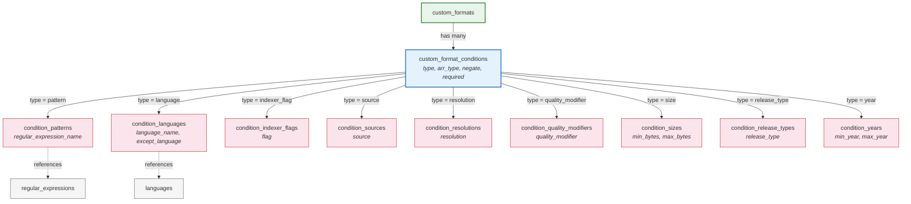

### The Parent Table

The `custom_format_conditions` table holds the common fields shared by all condition types:

| Column               | Type         | Purpose                                                   |
| -------------------- | ------------ | --------------------------------------------------------- |
| `custom_format_name` | VARCHAR(100) | FK to the owning custom format                            |
| `name`               | VARCHAR(100) | Unique name within the custom format                      |
| `type`               | VARCHAR(50)  | Dispatches to the correct child table                     |
| `arr_type`           | VARCHAR(20)  | Scope: `radarr`, `sonarr`, or `all`                       |
| `negate`             | INTEGER      | If 1, the condition matches when the check does NOT match |
| `required`           | INTEGER      | If 1, this condition must match (AND logic vs OR logic)   |

The composite key `(custom_format_name, name)` uniquely identifies a condition and is used as the
foreign key in all nine child tables.

### The Nine Condition Types

Each child table is keyed by `(custom_format_name, condition_name)` and stores only the data
specific to that condition type.

| Type               | Table                         | Specific Columns               | References          |
| ------------------ | ----------------------------- | ------------------------------ | ------------------- |
| `pattern`          | `condition_patterns`          | regular_expression_name        | regular_expressions |
| `language`         | `condition_languages`         | language_name, except_language | languages           |
| `indexer_flag`     | `condition_indexer_flags`     | flag                           |                     |
| `source`           | `condition_sources`           | source                         |                     |
| `resolution`       | `condition_resolutions`       | resolution                     |                     |
| `quality_modifier` | `condition_quality_modifiers` | quality_modifier               |                     |
| `size`             | `condition_sizes`             | min_bytes, max_bytes           |                     |
| `release_type`     | `condition_release_types`     | release_type                   |                     |
| `year`             | `condition_years`             | min_year, max_year             |                     |

### Invariant

A condition row in `custom_format_conditions` must have exactly one corresponding row in exactly one
child table. The `type` column determines which child table holds the data. This invariant is
enforced by application logic during recompose, not by a database constraint (SQLite does not
support cross-table CHECK constraints).

### Examples for All Nine Condition Types

The following examples demonstrate complete SQL for each condition type, showing both the parent
condition row and the corresponding child row.

#### 1. Pattern Condition

Matches against a release title, release group, or edition using a regular expression.

```sql
-- Parent condition
INSERT INTO custom_format_conditions (custom_format_name, name, type)
VALUES ('Dolby Vision', 'Has DV', 'pattern');

-- Child: references a named regex
INSERT INTO condition_patterns (custom_format_name, condition_name, regular_expression_name)
VALUES ('Dolby Vision', 'Has DV', 'DV Pattern');
```

Pattern conditions can be negated to match releases that do NOT contain a pattern:

```sql
-- Negated pattern: "does NOT have HDR10 fallback"
INSERT INTO custom_format_conditions (custom_format_name, name, type, negate)
VALUES ('Dolby Vision (no fallback)', 'No HDR10 Fallback', 'pattern', 1);

INSERT INTO condition_patterns (custom_format_name, condition_name, regular_expression_name)
VALUES ('Dolby Vision (no fallback)', 'No HDR10 Fallback', 'HDR10 Regex');
```

#### 2. Language Condition

Matches based on the language metadata of a release.

```sql
-- Match releases in English
INSERT INTO custom_format_conditions (custom_format_name, name, type)
VALUES ('English Audio', 'Is English', 'language');

INSERT INTO condition_languages (custom_format_name, condition_name, language_name)
VALUES ('English Audio', 'Is English', 'English');
```

The `except_language` flag inverts the match to "any language except this one":

```sql
-- Match any language EXCEPT English
INSERT INTO custom_format_conditions (custom_format_name, name, type)
VALUES ('Non-English Audio', 'Not English', 'language');

INSERT INTO condition_languages
    (custom_format_name, condition_name, language_name, except_language)
VALUES ('Non-English Audio', 'Not English', 'English', 1);
```

#### 3. Indexer Flag Condition

Matches based on flags set by the indexer (e.g., Scene, Freeleech).

```sql
INSERT INTO custom_format_conditions (custom_format_name, name, type)
VALUES ('Scene Release', 'Has Scene Flag', 'indexer_flag');

INSERT INTO condition_indexer_flags (custom_format_name, condition_name, flag)
VALUES ('Scene Release', 'Has Scene Flag', 'Scene');
```

#### 4. Source Condition

Matches based on the media source (e.g., Bluray, Web, DVD).

```sql
INSERT INTO custom_format_conditions (custom_format_name, name, type)
VALUES ('Bluray Source', 'Is Bluray', 'source');

INSERT INTO condition_sources (custom_format_name, condition_name, source)
VALUES ('Bluray Source', 'Is Bluray', 'Bluray');
```

#### 5. Resolution Condition

Matches based on the video resolution.

```sql
INSERT INTO custom_format_conditions (custom_format_name, name, type)
VALUES ('4K Resolution', 'Is 2160p', 'resolution');

INSERT INTO condition_resolutions (custom_format_name, condition_name, resolution)
VALUES ('4K Resolution', 'Is 2160p', '2160p');
```

#### 6. Quality Modifier Condition

Matches based on the quality modifier (e.g., REMUX, WEBDL).

```sql
INSERT INTO custom_format_conditions (custom_format_name, name, type)
VALUES ('REMUX Preferred', 'Is REMUX', 'quality_modifier');

INSERT INTO condition_quality_modifiers (custom_format_name, condition_name, quality_modifier)
VALUES ('REMUX Preferred', 'Is REMUX', 'REMUX');
```

#### 7. Size Condition

Matches based on file size (in bytes). Either `min_bytes` or `max_bytes` can be NULL for
open-ended ranges.

```sql
-- Match files between 5 GB and 80 GB
INSERT INTO custom_format_conditions (custom_format_name, name, type)
VALUES ('Appropriate Size', 'Size Range', 'size');

INSERT INTO condition_sizes (custom_format_name, condition_name, min_bytes, max_bytes)
VALUES ('Appropriate Size', 'Size Range', 5368709120, 85899345920);

-- Match files larger than 50 GB (no upper bound)
INSERT INTO custom_format_conditions (custom_format_name, name, type)
VALUES ('Oversized', 'Too Large', 'size');

INSERT INTO condition_sizes (custom_format_name, condition_name, min_bytes, max_bytes)
VALUES ('Oversized', 'Too Large', 53687091200, NULL);
```

#### 8. Release Type Condition

Matches based on the release type classification.

```sql
INSERT INTO custom_format_conditions (custom_format_name, name, type)
VALUES ('Movie Release', 'Is Movie', 'release_type');

INSERT INTO condition_release_types (custom_format_name, condition_name, release_type)
VALUES ('Movie Release', 'Is Movie', 'Movie');
```

#### 9. Year Condition

Matches based on the release year. Either `min_year` or `max_year` can be NULL for open-ended
ranges.

```sql
-- Match releases from 2020 onward
INSERT INTO custom_format_conditions (custom_format_name, name, type)
VALUES ('Recent Release', 'After 2020', 'year');

INSERT INTO condition_years (custom_format_name, condition_name, min_year, max_year)
VALUES ('Recent Release', 'After 2020', 2020, NULL);

-- Match releases from the 1990s decade
INSERT INTO custom_format_conditions (custom_format_name, name, type)
VALUES ('90s Release', 'In the 90s', 'year');

INSERT INTO condition_years (custom_format_name, condition_name, min_year, max_year)
VALUES ('90s Release', 'In the 90s', 1990, 1999);
```

### Example: Complete Custom Format

A custom format named "Dolby Vision (no fallback)" might have the following condition structure:

```sql
-- Parent condition
INSERT INTO custom_format_conditions (custom_format_name, name, type)
VALUES ('Dolby Vision (no fallback)', 'Has DV', 'pattern');

-- Child: pattern condition referencing a regex
INSERT INTO condition_patterns (custom_format_name, condition_name, regular_expression_name)
VALUES ('Dolby Vision (no fallback)', 'Has DV', 'DV Regex');

-- Parent condition (negated)
INSERT INTO custom_format_conditions (custom_format_name, name, type, negate)
VALUES ('Dolby Vision (no fallback)', 'No HDR10 Fallback', 'pattern', 1);

-- Child: negated pattern condition
INSERT INTO condition_patterns (custom_format_name, condition_name, regular_expression_name)
VALUES ('Dolby Vision (no fallback)', 'No HDR10 Fallback', 'HDR10 Regex');
```

### Example: Complex Multi-Condition Custom Format

A custom format can combine multiple condition types. Conditions with `required = 1` use AND logic
(all must match); conditions with `required = 0` use OR logic (at least one must match).

```sql
-- Custom format: "4K REMUX HDR (2020+)"
-- Matches: 4K resolution AND REMUX modifier AND released 2020 or later

INSERT INTO custom_formats (name, description)
VALUES ('4K REMUX HDR (2020+)', 'Matches 4K REMUX releases from 2020 onward');

-- Condition 1: Must be 2160p (required)
INSERT INTO custom_format_conditions
    (custom_format_name, name, type, required)
VALUES ('4K REMUX HDR (2020+)', '4K Resolution', 'resolution', 1);

INSERT INTO condition_resolutions (custom_format_name, condition_name, resolution)
VALUES ('4K REMUX HDR (2020+)', '4K Resolution', '2160p');

-- Condition 2: Must be REMUX (required)
INSERT INTO custom_format_conditions
    (custom_format_name, name, type, required)
VALUES ('4K REMUX HDR (2020+)', 'REMUX Quality', 'quality_modifier', 1);

INSERT INTO condition_quality_modifiers (custom_format_name, condition_name, quality_modifier)
VALUES ('4K REMUX HDR (2020+)', 'REMUX Quality', 'REMUX');

-- Condition 3: Must be 2020 or later (required)
INSERT INTO custom_format_conditions
    (custom_format_name, name, type, required)
VALUES ('4K REMUX HDR (2020+)', 'Recent Year', 'year', 1);

INSERT INTO condition_years (custom_format_name, condition_name, min_year, max_year)
VALUES ('4K REMUX HDR (2020+)', 'Recent Year', 2020, NULL);

-- Condition 4: Should have HDR pattern (not required, bonus match)
INSERT INTO custom_format_conditions
    (custom_format_name, name, type, required)
VALUES ('4K REMUX HDR (2020+)', 'Has HDR', 'pattern', 0);

INSERT INTO condition_patterns (custom_format_name, condition_name, regular_expression_name)
VALUES ('4K REMUX HDR (2020+)', 'Has HDR', 'HDR Pattern');
```

---

## 8. Key Design Decisions

### Name-Based Foreign Keys

All foreign keys reference UNIQUE `name` columns rather than autoincrement `id` columns. This is the
single most important design decision in the schema.

**Why:** PCDs are rebuilt from scratch on every recompose. Autoincrement IDs are assigned at INSERT
time and are not stable across rebuilds. If a PCD adds a new INSERT before an existing one, all
subsequent IDs shift, breaking every foreign key reference.

Name-based FKs are stable across recompiles because the name of an entity does not change based on
insertion order. This is what makes the entire OSQL/CDD system viable.

```sql
-- Stable: works regardless of insertion order
FOREIGN KEY (quality_profile_name) REFERENCES quality_profiles(name)

-- Unstable: breaks if a new INSERT shifts IDs
FOREIGN KEY (quality_profile_id) REFERENCES quality_profiles(id)
```

**Concrete example of the problem with ID-based FKs:**

```sql
-- Version 1.0: Two profiles, IDs assigned as 1 and 2
INSERT INTO quality_profiles (name) VALUES ('1080p Quality HDR');  -- id = 1
INSERT INTO quality_profiles (name) VALUES ('2160p REMUX HDR');    -- id = 2

-- A junction row references id = 2
INSERT INTO quality_profile_custom_formats (quality_profile_id, ...)
VALUES (2, ...);  -- Points to '2160p REMUX HDR'

-- Version 1.1: A new profile is added BEFORE the existing ones
INSERT INTO quality_profiles (name) VALUES ('720p Streaming');      -- id = 1 (NEW)
INSERT INTO quality_profiles (name) VALUES ('1080p Quality HDR');   -- id = 2 (SHIFTED)
INSERT INTO quality_profiles (name) VALUES ('2160p REMUX HDR');     -- id = 3 (SHIFTED)

-- The junction row still says id = 2, but now that points to '1080p Quality HDR'!
-- Data corruption: the wrong profile gets the custom format scores.
```

With name-based FKs, this problem cannot occur:

```sql
-- Version 1.1: insertion order does not matter
INSERT INTO quality_profile_custom_formats (quality_profile_name, ...)
VALUES ('2160p REMUX HDR', ...);  -- Always points to the right profile
```

All foreign keys use `ON DELETE CASCADE ON UPDATE CASCADE` to propagate name changes and deletions
through the relationship graph. If a quality profile is renamed, all junction table rows that
reference it are automatically updated. If it is deleted, all related rows cascade-delete.

### Composite Primary Keys

Junction tables use composite name-based primary keys rather than surrogate keys. This ensures
uniqueness at the relational level and aligns with the name-based FK strategy.

```sql
-- Junction table with composite PK
PRIMARY KEY (quality_profile_name, custom_format_name, arr_type)
```

This means a junction row is identified by the names of the entities it connects, not by an
arbitrary integer. This is stable across recompiles and makes OSQL operations self-documenting.

**Benefits of composite name-based PKs:**

1. **Self-documenting.** Reading the PK tells you exactly what the row connects.
2. **Replay-safe.** The same INSERT produces the same logical row regardless of execution order.
3. **Conflict detection.** Duplicate INSERT attempts fail with a UNIQUE constraint violation rather
   than silently creating duplicate relationships.
4. **No ORM dependency.** No need for a framework to generate or track surrogate keys.

### Arr-Type Differentiation

Several tables include an `arr_type` column (`radarr`, `sonarr`, `lidarr`, or `all`) to allow
per-application behavior without duplicating the entire entity.

- **`quality_api_mappings`**: Different arr applications use different API names for the same
  quality. Absence of a row means the quality does not exist for that arr.
- **`custom_format_conditions`**: A condition can apply to only one arr type or to all arrs.
- **`quality_profile_custom_formats`**: A score can differ per arr within the same profile.

This design allows a single quality profile to be defined once and then have arr-specific overrides
where needed, rather than maintaining separate profiles per application.

**Example: Same profile, different scores per arr**

```sql
-- Base score for all arr types
INSERT INTO quality_profile_custom_formats
    (quality_profile_name, custom_format_name, arr_type, score)
VALUES ('1080p Quality HDR', 'Dolby Atmos', 'all', 400);

-- Radarr-specific override (movies benefit more from Atmos)
INSERT INTO quality_profile_custom_formats
    (quality_profile_name, custom_format_name, arr_type, score)
VALUES ('1080p Quality HDR', 'Dolby Atmos', 'radarr', 800);
```

**Example: Quality name translation across applications**

```sql
-- Praxrr canonical name: Remux-1080p
-- Radarr API name: Remux-1080p (same)
-- Sonarr API name: Bluray-1080p Remux (different!)
INSERT INTO quality_api_mappings (quality_name, arr_type, api_name)
SELECT name, 'radarr', name FROM qualities WHERE name = 'Remux-1080p';

INSERT INTO quality_api_mappings (quality_name, arr_type, api_name)
SELECT name, 'sonarr', 'Bluray-1080p Remux' FROM qualities WHERE name = 'Remux-1080p';
```

### CHECK Constraints

Enum-like columns are validated at the schema level using CHECK constraints. This catches invalid
data during recompose rather than at runtime in the application. Praxrr generates types from
these constraints, so they serve double duty as both data validation and type system definitions.

| Table                       | Column                      | Allowed Values                                                |
| --------------------------- | --------------------------- | ------------------------------------------------------------- |
| `quality_profiles`          | upgrade_score_increment     | `> 0`                                                         |
| `quality_profile_qualities` | (quality_name XOR group)    | Exactly one of quality_name or quality_group_name must be set |
| `radarr_naming`             | colon_replacement_format    | delete, dash, spaceDash, spaceDashSpace, smart                |
| `radarr_media_settings`     | propers_repacks             | doNotPrefer, preferAndUpgrade, doNotUpgradeAutomatically      |
| `sonarr_media_settings`     | propers_repacks             | doNotPrefer, preferAndUpgrade, doNotUpgradeAutomatically      |
| `delay_profiles`            | preferred_protocol          | prefer_usenet, prefer_torrent, only_usenet, only_torrent      |
| `delay_profiles`            | usenet_delay                | NULL if and only if only_torrent                              |
| `delay_profiles`            | torrent_delay               | NULL if and only if only_usenet                               |
| `delay_profiles`            | minimum_custom_format_score | NOT NULL if and only if bypass enabled                        |
| `test_entities`             | type                        | movie, series                                                 |
| `test_releases`             | entity_type                 | movie, series                                                 |

**SQL examples of CHECK constraints in the schema:**

```sql
-- XOR constraint: exactly one of quality_name or quality_group_name must be set
CHECK (
    (quality_name IS NOT NULL AND quality_group_name IS NULL) OR
    (quality_name IS NULL AND quality_group_name IS NOT NULL)
)

-- Enum constraint with conditional NULL logic
CHECK (
    (preferred_protocol = 'only_torrent' AND usenet_delay IS NULL) OR
    (preferred_protocol != 'only_torrent' AND usenet_delay IS NOT NULL)
)

-- Simple enum constraint
CHECK (propers_repacks IN ('doNotPrefer', 'preferAndUpgrade', 'doNotUpgradeAutomatically'))

-- Positive integer constraint
CHECK (upgrade_score_increment > 0)
```

### Upgrade-Until Constraint

A partial unique index ensures that only one quality item per profile can be marked as the upgrade
ceiling:

```sql
CREATE UNIQUE INDEX idx_one_upgrade_until_per_profile
ON quality_profile_qualities(quality_profile_name)
WHERE upgrade_until = 1;
```

This uses SQLite's partial index feature to enforce a business rule (at most one upgrade target per
profile) at the database level. Without this index, a profile could have multiple qualities marked
as `upgrade_until = 1`, creating an ambiguous upgrade target. The partial index ensures this
constraint is violated at INSERT/UPDATE time rather than producing incorrect runtime behavior.

**How this works in practice:**

```sql
-- First upgrade_until: succeeds
INSERT INTO quality_profile_qualities
    (quality_profile_name, quality_name, position, enabled, upgrade_until)
VALUES ('1080p Quality HDR', 'Remux-1080p', 5, 1, 1);

-- Second upgrade_until in same profile: FAILS with UNIQUE constraint violation
INSERT INTO quality_profile_qualities
    (quality_profile_name, quality_name, position, enabled, upgrade_until)
VALUES ('1080p Quality HDR', 'Bluray-1080p', 4, 1, 1);
-- ERROR: UNIQUE constraint failed: idx_one_upgrade_until_per_profile

-- upgrade_until in a DIFFERENT profile: succeeds (different profile_name)
INSERT INTO quality_profile_qualities
    (quality_profile_name, quality_name, position, enabled, upgrade_until)
VALUES ('2160p REMUX HDR', 'Remux-2160p', 3, 1, 1);
```

---

## 9. Dependencies

### Current Status

**Dependencies are not part of Praxrr 2.0.** At the current scale (approximately 10 in-use
databases), forking solves shared-code needs without the complexity of dependency resolution,
version conflicts, and circular dependency detection.

### Why Not Now

Introducing a dependency system requires solving several hard problems:

- **Version resolution.** When PCD A depends on PCD B v1.2 and PCD C depends on PCD B v1.3, which
  version of B is used?
- **Circular dependencies.** PCD A depends on PCD B which depends on PCD A. This must be detected
  and rejected.
- **Operation ordering across PCDs.** Dependencies must be replayed before dependents, and the
  ordering must be deterministic.
- **Breaking changes.** If PCD B renames a quality, all PCDs that reference that quality name (via
  name-based FKs) must be updated.

These problems are solvable but add significant complexity. At the current scale, the cost exceeds
the benefit.

### Future Design (Post-2.0)

The layer system already reserves Layer 2 for dependencies. When clear duplication patterns emerge
and forking proves insufficient, dependency support will be added in Praxrr 2.1+ without breaking
existing PCDs.

The anticipated design:

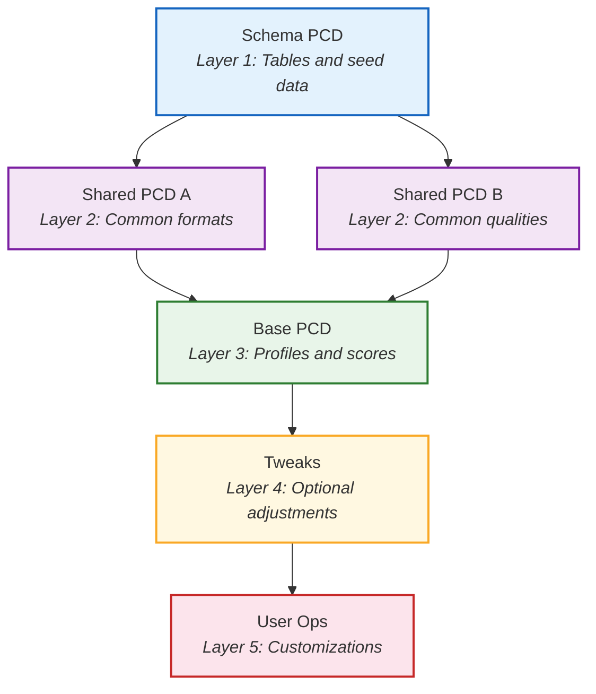

Dependencies would be declared in `pcd.json` and resolved at recompose time. The manifest would gain
a `dependencies` field (see [`docs/manifest.md`](manifest.md) for the full specification):

```json
{
  "dependencies": {
    "shared-formats": "^1.0.0",
    "shared-qualities": "^2.1.0"
  }
}
```

The anticipated dependency resolution process:

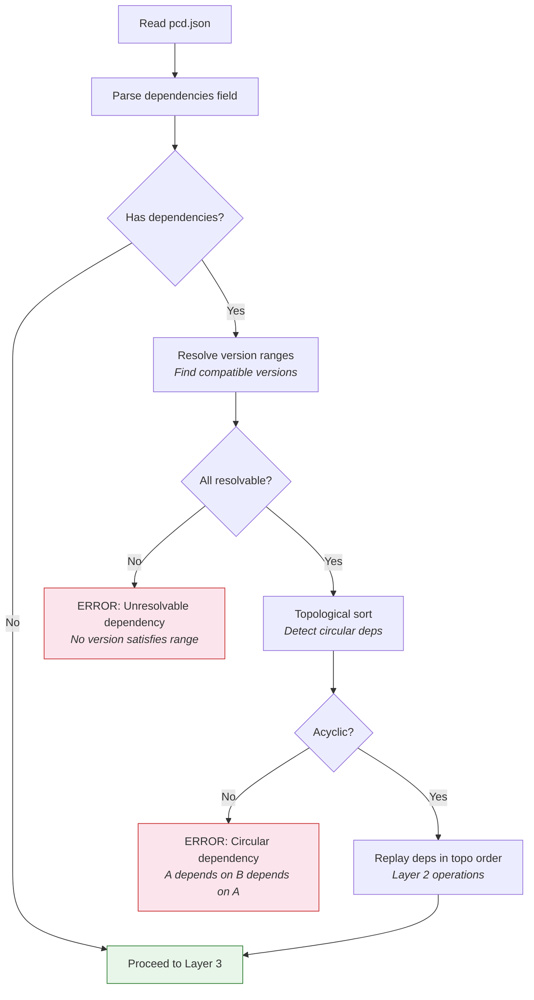

This will be built when the need justifies the complexity.

---

## Cross-References

| Document                                | Description                                      |
| --------------------------------------- | ------------------------------------------------ |
| [`docs/manifest.md`](manifest.md)       | Full `pcd.json` specification with all fields    |
| [`CONTRIBUTING.md`](../CONTRIBUTING.md) | Contribution process and discussion requirements |
| [`CHANGELOG.md`](../CHANGELOG.md)       | Version history and schema change documentation  |
| [`README.md`](../README.md)             | Project overview and quick start                 |

---
