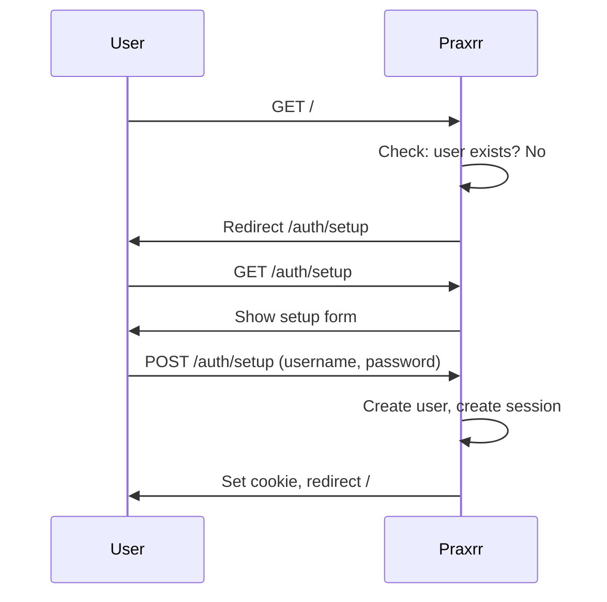
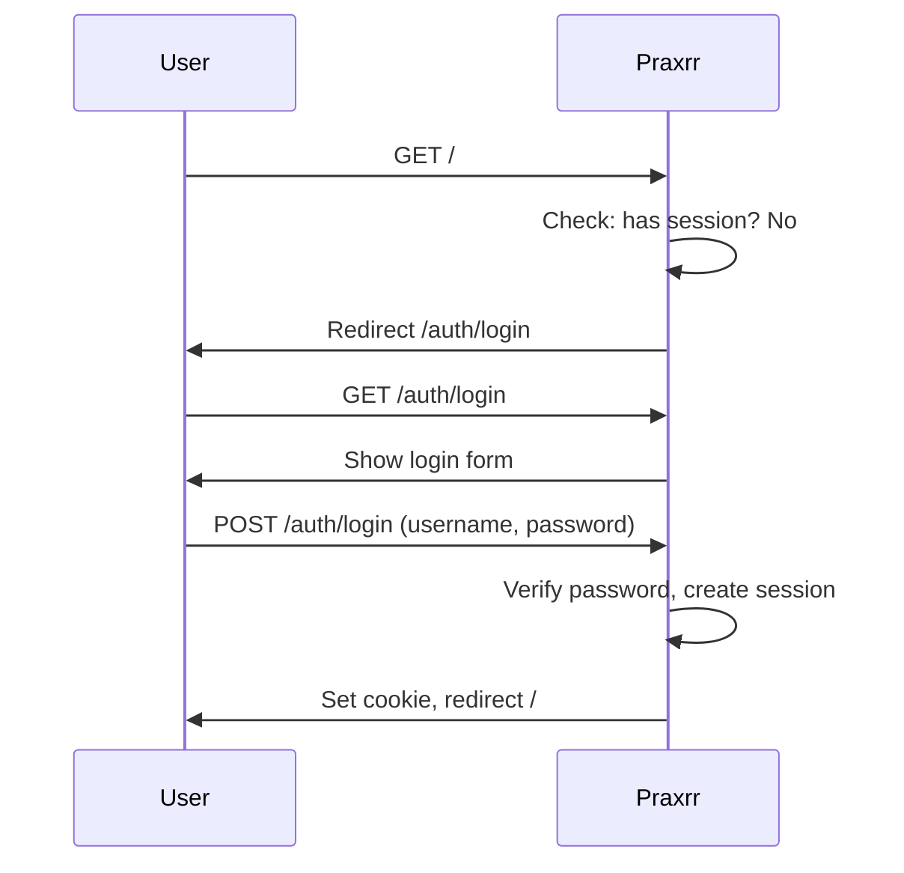
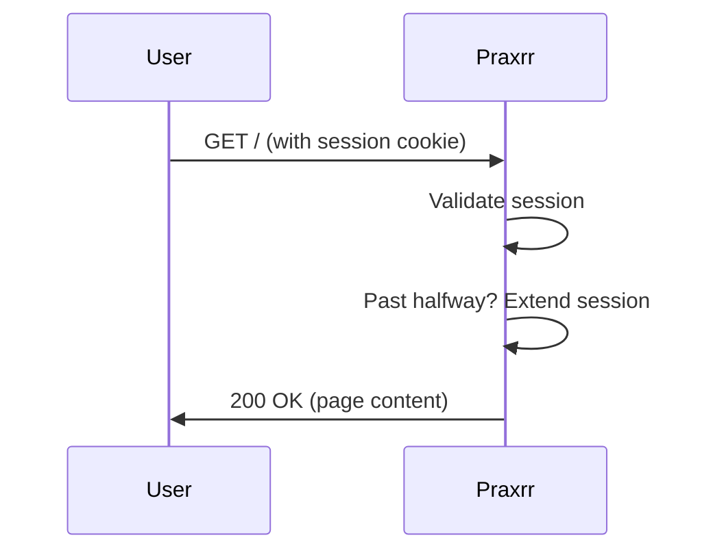
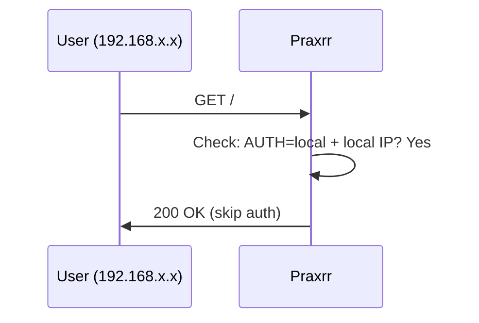
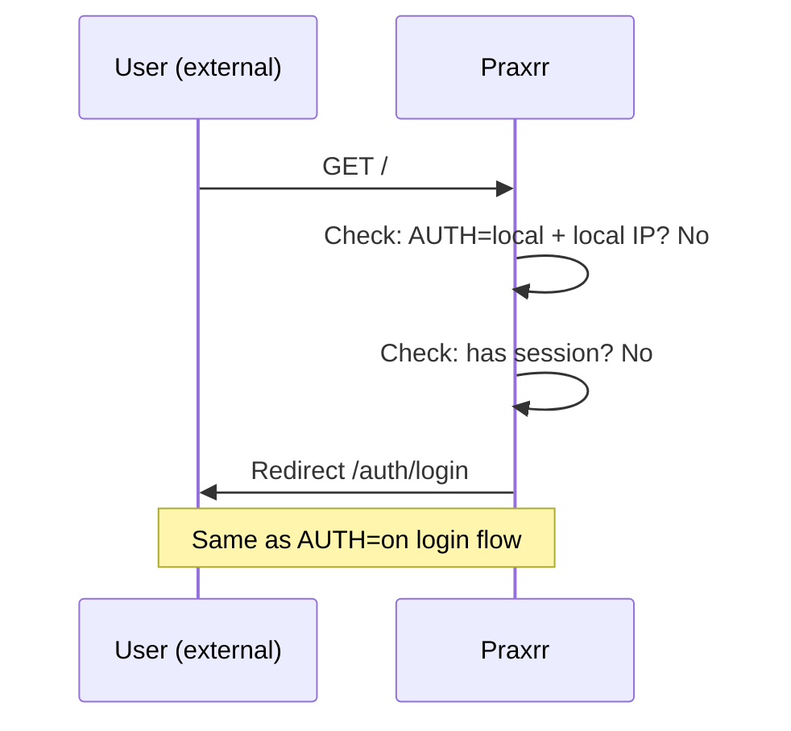
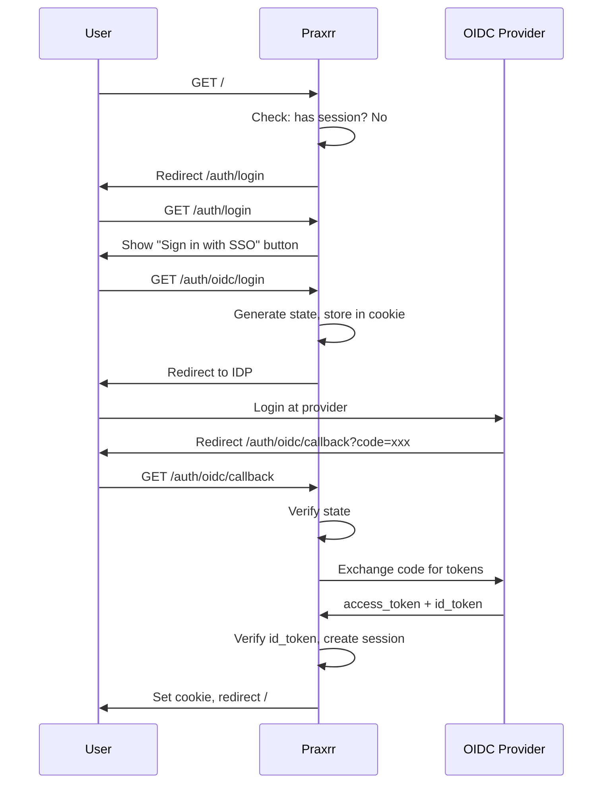
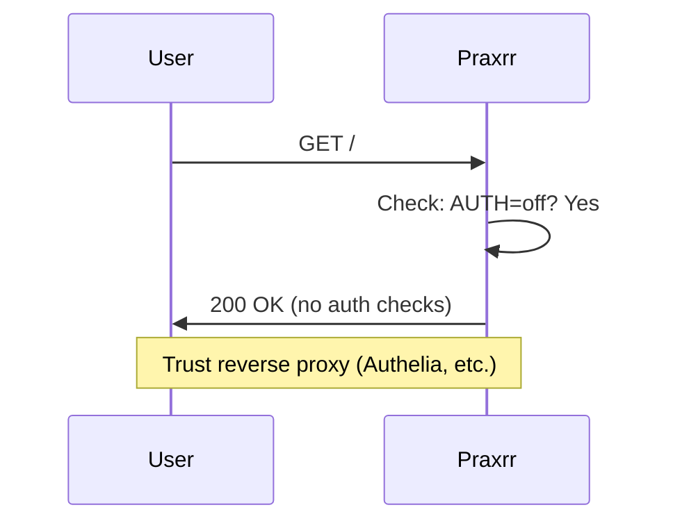

# Auth Module

Authentication and session management for Praxrr.

## Auth Modes

Controlled by the `AUTH` environment variable:

| Mode    | Description                                                    |
| ------- | -------------------------------------------------------------- |
| `on`    | Default. Username/password required for all requests           |
| `local` | Skip auth for local IPs (192.168.x.x, 10.x.x.x, etc.)          |
| `off`   | Disable auth entirely (trust reverse proxy like Authelia)      |
| `oidc`  | Login via external OIDC provider (Google, Authentik, Keycloak) |

## Sequence Diagrams

### AUTH=on (Default)

#### First Run (No User)



#### Login Flow



#### Authenticated Request



### AUTH=local

#### Local IP



#### External IP



### AUTH=oidc



### AUTH=off



## Scenarios

### AUTH=on (Default)

| Scenario                              | What Happens              |
| ------------------------------------- | ------------------------- |
| First run, no users                   | Redirect to `/auth/setup` |
| User exists, not logged in            | Redirect to `/auth/login` |
| User exists, logged in                | Allow access              |
| Session expired                       | Redirect to `/auth/login` |
| API request, no auth                  | 401 JSON response         |
| API request, valid X-Api-Key          | Allow access              |
| Visit `/auth/setup` after user exists | Redirect to `/`           |

### AUTH=local

| Scenario                   | What Happens                                          |
| -------------------------- | ----------------------------------------------------- |
| Local IP (192.168.x.x)     | Allow access (skip auth)                              |
| Local IP, first run        | Redirect to `/auth/setup` (still need to create user) |
| External IP, not logged in | Redirect to `/auth/login`                             |
| External IP, logged in     | Allow access                                          |

### AUTH=oidc

| Scenario                 | What Happens                                 |
| ------------------------ | -------------------------------------------- |
| Not logged in            | Redirect to `/auth/login` (shows SSO button) |
| Click "Sign in with SSO" | Redirect to OIDC provider                    |
| Return from provider     | Create session, redirect to `/`              |
| Session expired          | Redirect to `/auth/login`                    |
| Visit `/auth/setup`      | Redirect to `/` (no setup needed)            |

### AUTH=off

| Scenario    | What Happens                  |
| ----------- | ----------------------------- |
| Any request | Allow access (no auth checks) |

## Session Management

- **Duration**: 7 days (configurable in Settings > Security)
- **Sliding expiration**: Session extended when past halfway point
- **Multiple sessions**: Users can be logged in from multiple devices
- **Metadata tracked**: IP, user agent, browser, OS, device type, last active

## Files

| File            | Purpose                                      |
| --------------- | -------------------------------------------- |
| `middleware.ts` | Core auth logic (getAuthState, isPublicPath) |
| `password.ts`   | Bcrypt hash/verify                           |
| `network.ts`    | IP detection (getClientIp, isLocalAddress)   |
| `userAgent.ts`  | Parse browser/OS/device from user agent      |
| `apiKey.ts`     | API key generation                           |
| `oidc.ts`       | OIDC discovery, token exchange, JWT parsing  |

## Environment Variables

```bash
# Auth mode
AUTH=on                    # on, local, off, oidc

# OIDC (only when AUTH=oidc)
OIDC_DISCOVERY_URL=https://auth.example.com/.well-known/openid-configuration
OIDC_CLIENT_ID=praxrr
OIDC_CLIENT_SECRET=your-secret
```

## Routes

| Route                 | Purpose                                |
| --------------------- | -------------------------------------- |
| `/auth/setup`         | First-run setup (create admin account) |
| `/auth/login`         | Login page (form or OIDC button)       |
| `/auth/logout`        | Logout (clear session)                 |
| `/auth/oidc/login`    | Initiate OIDC flow                     |
| `/auth/oidc/callback` | Handle OIDC provider response          |
| `/settings/security`  | Manage sessions, API key, password     |
