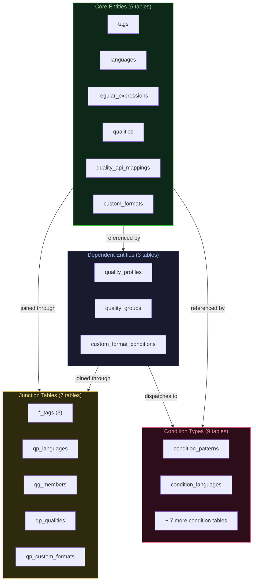
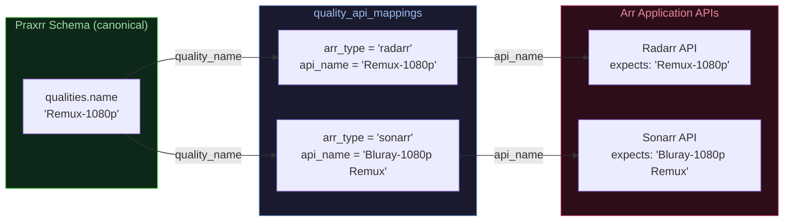
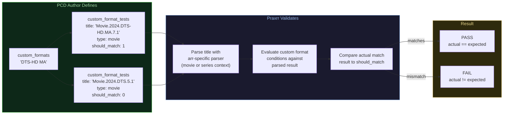
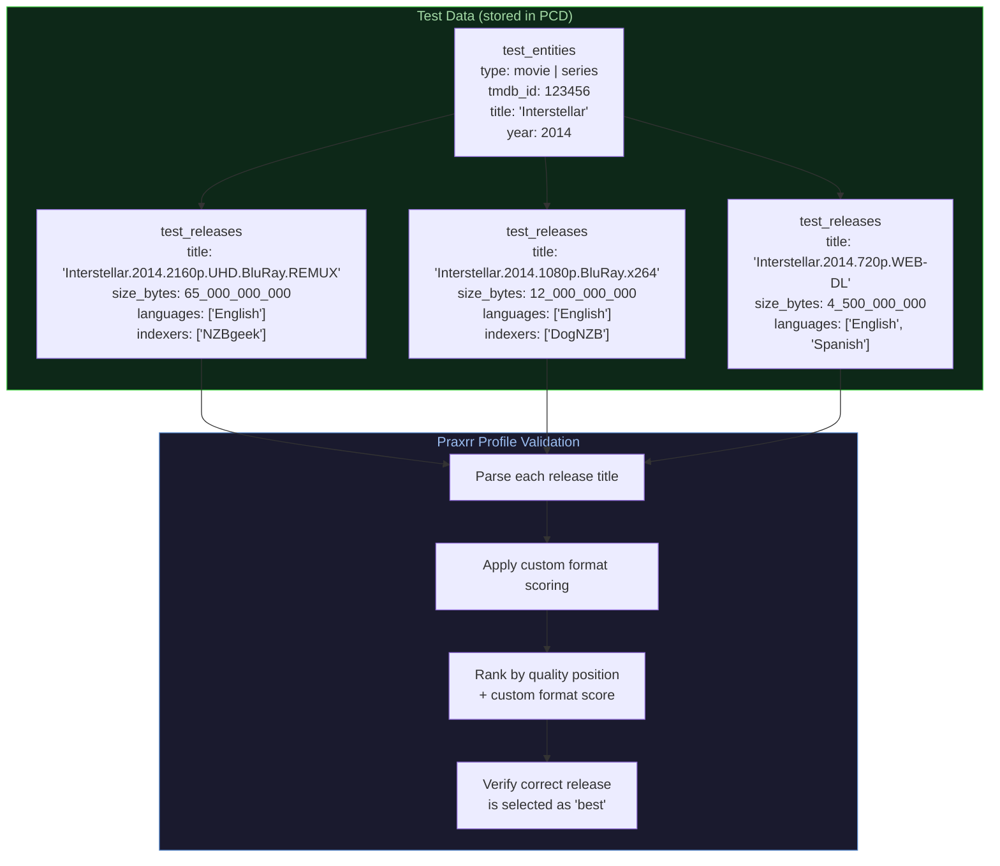
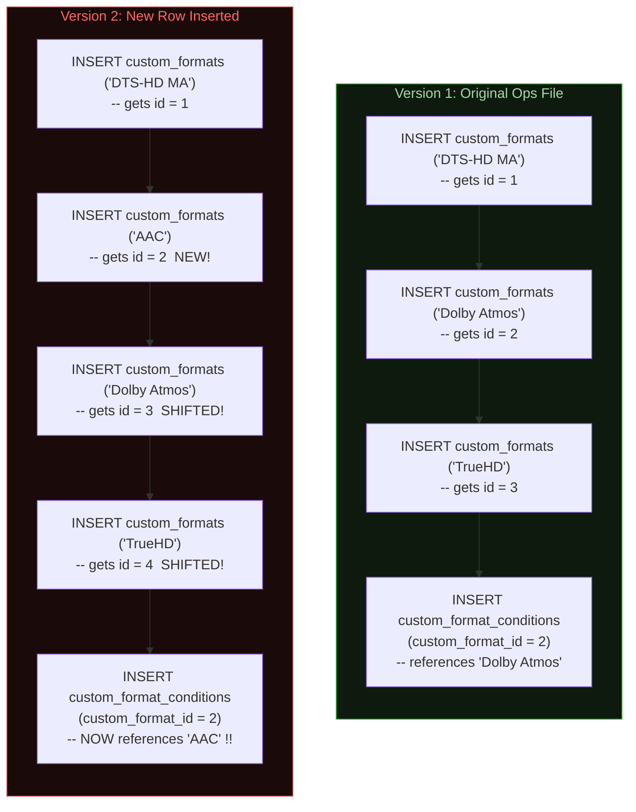
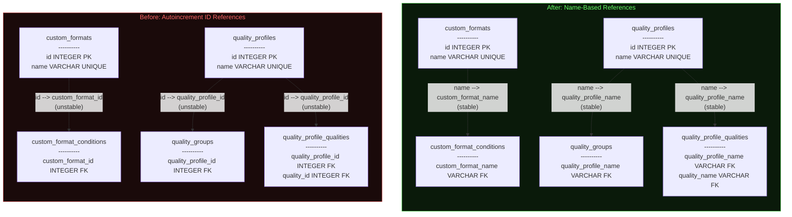
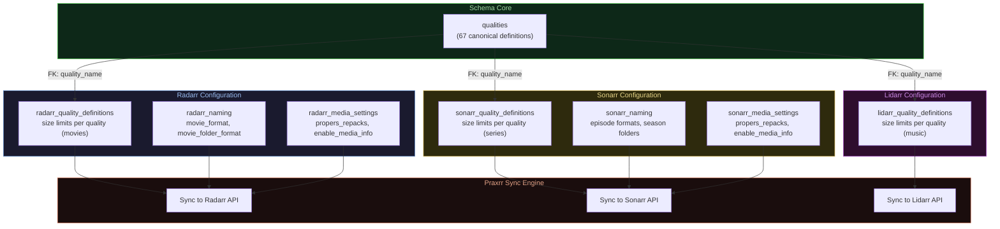

# Changelog

All notable changes to the Praxrr Schema will be documented in this file.

---

## Reading This Changelog

This changelog tracks the evolution of the PCD (Praxrr Compliant Database) base schema defined in
`ops/0.schema.sql`. It follows [Keep a Changelog](https://keepachangelog.com/) conventions:
**Added** for new features and tables, **Changed** for modifications to existing schema,
**Removed** for deleted tables or columns, and **Fixed** for bug fixes.

Entries are organized **chronologically with the most recent changes last**. Each entry includes a
date, title, optional summary paragraph, and categorized subsections. Where relevant, entries
include SQL DDL snippets, Mermaid diagrams, migration notes, and cross-references to
[docs/structure.md](docs/structure.md).

**Conventions used in this file:**

- **DDL snippets** show the actual `CREATE TABLE` or `ALTER` statements added to `ops/0.schema.sql`
- **Migration notes** describe what PCD authors needed to do after updating to the new schema
- **Cross-references** link to the relevant section in [docs/structure.md](docs/structure.md)
  for deeper architectural context
- **Mermaid diagrams** are styled for dark-theme compatibility

---

## 2025-10-31 -- Initial Schema

The foundation of PCD 2.0. This release establishes the complete schema architecture including core
entities, the condition type system, quality profiles, and junction tables for many-to-many
relationships. It defines the structural contract that every PCD must build upon: 25 tables organized
into four functional groups that handle everything from quality ranking to regex-based media
matching.

The initial design makes two key architectural choices: (1) a **type-dispatched condition system**
that avoids the pitfalls of single-wide tables and EAV patterns, and (2) **arr-type differentiation**
that allows Radarr and Sonarr to share a single schema while maintaining app-specific behavior. Both
of these choices remain in the schema today.

> Cross-reference: [Schema Architecture](docs/structure.md#6-schema-architecture) and
> [Condition Type System](docs/structure.md#7-condition-type-system)

### Initial Table Group Architecture



### Added

- **Core entity tables** for the fundamental data model:
  - `quality_profiles` -- media acquisition strategy definitions
  - `custom_formats` -- pattern/condition definitions for media matching
  - `regular_expressions` -- reusable regex patterns with optional regex101 links
  - `languages` -- language definitions for profiles and conditions
  - `tags` -- reusable labels for multiple entity types
  - `qualities` -- individual quality definitions (e.g., "1080p Bluray", "2160p REMUX")
  - `quality_groups` -- groups of equivalent qualities within a profile

  Key DDL for the `quality_profiles` table:

  ```sql
  CREATE TABLE quality_profiles (
      id INTEGER PRIMARY KEY AUTOINCREMENT,
      name VARCHAR(100) UNIQUE NOT NULL,
      description TEXT,
      upgrades_allowed INTEGER NOT NULL DEFAULT 1,
      minimum_custom_format_score INTEGER NOT NULL DEFAULT 0,
      upgrade_until_score INTEGER NOT NULL DEFAULT 0,
      upgrade_score_increment INTEGER NOT NULL DEFAULT 1
          CHECK (upgrade_score_increment > 0),
      created_at TEXT NOT NULL DEFAULT CURRENT_TIMESTAMP,
      updated_at TEXT NOT NULL DEFAULT CURRENT_TIMESTAMP
  );
  ```

- **Custom format conditions system** with type-dispatched architecture across 9 condition type
  tables. Each condition lives in `custom_format_conditions` and dispatches to exactly one child
  table based on its `type` column. This avoids the sparse-column problem of a single wide table
  and the loss of relational integrity from EAV patterns.

  The nine condition type tables:
  - `condition_patterns` -- regex-based matching (references `regular_expressions`)
  - `condition_languages` -- language-based matching (references `languages`)
  - `condition_indexer_flags` -- indexer flag matching (e.g., "Scene", "Freeleech")
  - `condition_sources` -- media source matching (e.g., "Bluray", "Web", "DVD")
  - `condition_resolutions` -- resolution matching (e.g., "1080p", "2160p")
  - `condition_quality_modifiers` -- quality modifier matching (e.g., "REMUX", "WEBDL")
  - `condition_sizes` -- file size range matching (min/max bounds in bytes)
  - `condition_release_types` -- release type matching (e.g., "Movie", "Episode")
  - `condition_years` -- release year range matching (min/max bounds)

  Key DDL for the parent conditions table and a representative child table:

  ```sql
  CREATE TABLE custom_format_conditions (
      id INTEGER PRIMARY KEY AUTOINCREMENT,
      custom_format_name VARCHAR(100) NOT NULL,
      name VARCHAR(100) NOT NULL,
      type VARCHAR(50) NOT NULL,
      arr_type VARCHAR(20) NOT NULL DEFAULT 'all',
      negate INTEGER NOT NULL DEFAULT 0,
      required INTEGER NOT NULL DEFAULT 0,
      UNIQUE(custom_format_name, name),
      FOREIGN KEY (custom_format_name)
          REFERENCES custom_formats(name)
          ON DELETE CASCADE ON UPDATE CASCADE
  );

  -- Example child table: pattern conditions
  CREATE TABLE condition_patterns (
      custom_format_name VARCHAR(100) NOT NULL,
      condition_name VARCHAR(100) NOT NULL,
      regular_expression_name VARCHAR(100) NOT NULL,
      PRIMARY KEY (custom_format_name, condition_name),
      FOREIGN KEY (custom_format_name, condition_name)
          REFERENCES custom_format_conditions(custom_format_name, name)
          ON DELETE CASCADE ON UPDATE CASCADE,
      FOREIGN KEY (regular_expression_name)
          REFERENCES regular_expressions(name)
          ON DELETE CASCADE ON UPDATE CASCADE
  );
  ```

- **Quality profile system** supporting both individual qualities and quality groups, with ordered
  ranking and upgrade-until semantics. The `quality_profile_qualities` table uses a CHECK constraint
  to enforce that each row references either a single quality OR a quality group, never both:

  ```sql
  CHECK (
      (quality_name IS NOT NULL AND quality_group_name IS NULL)
      OR
      (quality_name IS NULL AND quality_group_name IS NOT NULL)
  )
  ```

- **Junction tables** for many-to-many relationships:
  - `regular_expression_tags`, `custom_format_tags`, `quality_profile_tags` -- tag associations
  - `quality_group_members` -- qualities belonging to groups
  - `quality_profile_qualities` -- ordered quality ranking within profiles
  - `quality_profile_custom_formats` -- custom format scoring per profile

- **Unique index** ensuring only a single `upgrade_until` quality per profile, preventing ambiguous
  upgrade targets. This uses SQLite's partial index feature to enforce a business rule at the
  database level:

  ```sql
  CREATE UNIQUE INDEX idx_one_upgrade_until_per_profile
  ON quality_profile_qualities(quality_profile_name)
  WHERE upgrade_until = 1;
  ```

- **Arr-type differentiation** via `arr_type` columns, allowing Radarr and Sonarr to share a schema
  while maintaining app-specific behavior:
  - `custom_format_conditions.arr_type` -- conditions can be arr-specific or universal (`'all'`)
  - `quality_profile_custom_formats.arr_type` -- scores can differ between Radarr and Sonarr for
    the same custom format

**Downstream impact:** This is the initial release. No existing PCDs were affected.

---

## 2025-11-03 -- Profile Language and Quality Group Fixes

Two focused corrections to the initial schema, both addressing issues discovered during early PCD
development. The language processing fix resolved unpredictable behavior when associating languages
with profiles. The quality group scoping fix prevented unintentional coupling between profiles that
shared group definitions.

### Changed

- **Improved profile language processing** -- refined how languages are associated with quality
  profiles for more predictable behavior. Before this change, the `quality_profile_languages`
  junction table did not properly enforce the relationship between profiles and languages, leading
  to ambiguous results when a profile had multiple language associations. The fix tightened the
  foreign key relationships and ensured the `type` column (`must`, `only`, `not`, `simple`)
  was consistently applied.

- **Made quality groups profile-scoped** -- quality groups are now unique to a single profile rather
  than reusable across profiles. Before this change, a quality group could be shared by multiple
  profiles, meaning editing a group's membership in one profile would silently affect all other
  profiles using that group. After this change, `quality_groups` includes a
  `quality_profile_name` foreign key and a `UNIQUE(quality_profile_name, name)` constraint,
  ensuring each profile has independent control over its group definitions.

  Before:

  ```sql
  -- Groups were global, referenced by id
  CREATE TABLE quality_groups (
      id INTEGER PRIMARY KEY AUTOINCREMENT,
      name VARCHAR(100) UNIQUE NOT NULL
  );
  ```

  After:

  ```sql
  -- Groups are now profile-scoped
  CREATE TABLE quality_groups (
      id INTEGER PRIMARY KEY AUTOINCREMENT,
      quality_profile_name VARCHAR(100) NOT NULL,
      name VARCHAR(100) NOT NULL,
      UNIQUE(quality_profile_name, name),
      FOREIGN KEY (quality_profile_name)
          REFERENCES quality_profiles(name)
          ON DELETE CASCADE ON UPDATE CASCADE
  );
  ```

**Downstream impact:** Any PCD that referenced quality groups needed to include the
`quality_profile_name` in group-related INSERT statements. Since PCD development was in its earliest
stages, no production databases were affected.

---

## 2025-12-28 -- API Mappings, Media Management, and Delay Profiles

This release adds support for arr-specific configuration that goes beyond profile and format
definitions: quality name translation, file naming conventions, media settings, and download timing
control. These tables close the gap between the abstract quality model in the schema and the
concrete configuration that each arr application expects.

The motivation was straightforward: Radarr, Sonarr, and (eventually) Lidarr each use different API
names for the same quality, have different file naming template syntaxes, and expose different media
settings. Without these tables, PCD authors would have had to manage this translation logic outside
the database, losing the benefits of relational integrity and OSQL replayability.

> Cross-reference: [Media Management Tables](docs/structure.md#media-management-tables-7-tables--1)

### Quality Name Translation Flow

The `quality_api_mappings` table bridges the gap between Praxrr's canonical quality names and the
arr-specific API names that each application expects. This abstraction allows the schema to use
consistent names internally while correctly translating during sync.



### Added

- **Quality API mappings** for Radarr/Sonarr name translation:
  - `quality_api_mappings` -- maps canonical Praxrr quality names to arr-specific API names
    (e.g., `Remux-1080p` maps to `Bluray-1080p Remux` for Sonarr). Absence of a mapping row
    means the quality does not exist for that arr type. This table uses a composite primary key
    of `(quality_name, arr_type)`.

  ```sql
  CREATE TABLE quality_api_mappings (
      quality_name VARCHAR(100) NOT NULL,
      arr_type VARCHAR(20) NOT NULL,
      api_name VARCHAR(100) NOT NULL,
      created_at TEXT NOT NULL DEFAULT CURRENT_TIMESTAMP,
      PRIMARY KEY (quality_name, arr_type),
      FOREIGN KEY (quality_name)
          REFERENCES qualities(name)
          ON DELETE CASCADE ON UPDATE CASCADE
  );
  ```

- **Media management tables** for arr-specific configuration:
  - `radarr_quality_definitions` / `sonarr_quality_definitions` -- size limits (min/max/preferred)
    per quality, controlling what file sizes each arr will accept. Each table uses a composite
    primary key of `(name, quality_name)`, allowing multiple named configurations (e.g., different
    size profiles for different use cases).

  ```sql
  CREATE TABLE radarr_quality_definitions (
      name VARCHAR(100) NOT NULL,
      quality_name VARCHAR(100) NOT NULL,
      min_size INTEGER NOT NULL DEFAULT 0,
      max_size INTEGER NOT NULL,
      preferred_size INTEGER NOT NULL,
      PRIMARY KEY (name, quality_name),
      FOREIGN KEY (quality_name)
          REFERENCES qualities(name)
          ON DELETE CASCADE ON UPDATE CASCADE
  );
  ```

  - `radarr_naming` / `sonarr_naming` -- file and folder naming format templates. Radarr uses
    `movie_format` and `movie_folder_format`, while Sonarr uses `standard_episode_format`,
    `daily_episode_format`, `anime_episode_format`, `series_folder_format`, and
    `season_folder_format`. Both include colon replacement configuration.

  ```sql
  CREATE TABLE radarr_naming (
      name VARCHAR(100) NOT NULL PRIMARY KEY,
      rename INTEGER NOT NULL DEFAULT 1,
      movie_format TEXT NOT NULL,
      movie_folder_format TEXT NOT NULL,
      replace_illegal_characters INTEGER NOT NULL DEFAULT 0,
      colon_replacement_format VARCHAR(20) NOT NULL DEFAULT 'smart'
          CHECK (colon_replacement_format IN (
              'delete', 'dash', 'spaceDash', 'spaceDashSpace', 'smart'
          ))
  );
  ```

  - `radarr_media_settings` / `sonarr_media_settings` -- general settings such as
    `propers_repacks` handling and `enable_media_info`. Both tables use CHECK constraints to
    validate the `propers_repacks` enum.

  ```sql
  CREATE TABLE radarr_media_settings (
      name VARCHAR(100) NOT NULL PRIMARY KEY,
      propers_repacks VARCHAR(50) NOT NULL DEFAULT 'doNotPrefer'
          CHECK (propers_repacks IN (
              'doNotPrefer', 'preferAndUpgrade', 'doNotUpgradeAutomatically'
          )),
      enable_media_info INTEGER NOT NULL DEFAULT 1
  );
  ```

- **Delay profiles** for download timing control:
  - `delay_profiles` -- protocol preference (usenet/torrent), configurable delays, and bypass
    conditions for controlling when downloads are grabbed. Three interlocking CHECK constraints
    enforce that: (1) `usenet_delay` is NULL if and only if `preferred_protocol = 'only_torrent'`,
    (2) `torrent_delay` is NULL if and only if `preferred_protocol = 'only_usenet'`, and
    (3) `minimum_custom_format_score` is required when `bypass_if_above_custom_format_score = 1`.

  ```sql
  CREATE TABLE delay_profiles (
      id INTEGER PRIMARY KEY AUTOINCREMENT,
      name VARCHAR(100) UNIQUE NOT NULL,
      preferred_protocol VARCHAR(20) NOT NULL CHECK (
          preferred_protocol IN (
              'prefer_usenet', 'prefer_torrent',
              'only_usenet', 'only_torrent'
          )
      ),
      usenet_delay INTEGER,
      torrent_delay INTEGER,
      bypass_if_highest_quality INTEGER NOT NULL DEFAULT 0,
      bypass_if_above_custom_format_score INTEGER NOT NULL DEFAULT 0,
      minimum_custom_format_score INTEGER,
      -- Enforce usenet_delay is NULL only when only_torrent
      CHECK (
          (preferred_protocol = 'only_torrent' AND usenet_delay IS NULL) OR
          (preferred_protocol != 'only_torrent' AND usenet_delay IS NOT NULL)
      ),
      -- Enforce torrent_delay is NULL only when only_usenet
      CHECK (
          (preferred_protocol = 'only_usenet' AND torrent_delay IS NULL) OR
          (preferred_protocol != 'only_usenet' AND torrent_delay IS NOT NULL)
      ),
      -- Enforce minimum_custom_format_score required when bypass enabled
      CHECK (
          (bypass_if_above_custom_format_score = 0
              AND minimum_custom_format_score IS NULL) OR
          (bypass_if_above_custom_format_score = 1
              AND minimum_custom_format_score IS NOT NULL)
      )
  );
  ```

  - `delay_profile_tags` -- junction table for associating delay profiles with tags. (Later
    removed in 2026-01-19; see that entry.)

**Migration notes:** No migration required for existing PCDs. These are purely additive tables.
Existing databases gain the new tables on recompile but do not need to populate them immediately.

---

## 2025-12-31 -- Custom Format Testing

This release introduces the ability to define test cases directly in the schema, enabling validation
that custom format patterns match (or reject) specific release titles as expected. Before this
change, the only way to verify custom format correctness was to manually test against a running arr
instance. By embedding test cases in the PCD itself, authors can validate matching logic as part of
the recompose pipeline.

> Cross-reference: [Testing Tables](docs/structure.md#testing-tables-3-tables)

### Custom Format Test Flow



### Added

- **Custom format test cases**:
  - `custom_format_tests` -- stores test cases for validating custom format matching. Each test
    specifies a release title and whether it should match the parent format. The `type` column
    (`movie` or `series`) sets the parser context so that the test matches real-world usage where
    movie and series titles are parsed differently.

  ```sql
  CREATE TABLE custom_format_tests (
      id INTEGER PRIMARY KEY AUTOINCREMENT,
      custom_format_name VARCHAR(100) NOT NULL,
      title TEXT NOT NULL,
      type VARCHAR(20) NOT NULL,        -- 'movie' or 'series'
      should_match INTEGER NOT NULL,    -- 1 = should match, 0 = should not
      description TEXT,                 -- Why this test exists / edge case
      UNIQUE(custom_format_name, title, type),
      FOREIGN KEY (custom_format_name)
          REFERENCES custom_formats(name)
          ON DELETE CASCADE ON UPDATE CASCADE
  );
  ```

  The UNIQUE constraint on `(custom_format_name, title, type)` prevents duplicate test
  definitions. The optional `description` column allows authors to document why a particular
  test case exists or what edge case it covers.

### Changed

- **Added `include_in_rename` column** to `custom_formats` table -- controls whether a custom
  format's name appears in renamed filenames, giving users granular control over naming output.
  Before this change, all matched custom formats would appear in renamed filenames. After this
  change, authors can selectively exclude formats that are used only for scoring (not naming).

  ```sql
  -- Column added to custom_formats
  include_in_rename INTEGER NOT NULL DEFAULT 0
  ```

  Default is `0` (do not include), so existing custom formats are unaffected unless explicitly
  opted in.

**Migration notes:** No migration required. The new table and column are additive. PCD authors can
begin adding test cases to their ops files at their own pace.

---

## 2026-01-03 -- Quality Profile Testing

Extends the testing framework to quality profiles by storing real movie and series metadata from
TMDB, along with sample releases, enabling end-to-end profile testing. While custom format tests
validate that individual patterns match correctly, profile tests validate the higher-level question:
given a real movie or series and a set of candidate releases, does the profile correctly rank and
select the best release?

This was motivated by the difficulty of testing profile behavior in isolation. Profiles combine
quality ordering, custom format scoring, upgrade-until semantics, and language preferences. Without
realistic test data, profile authors had to deploy to a running arr instance to discover ranking
issues.

> Cross-reference: [Testing Tables](docs/structure.md#testing-tables-3-tables)

### Quality Profile Testing Data Model



### Added

- **Quality profile testing tables**:
  - `test_entities` -- stores movies and series from TMDB for testing quality profiles against
    realistic metadata. Each entity has a `type` (`movie` or `series`), a `tmdb_id`, `title`,
    optional `year`, and optional `poster_path`. The composite unique constraint
    `UNIQUE(type, tmdb_id)` ensures no duplicate entities.

  ```sql
  CREATE TABLE test_entities (
      id INTEGER PRIMARY KEY AUTOINCREMENT,
      type TEXT NOT NULL CHECK (type IN ('movie', 'series')),
      tmdb_id INTEGER NOT NULL,
      title TEXT NOT NULL,
      year INTEGER,
      poster_path TEXT,
      UNIQUE(type, tmdb_id)
  );
  ```

  - `test_releases` -- stores sample releases attached to test entities, including language,
    indexer, and flag metadata as JSON arrays. The composite foreign key
    `(entity_type, entity_tmdb_id)` references `test_entities(type, tmdb_id)`, using the stable
    TMDB identifier rather than an autoincrement ID.

  ```sql
  CREATE TABLE test_releases (
      id INTEGER PRIMARY KEY AUTOINCREMENT,
      entity_type TEXT NOT NULL CHECK (entity_type IN ('movie', 'series')),
      entity_tmdb_id INTEGER NOT NULL,
      title TEXT NOT NULL,
      size_bytes INTEGER,
      languages TEXT NOT NULL DEFAULT '[]',    -- JSON array
      indexers TEXT NOT NULL DEFAULT '[]',      -- JSON array
      flags TEXT NOT NULL DEFAULT '[]',         -- JSON array
      FOREIGN KEY (entity_type, entity_tmdb_id)
          REFERENCES test_entities(type, tmdb_id)
          ON DELETE CASCADE
  );

  CREATE INDEX idx_test_releases_entity
      ON test_releases(entity_type, entity_tmdb_id);
  ```

  Together these tables enable verifying that a quality profile correctly ranks and selects
  releases for known media titles. The JSON array columns (`languages`, `indexers`, `flags`)
  store metadata that the validation engine uses to simulate realistic download candidates.

**Migration notes:** No migration required. Additive tables that PCD authors can populate when ready
to add profile-level testing.

---

## 2026-01-19 -- Major FK Stability Overhaul

### Summary

All foreign key references throughout the schema were migrated from autoincrement `id` columns to
stable, name-based keys. This is the **single most impactful structural change** in the schema's
history and fundamentally altered how every table in the schema relates to every other table.

**Why this matters:** Because PCD databases are constructed by replaying Operational SQL (OSQL) files
from scratch, autoincrement IDs are inherently unstable -- inserting a new row in the middle of an
ops file shifts all subsequent IDs. Name-based foreign keys are deterministic regardless of
insertion order, ensuring data remains correctly linked after every database recompile.

**Core principle:** Every FK now references a `UNIQUE` name column (or composite of names) instead
of an autoincrement `id` column.

> Cross-reference: [Name-Based Foreign Keys](docs/structure.md#name-based-foreign-keys) and
> [Key Design Decisions](docs/structure.md#8-key-design-decisions)

### Why Autoincrement IDs Break on Recompile

The following diagram illustrates the fundamental problem. When a PCD author adds a new INSERT
between two existing ones, every autoincrement ID after the insertion point shifts. Any foreign key
that referenced the old ID value now points to the wrong row.



With name-based FKs, the same scenario is safe because `custom_format_name = 'Dolby Atmos'` always
resolves to the correct row regardless of insertion order.

### Before/After FK Reference Pattern

The following diagram shows the structural change applied to every parent-child relationship in the
schema. The left side shows the old pattern (unstable across recompile), and the right side shows
the new pattern (stable across recompile).



### Changed

- **All foreign key columns** across the entire schema were renamed from `*_id INTEGER` to
  `*_name VARCHAR` patterns. Every FK now references a `UNIQUE` name column instead of an
  autoincrement `id` column. The complete list of affected tables and their FK changes:

  | Table                            | Old FK Column(s)                                   | New FK Column(s)                                              |
  | -------------------------------- | -------------------------------------------------- | ------------------------------------------------------------- |
  | `custom_format_conditions`       | `custom_format_id`                                 | `custom_format_name`                                          |
  | `quality_groups`                 | `quality_profile_id`                               | `quality_profile_name`                                        |
  | `regular_expression_tags`        | `regular_expression_id, tag_id`                    | `regular_expression_name, tag_name`                           |
  | `custom_format_tags`             | `custom_format_id, tag_id`                         | `custom_format_name, tag_name`                                |
  | `quality_profile_tags`           | `quality_profile_id, tag_id`                       | `quality_profile_name, tag_name`                              |
  | `quality_profile_languages`      | `quality_profile_id, lang_id`                      | `quality_profile_name, language_name`                         |
  | `quality_group_members`          | `quality_group_id, quality_id`                     | `quality_profile_name, quality_group_name, quality_name`      |
  | `quality_profile_qualities`      | `quality_profile_id, quality_id, quality_group_id` | `quality_profile_name, quality_name, quality_group_name`      |
  | `quality_profile_custom_formats` | `quality_profile_id, custom_format_id`             | `quality_profile_name, custom_format_name`                    |
  | `condition_patterns`             | `condition_id, regex_id`                           | `custom_format_name, condition_name, regular_expression_name` |
  | `condition_languages`            | `condition_id, language_id`                        | `custom_format_name, condition_name, language_name`           |
  | `condition_indexer_flags`        | `condition_id`                                     | `custom_format_name, condition_name`                          |
  | `condition_sources`              | `condition_id`                                     | `custom_format_name, condition_name`                          |
  | `condition_resolutions`          | `condition_id`                                     | `custom_format_name, condition_name`                          |
  | `condition_quality_modifiers`    | `condition_id`                                     | `custom_format_name, condition_name`                          |
  | `condition_sizes`                | `condition_id`                                     | `custom_format_name, condition_name`                          |
  | `condition_release_types`        | `condition_id`                                     | `custom_format_name, condition_name`                          |
  | `condition_years`                | `condition_id`                                     | `custom_format_name, condition_name`                          |
  | `custom_format_tests`            | `custom_format_id`                                 | `custom_format_name`                                          |
  | `quality_api_mappings`           | `quality_id`                                       | `quality_name`                                                |
  | `test_releases`                  | `test_entity_id`                                   | `entity_type, entity_tmdb_id`                                 |

- **All junction table primary keys** were changed from surrogate integer PKs to composite
  name-based PKs. For example:

  Before:

  ```sql
  -- Old: surrogate PK with integer FK
  CREATE TABLE custom_format_tags (
      custom_format_id INTEGER NOT NULL,
      tag_id INTEGER NOT NULL,
      PRIMARY KEY (custom_format_id, tag_id),
      FOREIGN KEY (custom_format_id) REFERENCES custom_formats(id),
      FOREIGN KEY (tag_id) REFERENCES tags(id)
  );
  ```

  After:

  ```sql
  -- New: composite name-based PK
  CREATE TABLE custom_format_tags (
      custom_format_name VARCHAR(100) NOT NULL,
      tag_name VARCHAR(50) NOT NULL,
      PRIMARY KEY (custom_format_name, tag_name),
      FOREIGN KEY (custom_format_name)
          REFERENCES custom_formats(name)
          ON DELETE CASCADE ON UPDATE CASCADE,
      FOREIGN KEY (tag_name)
          REFERENCES tags(name)
          ON DELETE CASCADE ON UPDATE CASCADE
  );
  ```

- **All foreign keys** now use `ON DELETE CASCADE ON UPDATE CASCADE` to propagate name changes and
  deletions through the entire relationship graph. This means renaming a custom format in
  `custom_formats.name` automatically updates every reference in conditions, tags, scores, and
  test cases.

### Removed

- **`delay_profile_tags`** junction table -- removed because Radarr and Sonarr only allow updating
  the default delay profile (id=1), which must have empty tags. Only one delay profile can be
  synced per arr instance, making the tag association table unnecessary.

**Migration notes:** This was a **breaking change** for all existing PCDs. Every ops file that used
integer IDs in INSERT statements for junction tables or child tables needed to be rewritten to use
name-based references. Because PCDs were still in early development at this point, the migration was
done by hand-editing ops files. Example of a typical ops file change:

Before:

```sql
INSERT INTO quality_profile_custom_formats (quality_profile_id, custom_format_id, arr_type, score)
VALUES (1, 5, 'all', 400);
```

After:

```sql
INSERT INTO quality_profile_custom_formats
    (quality_profile_name, custom_format_name, arr_type, score)
VALUES ('1080p Quality HDR', 'Dolby Atmos', 'all', 400);
```

---

## 2026-01-25 -- CHECK Constraints and Multi-Config Media Management

Two related enhancements that improve schema-level validation and configuration flexibility.
CHECK constraints were added to enum-like columns across the schema, enabling downstream type
generation (TypeScript, etc.) directly from the DDL. Media management tables were restructured
to support multiple named configurations per arr type, replacing the previous single-row design.

> Cross-reference: [CHECK Constraints](docs/structure.md#check-constraints)

### Added

- **CHECK constraints for enum-like columns** throughout the schema. These constraints validate
  values at INSERT time during recompose, catching invalid data early instead of at runtime in
  the application. They also enable tooling to generate TypeScript union types directly from the
  DDL.

  Key constraints added:

  ```sql
  -- quality_profiles: upgrade increment must be positive
  CHECK (upgrade_score_increment > 0)

  -- quality_profile_qualities: exactly one of quality or group
  CHECK (
      (quality_name IS NOT NULL AND quality_group_name IS NULL)
      OR
      (quality_name IS NULL AND quality_group_name IS NOT NULL)
  )

  -- radarr_naming: colon replacement options
  CHECK (colon_replacement_format IN (
      'delete', 'dash', 'spaceDash', 'spaceDashSpace', 'smart'
  ))

  -- *_media_settings: propers/repacks handling
  CHECK (propers_repacks IN (
      'doNotPrefer', 'preferAndUpgrade', 'doNotUpgradeAutomatically'
  ))

  -- delay_profiles: protocol options
  CHECK (preferred_protocol IN (
      'prefer_usenet', 'prefer_torrent', 'only_usenet', 'only_torrent'
  ))

  -- test_entities and test_releases: type enum
  CHECK (type IN ('movie', 'series'))
  ```

### Changed

- **Media management tables restructured for multi-config support.** Quality definitions, naming,
  and media settings tables were updated to use composite primary keys with a `name` column,
  allowing multiple named configurations per arr type.

  Before, each quality definition table had a single-row-per-quality design:

  ```sql
  -- Old: one size config per quality
  PRIMARY KEY (quality_name)
  ```

  After, a `name` column was added to create named configuration sets:

  ```sql
  -- New: multiple named configs per quality
  PRIMARY KEY (name, quality_name)
  ```

  This allows PCD authors to define multiple quality definition profiles (e.g., "strict" with
  tight size limits and "relaxed" with generous limits) and reference them by name during sync.

- **Explicit `NOT NULL` added to `VARCHAR PRIMARY KEY` columns** in media management tables.
  While SQLite technically allows NULL in non-INTEGER PRIMARY KEYs, adding explicit `NOT NULL`
  makes the intent clear and aligns with the rest of the schema's strict nullability conventions.

**Migration notes:** PCD authors using quality definition tables needed to add a `name` column
value to their INSERT statements. The `name` column becomes part of the composite primary key.

---

## 2026-02-04 -- Lidarr Quality Definitions

Adds Lidarr support to the quality definitions system. Previously, quality definitions only covered
Radarr (movies) and Sonarr (series). With this change, Lidarr (music) quality definitions can be
managed through the same schema, and the validation CI pipeline was extended to verify Lidarr
qualities against the upstream Lidarr source repository.

> Cross-reference: [Media Management Tables](docs/structure.md#media-management-tables-7-tables--1)

### How Naming, Settings, and Quality Definitions Relate to Arr Applications

The media management tables form a per-arr configuration layer. Each arr application has its own
set of tables because the configuration surface differs between applications (movies have different
naming tokens than series, which have different tokens than music). Quality definitions are the one
table type shared across all three arrs, each with its own size constraints.



### Added

- **`lidarr_quality_definitions`** table for Lidarr-specific quality size limits:

  ```sql
  CREATE TABLE lidarr_quality_definitions (
      name VARCHAR(100) NOT NULL,
      quality_name VARCHAR(100) NOT NULL,
      min_size INTEGER NOT NULL DEFAULT 0,
      max_size INTEGER NOT NULL,
      preferred_size INTEGER NOT NULL,
      created_at TEXT NOT NULL DEFAULT CURRENT_TIMESTAMP,
      updated_at TEXT NOT NULL DEFAULT CURRENT_TIMESTAMP,
      PRIMARY KEY (name, quality_name),
      FOREIGN KEY (quality_name)
          REFERENCES qualities(name)
          ON DELETE CASCADE ON UPDATE CASCADE
  );
  ```

- **Lidarr qualities and API mappings** added to the seed data in `ops/2.qualities.sql`. The
  validation CI pipeline (`scripts/validateQualities.sh`) was extended to fetch quality definitions
  from the Lidarr source repository and verify that all upstream qualities are present in the
  schema.

- **`lidarr` added to `arr_types`** in `pcd.json`, declaring the schema's support for all three
  arr applications.

**Downstream impact:** Existing PCDs gain the `lidarr_quality_definitions` table on recompile. No
changes required unless the PCD wants to manage Lidarr configurations. The `pcd.json` manifest now
lists `["radarr", "sonarr", "lidarr"]` as supported arr types.

---

## 2026-02-18 -- Project Rename: Profilarr to Praxrr

The project was renamed from **Profilarr** to **Praxrr** and moved to a new GitHub organization.
This is a non-schema change that affected documentation, URLs, and project references but did not
alter any table definitions or seed data.

### Changed

- **All project references** updated from "Profilarr" to "Praxrr" across README, CONTRIBUTING,
  CHANGELOG, and documentation files
- **Repository URL** updated from `Dictionarry-Hub/schema` to `yandy-r/praxrr-schema`
- **Author email** and contributor links updated to reflect the new organization
- **`pcd.json`** manifest updated with the new repository URL and project name
