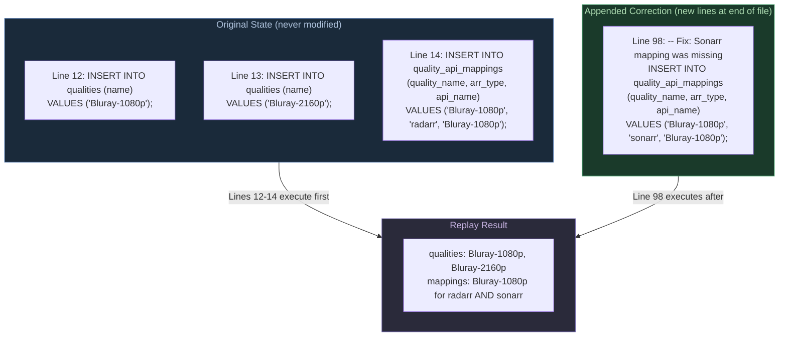
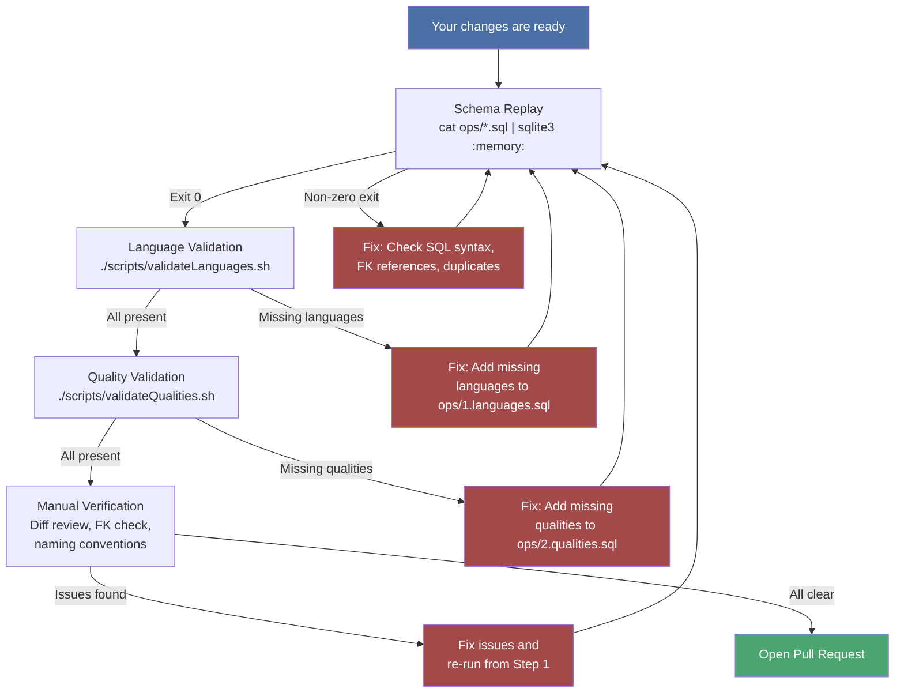
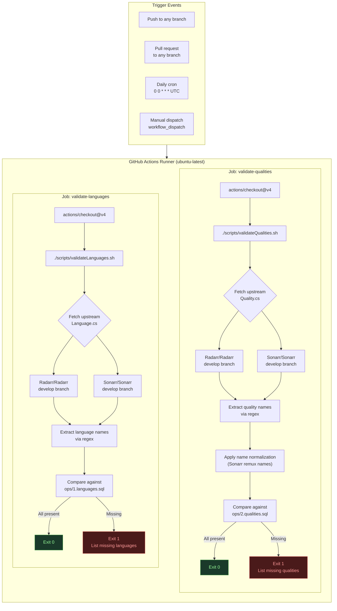
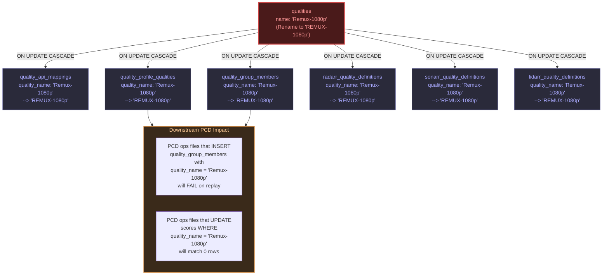

# Contributing

Thank you for your interest in contributing to the Praxrr Schema. Before you begin, please read this
document in its entirety. This schema is the structural foundation for **every** Praxrr Compliant
Database (PCD) and, by extension, every Praxrr installation. A single malformed column, a broken
foreign key, or an ill-considered table addition ripples across every database that builds on this
schema. The bar for changes here is intentionally high.

This repository currently defines **36 tables**, **64 languages**, **67 qualities**, and the
complete foreign key graph that all PCDs depend on. Changes are not routine maintenance -- they are
architectural decisions with downstream consequences.

---

## Table of Contents

- [Before Contributing](#before-contributing)
  - [Discussion Channels](#discussion-channels)
  - [Proposal Requirements](#proposal-requirements)
  - [Proposal Template](#proposal-template)
  - [What Makes a Good Proposal](#what-makes-a-good-proposal)
- [Impact Hierarchy](#impact-hierarchy)
- [Contribution Workflow](#contribution-workflow)
- [Types of Changes](#types-of-changes)
  - [Schema Changes (Highest Impact)](#schema-changes-highest-impact)
  - [Seed Data Updates (Medium Impact)](#seed-data-updates-medium-impact)
  - [Documentation Changes (Low Impact)](#documentation-changes-low-impact)
  - [Script and CI Changes (Low Impact)](#script-and-ci-changes-low-impact)
- [Development Workflow](#development-workflow)
  - [Fork and Branch Strategy](#fork-and-branch-strategy)
  - [How Ops Files Work](#how-ops-files-work)
  - [The Append-Only Principle](#the-append-only-principle)
  - [Common Change Patterns](#common-change-patterns)
- [Testing Your Changes](#testing-your-changes)
  - [Step 1: Schema Replay](#step-1-schema-replay)
  - [Step 2: Language Validation](#step-2-language-validation)
  - [Step 3: Quality Validation](#step-3-quality-validation)
  - [Step 4: Manual Verification](#step-4-manual-verification)
- [CI Validation Pipeline](#ci-validation-pipeline)
- [Foreign Key Cascading](#foreign-key-cascading)
- [Commit Message Format](#commit-message-format)
- [Review Checklist](#review-checklist)
- [What NOT to Do](#what-not-to-do)
- [Cross-References](#cross-references)

---

## Before Contributing

**ALL contributions must be discussed and approved before submitting a pull request.** This is not
negotiable. There are no exceptions.

Unsolicited pull requests -- even well-intentioned ones -- will be closed without review if they
were not preceded by an approved discussion. This policy exists for three reasons:

1. **Blast radius.** Every PCD inherits this schema. A schema change that seems local can break
   foreign key relationships, invalidate seed data assumptions, or force rewriting ops across dozens
   of downstream databases.

2. **Append-only history.** The project uses
   [Operational SQL (OSQL)](docs/structure.md#2-operational-sql-osql), where operations are
   append-only and never edited or deleted. A mistake that gets merged cannot be quietly fixed -- it
   must be corrected with additional compensating operations, permanently visible in the history.

3. **Coordination cost.** Other contributors and PCD authors may be working against the current
   schema. Uncoordinated changes create merge conflicts in ops files, broken recompiles, and wasted
   effort.

### Discussion Channels

- **GitHub Issues** -- [Open an issue](https://github.com/yandy-r/praxrr-schema/issues) for
  structured, long-form proposals that need a permanent record. Issues are preferred when the change
  is complex, requires detailed analysis, or when you want to reference the discussion later in a
  PR.

- **Database Discussions** --
  [GitHub Discussions (praxrr-db)](https://github.com/yandy-r/praxrr-db/discussions) for broader
  community discussion about how schema changes affect downstream PCDs and database content.

### Proposal Requirements

When proposing a change, your proposal **must** include all four of the following:

1. **The Problem** -- What limitation, inconsistency, or missing capability does this address? Be
   specific. "It would be nice to have X" is not sufficient. Explain what is currently impossible or
   broken, and provide concrete examples. If the problem was discovered while building a PCD,
   describe the exact scenario.

2. **The Proposed Solution** -- What specific schema change are you proposing? Include the exact SQL
   you envision: `CREATE TABLE`, `ALTER TABLE`, new `INSERT` statements, or column additions. Show
   the DDL, not just a description. For seed data changes, list the exact values being added or
   modified.

3. **Impact Analysis** -- How does this affect existing PCDs and Praxrr installations? Consider:
   - Will existing ops files in downstream PCDs still replay correctly?
   - Does this add, remove, or rename any columns that downstream ops reference?
   - Does this change any foreign key targets that other tables depend on?
   - Will Praxrr itself need code changes to handle the new schema?

4. **Migration Path** -- How would existing databases adapt to this change? Since OSQL is
   append-only, you cannot edit history. Describe what compensating operations (if any) downstream
   PCD authors would need to append to remain compatible. If the change is purely additive (new
   table, new seed rows), state that explicitly.

### Proposal Template

Copy this template into your GitHub Issue to ensure all required information is present:

````markdown
## Problem

<!-- What limitation, inconsistency, or missing capability does this address?
     Provide concrete examples. If discovered while building a PCD, describe
     the exact scenario that surfaced the issue. -->

## Proposed Solution

<!-- What specific schema change are you proposing? Include exact SQL:
     CREATE TABLE, ALTER TABLE, INSERT, column additions, etc.
     Show the DDL, not just a description. -->

```sql
-- Paste your proposed SQL here
```
````

## Impact Analysis

<!-- How does this affect existing PCDs and Praxrr installations? -->

- [ ] Existing downstream ops files still replay correctly
- [ ] No columns referenced by downstream ops are renamed or removed
- [ ] No foreign key targets that other tables depend on are changed
- [ ] Praxrr application code does / does not need changes (explain)
- [ ] Validation scripts still pass
- [ ] Schema replay (`cat ops/*.sql | sqlite3 :memory:`) succeeds

## Migration Path

<!-- How would existing databases adapt? What compensating operations
     would downstream PCD authors need to append? If purely additive,
     state that explicitly. -->

## Change Category

<!-- Check one: -->

- [ ] Schema change (new table, column, constraint, index)
- [ ] Seed data update (new language, quality, API mapping)
- [ ] Documentation change
- [ ] Script / CI change

````

### What Makes a Good Proposal

A good proposal demonstrates that the author has studied the schema and understands the
consequences. Here are examples of strong vs. weak proposals:

**Strong proposal:**

> "When building a PCD for Lidarr, I cannot define quality size limits because the schema only has
> `radarr_quality_definitions` and `sonarr_quality_definitions`. Lidarr uses different quality
> names and size ranges. I propose adding a `lidarr_quality_definitions` table with the same
> structure as the existing tables, using `quality_name` as a FK to `qualities(name)`. This is
> purely additive -- no existing table or column is modified. Downstream PCDs are unaffected.
> The validation script needs updating to check Lidarr qualities."

**Weak proposal:**

> "We should add Lidarr support."

The first proposal includes the problem (cannot define Lidarr quality sizes), the solution (a new
table matching existing conventions), the impact (purely additive, no breakage), and the migration
path (none needed). The second proposal requires the maintainer to do all of this analysis, which
means it will sit unreviewed.

**Another strong proposal:**

> "Sonarr uses `Bluray-1080p Remux` as its API name for what we call `Remux-1080p`. The
> `quality_api_mappings` table already handles this for Radarr and Sonarr, but I discovered that
> the mapping for `Remux-2160p` is missing for Sonarr. Here is the corrective INSERT:
> `INSERT INTO quality_api_mappings (quality_name, arr_type, api_name) VALUES ('Remux-2160p', 'sonarr', 'Bluray-2160p Remux');`
> This is a seed data addition. No existing rows are modified."

---

## Impact Hierarchy

Not all changes carry the same risk. The following diagram shows the impact hierarchy from highest
to lowest risk, along with the expected review intensity for each category.

```mermaid
flowchart TD
    subgraph highest["CRITICAL RISK"]
        S["Schema Changes\nops/0.schema.sql"]
    end

    subgraph high["HIGH RISK"]
        SD["Seed Data Updates\nops/1.languages.sql\nops/2.qualities.sql"]
    end

    subgraph medium["MODERATE RISK"]
        SC["Script Changes\nscripts/*.sh"]
        CI["CI Changes\n.github/workflows/"]
    end

    subgraph low["LOW RISK"]
        D["Documentation\ndocs/, *.md"]
    end

    S -->|"Can break every PCD\nand Praxrr itself"| SD
    SD -->|"Can break downstream\nFK references"| SC
    SC -->|"Can mask real\nvalidation failures"| CI
    CI -->|"No runtime\nimpact"| D

    style highest fill:#4a1a1a,stroke:#cc4444,color:#ff9999,stroke-width:3px
    style high fill:#4a2a1a,stroke:#cc8844,color:#ffcc99,stroke-width:2px
    style medium fill:#3a3a1a,stroke:#aaaa44,color:#ffffaa,stroke-width:2px
    style low fill:#1a3a1a,stroke:#44aa44,color:#99ff99,stroke-width:1px
````

**Key insight:** A schema change at the top of this hierarchy can trigger required updates at every
level below it. Adding a new table may require new seed data, new validation scripts, new CI checks,
and new documentation. Always consider the full cascade before proposing a change.

---

## Contribution Workflow

The following diagram shows the required path from idea to merged contribution. No step may be
skipped.

```mermaid
flowchart TD
    A["1. Propose Change\n(GitHub Issue using template)"] --> B{"2. Community\nDiscussion"}
    B -->|Rejected| C["Close Proposal\n(Document reasoning)"]
    B -->|Needs Revision| A
    B -->|Approved| D["3. Fork & Create Branch\n(feat/, fix/, docs/, ci/)"]
    D --> E["4. Implement Changes\n(Follow ops conventions)"]
    E --> F["5. Test Locally"]
    F --> F1["Schema replay\ncat ops/*.sql | sqlite3 :memory:"]
    F --> F2["Validate languages\n./scripts/validateLanguages.sh"]
    F --> F3["Validate qualities\n./scripts/validateQualities.sh"]
    F1 -->|Fails| E
    F2 -->|Fails| E
    F3 -->|Fails| E
    F1 -->|Passes| G{"All 3 pass?"}
    F2 -->|Passes| G
    F3 -->|Passes| G
    G -->|No| E
    G -->|Yes| H["6. Open Pull Request\n(Reference approved issue)"]
    H --> I{"7. Code Review\n(See Review Checklist)"}
    I -->|Changes Requested| E
    I -->|Approved| J["8. Merge to main"]

    style A fill:#4a6fa5,color:#fff
    style C fill:#a54a4a,color:#fff
    style J fill:#4aa56f,color:#fff
    style F1 fill:#2a4a6a,color:#ddd
    style F2 fill:#2a4a6a,color:#ddd
    style F3 fill:#2a4a6a,color:#ddd
```

Every pull request **must** reference the discussion or issue where the change was approved. PRs
without a linked approval will be closed.

---

## Types of Changes

Understand the category of your change and the scrutiny it will receive.

### Schema Changes (Highest Impact)

Changes to `ops/0.schema.sql`: new tables, column additions, foreign key modifications, CHECK
constraint changes, or index additions.

- **Risk:** Affects every PCD that builds on this schema. Can break downstream ops, invalidate
  existing data, or require Praxrr code changes.
- **Review bar:** Requires detailed proposal, impact analysis, and explicit maintainer approval.

**Example -- Adding a new table:**

A new table must follow the established conventions: name-based foreign keys, `UNIQUE` name
columns, `ON DELETE CASCADE ON UPDATE CASCADE`, and timestamp columns.

```sql
-- New table following schema conventions
CREATE TABLE lidarr_quality_definitions (
    name VARCHAR(100) NOT NULL,
    quality_name VARCHAR(100) NOT NULL,
    min_size INTEGER NOT NULL DEFAULT 0,
    max_size INTEGER NOT NULL,
    preferred_size INTEGER NOT NULL,
    created_at TEXT NOT NULL DEFAULT CURRENT_TIMESTAMP,
    updated_at TEXT NOT NULL DEFAULT CURRENT_TIMESTAMP,
    PRIMARY KEY (name, quality_name),
    FOREIGN KEY (quality_name) REFERENCES qualities(name)
        ON DELETE CASCADE ON UPDATE CASCADE
);
```

Note the conventions this follows:

- `quality_name` FK references `qualities(name)`, not `qualities(id)`
- Composite primary key `(name, quality_name)` uses names, not IDs
- `ON DELETE CASCADE ON UPDATE CASCADE` on the FK
- `created_at` and `updated_at` timestamp columns

**Example -- Adding a column to an existing table:**

```sql
-- Adding include_in_rename to custom_formats
-- Since OSQL is append-only, this would be appended to 0.schema.sql
-- (In practice, for the Schema PCD, this means editing the CREATE TABLE
-- directly, since the schema file is the base layer.)
CREATE TABLE custom_formats (
    id INTEGER PRIMARY KEY AUTOINCREMENT,
    name VARCHAR(100) UNIQUE NOT NULL,
    description TEXT,
    include_in_rename INTEGER NOT NULL DEFAULT 0,  -- NEW COLUMN
    created_at TEXT NOT NULL DEFAULT CURRENT_TIMESTAMP,
    updated_at TEXT NOT NULL DEFAULT CURRENT_TIMESTAMP
);
```

**Example -- Adding a CHECK constraint:**

```sql
-- CHECK constraints act as enum definitions
-- Praxrr generates types from them
CREATE TABLE delay_profiles (
    -- ...
    preferred_protocol VARCHAR(20) NOT NULL CHECK (
        preferred_protocol IN (
            'prefer_usenet',
            'prefer_torrent',
            'only_usenet',
            'only_torrent'
        )
    ),
    -- ...
);
```

### Seed Data Updates (Medium Impact)

Changes to `ops/1.languages.sql` or `ops/2.qualities.sql`: adding new languages, adding new
qualities, or updating API mappings.

- **Risk:** New entries are generally safe. Modifying or removing existing entries can break
  downstream foreign key references (e.g., a PCD that references a language by name in its ops).
- **Review bar:** Must demonstrate that the upstream arr application (Radarr, Sonarr, or Lidarr)
  actually supports the new entry. Validation scripts must pass.

**Example -- Adding a new language:**

```sql
-- Append to the end of ops/1.languages.sql
-- NEVER insert into the middle of existing INSERT statements
INSERT INTO languages (name) VALUES ('Tagalog');
```

**Example -- Adding new qualities with API mappings:**

```sql
-- Append to ops/2.qualities.sql
-- First, add the quality definition
INSERT INTO qualities (name) VALUES ('FLAC-24bit');

-- Then add the arr-specific API mapping
INSERT INTO quality_api_mappings (quality_name, arr_type, api_name)
VALUES ('FLAC-24bit', 'lidarr', 'FLAC 24bit Lossless');
```

**Example -- Correcting an API mapping name:**

```sql
-- WRONG: editing the original INSERT (violates append-only)
-- RIGHT: append a corrective UPDATE at the end of the file
UPDATE quality_api_mappings
SET api_name = 'Bluray-1080p Remux'
WHERE quality_name = 'Remux-1080p'
  AND arr_type = 'sonarr';
```

### Documentation Changes (Low Impact)

Changes to Markdown files, diagrams, or comments within SQL files.

- **Risk:** Minimal. Documentation errors do not affect runtime behavior.
- **Review bar:** Standard review for accuracy and clarity.
- **Examples:** Fixing a typo in [docs/structure.md](docs/structure.md), improving a table comment
  in the schema, updating [CHANGELOG.md](CHANGELOG.md).

### Script and CI Changes (Low Impact)

Changes to `scripts/` or `.github/workflows/`.

- **Risk:** Low for the schema itself, but a broken validation script can mask real problems. A
  false-passing CI pipeline is worse than no CI at all.
- **Review bar:** Must demonstrate that the script or workflow change does not weaken existing
  validation guarantees.

**Example -- Adding a new upstream source to validate against:**

When Lidarr quality validation was added, the `validateQualities.sh` script needed to fetch
`Quality.cs` from a third repository:

```bash
LIDARR_URL="https://raw.githubusercontent.com/Lidarr/Lidarr/develop/src/NzbDrone.Core/Qualities/Quality.cs"

echo "Fetching Lidarr qualities..."
LIDARR_QUALS=$(curl -s "$LIDARR_URL" | grep -oP 'public static Quality \w+ => new Quality\(\d+, "\K[^"]+' | sort -u)
```

**Example -- Handling naming differences between arr applications:**

The validation script must account for cases where upstream arr applications use different names
for the same quality:

```bash
# Sonarr uses 'Bluray-1080p Remux' where the schema uses 'Remux-1080p'
SONARR_QUALS=$(echo "$SONARR_QUALS" \
    | sed 's/Bluray-1080p Remux/Remux-1080p/' \
    | sed 's/Bluray-2160p Remux/Remux-2160p/' \
    | sort -u)
```

---

## Development Workflow

### Fork and Branch Strategy

1. Fork the repository on GitHub.
2. Create a feature branch from `main`:

   ```bash
   git checkout -b feat/add-new-condition-type main
   ```

3. Use a descriptive branch name. Prefix with the change type:
   - `feat/` -- new tables, columns, or seed data
   - `fix/` -- corrections to existing schema or data
   - `docs/` -- documentation-only changes
   - `ci/` -- script or workflow changes

### How Ops Files Work

The `ops/` directory contains Operational SQL files that are executed **in numeric order** to build
the database from scratch:

| File              | Purpose                              | Contents                                                              |
| ----------------- | ------------------------------------ | --------------------------------------------------------------------- |
| `0.schema.sql`    | DDL -- all table definitions         | `CREATE TABLE` statements, indexes, constraints                       |
| `1.languages.sql` | Seed data -- 64 languages            | `INSERT INTO languages` values                                        |
| `2.qualities.sql` | Seed data -- 67 qualities + mappings | `INSERT INTO qualities` and `INSERT INTO quality_api_mappings` values |

Key rules for ops files:

- **Ordered execution.** Files run in numeric prefix order: `0`, then `1`, then `2`. The number
  prefix determines execution order.
- **Append-only.** Never edit or delete existing content in an ops file. If you need to correct
  something, append new operations. This is the core
  [OSQL principle](docs/structure.md#2-operational-sql-osql).
- **Idempotent rebuild.** Running all ops files in order against an empty SQLite database must
  produce a valid, fully-formed database with no errors.

For a deeper understanding of how OSQL and Change-Driven Development (CDD) work together, see
the [PCD Architecture documentation](docs/structure.md).

### The Append-Only Principle

The append-only principle is the defining constraint of OSQL. Understanding it is essential before
contributing any change. The following diagram illustrates how corrections work in an append-only
system.



**What this means in practice:**

- Lines 12-14 were written during the initial schema development and must never be edited.
- Line 98 was appended later when the missing Sonarr mapping was discovered.
- On replay, both the original lines and the correction execute in order. The final database has
  the correct state.
- The history permanently records that the mapping was initially missing and later added. This
  audit trail is a feature, not a deficiency.

### Common Change Patterns

The following patterns cover the most frequent types of contributions. Use these as templates.

#### Pattern 1: Adding a New Table

1. Add the `CREATE TABLE` statement to the end of `ops/0.schema.sql`.
2. Follow the existing conventions: name-based FKs, `ON DELETE CASCADE ON UPDATE CASCADE`,
   `created_at`/`updated_at` timestamps.
3. If the table needs seed data, create or append to an ops file with the next numeric prefix.

```sql
-- Appended to the end of ops/0.schema.sql

-- Whisparr quality size definitions
-- Uses stable key: (name, quality_name)
CREATE TABLE whisparr_quality_definitions (
    name VARCHAR(100) NOT NULL,
    quality_name VARCHAR(100) NOT NULL,
    min_size INTEGER NOT NULL DEFAULT 0,
    max_size INTEGER NOT NULL,
    preferred_size INTEGER NOT NULL,
    created_at TEXT NOT NULL DEFAULT CURRENT_TIMESTAMP,
    updated_at TEXT NOT NULL DEFAULT CURRENT_TIMESTAMP,
    PRIMARY KEY (name, quality_name),
    FOREIGN KEY (quality_name) REFERENCES qualities(name)
        ON DELETE CASCADE ON UPDATE CASCADE
);
```

#### Pattern 2: Adding Seed Data Values

Append new `INSERT` statements to the end of the appropriate ops file. Never insert into the middle
of an existing `INSERT` block.

```sql
-- Appended to the end of ops/1.languages.sql

-- Added in response to Radarr v5.x adding Tagalog support
INSERT INTO languages (name) VALUES ('Tagalog');
```

#### Pattern 3: Correcting a Typo in Seed Data

Because ops files are append-only, a typo in seed data must be corrected with compensating
operations, not by editing the original line.

```sql
-- Original line (line 45, never modified):
-- INSERT INTO qualities (name) VALUES ('WEBDL-1080p');

-- Hypothetical correction appended to end of ops/2.qualities.sql:
-- Suppose the original had a typo 'WebDL-1080p' instead of 'WEBDL-1080p'
UPDATE qualities SET name = 'WEBDL-1080p' WHERE name = 'WebDL-1080p';

-- Note: Because all FKs use ON UPDATE CASCADE, this rename
-- automatically propagates to:
--   quality_api_mappings.quality_name
--   quality_group_members.quality_name
--   quality_profile_qualities.quality_name
--   radarr_quality_definitions.quality_name
--   sonarr_quality_definitions.quality_name
--   lidarr_quality_definitions.quality_name
```

#### Pattern 4: Adding an API Mapping for a New Arr Type

```sql
-- Appended to the end of ops/2.qualities.sql

-- Lidarr API mappings for audio qualities
INSERT INTO quality_api_mappings (quality_name, arr_type, api_name) VALUES
('MP3-128', 'lidarr', 'MP3-128'),
('MP3-160', 'lidarr', 'MP3-160'),
('MP3-192', 'lidarr', 'MP3-192'),
('MP3-256', 'lidarr', 'MP3-256'),
('MP3-320', 'lidarr', 'MP3-320'),
('FLAC', 'lidarr', 'FLAC');
```

---

## Testing Your Changes

Before opening a PR, you must verify your changes locally. Complete all four steps in order.

### Step 1: Schema Replay

Test that all ops files replay cleanly against an empty SQLite database:

```bash
cat ops/0.schema.sql ops/1.languages.sql ops/2.qualities.sql | sqlite3 :memory:
```

If this command exits with a non-zero status or prints any errors, your changes have broken the
schema. Every `CREATE TABLE`, `INSERT`, and foreign key constraint must be satisfied when replayed
in order.

**Common failures at this step:**

| Error                           | Cause                                                      |
| ------------------------------- | ---------------------------------------------------------- |
| `UNIQUE constraint failed`      | Duplicate `INSERT` for a value that already exists         |
| `FOREIGN KEY constraint failed` | Referencing a name that does not exist in the parent table |
| `no such table`                 | Table referenced before it is created (ordering issue)     |
| `CHECK constraint failed`       | Value does not satisfy a CHECK constraint on the column    |
| `table already exists`          | Duplicate `CREATE TABLE` statement                         |

### Step 2: Language Validation

Check that all languages from upstream Radarr and Sonarr source code are present in the schema:

```bash
./scripts/validateLanguages.sh
```

**What this script does:**

1. Fetches `Language.cs` from the Radarr `develop` branch on GitHub
2. Fetches `Language.cs` from the Sonarr `develop` branch on GitHub
3. Extracts all language names from both files using regex
4. Extracts all language names from `ops/1.languages.sql`
5. Compares the sets: any language present upstream but missing from the schema causes a failure

**Expected output on success:**

```
✓ All Radarr languages present (XX)
✓ All Sonarr languages present (XX)
Total unique languages in schema: 64
```

### Step 3: Quality Validation

Check that all qualities from upstream Radarr, Sonarr, and Lidarr source code are present:

```bash
./scripts/validateQualities.sh
```

**What this script does:**

1. Fetches `Quality.cs` from Radarr, Sonarr, and Lidarr `develop` branches
2. Extracts quality names, handling naming differences (e.g., Sonarr's `Bluray-1080p Remux` maps
   to the schema's `Remux-1080p`)
3. Extracts quality names from `ops/2.qualities.sql`
4. Compares: any quality present upstream but missing from the schema causes a failure

**Expected output on success:**

```
✓ All Radarr qualities present (XX)
✓ All Sonarr qualities present (XX)
Total unique qualities in schema: 67
```

### Step 4: Manual Verification

After automated checks pass, manually verify your changes:

1. **Read the diff.** Run `git diff` and review every changed line. Ask yourself: "Does this
   follow the naming conventions used in the rest of the file?"
2. **Check foreign key references.** If you added a new FK, verify that the referenced column
   has a `UNIQUE` constraint and that `ON DELETE CASCADE ON UPDATE CASCADE` is specified.
3. **Check the CHANGELOG.** If your change is user-visible, ensure you have added an entry to
   [CHANGELOG.md](CHANGELOG.md).
4. **Check naming consistency.** Table names are `snake_case` and plural. Column names are
   `snake_case`. Constraint values match the casing used in upstream arr applications.

The following diagram shows the complete local validation pipeline:



---

## CI Validation Pipeline

The repository runs automated validation on every push, every pull request, and on a daily schedule
via the `validate.yml` workflow. The following diagram shows how the validation scripts interact
with upstream sources and the local schema.



**Key details:**

- Both validation jobs run **in parallel** on separate `ubuntu-latest` runners.
- The daily cron run (`0 0 * * *` UTC) catches cases where an upstream arr application adds a new
  language or quality to their `develop` branch. If the daily run fails, a seed data update is
  needed.
- Both validation jobs **must** pass before a PR can be merged. There are no overrides.
- The scripts fetch directly from GitHub raw content URLs (e.g.,
  `https://raw.githubusercontent.com/Radarr/Radarr/develop/src/NzbDrone.Core/Languages/Language.cs`),
  so they require network access.
- The `workflow_dispatch` trigger allows maintainers to manually re-run validation at any time.

---

## Foreign Key Cascading

All foreign keys in the schema use `ON DELETE CASCADE ON UPDATE CASCADE`. This means renaming or
deleting a value in a core entity table cascades through the entire relational graph. Understanding
this cascade is critical before proposing any change that modifies existing seed data.

The following diagram shows what happens when a quality name is renamed. This illustrates why
renaming is a high-risk operation.



**The cascade within the schema itself is automatic** -- SQLite handles propagating the rename
through all tables that reference `qualities(name)`. However, the cascade does **not** extend to
downstream PCD ops files. Those files contain hardcoded string values like
`quality_name = 'Remux-1080p'`. After a rename, those hardcoded strings no longer match anything,
causing silent failures (zero rows affected) or loud failures (FK constraint violations on INSERT).

This is why renaming existing seed data values is treated as a **breaking change** requiring a
major version bump and coordinated migration across all downstream PCDs.

---

## Commit Message Format

Use [Conventional Commits](https://www.conventionalcommits.org/) format:

```
<type>: <description>

[optional body]
```

**Types:**

| Type       | Use For                                            |
| ---------- | -------------------------------------------------- |
| `feat`     | New tables, columns, seed data entries             |
| `fix`      | Corrections to schema, data, or constraints        |
| `docs`     | Documentation changes only                         |
| `ci`       | CI workflow or validation script changes           |
| `refactor` | Schema restructuring with no functional change     |
| `chore`    | Maintenance tasks (dependency updates, formatting) |

**Examples:**

```
feat: add lidarr_quality_definitions table to schema

feat: add Lidarr qualities and mappings

fix: correct Sonarr remux quality API mapping name

docs: expand CONTRIBUTING.md with development workflow

ci: update validateQualities.sh to handle Lidarr
```

Keep the subject line under 72 characters. Use the body for additional context when the subject
alone is not sufficient.

---

## Review Checklist

Reviewers evaluate every PR against this checklist. Familiarizing yourself with it before submitting
will reduce review cycles.

### Schema Changes

- [ ] New tables follow naming conventions (`snake_case`, plural)
- [ ] All foreign keys reference `UNIQUE` name columns, not autoincrement IDs
- [ ] All foreign keys specify `ON DELETE CASCADE ON UPDATE CASCADE`
- [ ] New tables include `created_at` and `updated_at` timestamp columns where appropriate
- [ ] CHECK constraints are used for enum-like columns
- [ ] The table participates in the relational graph (no orphan tables)
- [ ] `cat ops/0.schema.sql ops/1.languages.sql ops/2.qualities.sql | sqlite3 :memory:` succeeds
- [ ] Impact on downstream PCDs has been analyzed and documented

### Seed Data Changes

- [ ] New values are appended to the end of the file, not inserted into existing blocks
- [ ] No existing lines have been edited or deleted
- [ ] New entries correspond to values actually present in upstream arr source code
- [ ] Validation scripts (`validateLanguages.sh`, `validateQualities.sh`) pass
- [ ] API mappings are provided for all relevant arr types
- [ ] Schema replay succeeds with no constraint violations

### Documentation Changes

- [ ] Content is accurate and matches the current implementation
- [ ] Cross-references to other docs are correct (links resolve)
- [ ] Mermaid diagrams render correctly
- [ ] No sensitive information is exposed

### Script and CI Changes

- [ ] Existing validation guarantees are not weakened
- [ ] New validation covers the intended cases
- [ ] Scripts handle edge cases (network failures, naming differences)
- [ ] The workflow triggers are appropriate (push, PR, cron)

### All Changes

- [ ] PR references an approved GitHub Issue or Discussion
- [ ] Commit messages follow Conventional Commits format
- [ ] Branch name uses the correct prefix (`feat/`, `fix/`, `docs/`, `ci/`)
- [ ] CHANGELOG.md is updated if the change is user-visible
- [ ] No unrelated changes are included in the PR

---

## What NOT to Do

These are hard rules. Violating any of them will result in immediate PR rejection.

- **Do not edit existing lines in ops files.** OSQL is append-only. If a previous `INSERT` has a
  typo, append a corrective `UPDATE` or `DELETE` + `INSERT` -- do not modify the original line.
  This preserves the audit trail and ensures that the ops history remains a truthful record of how
  the schema evolved. Editing history makes it impossible to reason about what changed and when.
  See the [Append-Only Principle](#the-append-only-principle) section for the correct approach.

- **Do not submit a PR without prior discussion.** This has been stated multiple times in this
  document because it is the single most common mistake. The answer will always be "close and
  discuss first." Even a perfect implementation will be rejected if it was not preceded by an
  approved discussion. The discussion requirement exists to catch design issues before
  implementation effort is spent, and to ensure other contributors are aware of in-flight changes.

- **Do not break foreign key relationships.** Every foreign key in the schema references a `UNIQUE`
  name column. If you rename a value in a core entity table (e.g., renaming a language or quality),
  you break every downstream reference. Renaming is effectively a delete + recreate, which requires
  a coordinated migration. See the [Foreign Key Cascading](#foreign-key-cascading) section for a
  detailed explanation of the cascade effect.

- **Do not use autoincrement IDs in foreign keys.** The schema deliberately uses name-based stable
  keys so that databases remain correctly linked after recompile from ops. Autoincrement IDs are
  assigned at `INSERT` time and shift if a new row is inserted earlier in the ops sequence. Name-
  based FKs are deterministic regardless of insertion order. This is the foundational design
  decision that makes OSQL viable. See
  [Key Design Decisions](docs/structure.md#8-key-design-decisions) in the architecture docs.

- **Do not add tables without foreign keys to existing tables.** Orphan tables that reference
  nothing and are referenced by nothing are a sign of a design problem. Every table should
  participate in the relational graph. If a table genuinely has no relationships, that usually means
  it either belongs in a different repository or its design needs rethinking.

- **Do not modify CHECK constraints without understanding all downstream consumers.** CHECK
  constraints act as enum definitions. Praxrr generates types from them. Changing a CHECK changes
  the type system, which means Praxrr application code must be updated simultaneously. Adding a
  new value to a CHECK is a schema change with code implications.

- **Do not reorder ops files.** The numeric prefix defines execution order. Reordering or
  renumbering breaks the append-only guarantee and invalidates the replay sequence. File `0` runs
  before `1`, which runs before `2`. This order is permanent. If you need a new file, use the
  next available numeric prefix.

- **Do not add runtime logic to ops files.** Ops files contain only DDL (`CREATE TABLE`) and DML
  (`INSERT`, `UPDATE`, `DELETE`). No triggers, no views, no stored procedures, no application logic.
  The ops files describe data and structure, not behavior. Runtime logic belongs in the Praxrr
  application, not in the schema.

- **Do not use `ALTER TABLE` in the Schema PCD.** The Schema PCD's `0.schema.sql` is the base
  layer -- it defines tables from scratch. There is no prior state to alter. `ALTER TABLE` is
  appropriate in downstream PCD ops (Layers 3-5) where a table already exists from an earlier
  layer, but not in the schema definition itself.

---

## Cross-References

This document focuses on the contribution process. For deeper technical context, consult these
companion documents:

| Document                               | What It Covers                                                    |
| -------------------------------------- | ----------------------------------------------------------------- |
| [README.md](README.md)                 | Schema overview, table groups, key concepts, repository structure |
| [docs/structure.md](docs/structure.md) | OSQL, CDD, Layers, schema architecture, condition type system     |
| [docs/manifest.md](docs/manifest.md)   | `pcd.json` specification, versioning guidelines                   |
| [CHANGELOG.md](CHANGELOG.md)           | Complete history of schema changes                                |

**Specific sections frequently relevant to contributors:**

- [OSQL: The Four Properties](docs/structure.md#2-operational-sql-osql) -- Explains append-only,
  ordered, replayable, and relational properties in depth.
- [CDD: Change-Driven Development](docs/structure.md#3-change-driven-development-cdd) -- The
  workflow for expressing changes as SQL operations with value guards.
- [Name-Based Foreign Keys](docs/structure.md#8-key-design-decisions) -- Why IDs are unstable and
  names are stable across recompiles.
- [Condition Type System](docs/structure.md#7-condition-type-system) -- The type-dispatched
  architecture for custom format conditions (relevant if adding a new condition type).
- [Manifest Versioning](docs/manifest.md#versioning) -- When to bump MAJOR, MINOR, or PATCH
  versions after a schema change.
