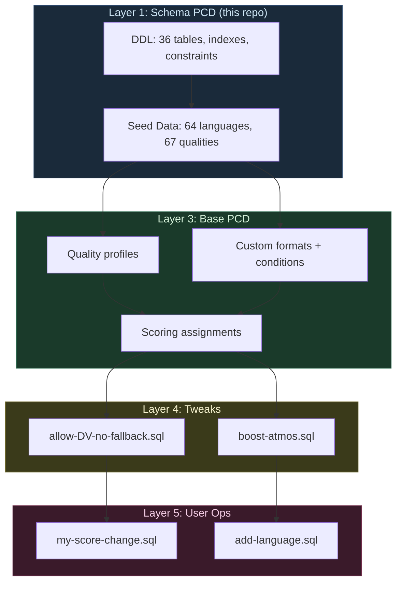
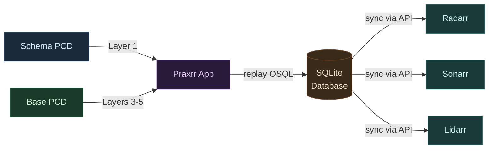
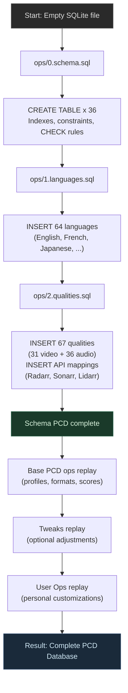
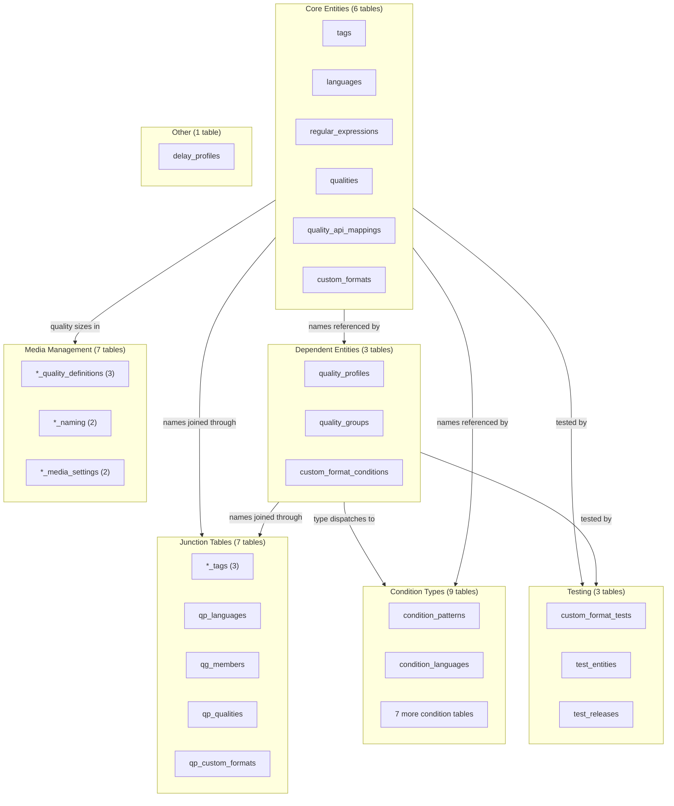
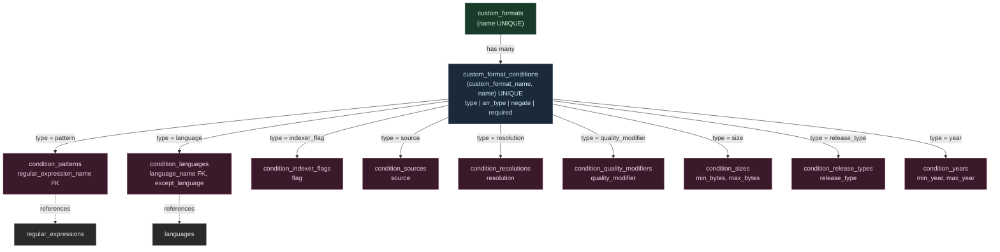
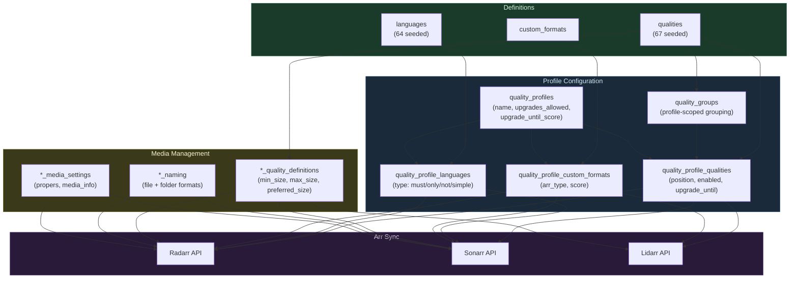
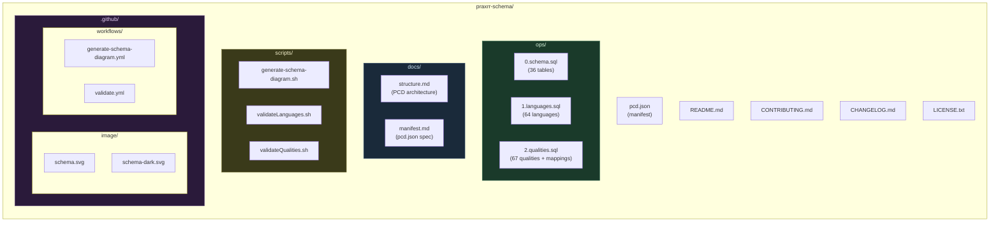

# Praxrr Schema

The **base SQLite schema** for all [Praxrr Compliant Databases (PCDs)](https://github.com/yandy-r/praxrr) is maintained in the monorepo at
`praxrr/packages/praxrr-schema`. This repository defines the structural foundation -- tables, constraints,
indexes, and seed data -- that every PCD builds upon.
It supports **Radarr**, **Sonarr**, and **Lidarr** media management applications.

## Distribution and release workflow

This is a distribution mirror of the main Praxrr monorepo:
[`https://github.com/yandy-r/praxrr`](https://github.com/yandy-r/praxrr).

Source-of-truth locations for this package:

- Package source: `praxrr/packages/praxrr-schema`
- Mirror publish workflow: `praxrr/.github/workflows/publish-schema.yml`

Do not edit this repository directly. Changes must be made in the monorepo and are published automatically
via the workflow above using `git subtree split`.

PCDs describe a database as a sequence of SQL operations, not as final data. The stored artifact is
**how to build the state**, not the state itself. This schema is the first layer in that sequence:
it creates the DDL (tables and constraints), then seeds canonical data (languages and qualities)
that downstream PCDs depend on. Every PCD must declare `schema` as a dependency in its manifest.

---

## Table of Contents

- [Distribution and release workflow](#distribution-and-release-workflow)
- [What Is a PCD?](#what-is-a-pcd)
- [Schema Diagram](#schema-diagram)
- [How It Works](#how-it-works)
- [Quick Start](#quick-start)
- [Schema Overview](#schema-overview)
- [Table Groups](#table-groups)
- [Condition Type System](#condition-type-system)
- [Quality Profile Pipeline](#quality-profile-pipeline)
- [Key Concepts](#key-concepts)
- [Repository Structure](#repository-structure)
- [Validation and CI](#validation-and-ci)
- [Documentation](#documentation)
- [Contributing](#contributing)
- [Changelog](#changelog)
- [License](#license)

---

## What Is a PCD?

A **Praxrr Compliant Database (PCD)** is a SQLite database described entirely as a sequence of SQL
operations rather than as a final data snapshot. The stored artifact is **how to build the state**,
not **the state itself**. This operational approach means any PCD can be rebuilt from scratch at any
time by replaying its operations in order, producing a deterministic, identical result.

PCDs solve a fundamental problem in media automation: managing complex, interrelated configurations
for applications like Radarr, Sonarr, and Lidarr in a way that is **versionable**, **composable**,
**auditable**, and **conflict-aware**.

The following diagram shows how PCDs are layered and composed. The **Schema PCD** (this repository)
is the foundation. **Base PCDs** build on it with profiles and custom formats. **Tweaks** optionally
adjust Base PCD behavior. **User Ops** add personal customizations. Together, these layers produce a
complete database that Praxrr syncs to arr applications.



The Praxrr application orchestrates this entire pipeline: it fetches PCDs, replays their operations
in layer order into a SQLite database, and then syncs the resulting configuration to running arr
instances via their APIs.



For a complete treatment of PCD architecture, OSQL, CDD, and Layers, see
[docs/structure.md](docs/structure.md).

---

## Schema Diagram

Auto-generated from `ops/0.schema.sql` by the
[Generate Schema Diagram](.github/workflows/generate-schema-diagram.yml) workflow. Do not edit the
SVGs by hand.

<p align="center">
  <picture>
    <source media="(prefers-color-scheme: dark)" srcset=".github/image/schema-dark.svg">
    <source media="(prefers-color-scheme: light)" srcset=".github/image/schema.svg">
    
  </picture>
</p>

---

## How It Works

The PCD build pipeline transforms ordered SQL operation files into a complete, usable SQLite
database through a process called **OSQL replay**. Each ops file executes in numeric order against a
fresh SQLite instance. The result is deterministic: the same operations always produce the same
database.



**Key properties of OSQL replay:**

1. **Append-only.** Operations are never edited or deleted. To change behavior, a new operation is
   appended that overrides the effect of the earlier one.
2. **Ordered.** File names encode execution order (`0.schema.sql`, `1.languages.sql`,
   `2.qualities.sql`). Within a file, statements execute top-to-bottom.
3. **Replayable.** Anyone can rebuild the database by replaying all operations against a fresh
   SQLite file. The result is deterministic.
4. **Relational.** Standard constraints (foreign keys, CHECK, UNIQUE) are enforced throughout
   replay. Invalid operations fail loudly.

For the complete OSQL and CDD specification, see
[docs/structure.md -- Operational SQL](docs/structure.md#2-operational-sql-osql) and
[docs/structure.md -- Change-Driven Development](docs/structure.md#3-change-driven-development-cdd).

---

## Quick Start

### Replay the Schema Locally

The schema can be replayed into an in-memory SQLite database to verify correctness or explore the
table structure. This requires only the `sqlite3` command-line tool.

```bash
# Replay all three ops files into an in-memory database
cat ops/0.schema.sql ops/1.languages.sql ops/2.qualities.sql | sqlite3 :memory:
```

If this command exits with status 0 and no output, the schema is valid. Any constraint violations,
missing foreign keys, or syntax errors will produce error messages and a non-zero exit code.

### Replay to a File for Inspection

```bash
# Create a persistent database file
cat ops/0.schema.sql ops/1.languages.sql ops/2.qualities.sql | sqlite3 praxrr.db

# Explore the schema
sqlite3 praxrr.db ".tables"
sqlite3 praxrr.db ".schema qualities"
sqlite3 praxrr.db "SELECT COUNT(*) FROM languages;"  -- Returns 64
sqlite3 praxrr.db "SELECT COUNT(*) FROM qualities;"   -- Returns 67
```

### Query Seed Data

After replay, the database contains 64 languages and 67 qualities with their arr-specific API
mappings. These can be queried to understand what the schema provides.

```sql
-- List all seeded qualities with their arr API mappings
SELECT q.name, m.arr_type, m.api_name
FROM qualities q
LEFT JOIN quality_api_mappings m ON q.name = m.quality_name
ORDER BY q.name, m.arr_type;

-- Show qualities unique to a specific arr type
SELECT quality_name, api_name
FROM quality_api_mappings
WHERE arr_type = 'lidarr'
ORDER BY quality_name;

-- Show where Sonarr uses a different API name than the canonical name
SELECT quality_name, api_name
FROM quality_api_mappings
WHERE arr_type = 'sonarr' AND quality_name != api_name;
-- Returns: Remux-1080p -> Bluray-1080p Remux
--          Remux-2160p -> Bluray-2160p Remux
```

---

## Schema Overview

The schema contains **36 tables** organized into 7 logical groups. Each group serves a distinct role
in the PCD architecture and has defined dependency relationships with the other groups.



**Core Entities** are the foundation. They define the atomic data types -- tags, languages, regex
patterns, qualities, and custom formats -- that every other group references by name. These tables
have no foreign key dependencies and can be populated in any order. The schema seeds 64 languages
and 67 qualities into this layer.

**Dependent Entities** reference Core Entities through foreign keys. Quality profiles define media
acquisition strategies. Quality groups organize equivalent qualities within a profile. Custom format
conditions define the matching logic for custom formats and dispatch to type-specific child tables.

**Junction Tables** implement many-to-many relationships using composite name-based primary keys.
They connect profiles to languages, profiles to qualities (with ordering and upgrade semantics),
profiles to custom formats (with per-arr scoring), and various entities to tags.

**Condition Types** store the typed data for custom format conditions. The parent table
(`custom_format_conditions`) dispatches to one of nine child tables based on the `type` column. Each
child table stores only the columns relevant to that condition type, maintaining full relational
integrity.

**Testing Tables** store test cases for validating custom format matching and quality profile
behavior. They reference real TMDB movie and series data to enable realistic end-to-end testing.

**Media Management Tables** hold arr-specific configuration: quality size limits, file naming
formats, and general media settings. Each table is prefixed with its arr type (`radarr_`, `sonarr_`,
`lidarr_`) and supports multiple named configurations.

**Delay Profiles** control download timing preferences and protocol selection. They are standalone
configuration entities with CHECK constraints enforcing valid protocol/delay combinations.

---

## Table Groups

### Core Entity Tables (6 tables)

Independent tables with no foreign key dependencies. These form the foundation and can be populated
in any order.

| Table                  | Purpose                                                        | Key Columns                               | Seed Data                                  |
| ---------------------- | -------------------------------------------------------------- | ----------------------------------------- | ------------------------------------------ |
| `tags`                 | Reusable labels applied to regex, custom formats, and profiles | `name` (UNIQUE)                           | None (populated by Base PCDs)              |
| `languages`            | Language definitions for profiles and conditions               | `name` (UNIQUE)                           | 64 languages from Radarr/Sonarr upstream   |
| `regular_expressions`  | Regex patterns with optional regex101 links                    | `name` (UNIQUE), `pattern`, `regex101_id` | None (populated by Base PCDs)              |
| `qualities`            | Individual quality definitions                                 | `name` (UNIQUE)                           | 67 qualities (31 video + 36 audio)         |
| `quality_api_mappings` | Maps canonical names to arr-specific API names                 | `(quality_name, arr_type)` PK, `api_name` | 30 Radarr + 22 Sonarr + 38 Lidarr mappings |
| `custom_formats`       | Pattern/condition definitions for media matching               | `name` (UNIQUE), `include_in_rename`      | None (populated by Base PCDs)              |

The `quality_api_mappings` table is notable because it handles the naming differences between arr
applications. For example, the canonical quality name `Remux-1080p` maps to `Bluray-1080p Remux` in
Sonarr. Absence of a mapping row means the quality does not exist for that arr type.

```sql
-- Example: How the schema maps canonical names to arr-specific API names
-- Radarr uses the canonical name directly
INSERT INTO quality_api_mappings (quality_name, arr_type, api_name)
SELECT name, 'radarr', name FROM qualities WHERE name = 'Remux-1080p';

-- Sonarr uses a different name for the same quality
INSERT INTO quality_api_mappings (quality_name, arr_type, api_name)
SELECT name, 'sonarr', 'Bluray-1080p Remux' FROM qualities WHERE name = 'Remux-1080p';
```

### Dependent Entity Tables (3 tables)

Tables that reference core entities through foreign keys.

| Table                      | Depends On       | Key Columns                                                                                                          | Purpose                                                        |
| -------------------------- | ---------------- | -------------------------------------------------------------------------------------------------------------------- | -------------------------------------------------------------- |
| `quality_profiles`         | (standalone)     | `name` (UNIQUE), `upgrades_allowed`, `minimum_custom_format_score`, `upgrade_until_score`, `upgrade_score_increment` | Media acquisition strategy definitions with upgrade thresholds |
| `quality_groups`           | quality_profiles | `(quality_profile_name, name)` UNIQUE                                                                                | Groups of equivalent qualities within a single profile         |
| `custom_format_conditions` | custom_formats   | `(custom_format_name, name)` UNIQUE, `type`, `arr_type`, `negate`, `required`                                        | Matching logic dispatched to type-specific child tables        |

Quality groups are **profile-scoped** -- each group belongs to a single profile. This ensures that
each profile has independent control over how it organizes qualities. The `quality_profiles` table
includes upgrade behavior settings: `upgrades_allowed` toggles automatic upgrading, and
`upgrade_score_increment` (validated by `CHECK (upgrade_score_increment > 0)`) controls the minimum
score improvement required for an upgrade.

### Junction Tables (7 tables)

Many-to-many relationship tables using composite name-based primary keys. All junction tables use
`ON DELETE CASCADE ON UPDATE CASCADE` to propagate changes through the relationship graph.

| Table                            | Connects                            | Notable Columns                                                          |
| -------------------------------- | ----------------------------------- | ------------------------------------------------------------------------ |
| `regular_expression_tags`        | regular_expressions + tags          | Composite PK: `(regular_expression_name, tag_name)`                      |
| `custom_format_tags`             | custom_formats + tags               | Composite PK: `(custom_format_name, tag_name)`                           |
| `quality_profile_tags`           | quality_profiles + tags             | Composite PK: `(quality_profile_name, tag_name)`                         |
| `quality_profile_languages`      | quality_profiles + languages        | `type` column: `must`, `only`, `not`, or `simple`                        |
| `quality_group_members`          | quality_groups + qualities          | Composite PK: `(quality_profile_name, quality_group_name, quality_name)` |
| `quality_profile_qualities`      | quality_profiles + qualities/groups | `position` (ordering), `enabled`, `upgrade_until`                        |
| `quality_profile_custom_formats` | quality_profiles + custom_formats   | `arr_type` + `score` (per-arr scoring)                                   |

The `quality_profile_languages` table uses a `type` modifier to control how each language is
applied:

- `simple` -- the language is preferred (default behavior)
- `must` -- the release must include this language
- `only` -- the release must have only this language
- `not` -- the release must not include this language

The `quality_profile_qualities` table uses a CHECK constraint to enforce that each row references
either a single quality or a quality group, never both:

```sql
CHECK (
    (quality_name IS NOT NULL AND quality_group_name IS NULL) OR
    (quality_name IS NULL AND quality_group_name IS NOT NULL)
)
```

A partial unique index enforces that only one quality item per profile can be the upgrade ceiling:

```sql
CREATE UNIQUE INDEX idx_one_upgrade_until_per_profile
ON quality_profile_qualities(quality_profile_name)
WHERE upgrade_until = 1;
```

### Condition Type Tables (9 tables)

Each table stores typed condition data for `custom_format_conditions`. The condition's `type` column
dispatches to the corresponding child table. Every child table is keyed by
`(custom_format_name, condition_name)`.

| Table                         | Condition Type      | Specific Columns                           | References            |
| ----------------------------- | ------------------- | ------------------------------------------ | --------------------- |
| `condition_patterns`          | Regex pattern match | `regular_expression_name`                  | `regular_expressions` |
| `condition_languages`         | Language match      | `language_name`, `except_language`         | `languages`           |
| `condition_indexer_flags`     | Indexer flag match  | `flag`                                     | --                    |
| `condition_sources`           | Source match        | `source` (e.g., Bluray, Web)               | --                    |
| `condition_resolutions`       | Resolution match    | `resolution` (e.g., 1080p, 2160p)          | --                    |
| `condition_quality_modifiers` | Quality modifier    | `quality_modifier` (e.g., REMUX, WEBDL)    | --                    |
| `condition_sizes`             | File size range     | `min_bytes`, `max_bytes` (nullable bounds) | --                    |
| `condition_years`             | Release year range  | `min_year`, `max_year` (nullable bounds)   | --                    |
| `condition_release_types`     | Release type match  | `release_type` (e.g., Movie, Episode)      | --                    |

For detailed coverage of the dispatch architecture, see the
[Condition Type System](#condition-type-system) section below.

### Testing Tables (3 tables)

Tables for validating custom format matching and quality profile behavior.

| Table                 | Purpose                                     | Key Columns                                                                     |
| --------------------- | ------------------------------------------- | ------------------------------------------------------------------------------- |
| `custom_format_tests` | Test cases for CF matching validation       | `custom_format_name` FK, `title`, `type` (movie/series), `should_match`         |
| `test_entities`       | Movies/series from TMDB for profile testing | `(type, tmdb_id)` UNIQUE, `title`, `year`                                       |
| `test_releases`       | Sample releases attached to test entities   | `(entity_type, entity_tmdb_id)` FK, `title`, `languages` (JSON), `flags` (JSON) |

The `test_releases` table stores language, indexer, and flag metadata as JSON arrays, enabling
realistic simulation of release properties. The `custom_format_tests` table uses a
`UNIQUE(custom_format_name, title, type)` constraint to prevent duplicate test definitions.

### Media Management Tables (7 tables)

Arr-specific configuration for quality definitions, naming, and settings. Each supports multiple
named configurations (identified by a `name` primary key), allowing Base PCDs to ship different
presets.

| Table                        | Arr Type | Key Columns                                                                          | Purpose                                |
| ---------------------------- | -------- | ------------------------------------------------------------------------------------ | -------------------------------------- |
| `radarr_quality_definitions` | Radarr   | `(name, quality_name)` PK, `min_size`, `max_size`, `preferred_size`                  | Quality size limits for movies         |
| `sonarr_quality_definitions` | Sonarr   | `(name, quality_name)` PK, `min_size`, `max_size`, `preferred_size`                  | Quality size limits for series         |
| `lidarr_quality_definitions` | Lidarr   | `(name, quality_name)` PK, `min_size`, `max_size`, `preferred_size`                  | Quality size limits for music          |
| `radarr_naming`              | Radarr   | `name` PK, `movie_format`, `movie_folder_format`, `colon_replacement_format`         | File and folder naming formats         |
| `sonarr_naming`              | Sonarr   | `name` PK, `standard_episode_format`, `anime_episode_format`, `series_folder_format` | File and folder naming formats         |
| `radarr_media_settings`      | Radarr   | `name` PK, `propers_repacks`, `enable_media_info`                                    | General settings (propers, media info) |
| `sonarr_media_settings`      | Sonarr   | `name` PK, `propers_repacks`, `enable_media_info`                                    | General settings (propers, media info) |

Naming and media settings tables use CHECK constraints for enum-like values:

```sql
-- radarr_naming: colon replacement options
CHECK (colon_replacement_format IN (
    'delete', 'dash', 'spaceDash', 'spaceDashSpace', 'smart'
))

-- radarr_media_settings / sonarr_media_settings: propers handling
CHECK (propers_repacks IN (
    'doNotPrefer', 'preferAndUpgrade', 'doNotUpgradeAutomatically'
))
```

### Other (1 table)

| Table            | Purpose                                          | Key Columns                                                                                                                                |
| ---------------- | ------------------------------------------------ | ------------------------------------------------------------------------------------------------------------------------------------------ |
| `delay_profiles` | Download timing preferences and protocol control | `name` (UNIQUE), `preferred_protocol`, `usenet_delay`, `torrent_delay`, `bypass_if_highest_quality`, `bypass_if_above_custom_format_score` |

The delay profiles table uses three interrelated CHECK constraints to enforce valid combinations:

```sql
-- usenet_delay must be NULL if and only if protocol is only_torrent
CHECK (
    (preferred_protocol = 'only_torrent' AND usenet_delay IS NULL) OR
    (preferred_protocol != 'only_torrent' AND usenet_delay IS NOT NULL)
)

-- torrent_delay must be NULL if and only if protocol is only_usenet
CHECK (
    (preferred_protocol = 'only_usenet' AND torrent_delay IS NULL) OR
    (preferred_protocol != 'only_usenet' AND torrent_delay IS NOT NULL)
)

-- minimum_custom_format_score required only when bypass is enabled
CHECK (
    (bypass_if_above_custom_format_score = 0 AND minimum_custom_format_score IS NULL) OR
    (bypass_if_above_custom_format_score = 1 AND minimum_custom_format_score IS NOT NULL)
)
```

---

## Condition Type System

The condition type system implements a **type-dispatched** pattern where the parent table
(`custom_format_conditions`) dispatches to one of nine child tables based on the value of the `type`
column. This avoids a single sparse table with columns for every condition type, and avoids the
downsides of an Entity-Attribute-Value pattern. Each condition type has a dedicated table with
exactly the columns it needs, and all standard relational constraints apply.



**Invariant:** A condition row in `custom_format_conditions` must have exactly one corresponding row
in exactly one child table. The `type` column determines which child table holds the data. This
invariant is enforced by application logic during recompose, not by a database constraint (SQLite
does not support cross-table CHECK constraints).

**Example:** A custom format named "Dolby Vision (no fallback)" with two pattern conditions:

```sql
-- Parent condition: check for Dolby Vision
INSERT INTO custom_format_conditions (custom_format_name, name, type)
VALUES ('Dolby Vision (no fallback)', 'Has DV', 'pattern');

-- Child: pattern condition referencing a regex
INSERT INTO condition_patterns (custom_format_name, condition_name, regular_expression_name)
VALUES ('Dolby Vision (no fallback)', 'Has DV', 'DV Regex');

-- Parent condition: negated check for HDR10 fallback
INSERT INTO custom_format_conditions (custom_format_name, name, type, negate)
VALUES ('Dolby Vision (no fallback)', 'No HDR10 Fallback', 'pattern', 1);

-- Child: negated pattern condition
INSERT INTO condition_patterns (custom_format_name, condition_name, regular_expression_name)
VALUES ('Dolby Vision (no fallback)', 'No HDR10 Fallback', 'HDR10 Regex');
```

For the complete condition type specification, see
[docs/structure.md -- Condition Type System](docs/structure.md#7-condition-type-system).

---

## Quality Profile Pipeline

Quality profiles are the central configuration object that ties qualities, custom formats, and
scoring together. The following diagram shows how data flows from individual definitions through the
profile system and ultimately to arr application sync.



A single quality profile can serve all three arr types. Scoring in `quality_profile_custom_formats`
uses the `arr_type` column (`radarr`, `sonarr`, or `all`) to allow per-application overrides while
keeping the profile definition unified. During sync, Praxrr resolves the `all` scores as defaults
and applies arr-specific overrides where they exist.

---

## Key Concepts

These concepts are covered in depth in [docs/structure.md](docs/structure.md).

### Operational SQL (OSQL)

Operations are append-only, ordered, and replayable. The database is rebuilt by replaying ops in
sequence. History is immutable; results are mutable because new operations can always be appended.

**Example:** A Base PCD inserts a score. A Tweak overrides it without editing the original.

```sql
-- Base PCD: ops/1.create-profiles.sql (Layer 3)
INSERT INTO quality_profile_custom_formats
    (quality_profile_name, custom_format_name, arr_type, score)
VALUES ('1080p Quality HDR', 'Dolby Atmos', 'all', 400);

-- Tweak: tweaks/boost-atmos.sql (Layer 4) -- overrides without editing the original
UPDATE quality_profile_custom_formats
SET score = 1200
WHERE quality_profile_name = '1080p Quality HDR'
  AND custom_format_name = 'Dolby Atmos'
  AND arr_type = 'all';
```

See [docs/structure.md -- Operational SQL](docs/structure.md#2-operational-sql-osql).

### Change-Driven Development (CDD)

Every change starts from a concrete need, gets expressed as a single SQL operation, and is appended
to the appropriate layer. Value guards in WHERE clauses make conflicts explicit when upstream data
changes.

**Example:** A user op with a value guard that detects upstream changes.

```sql
-- User Op: If upstream changed score from 400, this UPDATE affects 0 rows
-- and the recompose tool flags it as a conflict.
UPDATE quality_profile_custom_formats
SET score = 600
WHERE quality_profile_name = '1080p Quality HDR'
  AND custom_format_name = 'Dolby Atmos'
  AND score = 400;  -- Value guard: expected previous value
```

See
[docs/structure.md -- Change-Driven Development](docs/structure.md#3-change-driven-development-cdd).

### Layers

PCDs execute in layers: Schema (Layer 1), Dependencies (Layer 2, reserved), Base (Layer 3), Tweaks
(Layer 4), User Ops (Layer 5). Each layer is append-only, but later layers can override the effects
of earlier ones.

See [docs/structure.md -- Layers](docs/structure.md#4-layers).

### Name-Based Foreign Keys

All foreign keys reference `UNIQUE` name columns (or composite name keys) instead of autoincrement
IDs. This ensures data remains correctly linked after a database recompile from ops, because name
references are stable regardless of insertion order.

**Example:** Stable name-based FK vs. unstable ID-based FK.

```sql
-- Stable: works regardless of insertion order
FOREIGN KEY (quality_profile_name) REFERENCES quality_profiles(name)
    ON DELETE CASCADE ON UPDATE CASCADE

-- Unstable: breaks if a new INSERT shifts IDs (NOT used in this schema)
-- FOREIGN KEY (quality_profile_id) REFERENCES quality_profiles(id)
```

See [docs/structure.md -- Name-Based Foreign Keys](docs/structure.md#8-key-design-decisions).

### Arr-Type Differentiation

Conditions and scores can vary per arr application (`radarr`, `sonarr`, `lidarr`). A single schema
supports all three. The `arr_type` column appears in `custom_format_conditions` (scope a condition
to one arr), `quality_profile_custom_formats` (different scores per arr), and `quality_api_mappings`
(different API names per arr).

### CHECK Constraints

Enum-like columns are validated at the schema level using CHECK constraints, enabling downstream
type generation. For example, `delay_profiles.preferred_protocol` is constrained to exactly four
values: `prefer_usenet`, `prefer_torrent`, `only_usenet`, `only_torrent`. Invalid data fails at
replay time, not at runtime.

---

## Repository Structure



| Path                                                                                             | Description                                                                                                                          |
| ------------------------------------------------------------------------------------------------ | ------------------------------------------------------------------------------------------------------------------------------------ |
| [`pcd.json`](pcd.json)                                                                           | PCD manifest -- name (`schema`), version (`1.0.0`), arr_types, metadata. See [docs/manifest.md](docs/manifest.md) for the full spec. |
| [`ops/0.schema.sql`](ops/0.schema.sql)                                                           | DDL -- all 36 table definitions, indexes, CHECK constraints, foreign keys                                                            |
| [`ops/1.languages.sql`](ops/1.languages.sql)                                                     | Seed data -- 64 languages sourced from Radarr/Sonarr upstream                                                                        |
| [`ops/2.qualities.sql`](ops/2.qualities.sql)                                                     | Seed data -- 67 qualities (31 video + 36 audio) + arr-specific API mappings                                                          |
| [`docs/structure.md`](docs/structure.md)                                                         | PCD architecture reference: OSQL, CDD, Layers, repository layout, condition type system, design decisions                            |
| [`docs/manifest.md`](docs/manifest.md)                                                           | `pcd.json` specification: required/optional fields, validation rules, versioning guidance                                            |
| [`scripts/generate-schema-diagram.sh`](scripts/generate-schema-diagram.sh)                       | Generates SVG diagrams from SQL using Graphviz                                                                                       |
| [`scripts/validateLanguages.sh`](scripts/validateLanguages.sh)                                   | Validates languages in `ops/1.languages.sql` against Radarr/Sonarr upstream source                                                   |
| [`scripts/validateQualities.sh`](scripts/validateQualities.sh)                                   | Validates qualities in `ops/2.qualities.sql` against Radarr/Sonarr/Lidarr upstream source                                            |
| `.github/image/schema.svg`                                                                       | Light mode schema diagram (auto-generated, do not edit)                                                                              |
| `.github/image/schema-dark.svg`                                                                  | Dark mode schema diagram (auto-generated, do not edit)                                                                               |
| [`.github/workflows/validate.yml`](.github/workflows/validate.yml)                               | CI: daily + push + PR validation against upstream arr sources                                                                        |
| [`.github/workflows/generate-schema-diagram.yml`](.github/workflows/generate-schema-diagram.yml) | CI: regenerate SVG diagrams when schema SQL changes                                                                                  |

---

## Validation and CI

Two GitHub Actions workflows keep the schema correct and up to date.

### Schema Diagram Generation

**Workflow:** [`generate-schema-diagram.yml`](.github/workflows/generate-schema-diagram.yml)

Runs automatically when `ops/0.schema.sql`, the generation script, or the workflow file itself
changes. It:

1. Installs Graphviz on the runner
2. Runs `scripts/generate-schema-diagram.sh` to parse the SQL and produce Graphviz DOT output
3. Generates both light and dark mode SVG diagrams
4. Commits and pushes the updated SVGs if they changed

### Language and Quality Validation

**Workflow:** [`validate.yml`](.github/workflows/validate.yml)

Runs **daily** (cron at midnight UTC), on every **push**, and on every **pull request**. Two
parallel jobs:

| Job                  | Script                         | What it checks                                                                               | Upstream sources                                                                                                                                                    |
| -------------------- | ------------------------------ | -------------------------------------------------------------------------------------------- | ------------------------------------------------------------------------------------------------------------------------------------------------------------------- |
| `validate-languages` | `scripts/validateLanguages.sh` | Every language in Radarr and Sonarr `Language.cs` is present in `ops/1.languages.sql`        | [Radarr Language.cs](https://github.com/Radarr/Radarr), [Sonarr Language.cs](https://github.com/Sonarr/Sonarr)                                                      |
| `validate-qualities` | `scripts/validateQualities.sh` | Every quality in Radarr, Sonarr, and Lidarr `Quality.cs` is present in `ops/2.qualities.sql` | [Radarr Quality.cs](https://github.com/Radarr/Radarr), [Sonarr Quality.cs](https://github.com/Sonarr/Sonarr), [Lidarr Quality.cs](https://github.com/Lidarr/Lidarr) |

Both scripts fetch the canonical definitions directly from the arr source repositories on GitHub,
parse the C# source files to extract language and quality names, then compare them against the seed
data in `ops/`. If the schema is missing any upstream values, the job fails.

The daily cron run catches cases where an upstream arr application adds a new language or quality
between schema releases. If the daily run fails, a seed data update is needed.

**Run validation locally:**

```bash
# Validate languages against Radarr + Sonarr upstream
./scripts/validateLanguages.sh

# Validate qualities against Radarr + Sonarr + Lidarr upstream
./scripts/validateQualities.sh

# Verify complete schema replay (exit 0 = valid, non-zero = broken)
cat ops/0.schema.sql ops/1.languages.sql ops/2.qualities.sql | sqlite3 :memory:
```

---

## Documentation

| Document                                   | Description                                                                                 |
| ------------------------------------------ | ------------------------------------------------------------------------------------------- |
| [PCD Architecture](docs/structure.md)      | OSQL, CDD, Layers, repository layout, condition type system, design decisions, dependencies |
| [Manifest Specification](docs/manifest.md) | Required and optional `pcd.json` fields, validation rules, versioning guidance, examples    |
| [Contributing](CONTRIBUTING.md)            | Contribution process, proposal requirements, change categories, commit format               |
| [Changelog](CHANGELOG.md)                  | Version history: initial schema, FK stability overhaul, media management, testing tables    |

---

## Contributing

**All contributions must be discussed before submitting a pull request.** The schema affects every
PCD and Praxrr installation, so changes have far-reaching consequences.

Please read [CONTRIBUTING.md](CONTRIBUTING.md) for full details on proposal requirements, the
contribution workflow, and development conventions.

## Changelog

See [CHANGELOG.md](CHANGELOG.md) for a complete list of schema changes, including the major
name-based FK stability overhaul and multi-config media management support.

---

## License

This project is licensed under the [MIT License](LICENSE.txt).
